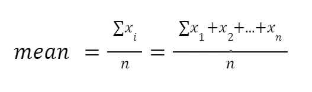
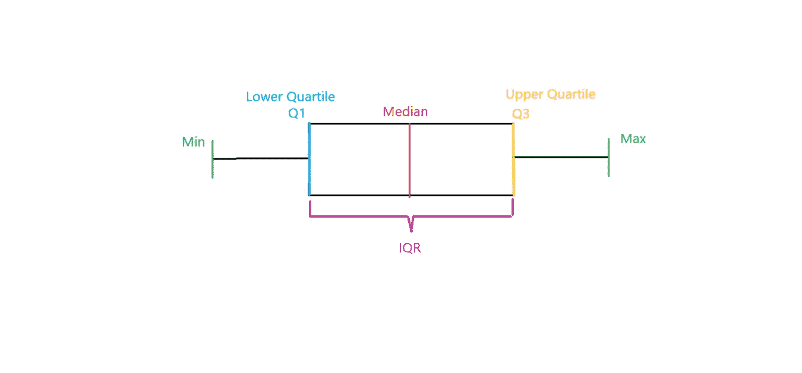
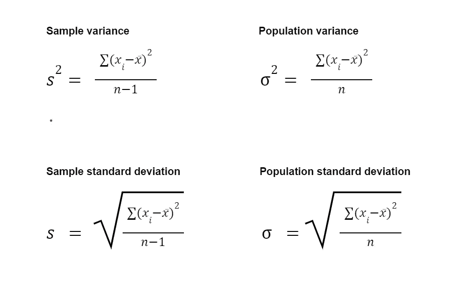
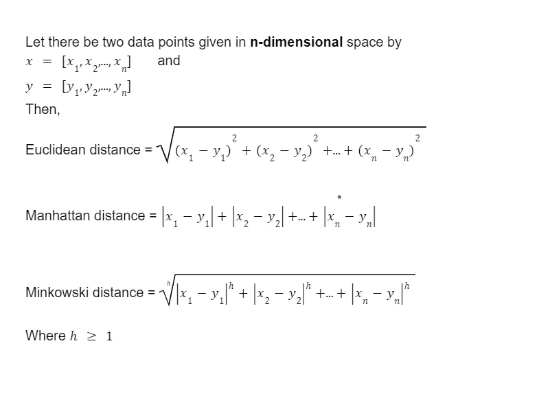
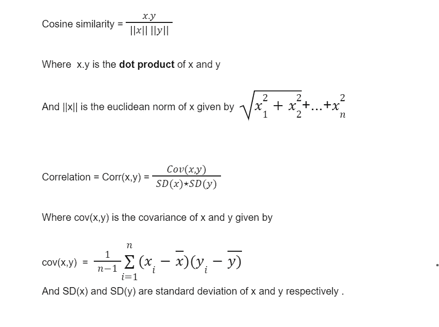
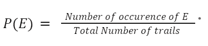
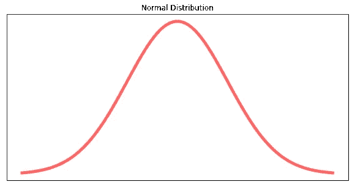
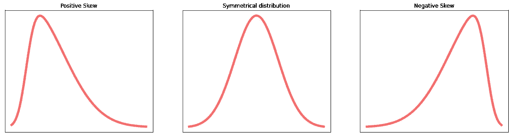
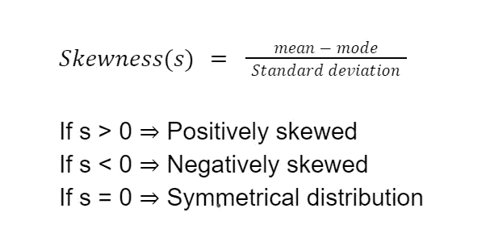
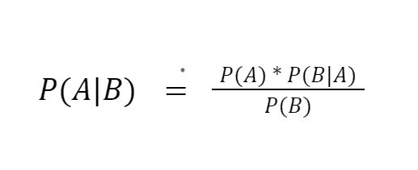

# 机器学习的四大支柱#1 —统计和概率

> 原文：<https://medium.com/codex/foundation-of-machine-learning-1-b21f7b3e5850?source=collection_archive---------10----------------------->

由[乌列尔 SC](https://unsplash.com/@urielsc26?utm_source=medium&utm_medium=referral) 在 [Unsplash](https://unsplash.com?utm_source=medium&utm_medium=referral) 上拍摄的照片

你好，机器学习爱好者们！

这篇博客是 ***【初学者的完整机器学习和深度学习】*** 系列的第二篇，它将专注于让我们为未来的旅程做好准备。这就奠定了学习机器学习所需的数学和统计学的基石。

想想看，如果一个五年级的孩子因为发现黑洞很神奇而被迫学习相对论和背后的数学，这公平吗？当然不是……这是大多数机器学习爱好者最近在做的事情。直接跳到训练模型和复制粘贴代码在短期内可能看起来不可思议，但如果你正在寻找 ML 职业生涯，这可能是危险的。我和许多其他兴奋而热情的人一样，也遇到了同样的问题。我们决定，在进入奇妙的 ML 世界之前，我们应该先有一个坚实的数学和统计学基础。这篇文章及其下一部分将涵盖开始这个巨大的机器学习之旅所需的以下初步主题。

> **注**:你现在可能不理解这些公式，或者可能无法理解它们为什么重要。但是请相信我，你会需要它们，并且可以在这个系列的任何时候回到这个帖子来看看。把这篇文章和它的第二部分作为你的公式指南。

1.  统计数据
    1.1 集中趋势的测量。
    1.2 分散度的测量。
    1.3 相似性度量。
2.  概率
    2.1 随机变量和概率分布。
    2.2 联合概率。
    2.3 条件概率。
    2.4 贝叶斯定理。
3.  线性代数
    3.1 标量。
    3.2 向量和矩阵。
    3.3 向量和矩阵运算。
    3.4 特征向量和特征值。
4.  微积分
    4.1 微分和导数。
    4.2 偏导数和梯度。
    4.3 连锁法则。

# 1.统计数字

如果我们看任何与统计相关的思维导图，我们都会熟悉这个领域有多广阔，但你认为真的有必要了解所有这些话题吗？是的，当然可以，但是作为一个初学者，我们将只关注基本的主题，并且需要学习和解释 ML。随着我们的前进，我们将熟悉新的主题，但是请记住我的话，所有这些主题都很容易被我们现在将要讨论的内容所理解。

统计学是一个数学领域，有助于提供我们的数据。它告诉我们数据是如何分布的，数据的多样性如何？我们可以从数据中获得哪些见解，即数据是否支持假设，我们可以应用哪些机器学习模型，以及我们应该如何进行。

## 1.1 集中趋势的测量

它可以被认为是定义或表示数据分布中心的单个值。平均值、众数、中位数是集中趋势的三个主要度量。你们中的许多人一定听说过这些术语，但是让我们简单回顾一下它们是什么以及它们是如何计算的。

**均值
一个数据集的均值定义为所有值之和除以集合中值的个数。它也被称为**算术平均值**，在总体平均值的情况下用希腊字母μ(“mu”)表示，在样本平均值的情况下用 x̄表示。**

> **注意**:这里的**总体**是指我们想要得到一些结论的整个数据集，而**样本**是指总体的一部分。

平均值公式。图片来源:自制

> **注**:均值的问题是受很大或很小的值影响，答案可能会失真。

**中位数** *中位数*可以定义为按降序或升序排列时整个数据集的“中间元素”。

在奇数个元素的情况下，最中间的元素是整个集合的中间值。而在偶数个**元素的情况下，两个中心元素的平均值是中间值。**

**Mode**
它是数据集中出现频率最高的元素。可以有一种模式或多种模式。当数据不是数字时，也可以使用它。

## 1.2 离散度的测量

上节中集中趋势的度量不足以描述数据集，因为两个数据集可能具有相同的平均值，但完全不同。因此，我们需要另一个因素来衡量数据集的可变性。以上可以通过极差、四分位差、标准差和方差来计算。

**范围**

一组数据的范围是该组数据的最大值和最小值之差。

> **Range = max(X) - min(X)** ，其中 X 为数据集。

**四分位数和 IQR**
中位数将整个数据集分成两部分，而四分位数将数据集分成四部分，这四部分分别称为 Q1、Q2 和 Q3。
在这里，

*   Q1 是划分数据集的元素，25%的元素小于 Q1，75%的元素大于。也称为下四分位数。
*   Q2 与中位数相同，即将数据分为 50–50%。
*   Q3 划分数据集，使 75%小于 Q3，25%大于 Q3。也称为上四分位数。

**四分位距(IQR)** 是另一个可以衡量数据扩散的尺度。这是上四分位数和下四分位数之间的差异(Q3-Q1)。这一点非常重要，因为这可以消除异常值的影响(数据末尾和开头的异常数据会影响数据的传播和测量)。

> **四分位距= Q3 — Q1。**
> 
> **注**:计算 Q1 和 Q3 时，如果元素个数为偶数，则取两个中心元素的平均值。
> 
> **注:**最小值、Q1、中值、Q3、最大值这五个加在一起就是**五点汇总**。

五点总结。图片来源:自制

## **标准差和方差**

**标准差**和**方差**用于测量每个数据点与平均值的距离。标准差是方差的平方根。

总体和样本的方差和标准差。图片来源:自制

> **注**:需要注意的是**总体**和**样本方差**和标准差有两个不同的公式。

## 1.3 相似性度量

在 ML 中，我们总是需要测量两个数据点有多接近或者两个点有多相似。想必你已经听说过欧几里德距离；这是测量点之间的距离或相似性的方法之一。在这里，我们将学习闵可夫斯基距离、欧几里德距离、曼哈顿距离、余弦相似性和相关性。

由数值或属性描述的两个数据点的相异度的最常用度量是由公式给出的闵可夫斯基距离、欧几里德距离和曼哈顿距离。

欧几里德距离，曼哈顿距离，闵可夫斯基距离。图片来源:自制

> **注**:需要注意的是，闵可夫斯基距离是欧几里德距离和曼哈顿距离的推广。此外，当我们增加 h 的值时，具有最显著差异的项，即差异最大的数据点的部分或坐标对距离的影响最大。

这三个可以有从-∞到∞的任意值。这使得很难想象两个数据点有多相似，因此可以用于数字和二进制数据点的其他已知度量是 C**o 相似度**和**相关性**。关于它们的重要事实是它们的值从 0 到 1 变化。

余弦相似性和相关性。图片来源:自制

> **注**:上面给出的协方差、相关性和余弦相似性的公式是必不可少的，并将在本系列中一再重复。

# 2.可能性

大多数人可能已经听说过概率，其他人肯定已经猜到了“可能”这个词概率是指一个事件发生的可能性，任何事件的概率从 0 到 1。由于主要任务是预测机器学习的未来结果，概率将发挥重要作用。

数学上，定义给定一个事件`E`，事件发生的概率由`P(E)`提供。它是使用结果计算的，即事件`E`的“失败”或“成功”，也称为**试验**。概率`P(E)`由下式给出。

概率公式。图片来源:自制

## 2.1 随机变量和概率分布

在公平审判的情况下，事件的结果可以是任何事情，即它是随机的；可能是抛硬币、掷骰子，或者其他什么最近的，所以这些变量被称为**随机变量**。

**概率分布**是为随机变量定义的，它描述了概率如何分布在随机变量的整个取值范围内。对于随机变量`x`，函数`f(x)`表示每个`x`发生的概率；这叫做它的概率分布。

在 ML 中，我们需要研究的最关键的概率分布是**高斯分布**还是**正态分布**。高斯分布据说是统计学的主要焦点。令人惊讶的是，来自各个领域的数据可以用高斯分布的形式来表示，因为它被称为“正态”分布。

正态分布。图片来源:自制

使用以下两个参数**均值**和**标准差可以很容易地描述高斯分布。**由于这是一个非常显著的分布，所以理解清楚是至关重要的；你可以使用 https://academo.org/demos/gaussian-distribution/[的链接](https://academo.org/demos/gaussian-distribution/)来玩参数，了解它对分布有什么影响。

现在，很明显高斯分布是一个平衡分布。尽管如此，也有可能随机变量是不平衡的【剧透！]，这可能会导致 ML 中出现不好的结果。这种不平衡的性质被称为分布的偏斜度。此外，这是两种类型的消极和积极的偏斜。流动的图像显示了这些分布之间的差异。

正偏(右)，对称分布(中)，负偏(左)，图片来源:自制

任何数据集的偏斜度都可以使用这个人的第一个偏斜度系数来计算。

人的第一偏斜系数。图片来源:自制

## 2.2 联合概率

考虑两个独立的事件`A`和`B`，独立是指一个事件的发生不影响另一个事件。所以，这两个事件一起发生的概率是`P(A and B) or P(A ∩ B)`其中
。这被称为事件`A`和`B`的联合概率。

## 2.2 条件概率

通俗地说，如果我们考虑两个相依事件`A`和`B`，条件概率`P(A|B)`就是以事件`B`已经发生为条件的事件`A`发生的可能性。它是由公式给出的。

`**P(A|B) = P(A ∩ B)/ P(B) — — — — — (1)**`

`**P(B|A) = P(A ∩ B)/ P(A) — — — — — (2)**`

## 2.3 贝叶斯定理

贝叶斯定理是最大似然的基本定理之一，甚至许多算法都完全基于这个定理。贝叶斯定理有助于定义上面给出的两个条件概率`(1)`、`(2)`之间的关系。为此，将`(1)`和`(2)`等同起来。这给了我们

`**P(A ∩ B) = P(A|B)/ P(B) — — — — — (3)**`

`**P(A ∩ B) = P(B|A)/ P(A) — — — — — (4)**`

从`(3)`和`(4)`我们得到

`**P(B|A)/ P(A) = P(A|B)/ P(B)**`

重新排列上面的方程，我们得到了贝叶定理的最终形式。

贝叶斯定理公式。图片来源:自制

在上面的等式中:

`P(A|B)`称为`A`的**后验概率**，即`B`已经发生时`A`的发生。

`P(A)`和`P(B)`称为**先验概率**之所以这样叫是因为我们可能事先知道这些信息**。**

而`P(B|A)`叫做**可能性**发生的`B`就是`A`是真的。

现在，假设我们必须预测你是否会在周一得到一个作业，也就是说，从数学上来说`P(A = assignment| B = monday)`。为了计算这一点，我们可以使用 Baye 定理，为此我们需要一周中任何一天分配的先验概率。今天是星期一的先验概率，`P(B = monday) = 1/7`。如果你得到任务的可能性是在星期一`P(B = monday| A = homework)`这可以从以前的数据中计算出来。这也广泛用于医学领域，测试一个人是否对特定疾病呈阳性`P(A = positive|B = disease)`。

# **结论**

在这篇博客中，我们讨论了基础知识对于成为机器学习和数据科学专家的重要性。然后，我们讨论了一些重要的概念，通过这些概念，我们可以使用统计数据来总结我们的数据，我们了解了五位数总结和相似性度量，没有这些，机器学习模型将是不可能的。然后我们跳到概率，概率是 ML 中预测的基础。我们学习了一些基本术语，最后，我们学习了贝叶斯定理。在本系列的下一部分中，我们将涉及 ML 的下两个基本概念，线性代数和微积分。如果你喜欢这个系列，请跟随我和我的同事哈什特·亚达夫

谢谢你，

**系列的前一篇博客** : [熟悉机器学习的世界](/@harshity8/getting-familiar-to-the-world-of-machine-learning-ea31974ed0c4)

**系列下一篇博客:** [机器学习的四大支柱# 2——线性代数与微积分](/@malikSarthak/foundation-of-machine-learning-2-linear-algebra-and-calculus-9783d4592b98)

 [## 萨尔萨克·马利克-中等

### 免责声明:如果你是 ML 的新手，还没有看过早期的帖子，请访问它们以保持一致。其他人在看…

medium.com](/@malikSarthak)  [## Harshit Yadav -中等

### 机器学习的鸟瞰图注:这是“完整的机器学习和深度学习…

medium.com](/@harshit_yadav)