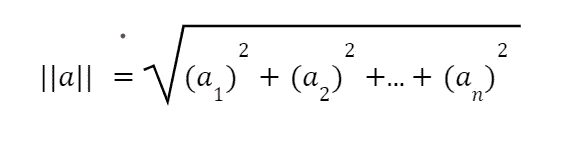
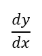

# 机器学习的四大支柱# 2——线性代数和微积分

> 原文：<https://medium.com/codex/foundation-of-machine-learning-2-linear-algebra-and-calculus-9783d4592b98?source=collection_archive---------2----------------------->


照片由[托马斯 T](https://unsplash.com/@pyssling240?utm_source=medium&utm_medium=referral) 在 [Unsplash](https://unsplash.com?utm_source=medium&utm_medium=referral) 上拍摄

在早期的帖子中，我们已经讨论了机器学习的两个支柱“统计”和“概率”，这是清晰而轻松地掌握 ML 的所有概念所必需的。这样，我们也可以很好地完成[熟悉机器学习世界](/@harshit_yadav/getting-familiar-to-the-world-of-machine-learning-ea31974ed0c4)中讨论的“数据预处理”和“数据分析”。我们将学习模型训练和评估所需的代数和微积分。

# 3.代数学

机器学习是关于多变量方程和求解它们的。猜猜线性代数是什么？是的，线性代数是数学的一个分支，它处理像- `y = mx + c`这样的线性方程及其在向量空间中的表示(向量空间是指当一组向量连同标量被用来描述感兴趣的点时)。线性代数是一个广阔的领域，可以有多种解释。尽管如此，我们将只研究那些本质的东西，跳过任何不必要的解释。

## 3.1 标量

即使任何人是机器学习的新手或者没有听说过线性代数或标量。但应该已经学过基础数学，像加法、乘法等运算。每个操作都包括一个使用这些操作进行操作的数字；这些数字被称为标量。像什么东西的成本或者温度或者像`y = 2*x + 3`这样的方程都是用标量来表示的，在上面的方程中，`y`，`x`，2，3 都是标量。

> **注意**:在整个系列中，我们将使用不大写的小写字母来表示标量

## 3.2 矢量和矩阵

## 3.2.1 矢量

许多人可能认为，如果我们可以用标量的形式来表示一切，为什么我们需要向量或矩阵。想想我们将如何表示整个标量集合。设想一个包含有 150 个或更多房间数量、大小等特征的房屋的数据。现在，如果我们想讨论一个房子的单个实例，编写所有 150 个标量来表示一个房子将是非常乏味的；在这里，矢量来拯救。把向量想象成标量的集合；它可以写成


向量。图片来源:自制

这里 x₁、x₂、… xₙ都是标量，而 **x** 是代表它们集合的向量。上图中的向量称为列向量，在大多数文献中，都使用列向量

> **注**:在这整个系列中，向量将用粗体的未大写字母表示，如 **x**

## 矩阵

使用类似的思维过程，我们将如何表示向量的集合，整个数据集，或几个方程的集合。这就要求我们使用二维或多维的东西；关于维数，我们指的是一个矩阵的维数，就像上面的例子，维数向量是(n×1)。


矩阵表示。图片来源:自制

> **注**:在整个系列中，矩阵将用粗体大写字母表示，如 **A.**
> 
> **注**:矩阵可以有更高的维数，如(m x n x k)。但是在这个系列和 ML 中，我们将仅限于二维矩阵。

## 3.3 向量和矩阵运算

## 向量

**a)范数:**用外行人的话来说，向量的范数告诉我们向量的长度。之前，我们讨论过矢量的大小。这里的大小是指维度。这与向量的长度不同。向量 **a** 的范数或长度|| **a** ||由下式给出:



向量的范数。图片来源:自制

**b)向量加减:**只能对两个等长的向量进行加减运算。通过在给定索引**处增加或减少单个元素来计算新向量。**对于两个给定的向量， **x，**和 **y**


向量加法。图片来源:自制

**d)点积:**简单来说两个向量的点积就是向量中每个元素的乘积之和，即第一个元素乘以第一个元素，第二个元素乘以第二个元素，以此类推。对于两个给定的矢量， **x** 和 **y** 的点积由下式给出:


两个向量的点积。图片来源:自制

## 3.3.2 **矩阵**

**a)转置:**一个矩阵的转置是指一个新的矩阵，其中的行和列被翻转。上标“t”即 Aᵀ表示它。


矩阵的转置。图片来源:自制

**b)求逆:**一个矩阵的逆是一个矩阵，当与该矩阵相乘时，给出单位矩阵(单位矩阵是指所有对角线为 1，其余元素为 0 的矩阵，用 **I** 表示)。求逆的过程叫求逆。


矩阵求逆。图片来源:自制

**c)矩阵-矩阵乘法:**矩阵乘法是解决或解释任何机器学习模型时最重要和最常用的主题之一。我们需要为乘法矩阵做行和列的“点积”。下图清楚地显示了这一过程:


两个矩阵相乘。图片来源:自制

**d)行列式:**行列式只能计算方阵(方阵是指行列数相同矩阵)。所以，用 det( **A** )或| **A** |表示的方阵的行列式，就是边长由 A 的行给定的盒子的体积，它也告诉我们方阵是否可以求逆，即如果 det( **A** ) = 0，那么这个矩阵就不能求逆。你可以在这里阅读更多关于决定因素的内容。

**e)秩:**矩阵的秩是矩阵的独立行向量的个数。使用 independent，意味着不能使用其他剩余行向量的向量加法或减法来表示向量。这是机器学习中会用到的，但是如果有人有兴趣更深入的了解，可以参考[这个](https://www.khanacademy.org/math/linear-algebra/vectors-and-spaces/null-column-space/v/dimension-of-the-column-space-or-rank)。

## 3.4 特征向量和特征值

特征值和特征向量被认为是线性代数中最重要的课题。寻找特征值和特征向量放弃了对矩阵性质的深入了解。它使各种操作，如寻找电源和许多更容易。

数学上，对于矩阵，**特征值由标量λ表示，特征向量如其名称所示是由以下等式给出的向量 **v** :**

```
 **Av** = λ**v**
```

**机器学习中的特征向量可以减少特征或维数，这是数据预处理的主要步骤之一，可以使模型训练更快更好。这是因为特征向量可以给出数据的重要特征。要获得更深入的见解，请参考本。**

# **4.结石**

**你有没有想过如何证明正方形、长方形等各种图形的面积公式？和我一样，我相信肯定有很多人认为这些公式是微不足道的，但是没有，这些都是可以借助微积分证明的。微积分是一个几乎无处不在的数学领域，从计算斜率、求任何形状的面积，甚至在物理、机器和深度学习中，我们将在后面讨论。并且，那些想要深入研究与模型相关的数学以及模型训练如何工作的人必须至少知道微积分的基础知识，这一点我们将在这里讨论。**

> ****注**:那些想知道我们在哪里可以更精确地使用微积分的人。然后，只要知道这一点，我们必须通过一个称为优化的缓慢过程来训练我们的模型；这种优化是在微分的帮助下完成的。**

## **4.1 微分和导数**

**用外行人的话来说，微分就是求任意因变量`y`相对于任意自变量`x`的变化率。从属是指`y`可以用`x`例子`y = 2x`或其他任何形式来写。简单地说，我们把速度计算为距离相对于时间的变化率。操作员表示它**

****

**y wrt x .图片来源:自制**

**它也用一个像 f(x)'这样的函数上面的小破折号来表示。导数意味着任何特定函数的微分。下面列出了您需要的一些基本衍生产品:**

****

**基本导数。图片来源:自制**

****

**指数导数。图片来源:自制**

****

**产品规则。图片来源:自制**

****

**商数法则。图片来源:自制**

> ****注意**:如果你不能处理这么多公式，看看它们，并把这篇文章加入书签以备后用。其他想要更深刻理解的人可以参考这个。**

## **4.2 偏导数和梯度**

## **偏导数**

**导数告诉我们，如果我们将自变量`x`改变一个单位，因变量`y`会发生什么变化。如果`y`只依赖于一个独立变量`x`，这是正确的，但是如果有两个或更多的独立变量，并且我们只想计算相对于单个变量的变化。例如，假设我们想计算我们的知识相对于时间的变化；这似乎是一个需要通过计算导数来解决的问题。然而，除了时间之外，其他因素也在影响我们的知识，比如我们的专注程度、我们的来源等等。所以，这里我们需要计算知识对时间的偏导数。符号表示它:**

****

**y wrt x 的偏导数图片来源:自制**

**让我们假设一个因变量`y`依赖于两个自变量`x`和`z`，并让关系为`y = 2x^2 + z`，现在我们要计算`y`相对于`x`的偏导数。此外，需要注意的重要一点是，当计算变量的偏导数时，所有其他变量都被认为是常数。从下图中可以看出:**

****

**偏导数的例子。图片来源:自制**

## **梯度**

**梯度只是对所有独立变量的偏导数的集合。它以向量的形式表示。给出者:**

****

**y 的梯度代表所有独立变量。图片来源:自制**

**例如`y = 2x^2 + z`在偏导数中，梯度是:**

****

**渐变的例子。图片来源:自制**

## **4.3 链式法则**

**现在，考虑一种情况，其中变量`y`依赖于变量`x`，变量`x`也依赖于变量`z`。现在，如果我们想首先计算`y` w.r.t 对`z`的导数，我们必须将`y`的方程以`x`的形式转换为变量`z`，在大型方程的情况下，这将成为一个笨拙的过程。在这里，连锁规则来拯救我们。根据链式法则:**

****

**链式法则。图片来源:自制**

# **结论**

**在今天的博客中，我们讨论了机器学习的两大支柱，它们负责机器学习管道中的所有训练和评估部分。我们首先学习了向量和矩阵的基础知识以及为什么需要它们，然后我们开始了解它们的基本运算。在这一节的最后，我们简要地讨论了矩阵的秩、特征值和特征向量。**

**在这一节中，我们以最简单的方式讨论了导数，并介绍了一些最重要和必需的导数。然后，我们学习了如何计算一个有多个自变量的变量的导数。之后，我们讨论了一种将所有偏导数表示为向量的方法，即梯度。最后，我们讨论了最重要的链式法则。**

**至此，我们完成了机器学习的四大支柱，在下一篇博客中，我们将深入了解监督学习。在这里，我们不仅将学习线性回归、lasso 和 ridge 回归、逻辑回归等基本算法背后的理论和直觉，还将以最简单的方式学习它们背后的数学。**

**如果你喜欢我们的帖子，请关注我 Sarthak Malik 和我的同事 Harshit Yadav on medium，并订阅我们的邮件列表以获得定期更新，并与我们一起踏上这一旅程。**

**谢谢你，**

****本系列之前的博客:** [机器学习的四大支柱# 1——统计学和概率](/@malikSarthak/foundation-of-machine-learning-1-b21f7b3e5850)**

****本系列的下一篇博客:** [你的监督机器学习指南——回归](/codex/your-guide-to-supervised-machine-learning-regression-d6b822563e44)**

**[](/@malikSarthak) [## 萨尔萨克·马利克-中等

### 免责声明:如果你是 ML 的新手，还没有看过早期的帖子，请访问它们以保持一致。其他人在看…

medium.com](/@malikSarthak) [](/@harshit_yadav) [## Harshit Yadav -中等

### 机器学习的鸟瞰图注:这是“完整的机器学习和深度学习…

medium.com](/@harshit_yadav)**