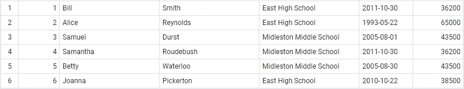
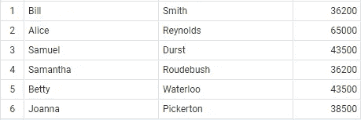
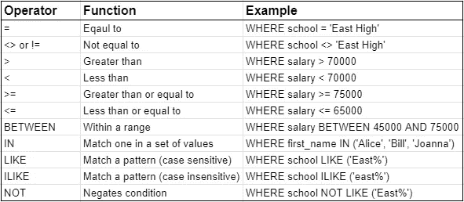
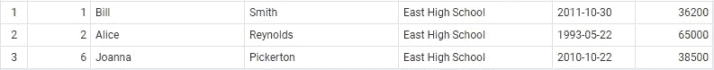
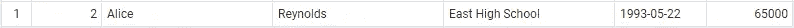
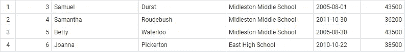
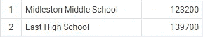
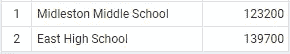
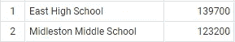

# 基础 SQL 知识

> 原文：<https://medium.com/codex/foundational-sql-know-how-4260fb4ec546?source=collection_archive---------17----------------------->


克里斯蒂安·威迪格在 [Unsplash](https://unsplash.com/s/photos/computer?utm_source=unsplash&utm_medium=referral&utm_content=creditCopyText) 上拍摄的照片

## [抄本](http://medium.com/codex)

## 足够危险。

不久前，我被扔进火里，开始学习 SQL。我认为深入基本面是一个好主意，这样会有一个更坚实的基础。这是我旅程的开始。

# 创建数据库和表

> 注意:我将使用 PostgreSQL 13 和 pgAdmin 4 来运行代码。在很大程度上，一切都可以跨数据库使用。如果我使用 PostgreSQL 特有的东西，我会让它为人所知。

## 创建数据库

创建数据库很简单，只需一行 SQL。现在是提及一些 SQL 语法的好时机。如果你注意到关键字是大写的，并且在末尾有一个分号。

```
CREATE DATABASE analysis;
```

大写关键字是为了可读性，分号表示语句的结束。这两者都是可选的，但被认为是良好的实践，使代码更具可读性。就我个人而言，我两者都不使用，因为这是我的上司喜欢的方式。

然而，从现在开始，我将确保使用大写关键字和分号来保持良好的实践。

## 创建表

要创建一个表，您将使用 CREATE TABLE 子句。

```
CREATE TABLE employees (
    id bigserial,
    first_name varchar(25),
    last_name varchar(50),
    school varchar(50),
    hire_date date,
    salary numeric
);
```

我们刚刚创建的表与生产数据库表相去甚远，因为它缺少定义结构和帮助定义关系的适当约束。然而，这是开始处理一些数据的良好起点。

> Bigserial 数据类型是特定于 PostgreSQL 的。每次添加新行时，它都会自动增加 id。

## 填充表格

没有数据的表有什么用？向表中添加数据有多种方法。通常，您会添加大量数据，因此最简单的方法就是导入数据。但是，有两个命令用于填充数据库表。它们被插入到和值中，并相互结合使用。

```
INSERT INTO employees (first_name, last_name, school, hire_date, salary) 
VALUES 
('Bill', 'Smith', 'East High School', '2011-10-30', 36200),        ('Alice', 'Reynolds', 'East High School', '1993-05-22', 65000),        ('Samuel', 'Durst', 'Midleston Middle School', '2005-08-01', 43500),        ('Samantha', 'Roudebush', 'Midleston Middle School', '2011-10-30', 36200),
('Betty', 'Waterloo', 'Midleston Middle School', '2005-08-30', 43500),
('Joanna', 'Pickerton', 'East High School', '2010-10-22', 38500);
```

# 探索数据

SQL 查询有一个基本的结构。它们以 SELECT 子句开头，后跟列名，然后是 FROM 子句，后跟表名。这两个子句是主要的组成部分，因为没有它们就没有数据。可选但非常有用的是 WHERE 子句、ORDER BY 子句和 GROUP BY 子句。

SQL 查询遵循非常具体的逻辑结构。

*   **选择**这些列。
*   **出自**这张表。
*   **其中**将返回这些行。
*   **按**这个标准分组。
*   **按**这个标准排序。

可以理解吧？然而，当查询运行时，顺序有点不同。

1.  **出自**何表。
2.  **这些行将被返回到哪里**。
3.  **按此标准分组**。
4.  **选择**这些列。
5.  **按**这个标准排序

本文将遵循类似 SQL 脚本的逻辑结构。

## 挑选

SELECT 子句实际上将结果打印到窗口中。它可以像打印“Hello World”一样简单，也可以用在复杂的查询中，从数据库中检索数据。要使用 SELECT 作为打印输出的方式，查询应该如下所示:

```
SELECT 'Hello World';
```

使用 SELECT 的更有用的方法是在查询的开头使用它:

```
SELECT *
FROM employees;
```

让我们解开这个脚本。这只是说“从老师那里，我想看到所有的列和行。”星号(*)是一个特殊字符，它告诉数据库返回给定表中的所有内容。查询的结果是:



## 从

FROM 语句与 select 语句密切相关。如果没有 FROM 子句，SELECT 所能做的就是回显您键入的内容，如第一个 SELECT 示例所示。我喜欢把 FROM 看作是查询的核心。它不仅是选择所需表的地方，也是决定表间连接的地方。

> 为了简单起见，连接将在另一篇文章中讨论，因为它们有很多细微差别。现在只需要知道连接发生在 FROM 子句中。

我写了一篇关于结合数据的文章，你可以在这里找到。

[在 SQL 中组合数据的 4 种真正重要的方法|作者 Scott Fiene | Jun，2021 |迈向数据科学](https://towardsdatascience.com/4-really-important-ways-to-combine-data-in-sql-b7a5bc1a3b5b)

```
SELECT first_name
    , last_name
    , salary
FROM employees;
```

上面的查询与前面的类似，只是现在我们需要教师表中 first_name、last_name 和 salary 列的信息。这将是输出:



## 在哪里

WHERE 子句是从结果中筛选出行的地方，写在 FROM 子句之后。要正确使用 where，必须使用一些比较运算符。下面的大部分内容可以在任何数据库上使用，但是 ILIKE 是 PostgreSQL 特有的。



```
SELECT *
FROM employees
WHERE school = 'East High School';
```

如果您注意到文本被封装在单引号中。在 Postgres、MS SQL Server 和许多其他数据库中，文本就是这样编写的。



还可以使用 AND 或 or 来组合运算符。使用 AND 运算符时，必须满足这两个条件才能返回行。在下面的例子中，工资必须高于 45000 英镑，并且必须受雇于东高中。

```
SELECT *
FROM employees
WHERE salary > 45000
    AND school = 'East High School';
```

该查询将返回 1 行，而不是 3 行。



OR 运算符几乎与 AND 运算符相反。使用 OR 运算符时，当满足一个或多个条件时，将返回一行。

```
SELECT *
FROM employees
WHERE salary > 45000
    OR school = 'East High School';
```


WHERE 子句还有两个特殊字符，用于运算符 LIKE 和 ILIKE。它们是匹配 1 个或多个字符的百分比(%)或通配符，以及仅匹配 1 个字符的下划线(_)或通配符。

```
SELECT *
FROM employees
WHERE school LIKE ('Mid%')
    OR first_name like ('Joann_');
```



## 分组依据

GROUP BY 子句的作用很简单，它根据特定的一列或多列对内容进行分组。

这是在 SQL 中引入一些聚合函数的好时机，这些函数可以很好地处理 GROUP BY。

*   **SUM()** 将数值相加。
*   **MIN()** 返回最小值。
*   **MAX()** 返回最大值。

```
SELECT school
    , sum(salary)
FROM employees
GROUP BY school;
```



上述查询所做的是将每所学校的所有工资加在一起，并根据数据库中有多少所学校返回结果，这样您就可以获得每所学校支付的总工资。

> 注意:如果一个列没有被聚集，那么它需要在 GROUP BY 中，否则 SQL 将会混乱，您将得到一个错误。

## 以...排序

我相信你能猜到 ORDER BY 是干什么的？你是对的！！它对 SQL 查询的结果进行排序。

ORDER BY 子句中有两个子选项。默认的排序选项是从最小到最大，但是您也可以将 ASC 写得更简洁。另一个选项是最大到最小，或 DESC。

下面使用默认的排序顺序和 ASC 来说明它们是如何相同的。

```
SELECT school
    , sum(salary)
FROM employees
GROUP BY school
ORDER BY sum(salary);SELECT school
    , sum(salary)
FROM employees
GROUP BY school
ORDER BY sum(salary) ASC;
```



这两个查询都将返回完全相同的内容，从最小到最大。

该查询将使用 DESC 来显示差异。

```
SELECT school
    , sum(salary)
FROM employees
GROUP BY school
ORDER BY sum(salary) DESC;
```



该查询返回与 ASC 相反的结果，即从大到小。

# 包扎

这绝不是 SQL 的完整指南。我希望在这里完成的是向您展示足够多的危险 SQL，并激起您进一步探索的好奇心。

我将在后面的文章中深入探讨更多的 SQL，所以请继续关注。

感谢您的阅读，祝您一切顺利。