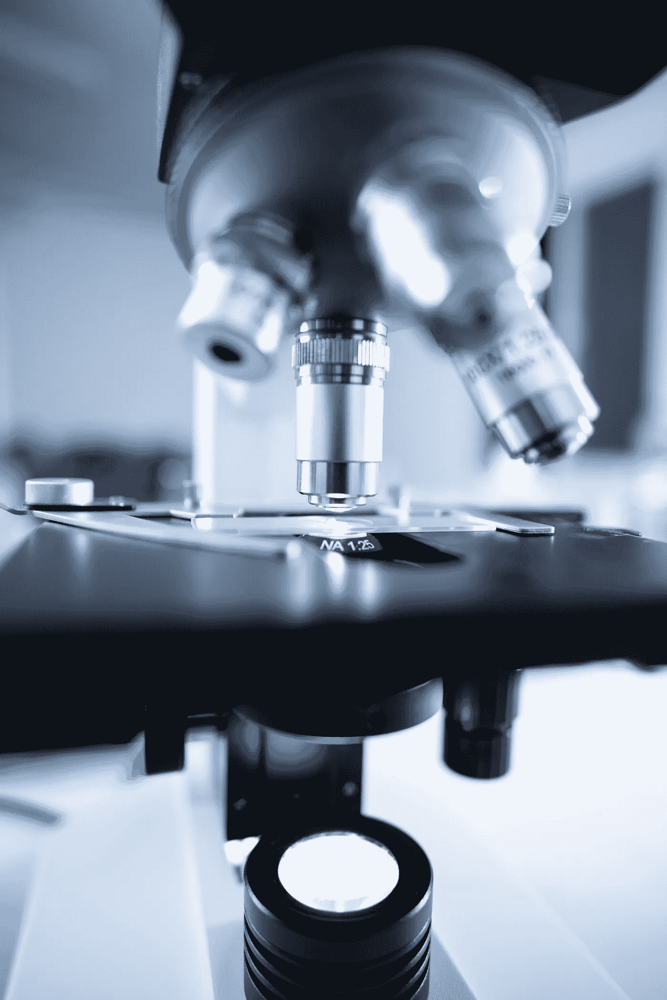

# 纳米技术影响你未来生活的四种方式

> 原文：<https://medium.com/codex/four-ways-nanotechnology-can-impact-your-life-in-the-future-ce766db51b90?source=collection_archive---------13----------------------->

纳米技术在我们的生活中越来越普遍。虽然背后的理论已经存在了很长时间，但纳米技术只是在最近才成为一项有前途的商业事业。这里有 4 种纳米技术可以很快影响你的生活:

# 未来应用的纳米工程材料

纳米技术是一个快速发展的领域，有许多令人兴奋的应用。在未来，纳米工程材料可以使建筑和运输比以往任何时候都更快、更便宜、更耐用。

纳米工程材料已经广泛用于建筑、车辆和其他大型结构的建造。由它们制成的轻质混凝土比传统混凝土强度高一半。它们还被用来在不牺牲耐用性和动力的情况下，使网球拍等运动器材变得更轻。此外，纳米技术已经创造了能够偏转紫外线的涂层，这意味着可以更好地保护昂贵的仪器，如相机、智能手机和笔记本电脑。

为了继续我们对速度的追求，纳米工程材料在交通运输中还有另一个应用——飞机！通过纳米技术生产的轻质碳纤维可以将飞机重量减少 50%，同时将结构强度增加 500%。这意味着航程更长，沿途停靠站更少，同时降低了燃料成本和环境污染。所以，当你飞向天空时，请高枕无忧，因为你不仅能准时到达你需要去的地方，而且对自然的影响也更小。

纳米技术的另一个很酷的用途是将抗菌涂层应用于包括玩具在内的日常用品。这不仅保护了孩子免受细菌的侵害，也保护了父母不必担心孩子的健康，因为我们都可以更好地清洁自己的身体。其他正在探索的领域包括杀死有害细菌的水净化系统。

# 纳米机电系统:可能证明有用的小装置

虽然科学家和研究人员继续探索纳米技术改善我们生活的方式，但尚不清楚它们在未来将如何影响我们。然而，我们知道的一件事是，纳米技术应用的一个主要领域是创造纳米机电系统(NEMS)。这些设备由多个部件组成，使用非常小的元件。

NEM 可以小到一粒盐，使用纳米管、纳米线或量子点等纳米材料来感知光或热的变化，并通过 NEM 本身的计算处理这些输入信号，然后根据计算结果采取行动。为了让你知道它有多小:一张纸大约有 100 个原子宽。一根人类的头发大约有 80，000 个原子。这意味着比一粒盐还小的东西几乎不可能用肉眼看到！

# 医疗保健的未来:纳米机器人

也许纳米技术最激动人心的发展之一是医学突破的潜力。大约 24 种疾病，包括帕金森病、癌症和阿尔茨海默病，正在作为纳米机器人的潜在目标进行研究，这些纳米机器人可以帮助清除重要器官或血管中的致病堆积。

还探索了使用纳米技术来监测健康。你体内的纳米粒子可以监测化学物质水平，并将信息发送给医生和研究人员——当一个人需要药物或生病时，它们甚至可以提醒他，比如高温读数。如果你住在偏远地区或经常旅行，这一点尤其重要；这甚至意味着防止因某种疾病而死亡，否则这种疾病可能无法及时发现。

这项技术并不像你想象的那么遥远:一些专家预测，这些应用程序可能会在相对较短的时间内出现。这项技术一旦投入使用，将会在多大范围内被采用还有待观察——可能还需要十年左右的时间，才会有足够多的人开始定期使用它们。

# 纳米技术:食品和健康的下一个前沿

纳米技术的进步使得食物味道更好，保质期更长，食用更安全。美国食品药品监督管理局(FDA)已经批准了这项技术的多种用途，以提高我们食品供应的质量和安全性。其中包括:

*   合成 DNA-可以模仿大豆等食物中的酶的酶可以让公司生产他们通常不卖的产品，因为它们味道不够好，或者在商店货架上出现的时间不够长，消费者无法在它们变质之前购买它们。
*   由纳米塑料珠制成的食品添加剂可以通过防止微生物生长或抑制腐败来帮助延长保质期。

# 结论

纳米技术不再是科幻小说中的概念，相反，它是最近才公之于众的东西，它很容易影响你未来十年的生活。它可以应用于广泛的产品，从医药到建筑，以及两者之间的一切。换句话说，纳米技术能做的有限。这就是为什么相信纳米技术会以任何方式进入你的生活并不是不现实的。