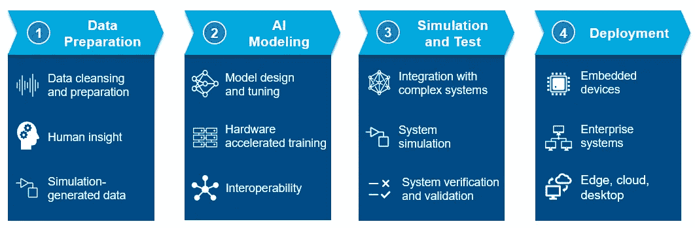

# 评估人工智能系统的框架

> 原文：<https://medium.com/codex/framework-to-evaluate-artificial-intelligence-systems-ccf27f53b613?source=collection_archive---------9----------------------->

ODI:是时候更新发援会评估标准了

# **简介**

人工智能(AI)是计算机科学的一个领域，其中实现了算法来训练机器模仿人类的能力，如对象识别、语音识别、语言翻译等。

由于其复杂性，它通常需要很高的技术专业知识来设计、培训和部署人工智能解决方案。

然而，随着开源程序的兴起，公众可以高度接触到人工智能技术。现在，任何人都可以轻松下载、训练和部署高级人工智能算法。

这使得买家很难评估原始设备制造商(OEM)在没有评估框架的情况下交付高性能人工智能解决方案的能力。

# 目标

本文旨在为读者提供一个评估人工智能系统的框架。

# 原则考虑

本文是参考各种行业采用的最佳实践开发的，因此它不是特定领域的，可以普遍应用。

# 人工智能系统概述

构建人工智能系统不同于传统的计算机程序，在传统的计算机程序中，解决方案在很大程度上是基于规则的，并且不会随着时间的推移而自我改进。

一个全面的人工智能系统包括以下阶段来随着时间的推移学习和改进自己:数据准备，人工智能建模，培训和评估，以及部署。

缺少任何规定的阶段都将抑制人工智能学习和改进新数据点的能力。

下面详细描述各个阶段:

(1)资料准备。它是收集数据并将其处理成正确格式以训练和改进人工智能模型的过程。这可以说是人工智能工作流程中最重要的阶段，因为人工智能系统的性能高度依赖于可用于训练的数据质量。为了确保数据质量，这一过程通常是自动化的，并分层进行验证检查，以最大限度地减少错误的数据输入。

(2) AI 建模。它是设计一个人工智能模型的过程，该模型可以有效地从收集的数据中学习，并使其能够做出智能决策和预测。AI 模型架构将极大地影响训练数据的类型(例如，图像、文本和音频)及其输出信息(例如，分类输出、数字输出和边界框)。由于其架构在部署后很大程度上是不可改变的，因此 OEM 为其预期应用选择正确的 AI 模型非常重要，否则，即使有数据可用，它也将无法运行。

(3)培训与评估。它是训练人工智能模型以随着时间的推移增强其能力的过程。这个过程很大程度上类似于人类如何学习做对事情会得到奖励，做错事情会受到惩罚。通过采用相同的方法，需要选择一个度量(例如，准确度、精确度、召回率和 F1)来评估人工智能模型在训练过程中的性能，以便人工智能模型能够有效地自我改进。由于每个指标都有其优点和缺点，因此对于 OEM 来说，评估其预期应用并选择正确的指标来评估 AI 模型性能非常重要。

(4)部署。它是将经过训练的 AI 模型实现到生产环境中以供使用的过程。它通常有更多的限制，如有限的数据存储、处理速度、冷却系统等。这可能会影响其预期性能。OEM 通常需要进一步优化人工智能模型，以确保它能够在新环境中发挥作用，并满足最初的用户需求。

MathWorks，Inc:工程师应该考虑的一个完整的、人工智能驱动的工作流程的四个步骤。

# 评估人工智能系统

原则上，一个有能力的人工智能系统被设计成**通用的、可持续的、高性能的、可解释的**，这样它就能给用户提供无缝的、直观的体验。这套设计原则可以用来评估人工智能系统的整体能力。

**多才多艺**

多功能性是指人工智能系统处理各种数据类型(如图像、数字和文本)、大小(如分辨率和文本长度)的能力。这使得人工智能系统可以部署在多个领域，如对象检测，语音识别和情感分析，从而提高其整体价值和性能。

**可持续性**

可持续性是指人工智能系统支持长期持续开发、培训和部署的能力。系统应设计为自助服务，以最大限度地减少因升级和维护导致的系统停机时间。因此提高了它的总体性价比。

**性能**

性能是指人工智能系统高效处理数据、训练和部署人工智能模型，同时为用户提供可信结果的能力。很大程度上取决于以下因素:数据处理算法、AI 模型架构、计算能力。OEM 必须优化这些因素，并使用相关指标(如准确度、精确度、召回率、F1)来验证其结果，从而提高其效率和结果可信度。

**可解释性**

可解释性是指 AI 系统提供信息以帮助用户理解和解释其预测结果的能力。这将允许他们有效地监控、调试和改进系统性能，并增加使用预测结果进行决策的信心。

# 结论

评估人工智能系统的框架决不是完整或详尽的，仍然是一篇开放的反馈文章。随着人工智能技术的发展，将需要更新整体框架以满足未来的背景和需求，特别是在与道德和隐私相关的领域。

我希望这篇文章能让你对人工智能系统有更好的理解，并对评估它们有所启发。