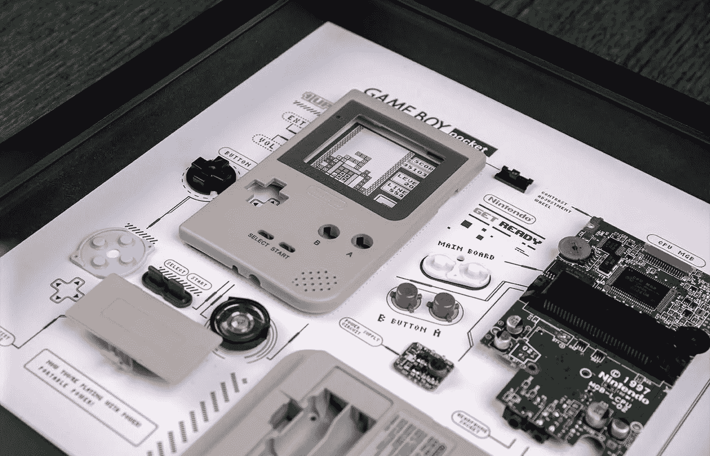

# 框住你的旧电子设备:我今天读到的最有创意的东西！

> 原文：<https://medium.com/codex/framing-your-old-electronics-the-most-creative-thing-i-read-about-today-72450ed0f351?source=collection_archive---------4----------------------->

## 多好的主意啊！

[Game Boy(媒体 by Grid Studio)](https://gridstudio.cc/products/game-boy)

他们说情人眼里出西施，我在电子产品中发现了美。出于这个原因，Jason England 在笔记本电脑杂志上写的这篇文章引起了我的注意 [Grid Studio 将最好的复古小工具变成了令人敬畏的墙壁艺术:完美的技术礼物](https://www.laptopmag.com/features/grid-studio-turns-the-best-retro-gadgets-into-awesome-wall-art-the-perfect-tech-gift)。