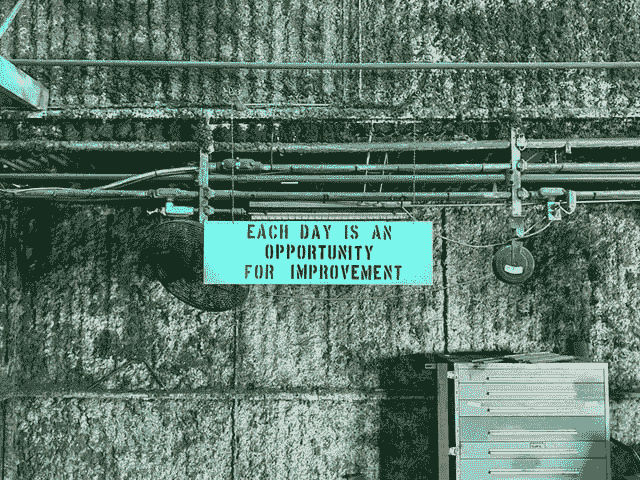

# 你应该知道的免费 DevOps 培训和认证

> 原文：<https://medium.com/codex/free-devops-training-and-certifications-you-should-know-13f98e0853c9?source=collection_archive---------1----------------------->

丹·华莱士在 [Unsplash](https://unsplash.com/?utm_source=unsplash&utm_medium=referral&utm_content=creditCopyText) 上的照片

我们的职业每年都在发展，无论是通过引入新的工具、新的云服务还是新的工作方法。这种不断的演变需要建立一种学习文化，不断分享经验和想法，从而鼓励每个人每年都获得新的知识。