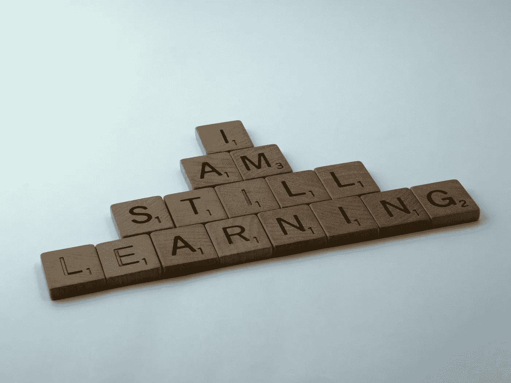

# Coursera 上的免费谷歌云课程

> 原文：<https://medium.com/codex/free-google-cloud-courses-on-coursera-8f017a6f91c?source=collection_archive---------2----------------------->

## 如何免费学习像谷歌数据工程师这样的课程

布雷特·乔丹在 [Unsplash](https://unsplash.com/s/photos/learning?utm_source=unsplash&utm_medium=referral&utm_content=creditCopyText) 上的照片

谷歌目前正在与 Coursera 合作并通过 Coursera 为谷歌云以及数据主题提供免费课程。

整个事情从上周开始，可能会持续到 2022 年 12 月 31 日。所以如果你有兴趣，就去 Coursera 看看吧。