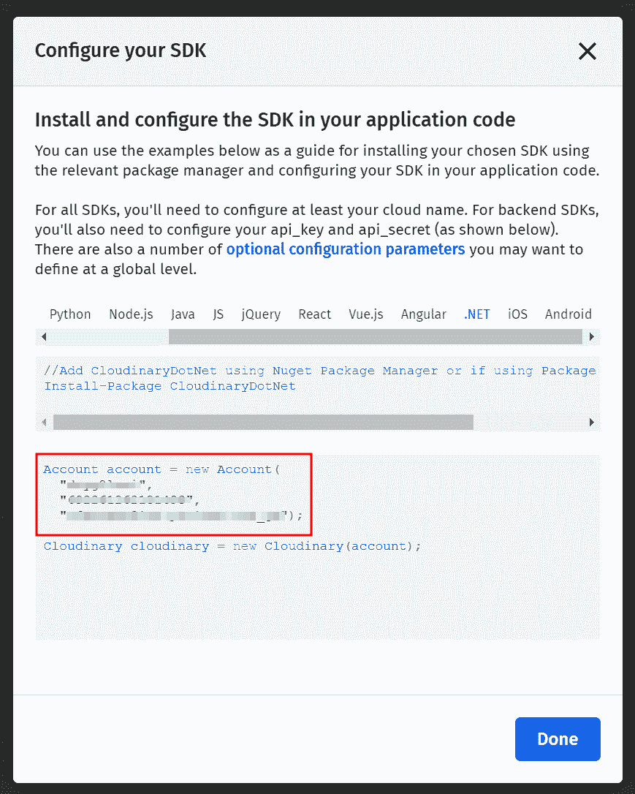

# 免费图像托管。净 6 个项目

> 原文：<https://medium.com/codex/free-image-hosting-for-net-6-projects-d166d8767150?source=collection_archive---------7----------------------->

## 为您的下一个项目提供快速、简单、免费的图像托管方式


Emile Perron 在 [Unsplash](https://unsplash.com?utm_source=medium&utm_medium=referral) 上的照片

在我的上一篇文章 的[，我展示了如何托管一个. NET 6 应用程序，以及一个免费的 Postgres 数据库**。**](/codex/free-hosting-for-net-6-projects-f65f76f2b973)

**在本指南中，我将向您展示如何为您的 next 实现一个非常简单明了的图像托管解决方案。NET 6 项目，免费。**

# **放弃**

**使用一个免费的第三方图像托管提供商来托管你的图像是不理想的，而且有很多限制，这取决于提供商。它不适合生产应用程序。对于任何严肃的事情，你可能会想使用像亚马逊 S3 或 Azure Blob Storage 这样的云数据存储服务。**

**话虽如此，它仍然是小型个人项目或概念快速验证的绝佳选择。**

# **要求**

**在研究和比较可供选择的不同选项时，这些是我寻找的主要内容:**

*   **合理的费率限制**
*   **无限期寿命**
*   **易用性**

**可供选择的选项多得惊人。我为我的项目选择的，也将在本教程中涉及的，是 **Cloudinary** 。我探索过的其他选项有 Flickr 和 Imgur，但事实证明它们在易用性和局限性方面远远不如前者。**

# **云雾缭绕**

**Cloudinary 提供了一个官方的。NET SDK、简单的设置、强大而丰富的 API 和**慷慨的免费计划**(每月 25 GB 存储/25k 转换/25GB 带宽)。**

**我将只向您展示**基本图像上传**。然而，如果你想进一步探索它提供的许多特性(比如转换)，可以看看他们写得很好的[文档](https://cloudinary.com/documentation/dotnet_integration)。**

# **设置**

**要使用 Cloudinary API，我们需要创建一个免费帐户并安装 SDK。**

## **创建帐户**

**前往 [Cloudinary](https://cloudinary.com/users/register/free) 报名。**

**分配的云名称将在你的所有网址中可见，所以选择一些好的名称。一句脏话加上一个随机数总是一个很好的选择。**

**对于**产品**，确保选择**图像和视频 API 的可编程媒体。****

**创建并验证账户后，打开 [**控制台**](https://cloudinary.com/console/) ，点击**开始配置**。将出现以下窗口:**

****

**这些是你的**授权凭证**，所以继续复制它们并保存在黑暗、安全的地方。我们以后会需要它们。**

## **安装 SDK**

**要安装 SDK，请在您的解决方案的根目录中打开一个**终端**(在 Visual Studio 中为 CTRL +),并运行以下命令来安装包:**

```
**Install-Package CloudinaryDotNet**
```

**或者，你可以打开 **NuGet 包管理器**并搜索 *CloudinaryDotNet。***

# **服务接口**

**对您使用的任何外部服务进行抽象是一个好主意。这不仅是一个很好的实践，而且还能让你使用一个小技巧，我稍后会讲到。由于这些文件将来自一个 **HTTP API 端点**并且我们想要为服务提供文件信息，所以对我来说设计一个接口来接收一个 IFormFiles 集合是最有意义的。然而，如果您有不同的用例，并且您不是从 HTTP API 端点接收这些，那么最好的选择可能是 **byte[]** 。我们还想在这些图片上传后取回它们的**URL，这样我们就可以将它们存储在我们的数据库中，这就是返回值。****

**服务接口**

# **服务实现**

**既然我们已经概述了基本接口，让我们创建一个 Cloudinary 实现。**

**Cloudinary 图像上传服务**

**我们在构造函数中初始化 Cloudinary API，使用我们之前复制的**授权凭证**。为简单起见，我将它们包含在文件中。然而，你也许应该从某种**秘密管理器**中检索它们，但这超出了本指南的范围。**

**注意第 24 行。这很容易被忽略，但是如果你忘记重置内存流的位置，你将会发送一个空文件。**

**同样，在这个例子中，我抛出了一个错误异常，这并不理想。更明智的做法是根据响应进行更细粒度的错误处理。稍后我将简要地谈到这一点。**

# **使用**

**现在我们已经准备好了服务，让我们用它来处理一个请求。**

**首先，确保将它添加到应用程序的 DI 容器中。英寸 NET 6 默认项目，此设置位于 **Program.cs.****

**注册我们的 CloudinaryImageUploadService**

**然后，我们可以将它注入我们的控制器，并在我们的一个端点内使用它:**

**使用我们实现的服务的控制器示例**

# **裁员**

**现在回到我之前提到的技巧。由于我们在设计服务时非常勤奋，现在很容易创建冗余服务以防我们的请求失败——例如，如果我们达到了**速率限制**。我们需要做的就是创建 **IImageUploadService** 的提供者特定的实现，并注册它们:**

**注册多个图像上传服务**

**如果我们现在重构我们的服务以返回，例如， **null** on error，并将它们全部注入到我们的控制器中，我们可以确保在单个服务失败时我们的请求不会失败:**

# **结论**

**我已经向您展示了如何从您的上传图像。NET 6 应用程序免费提供给外部提供商。尽管我向您展示的是非常基础的东西，但 Cloudinary 提供了更多，我强烈建议您自己去探索。**

**请在下面的评论中留下任何针对我或我的代码的问题、想法或侮辱。**

**如果我帮助了你，请留下一些掌声，并与你的朋友分享这篇文章，**否则**。**