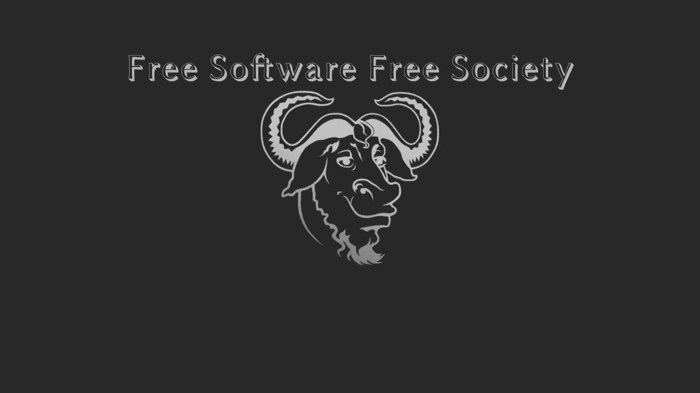

# 自由软件再也不会是原来的样子了

> 原文：<https://medium.com/codex/free-software-will-never-be-the-same-again-7a5c4985b078?source=collection_archive---------0----------------------->

[GNU 壁纸](https://www.gnu.org/graphics/skwid-wallpapers.html) ( [CC BY-SA 4.0](https://creativecommons.org/licenses/by-sa/4.0/) )

所以我不久前写了一篇关于 NPM 颜色争议的文章

 [## 对 NPM 颜色事件的思考

### 因此，如果你生活在岩石下，一些 NPM 开发者故意在他们的程序中放入一个无限循环。我首先…

medium.com](/codex/thoughts-on-the-npm-colors-debacle-677f673a7254)