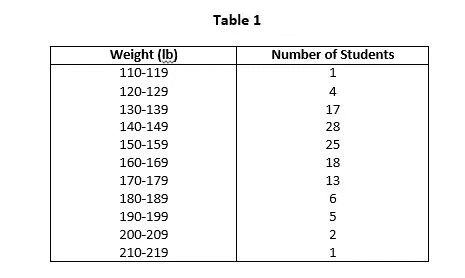

# 频率表和频率分布

> 原文：<https://medium.com/codex/frequency-tables-and-frequency-distributions-d75e41eaa264?source=collection_archive---------4----------------------->

# 介绍

在准备频率分布之前，有必要从各种来源收集所需性质的数据。收集的数据总是原始形式的，为了推断出所需的结果，需要对其进行适当的排列。你需要为频率分布做一定的准备，包括数据的分类和制表。这两者详细解释如下:

# 分类

***“将数据按照数据中存在的一些共同特征排列成类或类别的过程称为分类”***

收集的数据通常以不容易理解的形式提供。举例来说，如果我们面前有 1000 名大学生的大学考试成绩，我们很难单凭分数来判断有多少学生的分数在 300 至 400 分之间、400 至 500 分之间等等。为了清楚地了解情况，数据必须以易于理解的方式呈现。作为第一步，我们把数据分成具有相似特征的类和类别。例如，我们可以将标记排列成每组 50 个标记的组，例如 300 到 349、350 到 399、400 到 449 等等。

# 分类基础

收集到的数据可以根据许多特征进行分类，有四个主要的分类依据正在被广泛实践。这些基地是:

***1。定性***

*   当数据按属性分类时，如宗教、婚姻状况等。2

***2。定量:***

*   当数据按数量特征分类时，如身高、体重、收入等。

***3。地理:***

*   当数据按地理区域或位置分类时，例如，一个国家的人口可以按省、区、县或镇分类。

***4。*时序/时间:**

当数据按出现时间分类时。数据按出现时间的排列称为时间序列。

# 表格

> **“将数据排列成行和列的过程称为制表”**

表格是将数据系统地排列成垂直列和水平行。一个国家的人口数据列表可以根据宗教、性别或婚姻状况进行分类。根据统计员使用的分类的性质，列表可能是简单的、双重的、三重的或复杂的。

# 频数分布

> **“频率分布是数据的表格排列，其中各种项目被排列成类，并且落入每个类的项目的数量被提及”**

我们已经讨论了数据的分类和列表。频率分布是总结和组织定量数据的重要方法。以频率分布形式呈现的数据称为**分组数据**，而未按系统顺序或频率分布形式排列的数据称为**原始数据**或**未分组数据**。

# 例如

让我们考虑一所大学 120 名学生的体重，如下所示:

**普通表中的数据**

从上面提供的数据很难得出任何有意义的结论。就像，很难简单地通过看上面的数据来判断有多少学生的体重低于或高于 150 磅，或者在 150 和 200 磅之间等等。因此，有必要对数据进行排列，使它们的主要特征尽可能清晰。如果数据排列成数组，就很容易得出结论。按升序或降序排列的数据称为**数组**。

从数组中可以回答许多关于数据的问题。但是仍然很难查看 120 个观察值并获得关于这些观察值如何分布的准确想法。因此，我们可以将它们以更好的形式排列。例如，数据可以按如下表所示的类别排列:

**频率表的形式**

通过在上述表格中排列原始数据，我们已经将数据分类，并确定了属于每个类别的项目数，即类别频率。从 110 到 119 的数据范围是单个类别，1 是其对应的频率。这种按类别排列的数据及其对应的类别频率被称为频率分布或**频率表**。

# 组限

在表 1 中，我们看到每个类都用两个数字来描述。这些数字被称为等级限制。较小的数字称为**下限**，较大的数字称为**上限**。例如，在表 1 中，一级的等级限制是 110 和 119。110 是类下限，119 是类上限。

# 阶级界限

阶级界限并不总是看起来那样。我们知道测量很少是精确的，大部分时间都是近似值和估计值。110 磅的体重意味着体重在 109.5 和 110.5 磅之间。体重 119 磅意味着体重在 118.5 和 119.5 磅之间。因此，当下限为 110 磅时，真实的下限为 109.5 磅，而当上限为 119 磅时，真实的上限实际上为 109.5 磅。因此，如果记录的重量精确到磅，110-119 级包括从 109.5 磅到 119.5 磅的所有尺寸。

描述类的真实类限制的值 109.5 和 119.5 被称为**真实类限制**或**类边界**。较小的数字 109.5 是**下层阶级界限**，较大的数字 119.5 称为**上层阶级界限**。表 2 清楚地显示了等级界限。

通过将一个类别的类别上限与下一个更高类别的类别下限相加，然后除以 2，可以获得类别边界。在数学上，它可以表示如下:

**阶级界限**

例如，表 1 中第一类的类边界计算如下:

下表 2 显示了相应类别的类别边界和类别标记:

# 班级间隔的大小

***“类区间的大小，也叫类宽或类长，是上类边界与下类边界之差”。***

班级间隔不是班级限制之间的差异。在频率分布的所有类别间隔大小相等的情况下，公共宽度 id 由 ***h*** 表示。在这种情况下，类间隔的大小也等于两个连续的类下限或上限之间的差。例如，在表 2 中，一等舱的间隔是 119.5–109.5 = 10，或 120–110 = 10。

# 频率分布的形成

频率分布的形成包括以下步骤:

*   ***确定最大和最小的数字:***

首先，确定原始数据中的最大和最小数字，并找出最大和最小数字之间的差值范围。在 120 个学生的权重的例子中，最大的数字是 218，最小的数字是 110。因此，范围是 218–110 = 108。

*   ***决定班级人数:***

为了确定频率分布的类别，没有硬性规定。大多数情况下，会有 5 到 20 节课。班级的数量应该是适当的，这样才能合理地分配和代表班级。如果我们少于 5 节课，就会导致太多信息丢失。另一方面，如果我们有超过 20 个类，计算将变得不必要的冗长。在表 1 中，我们创建了 11 个类。

*   ***确定大致的班级间隔大小:***

通过划分期望的类别数量的范围来确定近似的类别间隔大小。例如，在 120 名学生的体重原始数据中，班级间隔大小为 108/11 = 9.8 或 10。用作班级间隔大小的数字应该易于使用。

*   ***决定应该是什么样的下限:***

分类下限应涵盖原始数据中的最小值。

*   ***通过将类区间大小加到下类边界上，找到上类边界:***

特定类的上类边界是通过将类区间大小加到该类的下类边界来确定的。通过重复添加类别间隔，直到原始数据的最大测量值包含在最终类别中，来确定剩余的较低类别和较高类别边界。

*   ***将原始数据的值分门别类:***

类别频率是通过将原始数据测量值分配到所建立的类别中获得的。属于每一类的测量值的数量称为频率。

## 频率分配方法

有两种**方法**用于将观察结果安排在适当的类别中。这些方法如下:

*   ***按清单实际值:***

在这种频率分布的方法中，每个观测值都被列在它的适当类别中。下面的表 3 说明了 120 名学生的体重测量的列表。这被称为**条目表**。

*   ***利用理货标志:***

这种频率分布方法用于数据不是按数量级排列的情况。制表数据的最简单方法是记录冲程，即计数标记，与每次观察的适当类别相对。下面的表 4 通过使用计数标记示出了频率分布。

# 频率分布的类型

*   分组频率分布。
*   未分组的频率分布。
*   累积频率分布。
*   相对频率分布。
*   相对累积频率分布。
*   二元频率分布。

# 分类资料

在某些时候，为了确保我们从数据集中做出正确和相关的观察，我们可能需要将数据分组到类间隔中。这确保了频率分布最好地代表了数据。让我们制作一个学生身高的分组频率数据表。

从上表中，您可以看到值 150 被放在 150–160 的类区间中，而不是 140–150。这是我们必须遵循的惯例。或者我们可以更改每个类别的限制，例如 140–149 和 150–159

# 离散数据(未分组数据)的频率分布

离散数据中的类限制是真正的类限制，并且将没有类边界，因为离散数据不是分数。比如说；下面的数字代表了某个班级中每个学生的分数。

# 累积频数分布

累积频率分布表示某一类别之前或之后所有频率的总和。显示累积频率的表格称为**累积频率分布**或**累积频率分布表**或简称为**累积频率**。例如，参考表 1，类别 120–129 的累积频率为 1 + 4 = 5。类似地，类别 130–139 的累积频率是 1+ 4 + 17 = 22。它将被解释为有 22 个孩子的体重低于 139.5 磅。累积频率如下表所示:

# 相对频率分布

一个类别的频率除以总频率称为该特定类别的相对频率。显示相对频率的频率分布表称为**相对频率分布**或**相对频率**或**百分比表**。相对频率通常用百分比表示。所有类别的相对频率之和为 1 或 100%。

**相对频率表**

# 相对累积频率分布

一个类别的累积频率除以总频率称为相对累积频率。由于是用百分比表示的，所以也被称为**百分比累积频率**。显示相对累积频率的表格称为**相对累积频率分布**或**百分比累积频率分布**

**累计相对频率**

# 二元频率分布

众所周知，单个变量的频率分布称为单变量分布。当一个数据集由大量的观察值组成时，可以使用双向表对它们进行汇总。双向表与两个变量相关联，比如 X 和 y。对于每个变量，可以定义多个类，同时考虑与单变量情况相同的因素。当 X 有 m 个类，Y 有 n 个类时，双向表中就会有 m × n 个单元格。在双向表中，一个变量的类可以水平排列，另一个变量的类可以垂直排列。通过遍历成对的 X 和 Y 值，我们可以找到每个单元格的频率。然后，整个小区频率集将定义一个二元频率分布。换句话说，二元频率分布是两个变量的频率分布。

下表显示了两个变量的频率分布，即年龄和 50 名学生在智能测试中获得的分数。为标记定义的类水平排列(行)，为年龄定义的类垂直排列(列)。每个单元格显示相应行和列值的频率。例如，有 5 名学生的年龄在 20-22 岁之间，他们的分数在 30-40 岁之间

# 频率表的优点和缺点

1-快速数据可视化(+)

2-可视化相对丰度(+)

3-复杂的数据集可能需要分类到区间(-)

4-频率表可以掩盖偏斜和峰度(-)

## **最后，让我们总结一下从无到有直到创建频率表的整个过程:**

## 问题 1:如何求频率分布？

**答**:我们可以通过以下步骤找到频率分布:

*   首先，计算数据集的范围。
*   接下来，将范围除以您想要数据所在的组的编号，然后向上取整。
*   之后，使用类宽度创建组
*   最后，找出每组的频率。

## 问题 2:在统计学中定义频率分布？

**答**:概述了一些变量中所有相异值的频率分布及其出现的次数。也就是说它告诉我们频率是如何分布的。然而，我们通常使用频率分布来总结分类变量。

## 问题 4:为什么频率分布很重要？

**回答**:在统计学上有很大的重要性。此外，一个结构良好的频率分布使得对给定特征的群体结构进行详细分析成为可能。因此，可以确定人口所分成的群体。

## 问题 5:陈述频率分布的组成部分？

**答**:频率分布的各个组成部分有:类区间、类区间的类型、类边界、中点或类标记、类区间的宽度或大小、类频率、频率密度=类频率/类宽度、相对频率=类频率/总频率等。