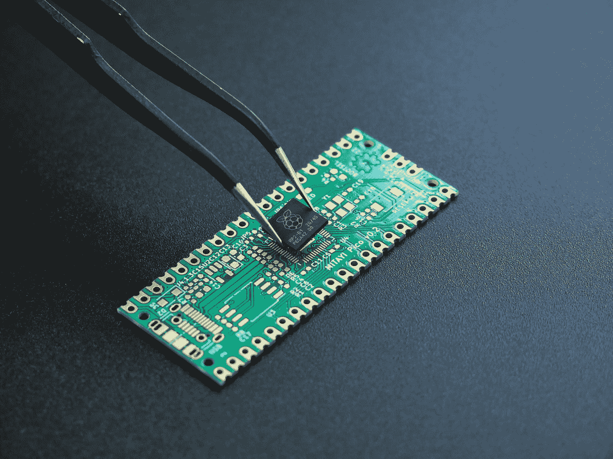

# LED 闪烁——裸机(第三部分)

> 原文：<https://medium.com/codex/from-brick-to-blink-part3-finale-42773faebf9e?source=collection_archive---------8----------------------->

## 如何处理裸露的金属

Vishnu Mohanan 在 [Unsplash](https://unsplash.com?utm_source=medium&utm_medium=referral) 上的照片

在前两篇文章中，我们已经准备好了让 LED 闪烁所需的工具。

如果你刚刚加入而没有阅读之前的帖子，你一定在想“但是这个家伙需要多少帖子来点亮一个该死的 LED？”
我建议你从头开始。