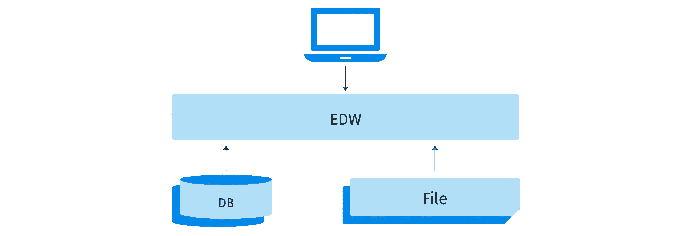
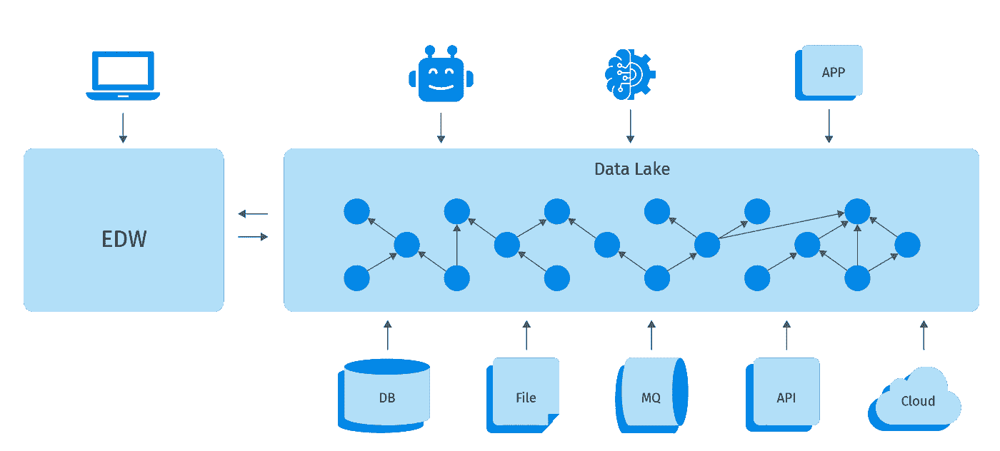
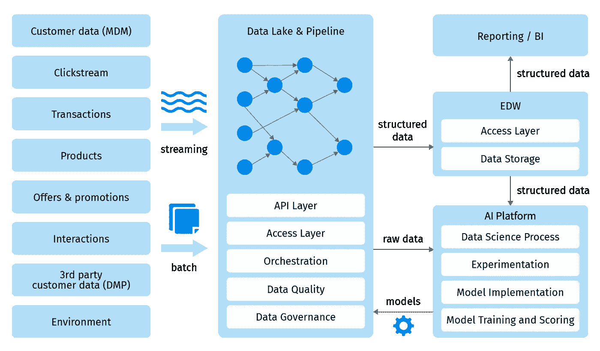
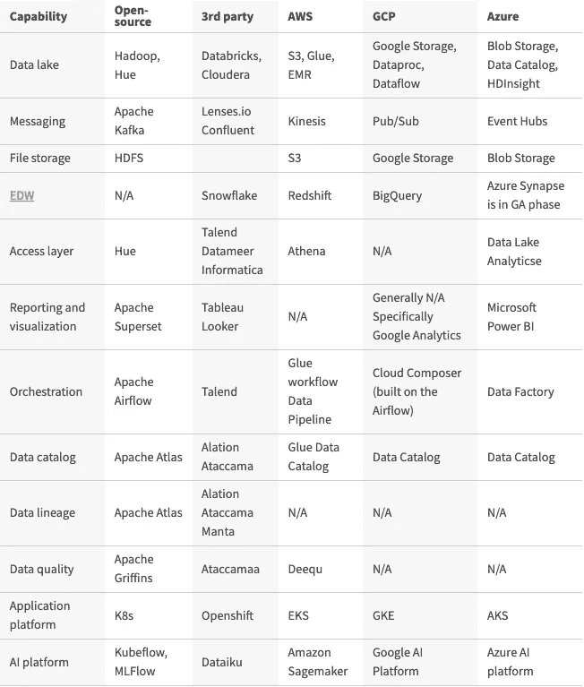

# 从数据湖到分析数据平台

> 原文：<https://medium.com/codex/from-data-lake-to-analytical-data-platform-3117f69cda55?source=collection_archive---------6----------------------->

文章最初发表在 [Grid Dynamics 博客](https://blog.griddynamics.com/?utm_source=medium&utm_medium=referral&utm_campaign=From_Data_Lake_to_Analytical_Data_Platform)

## 由[马克斯·马丁诺夫](https://blog.griddynamics.com/author/max-martynov/) & [德米特里·梅真斯基](https://blog.griddynamics.com/author/dmitry-mezhensky/)

在过去的十年中，数据在现代企业中的作用持续快速发展。公司发起了定义和执行其数据战略的计划，任命了首席数据官，并创建了大型团队来收集、管理数据并从中获得见解。随着意识的增强和对数据的更高需求，分析数据平台的概念也随之发展。

现在，实施数据湖来管理日益增长的[数量、速度和种类](https://www.forbes.com/sites/oreillymedia/2012/01/19/volume-velocity-variety-what-you-need-to-know-about-big-data/)的企业数据资产已经不够了。数据的[准确性](https://www.bigdataframework.org/four-vs-of-big-data/)或可信度也变得至关重要，同样重要的还有可访问性、易用性以及对 DataOps 和 MLOps 最佳实践的支持。在本文中，我们将描述现代分析数据平台的蓝图，以及从数据湖到现代数据分析工具集的旅程。

# 史前时代和数据大爆炸

在美好的过去，当数据是小的和结构化的，OLAP 立方体统治了分析的世界。EDW 技术和分析数据库加上报告和有限的机器学习能力足以管理企业数据资产并满足企业分析需求。数据源的数量是可管理的，并且大部分数据收集是通过 ETL 每周或每天批量完成的。

但是数字时代带来了传统分析生态系统无法很好应对的变化:

*   随着人们大规模移动到网上，与客户、员工、用户和供应商的数字交互数量大幅增加，导致捕获的数据呈爆炸式增长。点击流开始每天生成数 TB 的数据。
*   物联网的采用进一步增加了数据量。
*   公司看到了图像、语音和文本等非结构化数据的价值。这些数据的收集引发了人工智能的进步，允许从这些数据中产生见解。
*   将单个数据集保存在孤岛中使得难以实现客户和企业的 360 度视图。

EDWs 无法处理新的数据量、数据种类和数据速度。被称为数据湖的新一代系统，通常基于 Hadoop (HDFS)和 Spark 技术，接管了分析世界。

# 数据湖还是数据沼泽？

这些数据湖迅速成熟，到 2010 年代中期，大多数公司都部署了数据湖，并使用它们来聚合所有企业数据资产。云计算的成熟度落后，因此大多数部署都是在数据中心内部完成的。将数据转储到湖中非常容易，而且在湖中存储数据的成本也不是很高。

不幸的是，从数据中获取价值成了一个更大的问题。早期的数据湖有各种各样的问题:

*   虽然将数据放入湖中并不困难，但处理数据并将不同的数据集连接在一起需要新的技能和专业知识。
*   在湖中找到正确的数据非常困难，导致数据分析师和科学家的工作效率低下。无法找到正确的数据往往会导致数据重复，进一步恶化可访问性问题。
*   安全政策往往要么过于宽松，要么过于严格，导致敏感数据暴露给错误的人，要么限制访问太多，以至于该湖难以使用。
*   流处理仍然是许多公司没有实现的先进技术。
*   缺乏 DevOps 和 DataOps 流程以及不存在测试数据管道的最佳实践，使得开发新的数据处理管道极其困难。

所有这些挑战导致分析师、科学家和商业利益相关者对数据的信任度迅速下降。公司很快看到回报递减，并观察到他们的数据湖变成了数据沼泽。

# 分析数据平台蓝图

到 2010 年代中期，将数据放入湖泊的简单性导致许多公司认识到他们只是制造了数据沼泽。从许多方面来看，这都是迈向真正数据驱动型组织的合理目标。然而，没有借口在 2020 年重复同样的错误，陷入一个基本的数据湖。

在帮助许多财富 1000 强公司和科技初创公司从零开始构建分析数据平台或将其迁移到云之后，Grid Dynamics 为现代分析数据平台创建了一个技术蓝图。

当与正确的数据治理、数据运营和 MLOps 最佳实践、流程和组织结构相结合时，它可以提供一组强大的功能来满足任何企业的数据、分析和 AI/ML 需求。让我们简单描述一下它的功能。

# 数据湖

数据湖仍然扮演着核心角色。所有数据接收和处理最初都要经过数据湖。然而，新的数据湖并不局限于存储和处理数据。它有许多重要的功能:

*   **编排** —典型企业中数据接收、清理、重复数据删除和转换作业的总数可以以千或万计。需要数据管道编排来在正确的时间执行作业，管理作业间的依赖关系，促进发布和连续交付过程，以及实现灵活的配置。您可以在我们[最近发布的白皮书](https://blog.griddynamics.com/data-platform-orchestration-catalog-and-quality/)中找到关于编排的重要性和价值的更多详细信息。
*   **访问层** —将数据放入湖中很容易。很难安全、方便、快速地访问它。访问层功能使数据分析师和科学家能够找到并检索所需的数据。与数据目录一起，访问层可以扩展成一个语义层。
*   **API** —除了为数据分析师和科学家服务的访问层，现代分析数据平台通常需要为其他应用程序提供数据访问。为了实时地做到这一点，需要实现批处理和流式 API。如果需要实时访问键值数据，可以部署额外的系统和数据库来满足客户端应用程序的性能和可伸缩性需求。
*   **数据目录和沿袭** —虽然数据目录可以被视为访问层的一部分，但我们将其分开，因为它通常在不同的技术堆栈上实施。例如，数据湖的访问层可以在 Apache Hive 或 Apache Presto 中实现，数据目录的典型技术包括 Apache Atlas、Amazon Glue、Collibra 或 Alation。无论如何，数据目录的目的是使数据分析师、科学家和工程师能够在湖泊和 EDW 找到所需的数据集。然后使用数据沿袭来分析特定数据集是如何以及从哪些数据集创建的。更多详情，请阅读我们的[最新白皮书](https://blog.griddynamics.com/data-platform-orchestration-catalog-and-quality/)。
*   **数据监控和质量** —“垃圾进——垃圾出”这句名言最适用于分析数据平台。数据损坏的原因有很多，包括数据源中的缺陷、数据导入中间件或基础设施的问题以及数据处理管道中的缺陷。不管它是如何被破坏的，尽早发现缺陷并防止它们在系统中传播是非常重要的。更多详情，请参考我们的[博文](https://blog.griddynamics.com/why-you-need-data-quality-automation-to-make-data-driven-decisions/)和[白皮书](https://blog.griddynamics.com/data-platform-orchestration-catalog-and-quality/)。

# 摄取:批处理和流式传输

lake 有两种主要的接收数据的方式:批处理和流式传输。批处理用于通过 API 调用、导入文件和数据库转储从服务获取数据。流处理依赖于现代消息中间件，如 Kafka 或云服务。Lenses.io 等产品有助于将数据质量维持在这一水平。流数据摄取不仅限于点击流，通常还会结合应用程序设计模式，如 [CQRS](https://martinfowler.com/bliki/CQRS.html) 。

# edward 爱德华

虽然解决了许多新问题，但数据湖并没有完全取代企业数据仓库系统。EDW 是现代分析数据平台的重要组成部分，有助于快速安全地访问结构化和预处理数据。为了确保高性能和可伸缩性，大多数报告和可视化工具应该在 EDWs 之上实现，而不是直接访问数据湖。在许多情况下，数据科学家会发现在 EDW 使用“黄金数据”比直接访问数据湖更方便。

# 报告和可视化

报告和可视化仍然是任何分析数据平台的重要功能。大多数业务用户仍然通过报告和可视化工具与数据交互，而不是直接访问 edw 或数据湖。

# 人工智能/人工智能平台

近年来人工智能和机器学习的兴起增加了增强人类决策过程的重要性。为了能够在企业范围内扩展 AI/ML 工作，并实施高效的 MLOps 流程，数据科学家需要一个平台。现代人工智能/人工智能平台有许多功能可以让数据科学家的生活变得更加轻松，包括:

*   数据准备和实验
*   笔记本电脑
*   特征工程
*   AutoML
*   模型训练和评分
*   批量和实时服务
*   ML 质量控制

AI/ML 平台以及 MLOps 过程值得一个单独的博客帖子，所以我们在这里不会进行详细的讨论。

# CI/CD 基础设施

与任何代码一样，数据处理管道必须被开发、测试和发布。分析数据平台经常缺少 CI/CD 功能，增加了数据处理中的缺陷数量，导致数据质量差和系统性能不稳定。同时，数据管道的开发运维及持续交付流程有其自身的特点:

*   由于数据量很大，应该把重点放在使用生成的数据进行单元测试和功能测试上。
*   由于生产环境的规模很大，为 CI/CD 管道的每次执行创建随需应变的环境通常是不切实际的。
*   数据编排工具需要用于生产中的安全发布和 A/B 测试。
*   需要更加重视数据质量和生产中的监测以及数据产出的测试。

总的来说，我们在文章中概述的关于微服务的[发布过程的原则适用于数据管道的测试。数据管道和数据处理作业可以被认为是常规应用程序架构中的微服务。在微服务的情况下，数据管道的合同是文件或数据流，而不是 API 合同。](https://blog.griddynamics.com/avoid-the-monolithic-release-process-when-migrating-to-microservices/)

# 技术堆栈选项

蓝图中的每项功能都有许多技术选项。有了其中很多的实践经验，我们将在下表中给出几个例子:一个基于开源栈，一个基于第三方付费产品和服务，一个基于三大云提供商的云服务:Amazon AWS、Google Cloud 和 Microsoft Azure。

[什么是 EDW](https://blog.griddynamics.com/edw-performance-comparison/) ？

# 如何开始

构建一个具备所有必要功能的分析数据平台似乎是一项艰巨的任务。没有人愿意花几个月的时间从零开始构建一个核心平台，学习，并在这个过程中犯错误。“洞察速度”太重要了。

在 Grid Dynamics，我们帮助大大小小的公司从零开始构建一个强大的平台，将他们现有的湖升级为企业就绪的分析数据平台，并在升级的同时将他们的数据湖迁移到云中。无论您是想要从头构建平台、将内部数据迁移到云，还是升级现有的云平台，我们都可以根据业务的当前状态推荐最佳的技术组合，并共同规划迈向分析数据平台的旅程。

为了进一步加快核心平台的实施，我们为整个平台和特定功能(如数据质量、数据监控、异常检测和机器学习)实施了许多加速器。

# 结论

现代企业的数据分析需求远远超出了基本的数据湖。为了提高数据的可访问性和可信度，实现数据的价值，公司需要实施数据治理、访问层、API、数据质量和 AI/ML 平台等能力。利用结合了来自开源、第三方产品和云服务产品的最佳产品的现有蓝图和加速器，有助于最大限度地减少在构建脚手架和基础上花费的时间，实现高稳定性，并更快地实现增值的 AI 和 ML 功能。

在 Grid Dynamics，我们已经帮助各行各业的财富 1000 强公司设计、实施和升级了他们现有的云分析数据平台，或者将本地平台迁移到云。[联系我们](https://www.griddynamics.com/contact?utm_source=medium&utm_medium=referral&utm_campaign=From_Data_Lake_to_Analytical_Data_Platform)安排一次简报或研讨会，探讨现代分析数据平台功能、技术选项、云迁移之旅和优化升级路径的更多细节。