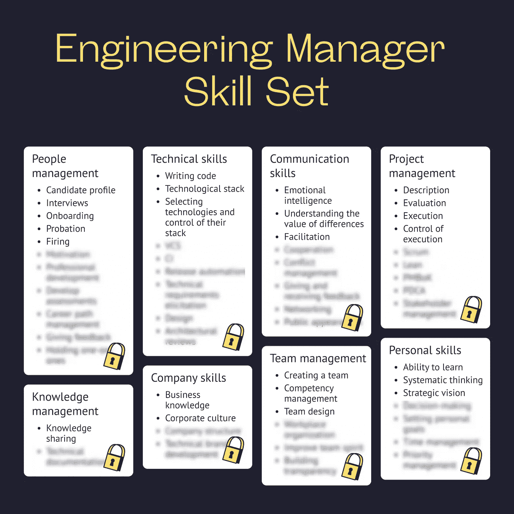

# 从员工到经理:2022 年伟大工程经理的八大技能

> 原文：<https://medium.com/codex/from-employee-to-a-manager-top-8-skills-of-a-great-engineering-manager-in-2022-60712c8ed797?source=collection_archive---------5----------------------->

你打算从一名员工转型为一名经理吗？或者你已经实现了，但是想知道怎样才能成为一名优秀的工程经理？

首先，你需要学习如何成为一名伟大的工程经理。也就是说，学习一名优秀的工程经理应该具备的技能，并解决初任经理面临的个人和职业挑战。

在这篇文章中，你会发现 2022 年成功的 8 大工程管理技能。

# 工程经理技能集 2022 —清单

在这一部分，你会找到问题的答案——成为一名软件工程经理需要哪些技能。

## 八大工程管理技能

当从软件工程师过渡到工程经理时，专家应该知道软件工程经理需要什么技能。毫无疑问，一个人应该有良好的硬技能，以便能够管理其他程序员的工作并评估他们的工作。

然而，伟大的软件工程管理与人员管理和沟通有很大关系。因此，发展软技能也是必不可少的。

Ace 准备了一个优秀工程经理应该具备的最完整和最新的技能列表，并将它们分为 8 个主要技能组。

以下是 2022 年 8 大工程管理技能:

*   人员管理
*   技术
*   通讯技能
*   项目管理
*   知识管理
*   公司技能
*   小组管理
*   个人技能

工程管理技能

> 通过您的电子邮件免费获取完整的[工程经理技能矩阵](https://www.vectorly.team/skill-matrix-templates/engineering-manager?utm_source=medium_partners&utm_campaign=codex)。

现在，让我们更详细地考虑每组技能。

*   **人员管理**。工程经理经常面临需要专业能力的不同任务，例如雇用新的团队成员、入职和激励他们，以及定期进行评估和一对一会议。
*   **技术技能。**这一组包括硬技能。管理者必须有技术背景，才能控制代码的质量，给出建设性的反馈，用同一种语言与软件开发人员交流。没有好的硬技能，软件工程经理很难完成工作。
*   **沟通技巧。这个群体意味着在对话中谈判和快速解决问题的能力。对于工程经理来说，了解每个团队成员的意图和动机是很有用的。同理心和高情商在管理技术团队中也发挥着关键作用。**
*   **项目管理。**这组技能是基于计划和控制执行的。工程经理帮助团队合作并及时交付产品。
*   **知识管理。**这项技能与知识的组织和收集以及在开发团队内部传递相关。它还包括维护技术文档的能力。
*   **公司技能。软件开发经理负责开发团队遵守商业规则。他或她应该完全了解公司的结构、目标和利益，以及促进企业文化。**
*   **团队管理。**工程经理必须表现出自己是一个有能力的组织者，能够确保技术团队协调一致且自主。一个经理应该能够建立一个有能力的团队，组织他们的工作流程，并保持团队精神和透明度。
*   **个人技能。最棘手的挑战是个人挑战:他或她应该提高他们在时间管理、决策和目标设定方面的技能，并学会如何设定优先事项，以便成为一名高效的管理者。**

你可以在这张图片中清楚地看到一个优秀的软件工程经理应该具备的顶级技能。

工程管理技能

> 通过电子邮件免费获取完整的[工程经理技能矩阵](https://www.vectorly.team/skill-matrix-templates/engineering-manager?utm_source=medium_partners&utm_campaign=codex)。

## 提高软件工程管理技能的来源

如何提高谈判、计划和委派的能力？最好的方法是在实践中去做。然而，为了让你在这个问题上走上正轨，我们提供了一个资源列表，帮助你更好地理解工程经理有用的软技能的本质。

## 15 大工程管理书籍

1.  [一个优雅的谜题:工程管理系统](https://www.amazon.com/Elegant-Puzzle-Systems-Engineering-Management/dp/1732265186)
2.  [衡量重要的事情:谷歌、博诺和盖茨基金会如何通过 OKRs 震撼世界](https://www.amazon.com/Measure-What-Matters-Google-Foundation/dp/0525536221/)
3.  [哈佛商业评论经理手册:17 种领导者需要突出的技能(HBR 手册)](https://www.amazon.com/Harvard-Business-Review-Managers-Handbook/dp/1633692116/)
4.  [管理者之路:引领技术领导者成长和变革的指南](https://www.amazon.com/gp/product/1491973897/ref=as_li_tl?ie=UTF8&camp=1789&creative=9325&creativeASIN=1491973897&linkCode=as2&tag=georgeguimara-20&linkId=1c6f251e21e36b2c64655a4dca208bdf)
5.  实用程序员:从熟练工到大师
6.  [设计模式:可重用面向对象软件的元素](https://www.amazon.com/Design-Patterns-Elements-Reusable-Object-Oriented/dp/0201633612/)
7.  [聪明能干:乔尔·斯波尔斯基寻找最佳技术人才简明指南](https://www.amazon.com/Smart-Gets-Things-Done-Technical/dp/1590598385/)
8.  [敏捷软件开发、原则、模式和实践](https://www.amazon.com/Software-Development-Principles-Patterns-Practices/dp/0135974445/)
9.  [极限编程讲解](https://www.amazon.com/Extreme-Programming-Explained-Embrace-Change/dp/0321278658/)
10.  [测试驱动开发:举例](https://www.amazon.com/gp/product/B095SQ9WP4/)
11.  [神话人月](https://www.amazon.com/Mythical-Man-Month-Anniversary-Software-Engineering-ebook/dp/B00B8USS14/)
12.  [Peopleware:生产项目和团队](https://www.amazon.com/Peopleware-Productive-Projects-Tom-DeMarco-ebook/dp/B00DY5A8X2/)
13.  [死亡行军](https://www.amazon.com/Death-March-2nd-Edward-Yourdon/dp/013143635X/)
14.  [团队的五大功能障碍](https://www.amazon.com/Five-Dysfunctions-Team-Leadership-Lencioni-ebook/dp/B006960LQW/)
15.  第一次当经理的人

## 面向工程经理的顶级导师平台

发展技能的最好方法之一是找一个导师，他有相关的经验，可以提供专业的支持。Ace 收集了最受欢迎的导师平台，工程经理可以在这些平台上找到导师。

> [寻找导师:软件开发人员、产品经理、设计师的 12 个热门导师平台](https://www.vectorly.team/vectorly-blog/mentorship-platforms?utm_source=medium_partners&utm_campaign=codex)

## 在线课程

在这篇文章中，你会发现包括工程管理在内的所有技术角色的在线课程平台。

> [35 个提高软件开发人员技能的在线平台](https://www.vectorly.team/vectorly-blog/online-courses?utm_source=medium_partners&utm_campaign=codex)

## 关注工程管理和技术领导力的影响者列表

*   肯尼斯·奥肯伯格[@奥肯伯格](https://twitter.com/auchenberg)
*   拍拍夸[@拍拍夸](https://twitter.com/patkua)
*   格尔吉利·奥罗兹[@格尔吉利·奥罗兹](https://twitter.com/GergelyOrosz)
*   亚当·沃斯基[@亚当·沃斯基](https://twitter.com/adamwarski)
*   慈善专业[@ mipsystipsy](https://twitter.com/mipsytipsy)
*   伊莎贝尔·尼奥[@艾萨白](https://twitter.com/eisabai)
*   法尔汉萨瓦尔 [@fnthawar](https://twitter.com/fnthawar)
*   thiago Ghisi[@ thiagoghisi](https://twitter.com/thiagoghisi)
*   凯文·斯图尔特 [@kstewart](https://twitter.com/kstewart)
*   劳拉·霍根[@劳拉 _ 霍根](https://twitter.com/lara_hogan)
*   张燕妮[@ yennychung](https://twitter.com/YennyCheung)
*   黄志刚[@攻击壁虎](https://twitter.com/attackgecko)
*   本·纳德尔[@本纳德尔](https://twitter.com/BenNadel)
*   瑞安·伯吉斯[@伯格斯特里安](https://twitter.com/burgessdryan)
*   塔辛·戴恩[@塔斯曼尼亚克](https://twitter.com/tasomaniac)
*   阿诺德·海雷[@阿诺德 _ 海雷](https://twitter.com/Arnold_Haine)
*   can dost Dagdeviren[@ can dosten](https://twitter.com/candosten)
*   肯尼斯·拉森[@肯尼特·拉森](https://twitter.com/kennethlarsen)
*   法瓦德·可汗 [@DigitalFawad](https://twitter.com/DigitalFawad)
*   莫莉·斯特鲁维[@莫莉 _ 斯特鲁夫](https://twitter.com/molly_struve)
*   安德里·丁尼亚[@安德里·丁尼亚](https://twitter.com/andriidzynia)
*   塞杰拉公主
*   凯文戈德史密斯 [@KevinGoldsmith](https://twitter.com/KevinGoldsmith)
*   莎拉·米尔斯坦[@萨拉姆](https://twitter.com/SarahM)
*   佛朗哥·费尔南多[@佛朗哥·费尔南多 0](https://twitter.com/Franc0Fernand0)
*   费利克斯·洛佩斯[@弗洛佩兹卢伊斯](https://twitter.com/flopezluis)
*   米特拉拉曼 [@ramannoodlez](https://twitter.com/ramannoodlez)
*   杰拉尔德·巴德医生

# 首次经理提示(包括来自经验丰富的 EMs 的报价)

怎样才能成为一名优秀的经理？对于软件工程经理来说，最大的挑战不是技术上的，而是个人的。为了有效地管理技术团队并交付优秀的软件，经理需要找到瓶颈和问题，消除它们可以让团队专注并变得更有效率。

此外，他或她看到他们的工程师不那么浮华的工作，并且知道如何证明需要额外的资源。同时，一个工程经理需要控制程序员的生产力，并与利益相关者建立沟通。

只有知道如何制定战略来预测未来几个步骤的团队领导和经理才有能力做到这一点。对于第一次做经理的人来说，这可能是个问题。

在这一部分中，您将了解经理在从员工转变为经理时最常面临的个人和职业困难，以及来自经验丰富的成功经理的首次经理提示和评论，以及他们如何应对这些挑战的建议。

以下是首次担任经理的人面临的最典型的挑战:

*   情商
*   时间管理
*   委托
*   应对压力
*   管理和领导会议
*   工作生活平衡

让我们仔细看看每一点，并考虑解决方案，特殊的技术，将有助于应对这些挑战和发展必要的技能。

## 情商

智商，或称智力商数，指的是某种技能，例如数学能力、对词汇和语言的广泛理解、抽象推理或空间能力——这大多在出生时就决定了。

另一方面，情商是一种后天习得的技能，可能会随着时间的推移而发生巨大的变化。拥有高情商技能基本上意味着理解自己的感受和他人的感受，表达情感，自我激励，并鼓励他人也这样。

良好的情商技能对有效的领导力至关重要，因为情商高的专家在管理职位上似乎表现得更好。他们往往在事业上更成功，建立更牢固的工作和个人关系，实现自己的目标，并激励他人。

如果你对发展你的情商技能感兴趣，你可以在下面的主题中找到我们收集的很好的资源。

## 也可以阅读情商

**提高管理者情商的 6 本书**

1.  [情商:为什么比智商更重要](https://www.amazon.com/Emotional-Intelligence-Matter-More-Than/dp/055338371X)
2.  [原始领导力:释放情商的力量](https://www.amazon.com/Primal-Leadership-New-Preface-Authors/dp/1422168034/ref=sr_1_1?crid=B1R4DSDT6PO7&keywords=Primal+Leadership%3A+Unleashing+the+Power+of+Emotional+Intelligence&qid=1646040900&s=books&sprefix=primal+leadership+unleashing+the+power+of+emotional+intelligence%2Cstripbooks-intl-ship%2C155&sr=1-1)
3.  [情商高的经理:如何开发和运用领导的四种关键情感技能](https://www.amazon.com/Emotionally-Intelligent-Manager-Emotional-Leadership/dp/0787970719/ref=sr_1_1?crid=27D9LVLO6XE2H&keywords=The+Emotionally+Intelligent+Manager%3A+How+to+Develop+and+Use+the+Four+Key+Emotional+Skills+of+Leadership&qid=1646040947&s=books&sprefix=the+emotionally+intelligent+manager+how+to+develop+and+use+the+four+key+emotional+skills+of+leadership%2Cstripbooks-intl-ship%2C171&sr=1-1)
4.  [思考，快与慢](https://www.amazon.com/Thinking-Fast-Slow-Daniel-Kahneman/dp/0374533555/ref=sr_1_1?crid=1RGIJFC5XKYBQ&keywords=Thinking%2C+Fast+and+Slow&qid=1646040975&s=books&sprefix=thinking%2C+fast+and+slow%2Cstripbooks-intl-ship%2C146&sr=1-1)
5.  [情商 2.0](http://www.amazon.com/Emotional-Intelligence-2-0-Travis-Bradberry/dp/0974320625/ref=sr_1_4?s=books&ie=UTF8&qid=1328548324&sr=1-4)
6.  [情商差异:让情商发挥作用的强大计划](http://www.amazon.com/EQ-Difference-Powerful-Emotional-Intelligence/dp/0814408443/ref=cm_lmf_tit_6)

**博客&作者写情商**

*   [非常好的心灵博客](https://www.verywellmind.com/)
*   [**助导博客**](https://www.helpguide.org/articles/mental-health/emotional-intelligence-eq.htm)
*   [**EI 体验博客**](https://eiexperience.com/blog/improve-employee-mental-health-with-emotional-intelligence/)
*   [**教练领导博客**](https://coachingleaders.co.uk/what-is-emotional-intelligence/)
*   [**六秒博客**](https://www.6seconds.org/2022/01/17/empathy-iceberg/)

**测试你的情商水平**

正如我们所发现的，情商在个人生活和工作中发挥着巨大的作用。你想知道自己的情商水平吗？点击[这里](https://www.verywellmind.com/how-emotionally-intelligent-are-you-2796099)进入你的情商。

## 时间管理

当担任经理时，一个人应该涵盖许多业务流程。这对那些难以规划时间的人来说是一个挑战。这就是为什么第一次做经理的人应该提高他们的时间管理技能——设定正确的目标，包括个人和团队的目标，优先考虑和消除浪费时间的事情。

> “在时间管理方面，按优先顺序排列的待办事项列表总是对我有帮助，遗漏任何事项的可能性也更小。作为一名经理，及时向利益相关者以及您的直接下属反馈问题非常重要。此外，我喜欢加里·凯勒和杰伊·帕帕桑写的《同一件事》一书，书中说一次专注于一件事可以节省大量时间，还能提高工作质量，”Verifi Inc .软件工程经理坎昌·巴卡尔说。
> 
> “待办清单是我的秘密武器。除此之外，我还使用普通的日历和甘特图，”Instacart 的高级工程经理马克西姆·戈利夫金说。

为了帮助管理者，我们收集了最流行和最有效的时间管理技巧。

**1。帕累托原理**

所谓的 80/20 法则是一种时间管理方法，它有助于对解决问题最有效的任务进行优先排序。这就是 20%的行动要对 80%的结果负责。

为此，建议采取以下步骤:

*   列出你面临的问题。例如，性能指标正在下降。
*   确定每个问题的根本原因。也许您的度量正在恶化，这是由于您在项目上错误地分配了时间和人力资源，或者其他原因。
*   给每个问题打分。给最重要的问题更高的分数。
*   按原因对问题进行分组。你在资源分配上犯错误导致的问题，应该是同一组的。比如说。
*   把每组的分数加起来。得分最高的那组是你应该首先解决的问题。
*   采取行动。

帕累托原理

**2。艾森豪威尔矩阵**

这种方法基于一个紧急重要矩阵。根据这种方法，您需要按以下方式对任务列表进行排序:

*   重要的
*   不重要的
*   急迫的
*   不急

理想情况下，你应该只做重要和紧急的任务。委派其余的任务，甚至重新考虑执行这些任务的需要。

这种方法基于一个紧急重要矩阵。根据这种方法，您需要按以下方式对任务列表进行排序:

*   重要的
*   不重要的
*   急迫的
*   不急

理想情况下，你应该只做重要和紧急的任务。委派其余的任务，甚至重新考虑执行这些任务的需要。

艾森豪威尔矩阵

**3。番茄工作法**

这项技术使用一个计时器将你的工作分成几个间隔——番茄工作法。工作原理:

*   制定一项任务。
*   设置一个计时器，例如 25 分钟。
*   专注于手头的任务。
*   当计时器响起时，勾选该框。
*   放下工作休息一会儿。
*   重复第二步到第五步:在你完成这个过程四次后，你可以开始休息更长时间(20-30 分钟)。

这个方法会帮助你集中注意力，同时不会感到不知所措。

番茄工作法

**4。做事情(GTD)的方法**

通过记录任务并将其分解为工作流来帮助您完成任务。它是这样工作的:

*   捕捉引起你注意的动作。
*   查看其中是否有需要采取行动的任务。如果一个项目需要行动，执行或委派它。
*   优先处理你的待办事项。
*   划掉你完成的任务。
*   完成你现在就能解决的任务。

把事情做好(GTD)方法

**5。吃青蛙技术**

从最困难的任务(“青蛙”)开始一天，逐渐向较容易的任务迈进:

*   明确目标。
*   修好它。
*   设定最后期限。
*   列出你需要做什么来达到你的目标。
*   按优先顺序排列列表上的任务。清单上的第一批是你的“青蛙”。
*   先吃最脏的青蛙，这样就更容易完成剩下的新任务。
*   每天重复这个过程。

## 委托

对于经理来说，理解如何授权是非常重要的，这一点怎么强调都不为过。当你适当地授权时，你可以更少地关注于执行任务，而更多地关注于管理和领导。

授权有很多好处:

*   首先，它让你有时间管理和领导他人，以及承担额外的项目。
*   其次，你让最积极主动的员工展示自己，承担额外的责任并获得新的技能。

为了实现双赢，对经理来说，使用以下[有效授权的四个步骤](https://www.amazon.com/First-Time-Manager-Loren-B-Belker/dp/0814417833):

1.  分析你当前的任务。找到你可以委派的人。
2.  决定你可以把它委托给谁。选择有足够能力的员工。
3.  与员工讨论细节。解释你期望的结果。
4.  监控进度。

委派步骤

在 Ace 的[一对一会议](https://www.vectorly.team/templates?utm_source=medium_partners&utm_campaign=codex#1-to-1-meeting)中，你可以用现成的议程讨论任务，并在讨论任务时为员工列出任务清单。这样你就不会忘记任何事情，也不必记住你在会议上达成的共识。

如果你对发展你的授权技巧感兴趣，请阅读以下相关资料。

## 另请参阅授权:

> [要成为一名伟大的领导者，你必须学会如何很好地授权](https://hbr.org/2017/10/to-be-a-great-leader-you-have-to-learn-how-to-delegate-well)
> 
> [如何有效授权:给经理的 9 个建议](https://online.hbs.edu/blog/post/how-to-delegate-effectively)

## 管理和领导会议

团队经理的职责之一是定期召开会议，既包括与整个团队的会议，也包括一对一会议。

一个有效的经理应该对召开会议有什么样的理解？

*   首先，会议是昂贵的，因为你打扰了人们的工作，花费了他们的时间，这可能要花很多钱。所以你需要意识到它应该尽可能有效，意思是导致决策，并安排在一个固定的时间内。
*   其次，应该在会议开始前给与会者发一份议程表，这样每个人都会有所准备。这将大大提高会议的效率，并允许与会者提出自己的议题。无论如何，任何讨论的主要目标之一是让人们感到被倾听。

> “对我来说，让团队中的每个人都参与进来并在工作中被倾听是成功召开会议的关键。作为一名领导者，在宣布自己的意见之前，先征求他人的意见，这在这方面很有帮助，”—机器人与控制公司的工程经理阿沛·古普塔(Abhay Gupta)。
> 
> “我从信任开始，努力与团队成员建立关系。我的目标是建立心理安全，一个学习和创新的安全环境。安全感和归属感会增加你快乐的大脑化学物质、血清素和催产素，”BoxCast 的技术主管兼网络开发负责人 Joe Swislocki 说。

最常见的情况是，第一次当经理的人很难在会议中扮演领导角色，也很难感到自信。为了减轻压力，使用以下简单的建议。

[针对经理的有效会议技巧](https://www.amazon.com/First-Time-Manager-Loren-B-Belker/dp/0814417833):

*   在会议开始前，制定一个有条理的主题和主要目的的议程，确保每个人都有时间准备。
*   扮演领导者的角色:把注意力集中在主题上，不要在人们发言之前打断他们，但也不要让他们渐行渐远。
*   在开始时概述会议规则。这些基本规则可能包括紧扣主题、允许每个人发言、批评建议但不批评传达者等等。这将使会议进行得更顺利，并避免许多中断。
*   会后收集参与者对会议进展的反馈。这将花费五到十分钟的时间，并有助于提高您主持的下一次会议的质量。
*   只邀请那些真正应该到场的人。而且，邀请的人越少越好，这样才能避免不必要的打扰，不浪费他们的时间。团队成员也不需要参加整个会议，他们应该只参与与他们相关的议程主题。
*   尽可能缩短会议时间。如果会议需要 2 个多小时，休息一下让每个人都参与进来。
*   为每位参与者准备一份包含具体行动的跟进行动计划。因此，你要确保你分配给队友的任务能够完成。

## 会议模板

为了进行有效的会议并节省准备时间，使用 Ace [现成的模板](https://www.vectorly.team/templates?utm_source=medium_partners&utm_campaign=codex#1-to-1-meeting)。

## 也在会议上阅读

> [软件开发团队中的一对一会议:惊人的收益](https://www.vectorly.team/vectorly-blog/benefits-of-one-on-one-meetings?utm_source=medium_partners&utm_campaign=codex)
> 
> [如何召开一对一会议的组织技巧【议程模板】](https://www.vectorly.team/vectorly-blog/how-to-run-one-on-one-meetings?utm_source=medium_partners&utm_campaign=codex)

## 应对压力

与工作相关的压力可能由多种因素引起。对于什么是压力，我们都有不同的看法。然而，任何让我们的身体或精神失常的事情都是有压力的。

以下是最常见的工作压力源列表:

*   没有得到老板的指示
*   电脑故障
*   不断的中断
*   优先级不断变化
*   上层管理不断变化
*   兼并
*   缩小规模
*   改组
*   组织政治
*   时间压力
*   性能压力
*   糟糕的时间管理
*   把个人问题带到工作中
*   长时间长时间工作

工作场所压力因素

处理工作压力的能力是一个高效且有经验的经理的技能。在这里你会发现两种释放压力的技巧:

*   有助于应对当前压力的短期练习
*   预防慢性压力和保持健康心态的长期策略

> “首先，我将自我保健和锻炼作为日常生活的一部分。我的目标是每天早上锻炼 60 分钟。我的锻炼以我为中心，我觉得我可以带着整个自我去工作。我有更强的领导能力”BoxCast 技术主管兼网站开发负责人 Joe Swislocki。
> 
> “首先，集中时间。我发现的最有效的压力管理策略是集中精力，在周五下午的几个小时里，不去参加任何会议和杂事。这是我用来赶上那些我知道很重要但在一周内没有完成的事情的时间，因此也是压力的原因。对我来说，让压力远离真的很有效，这是在一周结束前完成工作和提高效率的好方法。其次，腾出时间锻炼。我尝试每天散步或锻炼至少 20-30 分钟，这可以增强我的能量，清醒我的头脑，缓解压力，”— Harpeet Mehta，南加州大学软件工程经理。
> 
> “关于压力管理，我一直在做的是在早上开始工作之前锻炼。这样，我就可以从待办事项清单上少一件事情开始新的一天，”Suzano 的数据科学技术负责人 Bruno Theozzo 说。

## 尽快释放压力的技巧

我们推荐能带来短期压力缓解的技巧。如果你此刻需要处理一个有压力的情况，他们肯定会帮助你冷静下来，理清思路，做出更好的决定，即使是在压力下。

**1。紧张和放松技巧**

*   舒服地坐着，闭上眼睛
*   绷紧你身体的每一块肌肉 10 秒钟
*   放松并释放紧张 20 秒钟
*   重复 5-10 次

2.**箱式呼吸法**

适当的呼吸有助于你进入稳定的工作节奏。

*   吸气，慢慢数到四
*   屏住呼吸四秒钟
*   用嘴慢慢呼气 4 秒钟
*   重复，直到你感到平静

箱式呼吸技术

**3。快速冥想**

练习正念比你想象的要容易。专注于你的呼吸或身体感觉(感觉你的皮肤接触椅子或脚踩在地上)有助于释放压力和注意力。

**4。走 10 分钟**

如果你感到压力很大，无法集中注意力，一小段散步将有助于转移对问题的注意力，减少导致压力的系统中的皮质醇，并清理你的大脑。只需 10 分钟，你就会感觉好多了，并准备好继续工作。

## 长期减压策略

你需要小心安排你的工作日，以避免长期的压力。这里有一些方法会有所帮助:

*   提高你的时间管理技能
*   知道何时寻求帮助
*   定期练习冥想
*   锻炼
*   识别并跟踪工作中的压力源
*   抽出时间充电

长期减压策略

## 工作生活平衡

如果你想成为一名伟大的经理，你的职业生涯对你来说一定非常重要。这种奉献精神令人钦佩，但记住工作并不是你生活的全部也很好。当然，在工作的最初几个月里，你必须鞭策自己。但是在你顺利度过磨合期之后，你需要拓宽自己的兴趣和活动。一个完整的管理者，首先是一个完整的人。

> “我确实住在西海岸，在东海岸工作。这意味着早起，大约 5 点钟，然后在 3 点或 4 点钟更早下班。我的孩子下午 2:30 下班，所以我尽量每周去接他们一两次。对我来说，一件重要的事情是有时间进行更深入的工作。这种松散的文化中，对话是开放式的，有许多来回——有些与你有关，有些与你无关——这很容易分散注意力，不利于做出高质量的决策。BuzzFeed 首席技术官王蒙杰说:“我尽量在早上留出 3 个小时进行更深入的工作，其余时间用于开会。
> 
> “对我来说，工作与生活的平衡没有秘诀。我只是有意识地等待，看看哪种方式最有效，不会影响到他们中的任何一方。有时候，同样的策略并不适合所有人，所以重要的是不断学习和调整。我也让我的团队在他们自己的筒仓中运作，但保持沟通畅通，这样每个人都知道他们是如何运作的。这种策略增加了团队的自由度，从而提高了生产率，”—美敦力公司创始人、执行和工程负责人 Ajay Panwar。

如果一个管理者开始优先考虑他们的工作，而忽略了社会生活和个人兴趣，这将不可避免地导致倦怠。从长远来看，这种策略是失败的，并大大降低了有效性。

和任何情况一样，倦怠的症状因人而异。但是由于倦怠最终是一个工作场所的问题，你可以寻找一些模式并在为时已晚之前采取行动。

> 在我们最近的博客文章中阅读更多关于倦怠和如何预防的内容——开发人员倦怠可能是一个严重的问题。这里是如何发现它。

## 关键想法

*   当你从一名员工转变为一名经理时，你应该了解期望的职位需要什么样的技能，并发展这些技能。这个策略将有助于成为一名优秀的经理。
*   对于软件工程经理来说，良好的硬技能对于管理技术团队和评估他们的工作至关重要。然而，软技能同样重要，因为管理与人相关。
*   对于软件工程经理来说，最大的挑战不是技术上的，而是个人的。
*   第一次当经理的人面临的最典型的挑战是情商、时间管理、授权、处理压力、管理和主持会议，以及工作与生活的平衡。