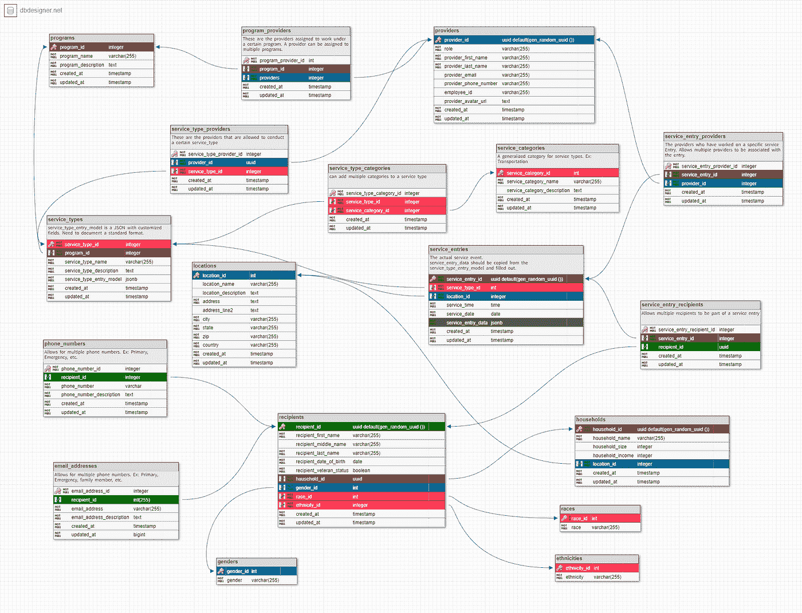

# 从自由职业者到全栈和雇佣——Lambda 学校/实验室体验

> 原文：<https://medium.com/codex/from-freelance-to-full-stack-hired-a-lambda-school-labs-experience-a469c24360dc?source=collection_archive---------8----------------------->

[潜水时间](https://www.instagram.com/e.a_burdett/)

2021 年 1 月，在 COVID 和飙升的感染率中，我开始了为期 6 个月的全日制全栈网络开发项目，名为 [Lambda 学校](https://lambdaschool.com/)。作为一名自由作家、摄影师和 wordpress/CMS 网站开发人员，我做得还不错，但我已经准备好做一些更稳定的事情——一些严格意义上的远程工作和更可靠的工作流，但仍然使用网络技术和编程语言。疫情和我周围的城市[实际上忽略了它](https://abc7amarillo.com/news/local/spike-of-334-new-covid-19-cases-reported-in-amarillo)，就像是一个警钟:我做的并不像我想象的那么好。金钱、工作和失业开始成为我的负担。Lambda 看起来是一条体面的出路，因为他们有 ISA 协议和远程资深教师。所以我做了。这很难——但实际上我写这篇博客是作为毕业要求。我不仅在写毕业要求——事实上，我已经通过一个付费的 Lambda 奖学金项目找到了一份工作，而且几乎肯定会得到一份工作。

所以，是的，我做到了。关于这个博客的毕业要求的一部分是谈论这个过程:我是如何做的，更具体地说，我在毕业前的最后一个实验室单元的经验如何有助于我从 Lambda 毕业的工具集。因此，在为一家从事 web 开发的租赁公司工作的时候，我在 Node.js [上重复了一个单元，在这漫长的 8 个月里，我没有详细解释，下面是实验室里发生的事情:](http://randallcountyrentals.com/)

Lambda 的最后一个实验单元是 4 周。在第一周，你被安排和一群其他学生一起为主要是非营利组织的项目工作，并了解你的具体组织。我的团队最终被分配到华盛顿州斯波坎市的[家庭承诺服务跟踪项目中。这让我很满意——我热爱一个好的事业，他们的事业很伟大:通过提供一些服务来帮助那些处于无家可归边缘的家庭远离无家可归。](https://www.familypromiseofspokane.org/)

该应用程序的想法是一个平板电脑原生服务跟踪器，为 Family Promise 工作的服务提供商可以使用它来跟踪他们在通过 Family-Promise 发给他们的平板电脑上提供的服务。来自该追踪器的数据将被发送到 python 驱动的数据科学数据库，以提供可操作的分析，如低收入地区的收入增长、食物匮乏、无家可归、心理健康服务等统计数据。家庭承诺将利用这些资金为更大的服务区域提供更有效的服务。为好而编程！

现在在技术方面:

在我们的第一周，我们大部分时间都是作为一个团队来处理代码库的当前状态，这些代码库是我们从之前的 2-3 个实验室团队那里继承来的，他们在我们之前参与了这个项目，这是他们毕业要求的一部分。我发现我之前在一家当地公司 E[eighty twenty](https://eightytwentymeals.com/)的开发经验和在乌干达圣弗朗西斯聋人销售学校的非盈利经验在这里派上了用场——我觉得与一个组织合作很舒服，能够识别和解释他们的问题，并设计出解决方案。因此，我们着手识别和解释被询问的内容、需要的内容以及代码库的当前状态。我们看了一些以前球队的 zoom calls 录音，看了文档，成为他们被遗忘的 Trello board 的新使者。我记得我浏览了我们继承的 github，然后是代码本身，我想，“嗯，这里的后端正在做一些我认为不太正确的事情……”这一周，我们更多地关注了逻辑，而不是代码，在这一周结束时，我们已经准备好进入代码了。

我们的家庭承诺服务跟踪特雷罗板！

在第 2 周的开始，我们深入到前端工作，从后端获取一些缺失的信息。我得说气氛几乎是愉快的。我们很兴奋开始工作。然后，当我们开始测试端点时，我们意识到数据库中确实存在一些不太正确的东西。然后，在接下来的一周里，这意味着什么变得清晰了。

2 年前，我们对数据库进行了重组，但这一重组并没有很好地记录下来。虽然有一个很好的功能，但我们意识到数据库的循环架构需要完全解开，这意味着数据库的另一次重新构建。然后，我们意识到大多数模型、路由器和前端变量都不匹配，因为上次数据库更新之前的遗留代码没有被删除/更改，以适应当前仍然不稳定的架构。我要说的是，在这段时间里，查看和处理一些后端连接的前端组件是我对团队最重要的贡献，因为它让我了解到我们继承的代码库在架构上有问题。如果我们继续这样下去，我们只会给家庭承诺和下一批工程师留下一个仍然破碎的应用程序。

事实上，对于实验 37 中的大多数同学来说，这是实验中最难的部分:我们的入职过程，即第一周，一直专注于团队工作的后勤，直到实验的第二或第三周，我们才理解我们正在进入的代码。当我们确定了关键的结构问题时，我们只有一周的时间来解决这些问题，如果我们不这样做，下一批人就会像我们一样迷失，因此:一个粘性循环，大多数初级程序员花 3 周时间来打破一个现实世界的项目，但在第 4 周他们才意识到他们需要专注于满足 Lambda 的毕业要求，而不是修复他们的代码或为下一批人记录项目的状态。

来自您的 pull 请求确实修复了一些不匹配的变量，这让我们发现了一些循环的数据库架构和遗留代码的前端代码(例如:左边面板第 148 行的 id 映射，显示在右边)

原始数据库模式—解开后

在这一点上，我的队友和我都感到相当的压力和失望。我们在去实验室的路上，基本上只是解开了别人的意大利面条代码。幸运的是，我们的团队有一个非常优秀的 Node.js 开发人员，他非常了解后端和数据库架构，Michael Habbermas。迈克尔重组了团队，我们开始解开更多的意大利面条式代码并重组数据库。我们这样做的目的是，在第四周结束时，它将就位并记录得足够好，以便下一批继承项目的人知道它的确切状态，并可以继续我们离开的地方，而不必解开太多的意大利面条。

理清和重构后的数据库——这样不是更流畅吗？

在不太疯狂地深入特定代码行和失去任何仍在阅读的读者的情况下，这就是项目现在的情况:在 github repo 中闪耀，准备传递给下一组聪明的 Lambda School 工程师，带有新的功能数据库和编写精美的 readme 文档库::[https://github . com/Lambda-School-Labs/family-promise-service-tracker-be-a/tree/main/docs](https://github.com/Lambda-School-Labs/family-promise-service-tracker-be-a/tree/main/docs)

天啊，看看那份文件！

这还不是我毕业时唯一庆祝的事情。Lambda:在我实验室的最后一周，正当我感觉要累垮的时候，我得了糖尿病。下面是我个人[观点的一点简介。那么](http://notion.so) doc 关于这位 DM 和我的实验室/伙伴经验将我引向何处:

“在 Lambda 呆了 8 个月之后，我开始感到筋疲力尽。我只弯曲了一次，但在我看来，是最难和最长的单元:节点。直到第二单元快结束的时候，我才真正意识到自己到底在做什么，以及代码的某些部分是如何相互通信的。CS 飞得相当快，python 感觉很熟悉。

实验室是一个不同的故事——八月悄悄来到我身边，事情又变得忙碌起来，夏天几乎已经结束了。再加上[的影响，在我的家乡阿马里洛发生的一切，那里的艾滋病感染率、住院率和死亡率最近都在飙升](https://scontent-dfw5-2.xx.fbcdn.net/v/t1.6435-9/240097810_4749058338439044_4579606911267342745_n.jpg?_nc_cat=106&ccb=1-5&_nc_sid=730e14&_nc_ohc=KRxNEyj6qbAAX8L9nsr&_nc_ht=scontent-dfw5-2.xx&oh=31c2be94f7f8b6e400138717060edb4a&oe=6152459E)。每一天都让我疲惫不堪，到了第三周，当我对事情有了更好的理解，并实际上提出了一个拉取请求时，我明白到那个周四的早上我已经筋疲力尽了。巧合的是，那天我进行了第二次简历审核，在把简历发给我的审核人 Elisa 后，我收到了一封 DM，要求把我的简历展示给 Audiohook。那天晚上，我参加了一个面试，我认为我做得不好，但是到了星期五早上，我得到了奖学金。"

那个星期一，我通过电话与首席执行官乔丹会面，他概述了他希望我为公司做的事情——使用 react-native flask stack 进行 CI & CD Heroku 测试。所以我做了一个反应瓶。我从未在 Lambda 学习过 react-native 或 flask 但我加入该团队已经一周了，我将很快完成并部署该应用程序并进行测试。虽然这不是该公司的产品，但通过真正具体的测试来部署它可能会让我获得平台代码，然后真正的机会就在我面前。甚至有一个机会，有足够可观的贡献，我可以赚取股票期权？？？？我不知道这值多少钱，但这绝对是我最近看到的最好的机会。

一件很酷的事情是，我真的觉得我可以做到——为公司做出体面的贡献。

不管怎样，我都很兴奋。感觉真好。时间安排得很好，我没有耗尽精力，而是设法将精力投入到这个奖学金项目中，学习一个新的框架，并对解决问题的机会持开放态度，这将非常值得我花费时间和精力。如果没有在 Lambda 通过与 Labs 37:Family-Promise Labs 团队实时远程协作实践实用而敏捷的开发实践来巩固数月的编程学习经验，这一切都是不可能的。

另外:大声感谢迈克尔·哈贝马斯、艾哈迈德·塞拉格、保罗·桑托拉、钱斯·斯沃茨、李训新(凯尔)、贾斯汀·百灵达、杰伊·庞塞德·莱昂、纳迪亚·查尔兹、拉托莎·蒂姆斯、弗兰克·富斯科、瑞安·汉布林、沃伦·朗米尔、加布·卡布雷加斯，以及拉姆达学校的所有人，感谢他们的项目，感谢他们对有压力的学生的耐心，感谢他们愿意帮助你找到一份真正好的工作。感谢大家的存在。

特别感谢 Garrick Suemith，另一位 Lambda 毕业生，来自我的第一个网络团队，他和我一起做了一个 buildweek 项目，帮助我真正理解了如何使用 Node。然后进一步检查我，回答大量问题，并提供有价值的建议、资源和鼓励。谢谢你加里克。