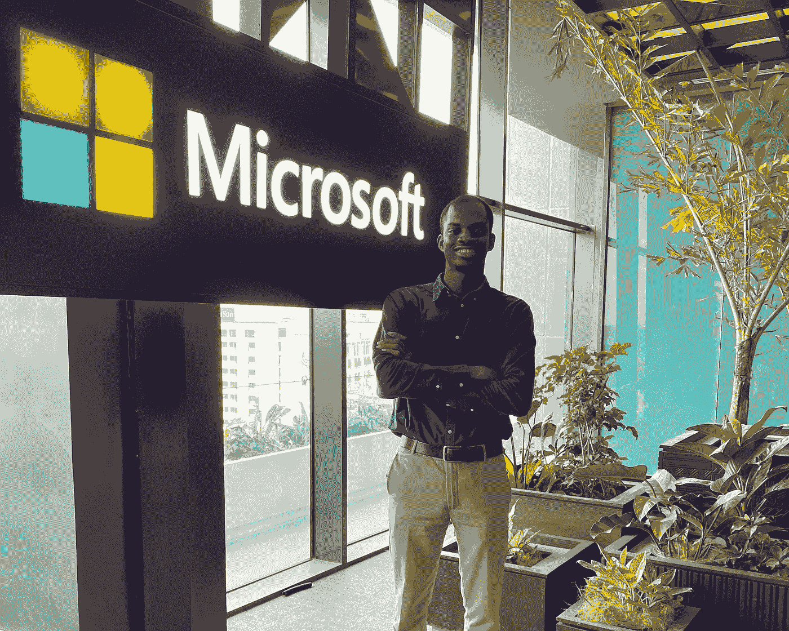
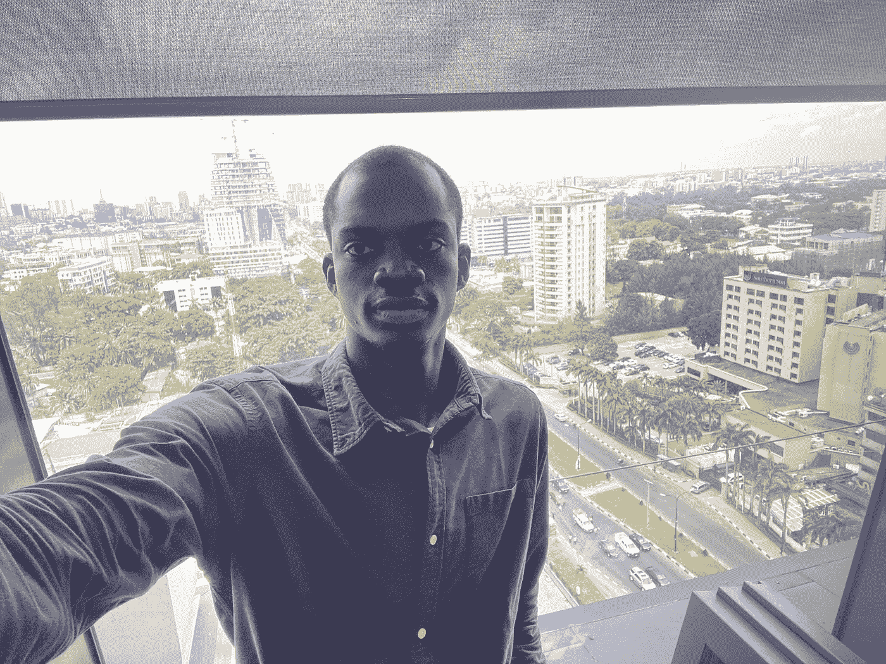
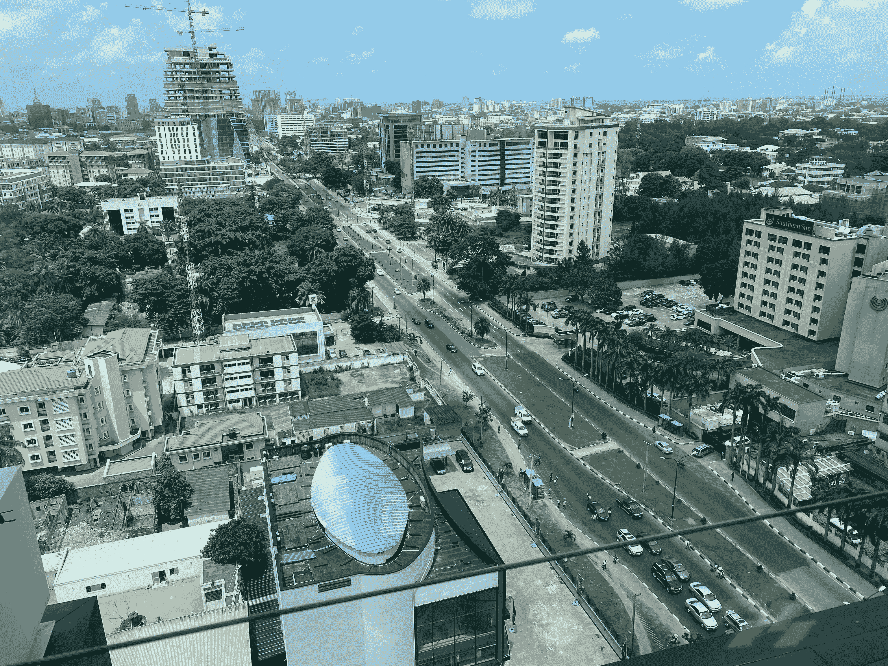
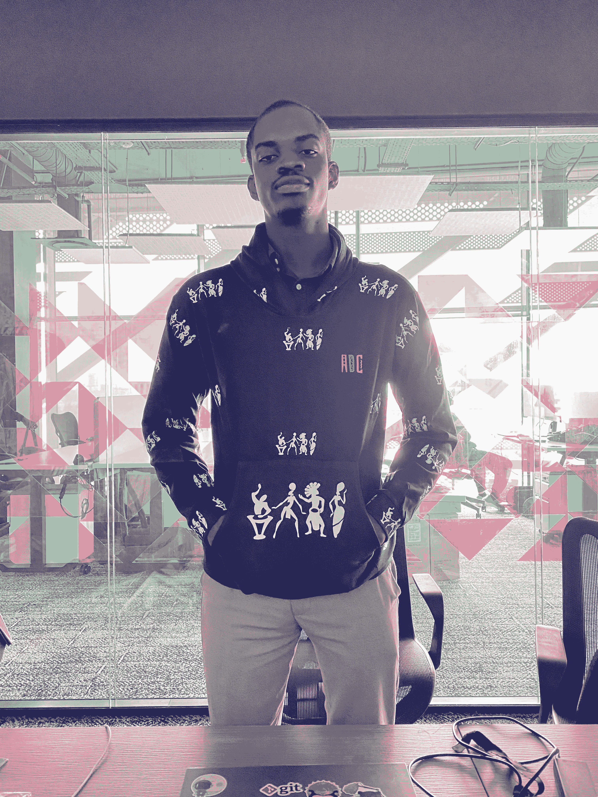
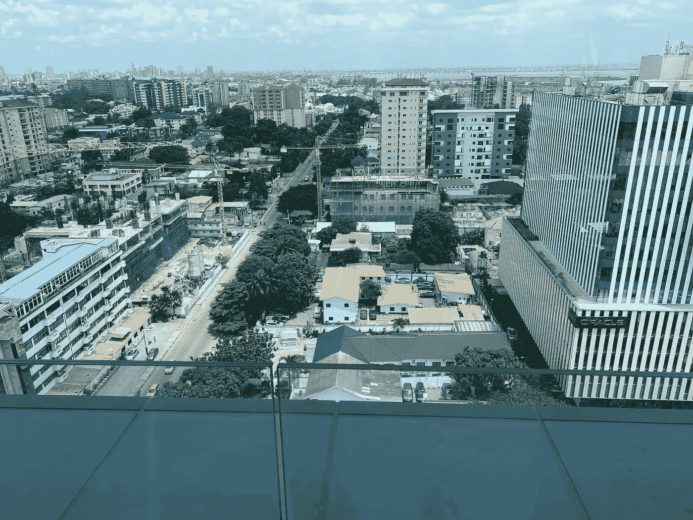
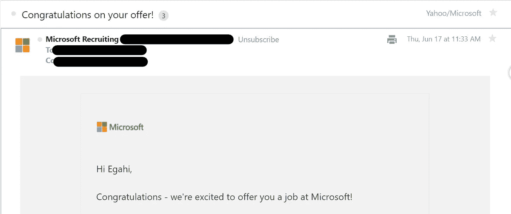
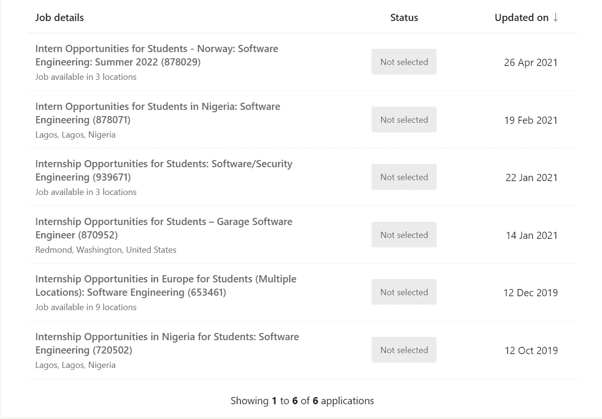
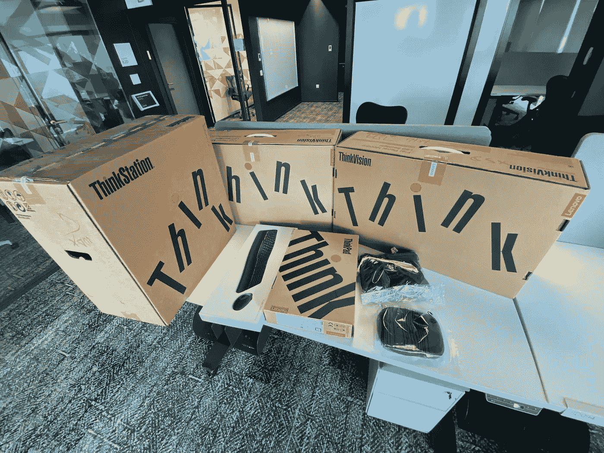
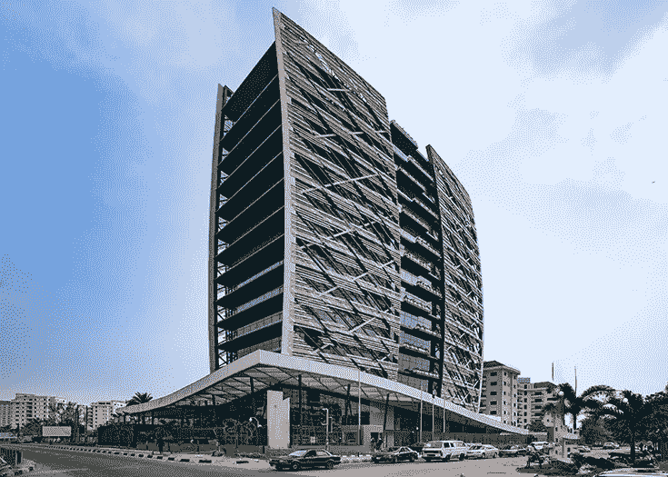

# 来自“你好世界！”敬微软！

> 原文：<https://medium.com/codex/from-hello-world-to-microsoft-371bdf450c84?source=collection_archive---------0----------------------->

## 我从新手到全职软件工程师的历程。

在微软的第一天

首先，我将所有的荣耀归于上帝，并承认是他让我将要分享的一切成为可能。这是我的故事。

## 2017 —“你好世界！— CS50”

在我计算机工程专业大一的最后一个学期，我和几个朋友聚集在一个阅览室里，俯身在画板上，疯狂地试图完成第二天要交的技术制图作业。鸢来了，问我是否听说过课程。

他打开笔记本电脑，指着台上大卫·j·马兰的视频，逐字演示“计算思维”。

一群学生在舞台上扮演电脑角色，而其他观众则指导他们如何制作花生酱和果冻三明治！结果相当混乱，从而证明了他的观点，即给计算机的指令必须尽可能精确，否则输出将是不可预测的。

我对这个演示很感兴趣，所以我做了一个笔记来探索这个课程。在课间休息时，我报名参加了 edx 课程，加入了脸书小组(他们在几乎所有的社交媒体平台上都有一个小组/页面/账户)，并开始探索讲座。他们向我们介绍了 scratch，然后继续 c 语言的课程。

有趣的是，我们将在下一学期学习 C++编程入门，所以这是一个完美的时机。(C++是 C 的扩展，语法类似。)我用的是 [Bucky 的 C++教程](https://www.youtube.com/watch?v=tvC1WCdV1XU&list=PLDED25B8DC0FEF9A1)。

那一年的 Cs50 是以讲座和习题集(项目)的形式组织的。我从讲师 0 开始，在玩了几个月 scratch 之后，尝试 pset0。我会看完讲座，遇到一个心理障碍，然后离开课程几个星期，然后回来再试一次。当我最终实现 pset0 时，我提交了它，它被接受了。我感受到的欣快与我以前感受到的任何东西都不一样。就像，我足够聪明来解决这个问题！

第一课向我们介绍了 C，pset1 的部分任务是创建一个 GitHub 帐户。这是我在 GitHub 上的第一个[回购。(不知道的，传统上，印刷“Hello World！”在大多数编程课程中，屏幕是你学习做的第一件事。)我会继续完成 12 周中的 7 周，涵盖各种主题，包括排序和搜索算法、密码学、内存和数据结构。](https://github.com/Egahi/hello-world)

同时，我也在学习 C++的语法。我会看录像，练习直到头疼，然后休息一下。2017 年的大部分时间都用来练习 C/C++。

有趣的是，我在平板电脑上完成了所有这些编码工作(有一个迷你蓝牙键盘),偶尔也从朋友那里借来一台电脑。

从 8 楼观看。

## 2018 年 1 月—“在每一个幸福的日子里编写代码。”

我怀着成为一名优秀开发者的强烈愿望进入了 2018 年。我的目标是在 3 年内成为一名“高级开发人员”(这主要是基于我对高级开发人员的有限了解)。

我的第一个行动方针是每天坚持编码。幸运的是，我偶然发现了 100 天代码挑战，并决定接受它。规则很简单，每天至少编码一个小时，并在推特上发布你每天的工作内容。这是我在那次练习中构建的项目的[报告](https://github.com/Egahi/100-days-of-code)。

2018 年也是我得到第一台笔记本电脑的一年。

## 2018 年第二季度—“ALC 与谷歌”

2018 年第二季度，我获得了安德拉学习社区(ALC)与谷歌合作提供的奖学金。我选择了 android 课程，并开始学习如何用 java 构建 android 应用程序。

课程的第一个任务是设置 Android studio，这是整个课程中最令人沮丧的任务！

当时我的互联网很糟糕，因此让 Gradle 第一次构建是一个相当大的挑战。我花了三天时间沮丧地完成了第一次成功的构建，并且多次差点把我的笔记本电脑扔出窗外。随着 Gradle 的工作，我不得不学习 java。为了指导我的探索，我决定参加 21 天 java 挑战。(回购生活[在这里。](https://github.com/Egahi/21DaysOfJava))

我完成了第一门课程，并建立了所需的项目([这里是](https://github.com/Egahi/Creed))，这是进入下一阶段的标准，即在 Udacity 上获得整个 Android 开发 nano 学位，但无法提交它。我们将通过谷歌表单提交我们的条目，并在指定的日期和时间锁定。不过在那个时候，我非常喜欢在最后 11 个小时的最后几分钟完成事情。

按照我的本性，我在截止日期前几分钟调整和改变。我实现了最后一个更改，将应用程序设置为构建并生成一个 apk，并决定在 Gradle 构建时“低头一会儿”。我醒来时正好过了最后期限两分钟，有一个功能应用程序，但表单已经关闭了！我很生气，但没有人可以责怪，所以我去睡觉了。随着时间的推移，一些人被选中进入下一阶段，不出所料，我没有。我努力从那些有视频的人那里获得视频，并决心自己学习，但没有社区的支持，保持这种动力有点挑战性。

顺便说一下，我在第三年，但对现在的情况不太满意，所以我办理了从计算机工程(这只是专门的电气电子工程)到工业数学(计算机选项)第二年的转学。这是一门 4 年的课程，所以这是我不用花 5 年时间就能接触到的最接近计算机科学的课程，但是，这是另外一个故事了。

从 8 楼观看

## 2018 年第四季度—“第一次工作面试。”

在 2018 年的最后一个季度，我设定了一个目标，要在年底前找到我的第一份工作，像往常一样，我开始实现我的目标。

我当时给自己打上了安卓开发者的烙印，起草了简历，开始求职。在 2018 年的最后四个月，我会每天上谷歌，搜索“我附近的 android 开发人员工作”，并申请我找到的所有独特的条目。我也会在 LinkedIn 上搜索“android 开发人员职位”,然后申请所有职位。我没有跟踪我发出了多少份申请，但感觉“很多”是一个轻描淡写的说法。

虽然我被他们中的大多数人所迷惑。幸运的是，在一次开发者群聊中，有人需要一个 android 开发者。我表示了兴趣，并被邀请参加面试。那次面试是我一生中最糟糕的经历之一。

我参加面试时不知道会发生什么，因此毫无准备，不仅如此，我还不能回答简单的问题，整个过程中明显在发抖。(这已经形成了一篇很长的文章，所以我将把这个故事的细节留到另一篇文章中。)

长话短说，我得到了我的第一个“我们会回复你”的回复，我知道他们打算“回复我”，但是，这已经是四年前的事了。

## 2019 年 1 月—“第一次实习—希斯威科技公司”

2018 年 12 月，我在 ALC 奖学金期间加入的名为“Udacity Scholars”的群聊上，分享了一个 C#/的广告。NET 开发人员和我一样，我没有作为一个 android 开发人员繁荣，为什么不试试这个。

我给发帖子的人发了信息，说，

> “我不会写 C#，但我对 C、C++和 java 很有经验，所以如果我学会了，两周内我就有足够的知识来提高效率。这份工作还能提供吗？”

他说他不确定，但鼓励我继续下去，所以我做了。我得到了一个文本(Svetlin Nakov 的《用 C#进行计算机编程的基础》)，浏览了整个文本，并用 C#重新实现了我以前的一些项目。两周过去了；这份工作已经没有了，但我爱上了 C#，并因此成为了一名. NET 开发人员。

说来也巧，2019 年 1 月初，又有一份招聘启事被分享，这一次他们需要一个 C#/。所以我申请了。

有趣的是，在我面试的前一天，我已经完全完成了从 windows 到 ubuntu 的转换，但是在我出现之前，我没有安装 windows。在我的面试中，我的任务是用 C#构建一个简单的图书评级应用程序并演示它。我尝试了不同的方法。NET 在 Ubuntu 上运行了整整一段时间，但无法运行。一天结束时，我告诉他们我必须重新安装 windows 才能继续这个项目。

我回去，安装了 windows，开始了这个项目，一周后有了一个可行的解决方案，我把它提交给了他们，并在第二周被邀请回去。我们讨论了实习的方式，以及我将如何把它和学校作业结合起来，然后就开始了。

这是一个带薪实习，但我渴望学习，所以我没有谈判就接受了他们的提议。后来我才知道，我之所以被聘用，是因为我没有放弃这个项目，尽管我面临着挑战，并找到了解决方案。下面是[项目](https://github.com/Egahi/HeathWayTech)。

实习持续了六个月，但是由于财政限制，他们不能让我成为全职员工，而这正是实习的目标。我发现的方式很有趣。

我请了两个星期的假去写试卷，回来的第一天，我精力充沛，大步走进办公室，打开笔记本电脑，问道:"我们在哪里停下来了?"！CTO 很安静，然后把我拉到一个角落，说我们需要谈谈，并透露了这个消息。我的能量瞬间从 100 到 0。不管结局如何，我将永远感激这个机会。

ADC 帽衫！

## 2019 年 5 月—“第一份自由职业— Interswitch Group”

那年 5 月，我看到一个招聘“UI/UX 设计师”的帖子，他对 C#非常熟悉。这份工作描述很吓人，但是我对自己的 C#技能很有信心，所以我表示了兴趣。原来是个前端角色，待遇不错，我就接受了这份工作。

坦率地说，我从 Udacity 学者群聊中获得了动力。很多人都收到了令人惊叹的邀请，与我们分享了他们的故事，我被激励着向高处走去。

当我和 HR 签合同的时候，我仍然不确定我是否能胜任这份工作。我只是知道如果它与 C#有关，我就能弄明白。后来，我会和带我浏览代码库的内部开发人员坐在一起。原来他们有一个平台。NET 需要一个新的接口。

这个项目一开始进展缓慢，因为我的前端技能很差(我在某个时候开始学习前端，但很无聊，就放弃了)，但我找到了时间，并能够交付，尽管比预期的要晚。

## 2019 年 7 月—“第一份全职工作— Itara 全球服务”

在一个美好的周三晚上，我在笔记本电脑上查看电子邮件，这时我收到了 Kp(Itara 全球服务部首席执行官)发来的一封冷冰冰的邮件。他在 Twitter 上看到了我的简介，想知道我是否有兴趣在他的初创公司工作。

我实习时获得全职工作的希望破灭了，我在 Interswitch 的工作是 2 个月的合同，所以我说当然，我们谈谈吧。

其余的，正如他们所说，都是历史了。我将继续在 Itara 工作两年，并于 2021 年 6 月正式辞职。

我受雇直接与首席技术官(Obaro)合作，为开发中的产品构建后端。他在不到三个月的时间里离开了，他所有关于构建后端的责任都落在了我身上。每个人(包括我)都有点怀疑我是否能胜任这项任务，但是，在奥巴罗的这两个月是我职业生涯中成长最快的时期。

在向服务器部署新更改的第一周，它就崩溃了。我花了大约一周的时间才成功恢复。那是一段艰难的时光，但我学到了很多。我研读了 azure 上管理资源的教程，从一个完全的新手变成了 azure 上的专家。我曾考虑过辞职，但我很高兴我没有。

那次经历给了我新的信心，任何事情都可以解决，我只是必须坚持下去。

尽管当时是全职工作，但任何在这个领域工作过的人都知道，初创企业的生活是不可预测的，有时甚至不稳定。为了平衡事情和补充收入，我到处做了一些自由职业者的工作，包括与美国一家公司的完全远程合同工作。

从 14 楼看出去！

## 2020 —“数据结构、算法和 Leetcode”

在 2019 年/2020 年初的某个时候，鸢向我介绍了 [leetcode](https://leetcode.com/) ，这就像是在大型科技公司面试中的圣杯。所以，2020 年是关注 leetcode 的一年。

我从 cs50 开始了解基本的 DS 和算法，并致力于 leetcode 的实践。我还有幸[赢得了由脸书赞助的黑客马拉松](https://www.unodc.org/nigeria/en/students-develop-app-to-trap-human-traffickers.html)(我爱黑客马拉松)，因此有机会得到脸书两位员工的指导。

辅导由两部分组成，第一部分是技术性的，第二部分是行为性的。

技术部分涵盖了我在面试时会遇到的大多数数据结构和算法，如何处理技术问题，向面试官介绍我的解决方案并实现该解决方案。

行为部分涉及人际交往技能(软技能)、面试技巧、讲故事以及面试时对我的期望。

在这一点上，我觉得自己已经为“申请季”做好了充分的准备，但还是多花了一笔钱买了一份针对 [ATS](https://en.wikipedia.org/wiki/Applicant_tracking_system) 的专业简历*。

(申请季指的是大多数科技公司招聘新人才的时期，它始于每年的 6 月份左右，在 12 月份左右逐渐消失。)

申请季节到了，我开始向我的目标公司发送申请。到年底，我已经申请了几乎所有在[这里](https://github.com/Egahi/Summer2021-Internships) **上市的公司。这是一个充满压力的过程，但我下定决心，继续前进。

我有一个系统，就是选择一家公司，编辑我的简历以尽可能地匹配他们的工作，提交我的申请，然后每天在 leetcode 上练习。(不过，在某个时候，我起草了一份通用简历，并把它用于所有的申请。)如果我有在线测试，我会在早上进行，因为那是我感觉最有效率的时候。

大多数公司都找了我的影子，一些公司没有任何联系就发送了拒绝邮件，另一些公司发送了在线测试的链接，我被安排了几次面试，但没有得到录用。(有趣的事实:我仍然会收到一年前申请的公司的拒绝邮件)

同时，我的朋友鸢有一个稍微不同的方法。他辞去了工作，专注于脸书的指导，醒着的大部分时间都在练习 leetcode。他的牺牲得到了回报，他[拿到了三份实习工作。](https://www.linkedin.com/posts/ateniolatobi_intern-microsoft-facebook-activity-6793860453035450368-yZET)

## 2021 年 8 月——“我在大科技(FAAMG)的第一份工作——微软”

就业机会

我带着强烈的乐观情绪开始了 2021 年，这将是我第一次突破的一年。

我刚刚经历了一个被拒绝的痛苦季节，但从大量的面试中学到了很多，尤其是脸书和谷歌的面试。我确切地知道他们在寻找什么以及如何得到它。

我在 leetcode 上购买了高级订阅服务，并加倍了每天的练习，从而加大了练习算法和数据结构的决心。

2021 年 4 月是第一波好消息传来的时候，我收到了一封邀请我去微软面试的邮件，没有任何直接申请。我之前的一份申请(被拒绝了)似乎是一个新职位的良好开端，所以它被转移了。

在继续之前，我再次讲述我的故事，这次是关于微软的。

2018 年第一次申请微软(当时我已经下定决心要拿到第一份工作)。我是编程新手，没有像样的简历(我从谷歌文档定制了一个模板)，对数据结构和算法知之甚少，但我还是申请了。

我很荣幸有一个招聘人员想要“了解我”。到目前为止，我不确定是什么在那份申请中脱颖而出，我只是假设他们在寻找人才，并在我的申请中碰了碰运气。虽然电话很短，但她意识到我仍在大学二年级，并礼貌地告诉我，她正在寻找倒数第二名学生或决赛选手。

这个电话很鼓舞人心，因为我一直在想，如果我不用努力就能引起微软招聘人员的注意，当我真的付出努力时会发生什么。就这样，我开始了学习、申请和一次又一次被拒的旅程。

微软的拒绝

快进到 2021 年 4 月，我的申请已经被转移到这个新的开放，我被安排参加我的面试。

微软的做法是在同一天安排四次独立的面试(每次约 45 分钟)。他们大多是技术性的(面试官给你一个问题，你讨论你的解决方法，并用你选择的任何编程语言实现它)，但也有几分钟被用来讨论软技能。

我做好了充分的准备，参加了第一、第二和第四轮面试。至于第三个问题，我找到了解决方案，但最初却陷入了一个复杂的部分，因为我错过了面试官给出的一个暗示。在某个时候，我的解决方案变得太复杂了，所以我后退一步重新审视这个问题，直到那时我才明白了这个暗示，并想出了一个准确的解决方案。面试官很友好，乐于助人，所以这是一次奇妙的经历。

大约两个星期过去了，在一个凉爽的星期五晚上，我接到招聘人员的电话。她打电话来传递任何求职者都想听到的消息。

> “你的采访很成功；反馈是惊人的，我想安排一个电话与您讨论您在微软的就业能力！！!"
> 
> -我的招聘人员

在整个通话过程中，我努力让自己平静下来，但紧接着，我跳起来，尖叫着(在我的脑海中)，也许还在跳舞？我就像，终于！我的梦想已经实现了，我将成为一名微软工程师！我感到的喜悦是难以形容的。

我不得不花些时间来消化刚刚听到的消息。我坐下来，想象自己的样子，反思我的旅程。当我开始的时候，挫折，拒绝，在平板电脑上编程，借笔记本电脑，与 leetcode 上的问题斗争，这之间的一切，现在，所有的工作都有了回报。我的大好机会来了！

那个电话有趣的地方在于，它让我对事情有了正确的认识。今年年初，我决定去大科技公司实习，在面试的时候，我不知道会马上被录用。但是在这里，我立即被微软聘为全职工程师！

我的旅程兜了一圈，从教程到自由职业，创业，兼职，合同工作，实习，最后，大技术！

在那次电话会议之后，官僚程序开始了(要约电话、背景调查、签署合同等)。)不过，我的经历有些曲折。我是一名全日制学生，所以考虑到法律和公司的标准，必须有一个内部对话来确定我是否合法就业。事情发生了，我被证明是清白的。

总的来说，这个过程花了 4 个月。我第一次被联系是在 4 月的最后几周，5 月份参加了面试，6 月份拿到了工作机会，通过了背景调查，7 月份签了合同，8 月份开始工作。

PS:“背景调查”是他们核实你的学术和工作经历的步骤。我只能说，他们非常仔细，所以你在起草简历时要尽可能准确。

在完成这篇文章的时候，我在微软大家庭中已经 1 周大了，我的经历已经超出了我的预期。微软是围绕许多内部社区、自助网站和无限的个人发展资源而建立的。加入不到一周，我已经感觉自己真正属于这里了。

我的第一天太棒了。由于疫情，我们应该远程工作，但我们可以选择从办公室拿起我们的工作工具，我们利用这个机会参观了办公室。尼日利亚拉各斯的办公空间非常精致！我无法停止拍照，直到我的队友真的把我拖走。

我们拿到了设备，安装好，拿到了门禁卡，当天就加入了团队。我从办公室回来，带了这么多小玩意，就好像去购物一样。我得到了一台笔记本电脑、一台台式机、两台显示器、一个键盘、一个鼠标、一个耳机和一件连帽衫！

作业工具。

成为这个令人惊奇的家庭的一员已经一周了，我迫不及待地想看看我在这里的未来。

最后，我想特别感谢那些在我的旅程中帮助我的人。

感谢[鸢](https://twitter.com/toirama___)和[迈克尔](https://www.linkedin.com/in/michael-uti-841807124/)，感谢他们让我接触编程，感谢谷歌的[奥瓦尔](https://twitter.com/auwalms)和[阿尼迪](https://twitter.com/aniediudo)，感谢你们的社区工作为我和 Udacity 学者小组聊天的每个人创造了有利的环境，感谢你们不断的激励。

大声感谢 Heathway Technologies 的首席执行官 Segun 给了我第一次实习的机会，感谢 Itara Global services 的首席执行官 Kp 给了我第一次全职软件工程师的机会。

向微软的 [Obaro](https://www.linkedin.com/in/obaroogbo/) ，向脸书的 [Michael](https://www.linkedin.com/in/michael-tkach/) 和 [Pearl](https://www.linkedin.com/in/pearl-oguchi-6a72824/) 感谢你们的指导，向微软的 [Tejumade](https://www.linkedin.com/in/tejumade-olaniyi-849a9b135/) ，我的招聘人员以及微软所有为我担保的人，万分感谢你们！

PS:我过去几年的旅程可以沿着三条平行线追踪——信仰/灵性、学术和职业。在这篇文章中，我追溯了我作为一个专业人士(以职业为中心)的旅程，在另一篇文章中，我将探索我作为一个有信仰的人和一个全职学生的旅程。或者可能只是写本书？好了，谢谢你的阅读，再见。

编辑:

* *我从* [*顶级简历*](https://www.topresume.com/) 拿到了我的职业简历

** *在这里* 找到最近的暑期实习资源库

*我在校园才艺播客上与那些了不起的人分享了我的故事。可以在 [*Spotify*](https://open.spotify.com/episode/6bopFAtl3iYmxpgtttfls5) *或者* [*主播*](https://anchor.fm/campus-talents/episodes/How-to-Rise-to-the-Top-in-Programming-Industry-as-a-Student-wEgahi-S-O-e18r4rm) 上收听*

**

*国王塔——微软拉格斯([kingstower-ng.com](http://kingstower-ng.com/))的所在地*