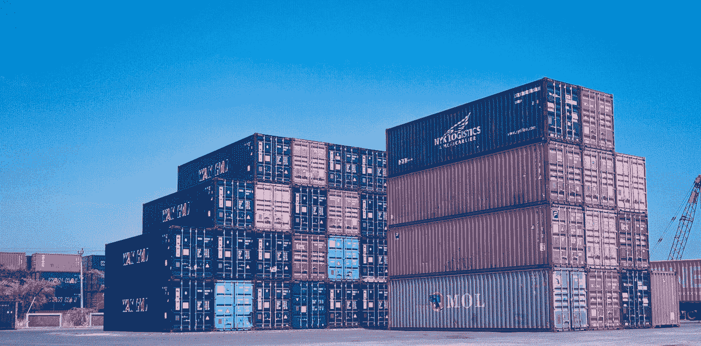
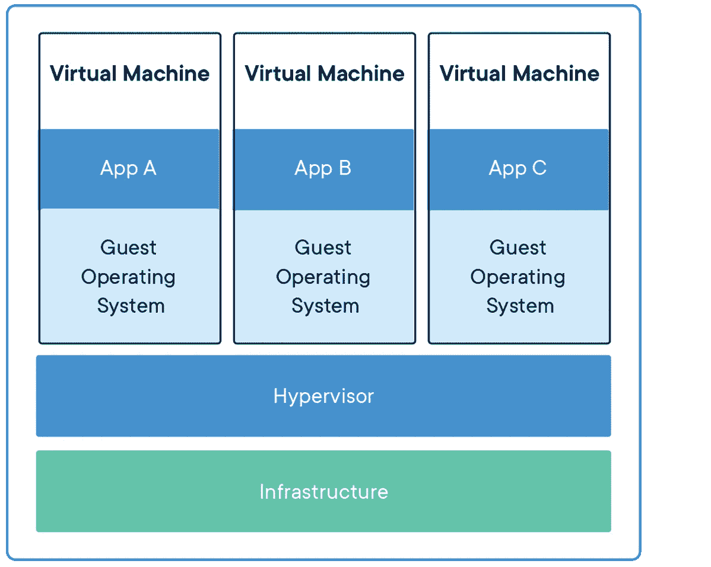
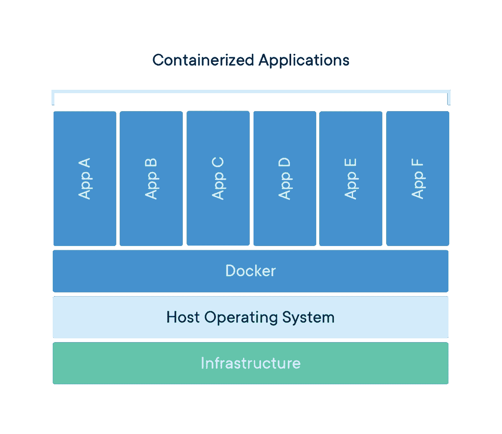
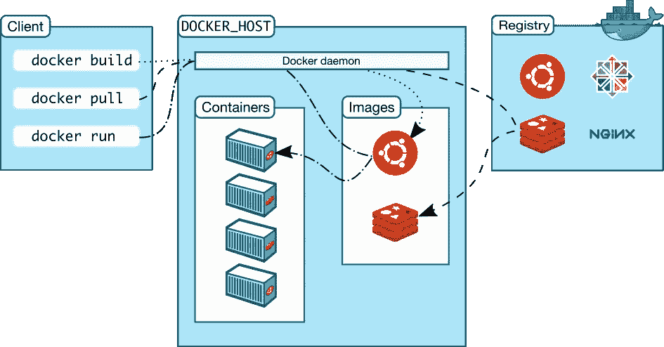

# 从虚拟机管理程序到容器

> 原文：<https://medium.com/codex/from-hypervisors-to-containers-11d3cc191ef6?source=collection_archive---------3----------------------->

在 [Unsplash](https://unsplash.com?utm_source=medium&utm_medium=referral) 上由 [Tri Eptaroka Mardiana](https://unsplash.com/@inidianaa?utm_source=medium&utm_medium=referral) 拍摄的照片

*“伟大的事情不是由冲动完成的，而是由一系列小事情汇集而成的。”――文森特·梵高*

# 回到过去

过去，开发一个应用程序后，一个单独的团队会配置一台单独的机器、路由器、交换机，将它们放入机架，然后取出应用程序并进行安装。这有时需要手动操作，并且需要在服务器群中安装一长串经过处理的专用硬件。并且主要在用于一个应用程序的一个服务器上，这有时会造成资源浪费。尽管它可以在同一台服务器上部署多个应用程序，但这是非常不安全的。

# 虚拟机管理程序

由于物理硬件资源的浪费，虚拟机管理程序作为一种共享计算机资源(包括内存和进程)的解决方案应运而生。虚拟机管理程序的作用是基于主机硬件创建隔离的环境，这允许在同一服务器/主机内创建多个独立的虚拟环境。

这增加了应用程序的可移植性和额外的安全性，因为一个虚拟机是独立于另一个虚拟机运行的。一个虚拟机包含完整的组件和依赖项，包括它自己的操作系统(*n*VMs =*n*OS)。

有两种类型的虚拟机管理程序

1.  **裸机虚拟机管理程序**——直接在硬件上运行。
    *前 Citrix XenServer，VMware ESXi。*
2.  **托管的虚拟机管理程序**——运行在主机的操作系统之上。
    *Ex — Oracle VirtualBox、微软 Hyper-V.*

虽然虚拟机管理程序带来了应用程序的隔离、更好的资源管理，但虚拟机管理程序仍然消耗资源，更新和补丁管理应该完成。

在虚拟机管理程序上运行应用程序(图片来自 [Docker](https://www.docker.com/sites/default/files/d8/2018-11/container-vm-whatcontainer_2.png)

# 容器

容器是运行应用程序所必需的组件和依赖关系的单元，与操作系统或运行环境无关，并且与虚拟机不同，容器作为单独的进程而不是单独的机器运行。

尽管人们认为容器是所有问题的最新解决方案，但这并不是新技术。根据[报道](https://d2iq.com/blog/brief-history-containers)容器作为 Unix 操作系统隔离应用程序代码的一种机制早在 1970 年就存在了。

此外，在深入研究容器之前，有一些关于容器的基本概念需要理解。

**名称空间**——“名称空间”是 Linux 操作系统为确保容器中的隔离而提出的东西，每个容器创建一个单独的名称空间，*限制该容器可以查看的内容*。

**cgroups** -控制组是 l *限制具体容器可以使用的容器。*

容器开始广泛使用[微服务架构](https://chamalwr.medium.com/microservice-architecture-1ac57a5445cc)。它提供了独立构建和部署的能力，而不必一次又一次地进行相同的服务器配置或网络配置，并根据需求处理可扩展性。

与 VMs 不同，容器没有什么优势。

**标准** -创建虚拟机时，设置可能会有所不同，环境取决于供应商。但是当谈到容器时[开放容器倡议](https://opencontainers.org/)提供了一个监控容器的通用标准，这有助于容器的可移植性，而不必担心供应商、运行的操作系统或环境。

**轻量级** -在虚拟机中，当创建一个虚拟机时，每个虚拟机都必须有一个单独的操作系统。但是对于容器来说，它的核心引擎与所有其他正在运行的容器共享操作系统内核。这在尺寸和性能方面都非常有效。

**安全** -容器作为一个完全独立的进程运行它的应用程序，这提供了彼此之间的隔离。

在容器上运行应用程序(图片来自 [Docker](https://www.docker.com/sites/default/files/d8/styles/large/public/2018-11/container-what-is-container.png?itok=vle7kjDj)

但是如何找到这些容器呢？基于不同的供应商，开发者可以选择各种各样的容器应用程序。Docker、rkt (Rocket)、LXC(Linux Containers)和 Docker 是其中最受欢迎的。

# 码头工人

Docker 是软件开发人员中最流行的容器应用程序。Docker 架构为开发人员带来了许多便利，包括 CI/CI 周期的完全自动化。

## Docker 对象

1.  **Docker Image** - Docker image 是一个创建工作 Docker 容器的模板。开发人员可以根据他们运行的应用程序定制 Docker 图像。举个例子，如果我们想创建一个 docker 映像来运行一个 Java 应用程序，我们必须在 docker 映像中安装操作系统库、Java 运行时，甚至是我们的 Java 应用程序。Docker 镜像是可定制的，可以改变其中包含的运行应用程序的一切(代码、系统库、配置、运行时)
2.  **docker 容器**——在创建一个它应该执行的 docker 映像之后，这个运行的 Docker 映像被称为“Docker 容器”。docker 容器可以使用 Docker API 或 CLI 启动、停止、移除或删除。Docker 容器由 Docker 图像定义。

## 码头建筑

从创建图像到管理容器并跟踪它们应该在一个适当的过程中。Docker 架构展示了如何基于客户机-服务器架构处理这些流程。

Docker 架构(图片来自 [Docker](https://docs.docker.com/get-started/overview/) )

Docker 客户端转发客户端请求并与 Docker 守护进程对话，通常，这是人们与之交互的 CLI 界面。

docker 守护进程处理来自 Docker 客户端的所有请求，并创建、删除和运行所有 Docker 映像和容器。Docker 守护进程甚至可以与远程守护进程通信。

docker registry 就像是 Docker 图像的存储库，在开发人员创建各种 Docker 图像和同一图像的各种版本后，Docker registry 负责处理和存储它们。默认情况下，“Docker Hub”被用作公共 Docker 注册中心，但在需要时也可以使用私有注册中心。

同样，当涉及到 docker 映像时，Docker 守护进程负责检查本地缓存中的 Docker 映像，如果没有，则从远程 Docker 注册表中提取映像。

有关开发基于容器的应用程序的更多信息，请参考下面的参考资料。

# 参考

开发基于容器的应用程序(教程)-第 1 部分

[开发基于容器的应用程序(教程)——第 2 部分](https://www.youtube.com/watch?v=hXLmW7bhA10&list=PLD-mYtebG3X9HaZ1T39-aF4ghEtWy9-v3&index=2)

 [## Docker 概述

### Docker 是一个开发、发布和运行应用程序的开放平台。Docker 使您能够分离您的…

docs.docker.com](https://docs.docker.com/get-started/overview/)