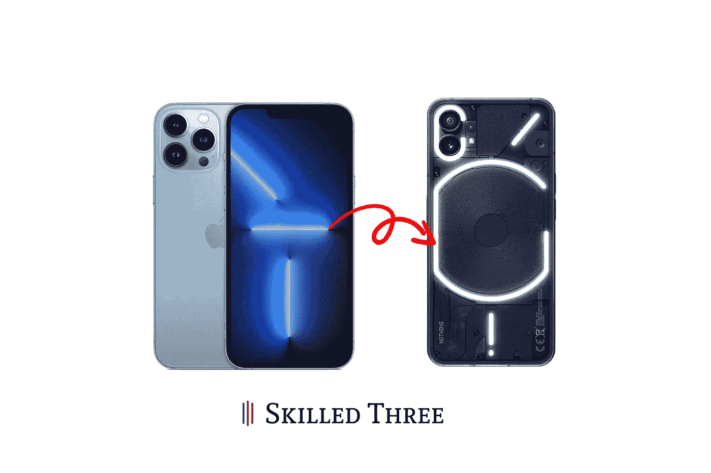

# 从 iPhone 到一无所有

> 原文：<https://medium.com/codex/from-iphone-to-nothing-858f08563e38?source=collection_archive---------11----------------------->

## 这种转换有可能吗？

在本文中，我们将看看中等价位手机的新奇感可能会如何改变长期 iPhone 用户看待事物的方式。长期以来，我对“中档”手机感到厌烦，因为它们提供的几乎都是一样的东西。它们都提供了高刷新率的显示，漂亮的显示，最重要的是，平滑的显示，这很棒。

图片由作者提供