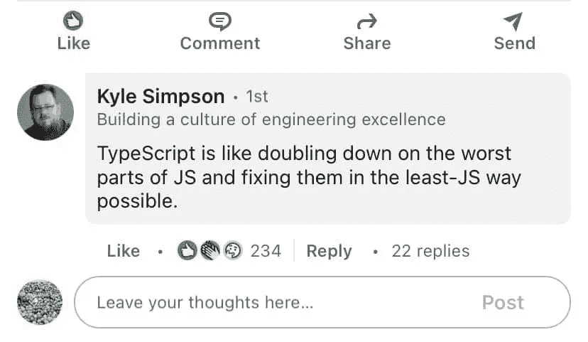

# 从 JS 到 Typescript:该不该用？

> 原文：<https://medium.com/codex/from-js-to-typescript-should-you-use-it-or-not-87eedce78e?source=collection_archive---------13----------------------->

JS 大师 Kyle Simpson 对 Typescript 有着强烈的兴趣

取决于你问的是谁，Typescript 要么是 Javascript 的救星，要么是它的没落。不管您感觉如何，不可否认它对许多开发人员的受欢迎程度和吸引力。我已经能够成功地避免编写 Typescript，直到最近我的团队决定在一个新项目中采用它。希望使用 TS 能帮助我们避免使用 JS 时出现的错误:type…