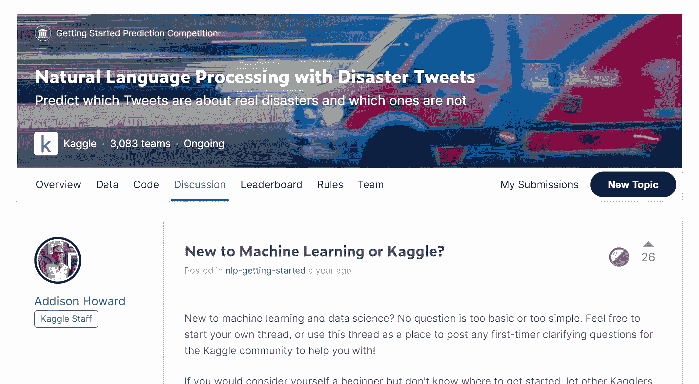
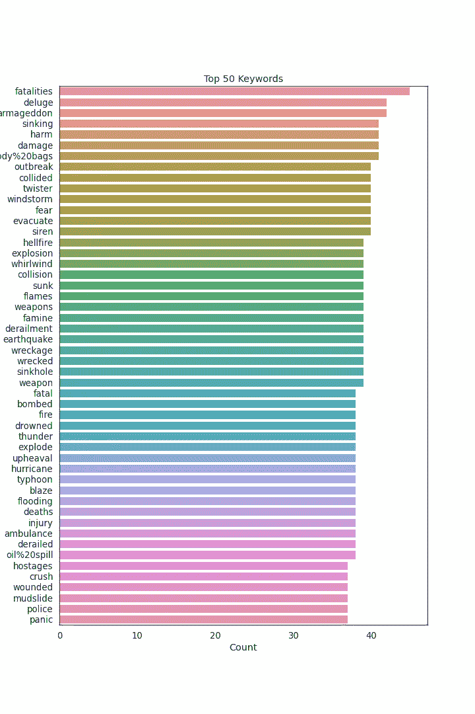
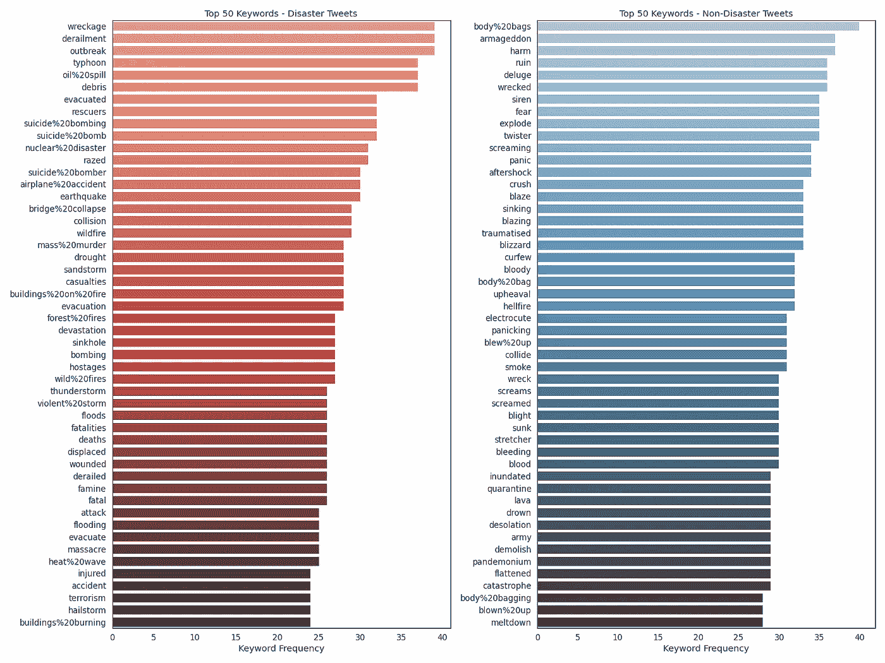

# 从文科到自然语言处理与灾难推特预测:一个 Kaggle BIPOC 受让人的自白

> 原文：<https://medium.com/codex/from-liberal-arts-to-nlp-a-confession-of-a-kaggle-bipoc-grantee-5bb876ee641a?source=collection_archive---------3----------------------->


Yosh Ginsu 在 [Unsplash](https://unsplash.com?utm_source=medium&utm_medium=referral) 上的照片

“艺术还是科学？”这可能是我在高中最后一年听到最多的问题。对许多人来说，艺术和科学不能混为一谈——你必须选择其中之一，并在大学四年中坚持你的选择。不过，我想知道事实是否如此。*嗯，为什么不两者兼得呢？*

我最终选择学习文科，主修商业和经济，因为这似乎是最灵活的。我认为自己非常好奇，把自己限制在一门学科上很违背我的本性。在疫情之前的几年里，我在大学里参加了各种各样的活动，从政治学讲座到创业孵化器。我只是喜欢保持开放的心态，不断学习新事物。

尽管我有各种各样的兴趣，但我对数据科学几乎一无所知，直到三年前，出于好奇，我决定参加一个 ML 活动。受到在 ML 的帮助下可以完成的大量事情的启发，我决定开始学习一些数据科学基础知识，并从那时起继续学习更多关于机器学习的知识。

在我的机器学习之旅中，两年前我偶然发现了 Kaggle。在那之前，我一直在学习各种关于数据科学的 MOOC 课程，希望获得一些实践经验。我在 Kaggle 上查了一些基本的 ML 项目，从经典的虹膜预测开始。从现有代码中学习有助于我理解整体结构，并对模型训练的方式有所了解。作为一个 ML 初学者，亲自运行代码并第一次看到 ML 模型是如何被训练的，在很多方面都很棒。看到很酷的代码实时运行确实令人兴奋，但对我来说更重要的是，它有助于揭开 ML 许多方面的神秘面纱，并帮助我熟悉基本 ML 项目的概念和整体工作流程。

我离开曼梯·里将近一年，因为毕业后我更忙于准备我的职业生涯。我必须承认，平衡学习、未来职业和我对 ML 的热情并不是一件容易的事情。然而，尽管有这样的中断，我对 ML 的热情仍然很强烈，我一直在想回到它身边。就在那时，我发现了 Kaggle BIPOC 资助项目。在我看到 Kaggle 的公告后，我毫不犹豫地开始准备我的申请表，我想说这可能是我一生中最好的决定之一。几个月后，令我惊讶的是，我从 Kaggle 那里听说我被选为受资助者之一。通过这个为期三个月的项目，我有机会发展我的数据科学技能，并增强我在相关领域追求职业生涯的信心。在这篇博文中，我想谈谈我在这个项目中的经历，以及为什么你也应该试一试！

# 为什么是 Kaggle BIPOC Grant？


在 [Unsplash](https://unsplash.com?utm_source=medium&utm_medium=referral) 上由 [Tachina Lee](https://unsplash.com/@chne_?utm_source=medium&utm_medium=referral) 拍摄的照片

## **表示事项**

就性别和种族代表性而言，数据科学作为一个领域正受到缺乏多样性的困扰。雪上加霜的是，在没有多样性的情况下开发的人工智能可以进一步[歧视代表性不足的群体](https://time.com/5520558/artificial-intelligence-racial-gender-bias/)，这反过来又加剧了歧视和代表性不足的恶性循环。在数据科学领域扩大 BIPOC 社区不仅意义重大，而且早就应该这样做了。

## 这是初学者友好的

虽然我已经接触了一些数据科学，但我在这个领域仍然相对较新，并认为自己是一个初学者。Kaggle BIPOC Grant 欢迎所有经验层次的人。如果你梦想成为一名数据科学家，这就是你的机会！

## 导师会让你走上正轨

掌握数据科学技能需要投入。就我个人而言，我与数据科学有些分分合合的关系；生活中经常有其他事情阻碍我，让我看不到自己最初的目标。从一位经验丰富的数据科学家那里获得私人指导极大地帮助了我专注于对我来说真正重要的事情(例如，在数据科学方面变得更好！)

# 我从 BIPOC 赠款经历中学到的:成为卡格勒的秘诀

*   **从“入门”项目开始**

如果你对 Kaggle 完全陌生，直接进入常规比赛可能太具挑战性。查看一些[入门](https://www.kaggle.com/competitions?hostSegmentIdFilter=5)比赛，开始你的第一个 Kaggle 项目！

*   **了解项目背后的故事**

迈出走你的第一步会很有挑战性，所以确保你在做的时候很开心。尽管直接投入到很酷的技术事物中可能很有诱惑力，但了解比赛背后的故事是至关重要的，因为这将帮助你选择对你有意义的比赛，这将使你在第一次 Kaggle 旅程中保持动力。在开始技术工作之前，阅读项目描述，查看数据集，了解总体范围和评分标准——稍后你会感谢自己的。

*   **看看公开的笔记本**


探索代码部分并从公共代码中学习

从现有代码中学习是我最喜欢的学习策略之一。它让我保持专注，并让我看到 Kaggle 比赛中的实际工作流程。公共笔记本可以通过竞赛页面上的代码选项卡轻松访问。

*   **阅读并参与讨论**



讨论线程对于从其他 Kagglers 那里获得见解和提示非常有用

*   **卡住时参考知识页面**

当你陷入困境时，有大量的资源可以参考。当我需要一些额外的帮助时，我经常浏览[栈溢出](https://stackoverflow.com/)或[到数据科学](https://towardsdatascience.com/)。

*   **通过寻找 ML 伙伴保持忠诚**

学习数据科学可能相当孤独。与其他 ML 学习者合作有助于我保持动力并坚持我的追求，即使事情变得具有挑战性。你可以通过在线讨论板、学习小组找到你的 ML 伙伴，或者试着参加像 Kaggle 的 BIPOC 基金这样的奖学金和资助项目！

# 我选择的项目

在这一点上，你可能想知道我实际上为这个资助项目承担了什么样的项目。我决定利用这个机会从小做起，迈出我进入 Kaggle 竞赛和 NLP 的第一步。我参加了《入门》系列的一个比赛，名字叫 [*自然语言处理带灾推文*](https://www.kaggle.com/c/nlp-getting-started) *。*该比赛的目的是预测推文是否是关于真实的灾难。数据集很小，允许用有限的计算资源进行训练。我在使用数据集的不同模型中玩得很开心，并通过观察和适应公共笔记本学习了不同的比赛方法。向下滚动查看我的项目的详细介绍。

# **利用程序提供的资源**

除了主要项目，我还利用了许多受资助者可以利用的资源。在提供的许多课程中，我特别喜欢 [MLOps Fundamentals](https://www.coursera.org/learn/mlops-fundamentals) 和 Kaggle Masters、数据科学家和 ML 工程师的许多 ML 讲座。到目前为止，我从未在我的数据科学项目中使用过 GCP，因此了解 GCP 的 MLOps 真的让我大开眼界。

# 确认

虽然资助项目已经结束，但我相信我会用我所学到的东西来支持我在数据科学领域建立自己的事业的梦想。

最后，我要感谢让这个项目成为可能的每一个人:Kaggle 团队(对 Julia 大声喊出来)启动了这个项目！)、客座讲师、导师和我的受助伙伴。特别是，我想对我的良师益友辛说一声，每当我遇到困难时，他总是鼓励我，帮助我。没有你们我不可能成功！

# **Kaggle 项目工作流程**

在这个 Kaggle 项目中，我将把我的工作分解成不同的步骤。这也适用于其他 Kaggle 项目。我采取的步骤通常包括:阅读比赛信息；探索性数据分析；数据预处理；模特培训；模型评估；提交预测进行评分。

*要获得可运行代码，查看我的* [*Kaggle 笔记本*](https://www.kaggle.com/nicolewarinn/nlp-disaster-tweets-electra) *和* [*GitHub 资源库*](https://github.com/nattananwarin/Kaggle_NLP_Disaster_Tweets) *！*

**探索性数据分析**

首先，导入必要的库。

```
import os
import re
import pandas as pd
import numpy as np
import seaborn as sns
import matplotlib.pyplot as plt
from collections import defaultdict, Counter
from wordcloud import WordCloud 
from nltk.tokenize import word_tokenize
import torch
from torch.utils.data import TensorDataset, DataLoader, RandomSampler, SequentialSampler
from transformers import ElectraTokenizer, ElectraForSequenceClassification,AdamW
from transformers import get_linear_schedule_with_warmup
import random
import time
import datetime
from sklearn.model_selection import train_test_split
```

接下来，进行基本配置，例如设置显示选项、可视化图形大小和字体大小。然后打印出将要使用的处理单元。

```
pd.set_option.display_max_columns = None
pd.set_option.display_max_rows = None
sns.set(style="white", font_scale=1.2)
plt.rcParams["figure.figsize"] = [10,15]if torch.cuda.is_available():  
    device = torch.device("cuda")
    print('We will use the GPU:', torch.cuda.get_device_name(0))    
else:
    print('No GPU available, using the CPU instead.')
    device = torch.device("cpu")
```

导入训练和测试数据集。

```
train = pd.read_csv("../input/nlp-getting-started/train.csv")
test = pd.read_csv("../input/nlp-getting-started/test.csv")
sample_sub = pd.read_csv("../input/nlp-getting-started/sample_submission.csv")df_train= train
df_test= test
```

Info()函数提供数据集的整体信息。

```
print(train.info())
print('________________________________________')
print(test.info())
```

Head()函数有助于您了解数据集。

```
train.head()test.head()
```

打印出行数、列数和训练/测试分割比。

```
print('There are {} rows and {} columns in train'.format(train.shape[0],train.shape[1]))
print('There are {} rows and {} columns in test'.format(test.shape[0],test.shape[1]))
print('Train/Test Split Ratio equals {}:1'.format(train.shape[0]/test.shape[0]))
```

找出是否存在任何空变量

```
null_counts = pd.DataFrame({"Num_Null": train.isnull().sum()})
null_counts["Pct_Null"] = null_counts["Num_Null"] / train.count() * 100
null_counts
```

*   **关键词可视化**

使用 seaborn 来可视化最常见关键字的条形图。如果需要，可以导出。下图将显示在输出中。



```
keywords_vc = pd.DataFrame({"Count": train["keyword"].value_counts()})
top50= sns.barplot(y=keywords_vc[0:50].index, x=keywords_vc[0:50]["Count"], orient='h')
plt.title("Top 50 Keywords")
fig = top50.get_figure()
fig.savefig("top50.png") 
fig.show()
```

使用 len()函数查看训练数据集中唯一关键字的总数

```
len(train["keyword"].value_counts())
```

可视化并比较来自训练数据集的灾难和非灾难推文之间的热门关键词。



```
disaster_keywords = train.loc[train["target"] == 1]["keyword"].value_counts()
nondisaster_keywords = train.loc[train["target"] == 0]["keyword"].value_counts()fig2, ax = plt.subplots(1,2, figsize=(20,15))
sns.barplot(y=disaster_keywords[0:50].index, x=disaster_keywords[0:50], orient='h', ax=ax[0], palette="Reds_d")
sns.barplot(y=nondisaster_keywords[0:50].index, x=nondisaster_keywords[0:50], orient='h', ax=ax[1], palette="Blues_d")
ax[0].set_title("Top 50 Keywords - Disaster Tweets")
ax[0].set_xlabel("Keyword Frequency")
ax[1].set_title("Top 50 Keywords - Non-Disaster Tweets")
ax[1].set_xlabel("Keyword Frequency")
fig2.tight_layout()
fig2.savefig("top50compare.png")
fig2.show()
```

**数据预处理**

在模型训练之前，需要适当地清理数据。数据质量越高，模型越好，反之亦然。

```
def preprocess(text):
    text=text.lower()
    text = re.sub(r'https?:\/\/.*[\r\n]*', '', text)
    text = re.sub(r'http?:\/\/.*[\r\n]*', '', text)
    text=text.replace(r'&amp;?',r'and')
    text=text.replace(r'&lt;',r'<')
    text=text.replace(r'&gt;',r'>')
    text = re.sub(r"(?:\@)\w+", '', text)
    text=text.encode("ascii",errors="ignore").decode()
    text=re.sub(r'[:"#$%&\*+,-/:;<=>@\\^_`{|}~]+','',text)
    text=re.sub(r'[!]+','!',text)
    text=re.sub(r'[?]+','?',text)
    text=re.sub(r'[.]+','.',text)
    text=re.sub(r"'","",text)
    text=re.sub(r"\(","",text)
    text=re.sub(r"\)","",text)
    text=" ".join(text.split())
    return text
df_train['text'] = df_train['text'].apply(preprocess)
df_test['text'] = df_test['text'].apply(preprocess)
df_train=df_train[df_train["text"]!='']
```

创建一个干净的 df_train 来删除不必要的列

```
df_train=df_train[["text","target"]]
```

从文本和目标列创建数组。

```
texts = df_train.text.values
labels = df_train.target.values
```

**模特培训**

```
torch.cuda.empty_cache()
tokenizer = ElectraTokenizer.from_pretrained('google/electra-base-discriminator')
model = ElectraForSequenceClassification.from_pretrained('google/electra-base-discriminator',num_labels=2)
model.cuda()
```

____________________

```
indices=tokenizer.batch_encode_plus(texts,max_length=64,add_special_tokens=True, return_attention_mask=True,pad_to_max_length=True,truncation=True)
input_ids=indices["input_ids"]
attention_masks=indices["attention_mask"]
```

____________________

```
train_inputs, validation_inputs, train_labels, validation_labels = train_test_split(input_ids, labels, 
                                                            random_state=42, test_size=0.2)train_masks, validation_masks, _, _ = train_test_split(attention_masks, labels,
                                             random_state=42, test_size=0.2)
```

__________________

```
train_inputs = torch.tensor(train_inputs)
validation_inputs = torch.tensor(validation_inputs)
train_labels = torch.tensor(train_labels, dtype=torch.long)
validation_labels = torch.tensor(validation_labels, dtype=torch.long)
train_masks = torch.tensor(train_masks, dtype=torch.long)
validation_masks = torch.tensor(validation_masks, dtype=torch.long)
```

__________________

```
batch_size = 32train_data = TensorDataset(train_inputs, train_masks, train_labels)
train_sampler = RandomSampler(train_data)
train_dataloader = DataLoader(train_data, sampler=train_sampler, batch_size=batch_size)validation_data = TensorDataset(validation_inputs, validation_masks, validation_labels)
validation_sampler = SequentialSampler(validation_data)
validation_dataloader = DataLoader(validation_data, sampler=validation_sampler, batch_size=batch_size)
```

________________

```
optimizer = AdamW(model.parameters(),
                  lr = 6e-6, # args.learning_rate - default is 5e-5, our notebook had 2e-5
                  eps = 1e-8 # args.adam_epsilon  - default is 1e-8.
                )# Number of training epochs (authors recommend between 2 and 4)
epochs = 5# Total number of training steps is number of batches * number of epochs.
total_steps = len(train_dataloader) * epochs# Create the learning rate scheduler.
scheduler = get_linear_schedule_with_warmup(optimizer, 
                                            num_warmup_steps = 0, 
                                            num_training_steps = total_steps)
```

________________

```
def flat_accuracy(preds, labels):
    pred_flat = np.argmax(preds, axis=1).flatten()
    labels_flat = labels.flatten()
    return np.sum(pred_flat == labels_flat) / len(labels_flat)
```

_________________________

```
def format_time(elapsed):
    '''
    Takes a time in seconds and returns a string hh:mm:ss
    '''
    # Round to the nearest second.
    elapsed_rounded = int(round((elapsed)))

    # Format as hh:mm:ss
    return str(datetime.timedelta(seconds=elapsed_rounded))
```

______________________

```
# Set the seed value all over the place to make this reproducible.
seed_val = 42random.seed(seed_val)
np.random.seed(seed_val)
torch.manual_seed(seed_val)
torch.cuda.manual_seed_all(seed_val)# Store the average loss after each epoch so we can plot them.
loss_values = []# For each epoch...
for epoch_i in range(0, epochs):

    # Perform one full pass over the training set.
    print("")
    print('======== Epoch {:} / {:} ========'.format(epoch_i + 1, epochs))
    print('Training...')# Measure how long the training epoch takes.
    t0 = time.time()# Reset the total loss for this epoch.
    total_loss = 0# Put the model into training mode. Don't be mislead--the call to 
    model.train()# For each batch of training data...
    for step, batch in enumerate(train_dataloader):# Progress update every 100 batches.
        if step % 50 == 0 and not step == 0:
            # Calculate elapsed time in minutes.
            elapsed = format_time(time.time() - t0)

            # Report progress.
            print('  Batch {:>5,}  of  {:>5,}.    Elapsed: {:}.'.format(step, len(train_dataloader), elapsed))# As we unpack the batch, we'll also copy each tensor to the GPU  
        b_input_ids = batch[0].to(device)
        b_input_mask = batch[1].to(device)
        b_labels = batch[2].to(device)model.zero_grad()outputs = model(b_input_ids, 
                    token_type_ids=None, 
                    attention_mask=b_input_mask, 
                    labels=b_labels)loss = outputs[0]total_loss += loss.item()loss.backward()torch.nn.utils.clip_grad_norm_(model.parameters(), 1.0)optimizer.step()scheduler.step()# Calculate the average loss over the training data.
    avg_train_loss = total_loss / len(train_dataloader)            

    # Store the loss value for plotting the learning curve.
    loss_values.append(avg_train_loss)print("  Average training loss: {0:.2f}".format(avg_train_loss))
    print("  Training epoch took: {:}".format(format_time(time.time() - t0)))

print("")
print("Training complete!")
```

**模型评估**

```
# Validationprint("")
print("Running Validation...")t0 = time.time()model.eval()preds=[]
true=[]eval_loss, eval_accuracy = 0, 0
nb_eval_steps, nb_eval_examples = 0, 0# Evaluate data for one epoch
for batch in validation_dataloader:

    # Add batch to GPU
    batch = tuple(t.to(device) for t in batch)

    # Unpack the inputs from our dataloader
    b_input_ids, b_input_mask, b_labels = batch

    # Telling the model not to compute or store gradients, saving memory and
    # speeding up validation
    with torch.no_grad():# Forward pass, calculate logit predictions.
        # This will return the logits rather than the loss because we have
        # not provided labels.
        # token_type_ids is the same as the "segment ids", which 
        # differentiates sentence 1 and 2 in 2-sentence tasks.outputs = model(b_input_ids, 
                        token_type_ids=None, 
                        attention_mask=b_input_mask)

    # Get the "logits" output by the model. The "logits" are the output
    # values prior to applying an activation function like the softmax.
    logits = outputs[0]# Move logits and labels to CPU
    logits = logits.detach().cpu().numpy()
    label_ids = b_labels.to('cpu').numpy()

    preds.append(logits)
    true.append(label_ids)
    # Calculate the accuracy for this batch of test sentences.
    tmp_eval_accuracy = flat_accuracy(logits, label_ids)

    # Accumulate the total accuracy.
    eval_accuracy += tmp_eval_accuracy# Track the number of batches
    nb_eval_steps += 1# Report the final accuracy for this validation run.
print("Accuracy: {0:.2f}".format(eval_accuracy/nb_eval_steps))
print("Validation took: {:}".format(format_time(time.time() - t0)))
```

____________________________

```
# Combine the predictions for each batch into a single list of 0s and 1s.
flat_predictions = [item for sublist in preds for item in sublist]
flat_predictions = np.argmax(flat_predictions, axis=1).flatten()
# Combine the correct labels for each batch into a single list.
flat_true_labels = [item for sublist in true for item in sublist]
```

_________________________

```
comments1 = df_test.text.valuesindices1=tokenizer.batch_encode_plus(comments1,max_length=128,add_special_tokens=True, return_attention_mask=True,pad_to_max_length=True,truncation=True)
input_ids1=indices1["input_ids"]
attention_masks1=indices1["attention_mask"]prediction_inputs1= torch.tensor(input_ids1)
prediction_masks1 = torch.tensor(attention_masks1)# Set the batch size.  
batch_size = 32# Create the DataLoader.
prediction_data1 = TensorDataset(prediction_inputs1, prediction_masks1)
prediction_sampler1 = SequentialSampler(prediction_data1)
prediction_dataloader1 = DataLoader(prediction_data1, sampler=prediction_sampler1, batch_size=batch_size)
```

_________________________

```
print('Predicting labels for {:,} test sentences...'.format(len(prediction_inputs1)))# Put model in evaluation mode
model.eval()# Tracking variables 
predictions = []# Predict 
for batch in prediction_dataloader1:
  # Add batch to GPU
  batch = tuple(t.to(device) for t in batch)

  # Unpack the inputs from our dataloader
  b_input_ids1, b_input_mask1 = batch

  # Telling the model not to compute or store gradients, saving memory and 
  # speeding up prediction
  with torch.no_grad():
      # Forward pass, calculate logit predictions
      outputs1 = model(b_input_ids1, token_type_ids=None, 
                      attention_mask=b_input_mask1)logits1 = outputs1[0]# Move logits and labels to CPU
  logits1 = logits1.detach().cpu().numpy()

  # Store predictions and true labels
  predictions.append(logits1)flat_predictions = [item for sublist in predictions for item in sublist]
flat_predictions = np.argmax(flat_predictions, axis=1).flatten()
```

**提交预测评分**

```
#Create Submission
submit=pd.DataFrame({'id':sample_sub['id'].values.tolist(),'target':flat_predictions})
print(submit)
submit.to_csv('submit.csv', index=False)
```