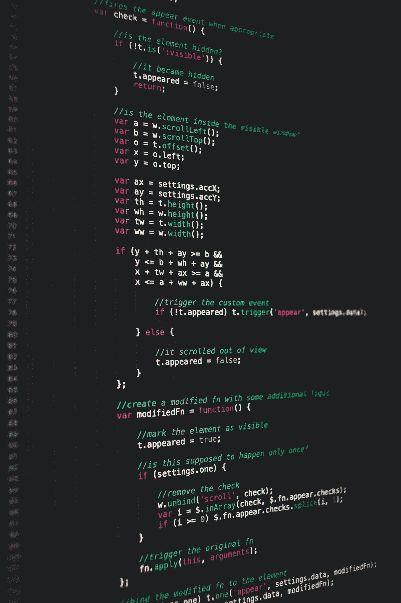

# 从博士到研究数据科学家:从学术界到工业界的旅程—第 1 部分

> 原文：<https://medium.com/codex/from-ph-d-to-research-data-scientist-the-journey-from-academia-to-industry-part-1-2d29200dc5c1?source=collection_archive---------9----------------------->

学术界和数据科学领域是不同的

几年前，我决定离开安全舒适的学术生涯，投身未知而神秘的数据科学世界。在数理统计领域做了 7 年多的博士生和博士后后，我决定是时候做出改变了。我知道我接受了适当的技术教育，并且尽可能多地在网上学习了 Python 课程，但是当我开始浏览不同数据科学职位的招聘广告时，我仍然感到非常困惑和有点害怕。你必须知道的事情的清单(不仅仅是知道，最好有 5 年以上的工作经验)似乎永远不会结束；这是画面，火花；尖峰神经网络，随机森林，贝叶斯推理，以及数百种其他技能和软件。

这不仅仅是为了获得数据科学职位而需要知道的一系列事情，也是我不知道什么是重要的感觉；以及先提高和发展哪些技能。然后是未知的未知。这太可怕了。

在这个系列中，我将尝试就如何成功地从学术界转移到工业界提供一些指导，并且我将尝试给你一些我希望几年前当我开始自己的数据科学家之旅时得到的建议。如果你是刚毕业的博士/博士后，你可能会从这个系列中获得最多，但它也将帮助你刚刚从学士或硕士项目毕业。在标题中，我指定了作为研究数据科学家的角色，但大部分仍然适用于有抱负的数据科学家(在整篇文章中，我将把这份工作称为数据科学家)。数据科学家和研究数据科学家之间的主要区别在于，后者更关注对模型的技术理解，但在大多数情况下，这些角色非常相似。

在第 1 部分中，我将讨论学术界和工业界在目的和目标上的不同，并作为本系列的介绍。如果你知道这些差异，你将会为即将到来的面试和你开始在一家公司工作时做更好的准备。

# 学术界的研究

在大学做研究，做硕士论文，或者写博士论文，基本上有三个你想达到的目标:

1.新颖性:你正在研究的问题的解决方案应该有一些新颖性，否则，你只会试图发表别人已经做过的东西，这很难成功，而且是一种**真正**糟糕的研究方法。

2.**方法必须有优势**:提议的解决方案需要优于竞争方法，至少在一个主要方面(可能是最高的准确性、最低的复杂性，或者在某些边缘情况下执行得更好)。你需要证明你的方法比已经发表的最先进的方法有优势。

3.**说服:**你需要写一份报告/论文，让评审员/反对者/考官相信你所做的符合另外两个要求。这里的主要重点是介绍问题，描述以前做过的事情，提出并推导出你的解决方案，展示结果，并与竞争方法进行比较。

如果你在这三个方面都成功了，你将更有可能获得出版，并能够展示你的作品。这是任何学术研究工作的最终目标。

该行业的研究至少在三个方面不同于学术界

# 工业研究

在工业上，目标完全不同！唯一真正重要的是:你能为公司创造多少价值？

1.**新奇:**没人在乎新奇！！如果有什么不同的话，新奇通常被认为是浪费时间——当你可以导入一个 Python 包来解决同样的问题时，为什么要花几天时间去创造新的东西呢？现在，对于一个研究者来说，这听起来非常无聊——“什么？？我就不能创造自己的方法了？”。实际上你会，但你不需要从头开始创造东西，你可以挑选你想要的任何解决方案或部分解决方案，找到最好的。你可以把它看作一种交换。在学术界，很多时候你需要做一些精神体操来创造一种新的方法。你不能在你的方法中使用解决方案 X，因为那样的话，评论者可能会认为你的方法不够新颖；即使方案 X 是最好的。在工业界，这不是一个限制，你可以有充分的自由从你能找到的所有可用的解决方案中挑选(除了那些有专利的)。你付出的回报是失去了选择自己要解决的问题的完全自由。

2.**方法有优势**:公司喜欢吹嘘他们在机器学习和人工智能方面有多好，但事实有点不同。诚然，大多数公司确实希望在自己的领域做到最好，但如果他们必须在拥有最好的模式和增加收入之间做出选择，他们会选择后者。我这么说的意思是，一个公司只需要比竞争对手做得更好。但是，更好不仅仅是用准确性或 F1 成绩来衡量，这通常要复杂得多。如果你能解决 80 %的问题，也许这足以说服客户购买你的产品，而不是竞争对手的解决方案。也许他们的产品实际上在准确性上更好(或任何其他机器学习指标)，但当你的公司有一个更便宜的产品，一个更好的主页，一个更积极的广告，或已经在其花哨和膨胀的生态系统中锁定了客户时，这可能实际上无关紧要。那样的话，你的模型只需要“足够好”就可以了。因此,“更好”这个词在行业中的含义比在学术界要宽泛得多，涉及的方面也比在学术界做研究时通常考虑的要多。

3.**说服:**这在业内确实很重要，但针对的是完全不同的受众。最有可能的是，你会发现自己试图说服你的老板、销售团队或同事，让他们相信你想做的工作会创造最大的价值。也可能是为了逃避一项你认为不会创造任何价值的任务。基本上，你的受众很可能是公司内部的人。当然，一些数据科学职位也将与外部利益相关方打交道，但同样，这也将与学术界有很大不同。例如，当试图说服客户购买你的产品时，你很可能不会谈论太多技术细节——相反，这都是关于如何为你的客户创造价值，进而为你工作的公司创造价值。

# 好吧，学术界和工业界是不同的——现在呢？

你来自学术界，拥有许多有用的工具。你可能确切地知道如何将这些工具应用到你在大学的研究中。毫无疑问，同样的工具在行业中也很有用，但是方式不同。要在行业中取得成功，您需要重新调整您的技能，而这一过程的第一步是首先了解在数据科学领域运营的公司的目标。当谈到什么是重要的时候，很容易变得短视，我们往往高估我们已经知道的东西的重要性，这并不罕见。

准备和学习的一个好方法是接触业内人士，询问他们的目标以及对他们公司来说什么是重要的。这不一定需要数据科学家。由此，尝试思考数据科学如何发挥作用，以及如何实施这些解决方案。问问你自己:“我需要什么样的知识来实现它？”以及“我如何利用我在学术界学到的知识来实现这一目标？”。

现在我们已经了解了学术界和行业之间的大致区别，在本系列的下一部分，我们将看看如何实际解决这些问题，以及如何更详细地为数据科学工作做准备。我希望这部分能帮助你思考其中的区别，以及当你进入数据科学领域时，如何最大限度地利用你在学术界的技能。

如果你喜欢这个故事，你可能想看看我的故事，从公司的角度看招聘数据科学家时面临的挑战。链接[此处](/codex/data-scientist-and-the-job-matching-problem-dffbd0b481ef?sk=28b9ee399526a8251fbaaf5aeb3e7590)。