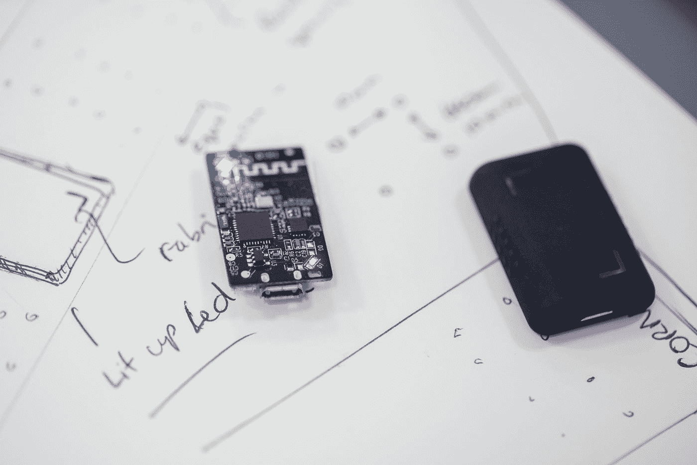

# 从碎片到项目:完成的艺术

> 原文：<https://medium.com/codex/from-pieces-to-project-the-art-of-completion-515f45a68c1?source=collection_archive---------28----------------------->

## 完成一个项目不是一件容易的事情，但是你可以从过程中学习。

你好，我是尼克🎞 on [Unsplash](https://unsplash.com?utm_source=medium&utm_medium=referral)

如果让我分享我在学习编码时学到的一件事，那就是每当我创建完整的项目时，我的学习效率至少提高了一倍。得到一个想法，构建它，并意识到你已经做了一个有用的项目，即使它并不总是一个突破性的创新，这个过程有一些神奇之处。

在一个更复杂的项目中，如果没有上千种方法，也有数百种方法可供选择，这通常会将整个过程变成一个简单任务的对立面。如果你突然被几个小时前还是一个简单的想法所淹没，你并不孤单。

根据我的经验，当你陷入困境时，花些时间暂停一下，你会从项目中获得更多的价值。花些时间思考一下到目前为止你做了什么，更深入地研究一下文档，搜索一下网页或者简单地复查一下你的代码。即使你不能为你遇到的问题想出一个解决方案，你也会从中吸取教训。在最后一种情况下，你可以将你的项目“存档”一段时间，然后尝试做一些更容易的事情。

最后，从完成项目中学习更多的是从过程中出现的问题中学习，而不是完成一些太容易的事情。这个过程的本质是不断挑战你自己和你对这个话题的了解。

# 停止关注一切

众所周知，你脑子里的活动和想法越多，你就越不能集中注意力，而且大多数时候你很少能完成这些活动。

管理你的时间和注意力的一个更有效的方法是坐下来设计一个适合你的时间表。这是一个非常有用的策略，因为它可以帮助你记录你做了什么，以及你在每项活动上花了多少时间。然而，如果你的时间表变得太拥挤，你没有空间来调整它以适应你的需要，你将回到开始。

我在这里想要表达的观点是，时间管理技术只能让你到此为止。有时候，问题不在于你如何安排你的时间，而在于你试图在我们有限的时间内完成多少工作。

这显然会在你学习的过程中产生很多挫折。可能最经常发生这种情况的地方是在学校，因为那里有。我敢打赌，你曾经有过这样的尴尬经历:听完一个小时的讲座，却在五分钟内忘记了其中的一部分。在学习一项技术时，不犯同样的错误是至关重要的。

# 获得灵感

布兰迪·里德在 [Unsplash](https://unsplash.com?utm_source=medium&utm_medium=referral) 上拍摄的照片

开始一个新项目的第一步可能是想出一个主意，想出一些你感兴趣的东西。这种灵感可以通过多种不同的方式从广泛的来源中获得，这意味着大多数时候在寻找它时没有对错之分。

最简单的方面是考虑你要寻找什么，那几乎是任何与你想要制作的项目相似的材料。例如，如果你想开发一个移动应用程序，你应该寻找设计布局，应用程序功能的例子和有趣的包(或库)来帮助你。

如果你已经有了这方面的经验，你可以专注于你想探索的新技术

该过程的另一个简单部分是知道在哪里搜索每个资源。我的意思是，在当今世界，我们可以访问大量的社区和资源，其中包含数千个不同领域和领域的示例。对我帮助很大的一些资源示例如下:

*   开源代码库
*   拼趣
*   几乎所有在线文档
*   行为
*   Reddit(如果你关注正确的子编辑)

我可以向你保证，无论你想做什么(也许火箭科学除外)，总有一个教程、指南、真实的例子或至少一张图片可以给你一个想法，并作为一个有用的参考来指导你完成这个过程。

最后，我们到了建立项目最不简单的部分，那就是计划。大多数情况下，您会想要检查项目的主要步骤和需求。需要特殊软件吗？你在这方面有多少经验？第一步应该做什么？第二个呢？

这些都是在你想出一个合理的计划之前，可能在几秒钟内得到答案或者可能永远得不到答案的问题，我们甚至没有考虑到项目通常是作为一个团队开发的事实。有许多文档涵盖了软件开发作为*过程*的有用标准和方法。此外，还有其他工具，如 er 图、UML 和线框，可以在项目的规划阶段发挥重要作用。

然而，思考你的个人进步也很重要，作为一名开发人员，你是谁，你为什么开始这个项目，你期望从中获得什么。

# 编码

在 [Unsplash](https://unsplash.com?utm_source=medium&utm_medium=referral) 上拍摄的 [ThisisEngineering RAEng](https://unsplash.com/@thisisengineering?utm_source=medium&utm_medium=referral)

一个项目的开发过程有很多方法，大多数时候，你采取的方法取决于项目本身的类型和规模。尽管如此，个人项目最常见的方法可能还是迭代方法，在这种方法中，你添加新的特性，测试结果，完成一个原型，然后重复，直到你有了目标产品。

根据您对所使用的语言或技术的了解，编程本身可能有不同程度的难度。请务必通读文档和参考资料，如果您不确定如何解决特定的 bug 或实现新功能，请尝试自己寻找解决方案，然后在其他资源上寻找小提示，最后自己实现代码。永远不要在没有事先想好每一行是做什么的情况下复制一段代码，因为这将使你的代码更容易出错，而且你也不会知道这段代码是如何产生的。

编码风格和惯例也是每个项目必须具备的基本特征。在所有源文件中保持一致的缩进、格式和命名。还要记住至少要给你的代码提供一些文档，即使是内联注释的形式。如果你想在未来继续开发这个项目，这些信息会对结果产生很大的影响。

您可以实施各种各样的测试来确保您的软件按预期运行。这些测试可以根据它们的目的进行分类:你需要围绕你的代码测试组件的功能吗？尝试单元测试。您的项目应该被部署到成千上万的并发用户吗？使用压力和负载测试。

当然，版本控制是这种方法的核心，因为拥有一个已定义的开发工作流将有助于根据现有的目标引导每个迭代朝着正确的方向发展。知道如何使用诸如 Git 之类的工具很可能会在您当前和未来的项目中产生巨大的成果，无论您是独自开发还是与团队一起开发。

请记住，有各种各样的技能和工具将在开发过程中帮助你，并且在每个项目中都很有价值。在 IDE 中键入代码不是您必须执行的唯一任务，也不是最重要的任务。

# 探索新视野

> 那么，你已经完成了一个项目。下一步是什么？

[Artur D.](https://unsplash.com/@1mann?utm_source=medium&utm_medium=referral) 在 [Unsplash](https://unsplash.com?utm_source=medium&utm_medium=referral) 上拍摄的照片

在许多情况下，你回到了过程的起点:你必须有一个想法，把时间放在一边，研究，建立项目，并准备再次犯错。在某种程度上，这就像把岩石再次推到山顶。

然而，通过完成一个项目，你会得到一些非常重要的东西。你不仅学到了技术和语法，而且你有希望找到关于你自己的关键知识，包括你当前的技能水平、目标、困难，并且经历了开发一个项目的全部经历。

了解了这一点，你就可以根据你的经历选择下一步:

*   回忆一下你学过的东西。
*   **这个项目容易吗？我在两个小时内完成了所有的事情吗？**很可能你能够相当轻松地从开始到结束。在你的下一个项目中，你应该尝试一些更难的东西，这些东西建立在你发展和/或发现的技能之上。
*   **我不确定自己是否是“x”技术的忠实粉丝。**据我所知，你可以选择要么继续做别的事情(尤其是如果你不*需要*去学习所说的技术)，要么在未来再试一次。请记住，技术可能每年都在变化，最终就像尝试新的食物一样:结果取决于食物本身和你的口味。
*   我就是无法完成这个项目。也许你一路上没有理解某些东西，在代码中犯了一点错别字或者你没有投入足够的时间。不管是哪种情况，你还有下一步:找出你失败的原因并改进你的方法。

基于项目的学习是一个在最近几年获得一些关注的概念，甚至导致一部分学术机构围绕这种方法开设新的课程。在我看来，构建项目通常是实践一致性、计划和故障排除以及帮助你为所述项目设定目标的最佳选择。