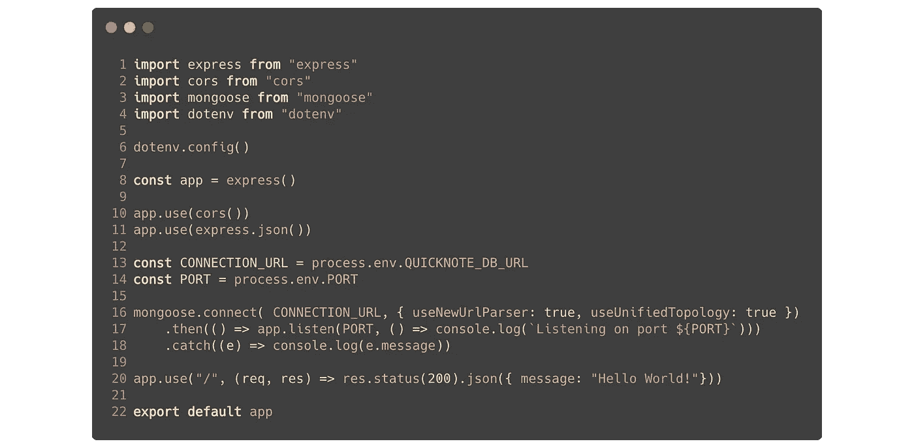
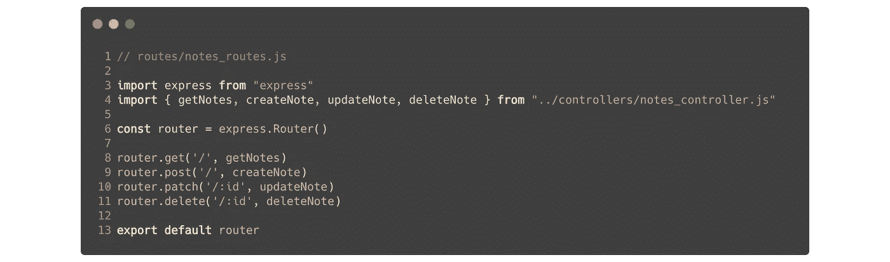
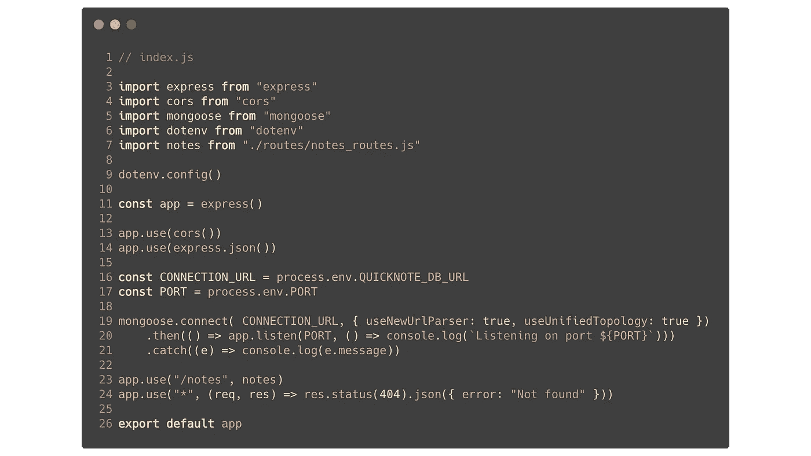
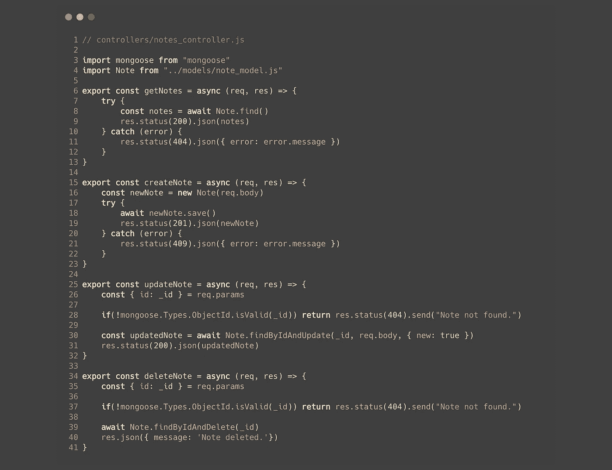
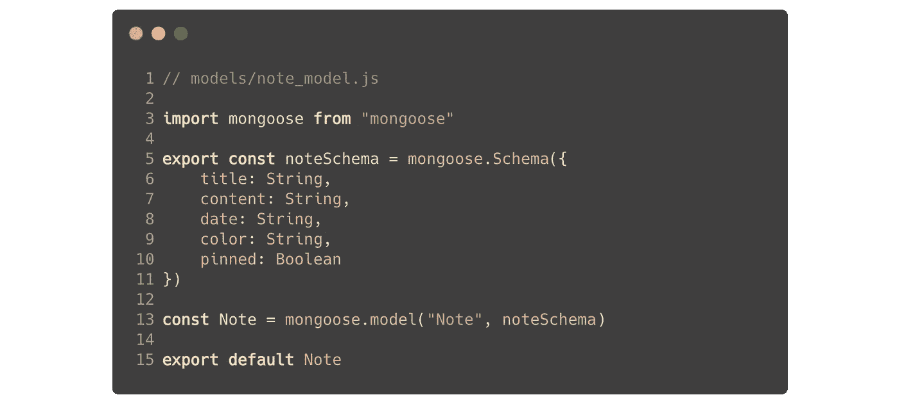

# 从 Rails 到 Node:初学者指南

> 原文：<https://medium.com/codex/from-rails-to-node-a-beginners-guide-d8c5a7ef395c?source=collection_archive---------8----------------------->


照片由[艾米·赫希](https://unsplash.com/@amyhirschi?utm_source=medium&utm_medium=referral)在 [Unsplash](https://unsplash.com?utm_source=medium&utm_medium=referral) 拍摄

没有什么感觉比从计算机科学学位或软件工程训练营毕业更令人沮丧的了，当你调出第一批工作清单，发现其中许多都不是你在课程中学到的特定技术。唉。但是，学习新技能的无限机会是科技世界最令人兴奋的方面，你对引入新工具和新概念越开放，你在潜在雇主面前就越有市场。

作为一个建立在用户友好语言之上的用户友好框架，Ruby on Rails 是开发人员训练营和类似组织中的一个流行选择，作为一个后端环境来教授新的软件工程师。为什么不呢？它得到了很好的支持，易于理解，并且适用于 PostgreSQL 等关系数据库。但是正如我们所说的——学习新工具是技术领域的游戏名称，所以本文将作为初学者指南，将 Rails 知识转移到另一个流行的后端环境中:

Node.js。

# Node.js 是什么？

Node 是一个后端运行时环境，旨在允许开发人员在浏览器之外编写和运行 JavaScript 代码。那是什么意思？基本上，它让我们能够使用 JS 为动态 web 应用程序构建服务器，就像我们习惯使用 Ruby 和 Rails 一样。这样做的好处是显而易见的:它允许我们在前端和后端统一我们的代码库。它也让我们写更多的 JavaScript，这从来不是一件坏事！在我们开始之前，如果您还没有安装 Node，请确保先安装它。让我们深入研究，从基础知识开始。

# 入门指南

我们将开始构建一个新的项目目录，并在其中运行`npm init`来生成我们的`package.json`。我们要做的第一件事是将下面一行添加到该文件中:

```
"type": "module"
```

直到最近，诸如`import`的 ES6 特性还不被 Node 支持。在`package.json`中包含这一行将会为我们打开这个可爱的功能。

接下来，为了弥补这里的知识缺口，本指南将介绍 Node 本身之外的几项附加技术，这些技术将允许我们建立一个类似于我们习惯使用 Rails 的环境。我们将在 MERN 堆栈(MongoDB、Express、React、Node)的上下文中工作，必要时会涉及到它，但不是本文的重点。现在让我们快速浏览一下其中的一些工具。

**1。Express.js**

`npm i express`

Express 是一个流行的极简节点框架，非常适合构建 RESTful APIs。

**2。猫鼬**

`npm i mongoose`

Mongoose 是 MongoDB 的建模工具，它允许我们轻松地建立数据库连接、编写对象模型模式、查询数据库等等。由于本指南旨在作为 Node 而非 Mongo 的初级读本，所以我们在这里不会涉及实际的数据库设置。然而，参考资料中会链接一个非常有用的 Youtube 系列，它涵盖了从开始到结束的整个栈 MERN 开发周期，包括 MongoDB 初始化。

**3。nodemon**

`npm i nodemon`

nodemon 是 Node 的替代包装器。它会主动观察代码中的变化，并自动重启服务器以反映这些变化，而不是让您自己手动执行该任务。一旦安装了 nodemon，确保将行`“start”: “nodemon index.js”`添加到`package.json`文件中的`scripts`对象中。这将允许你运行`npm start`来启动你的后端。

**4。cors**

`npm i cors`

cors 是一个 Express 节点中间件包(稍后将详细介绍),支持各种 CORS 功能。

**5。dotenv**

`npm i dotenv`

这是一个简单的节点包，允许我们创建并利用一个`.env`文件来隐藏敏感信息，如数据库凭证、API 密钥等。在推送到 GitHub 之前，确保您的`.env`文件包含在您的`.gitignore`中！

好的，太好了！有了这些工具，我们只需要在项目中再创建几个条目就可以了。让我们在我们的根目录下做三个目录，它们的名字可能听起来很熟悉:`controllers` `models`和`routes`。之后，我们将创建一个`index.js`文件并在我们的编辑器中打开它。这是我们设置服务器的地方！

# 服务器初始化

如前所述，我们的`index.js`文件将是我们建立服务器的地方。在这里，我们将导入几个刚刚安装的包，并编写一些样板代码来启动和运行。



让我们看看我们在这里做什么。首先，像往常一样，我们将导入服务器初始化所需的包。稍后，我们也将在这里导入我们的路由文件。在第 6 行，我们将配置`dotenv`——在我们可以使用它之前需要一个动作。在第 8 行，我们将使用 Express 创建一个服务器实例，然后在第 10 行和第 11 行，我们将告诉它同时使用`cors`和`json`中间件。之后，一旦您将 MongoDB 连接 URL 以及端口信息放在了`.env`文件中，并为它们指定了名称，您就可以在这里通过将它们指定给变量来访问它们，如第 13 行和第 14 行所示。接下来，在第 16 行，我们将使用 mongoose 的`connect`方法，将 DB URL 和 options 对象作为参数传递，来建立到数据库的连接。我们将字符串化一个`.then`,其中我们传入一个回调函数，该函数调用我们的`app`实例上的`listen`,传入端口和`console.log`消息作为参数。之后，我们将捕获并记录任何错误。最后，在第 20 行，我们将通过在我们的`app`实例上调用`use`来设置一个初始路由，传入一个路径字符串，然后传入一个带有状态代码和 json 响应的回调函数。稍后，我们将回到这里，扩大这条路线，以及添加更多。但在此之前，我们需要实际建造这些路线。

# 路线

啊，路由。这听起来很熟悉！虽然这不会像我们习惯的 Rails 那样编写(很明显)，但同样的概念仍然适用:我们将指定一个 HTTP 方法、一个请求可以从前端发送到的路由，以及一个处理该请求所发生的事情的控制器动作。让我们为即将建立的`Note`模型写一些 CRUD 路径。以下是我们习惯在 Rails 中看到的内容:

```
get "/notes", to: "notes#index"
post "/notes", to: "notes#create"
patch "/notes/:id", to: "notes#update"
delete "/notes/:id", to: "notes#destroy"
```

现在，让我们看一下我们将如何使用 Express 处理这些相同的路线。在我们的`routes`目录中，我们将创建一个名为`notes_routes.js`的文件，并编写以下代码:



首先，我们将从一个控制器文件导入 Express 和四个动作函数，我们还没有制作。接下来，我们将在第 6 行创建一个 Express 路由器的实例。之后，我们将调用我们希望在该实例上路由的每个 HTTP 方法，首先传入可以发出请求的路径，然后传入控制器的 action 函数。最后，我们将导出路由器。就是这样！完成后，让我们回到我们的`index.js`并向我们的服务器提供路由。



只需从`notes_routes.js`导入路由器，将路径作为字符串传入`app.use`的第一个参数，然后将路由器作为第二个参数传入。通过传入`“/notes”`作为`index.js`中的路径，以及我们在路由文件中设置的附加子路径，我们将能够获取的完整端点看起来类似于`http://localhost:5000/notes/`以获取所有注释并发布新注释，以及`http://localhost:5000/notes/id`以编辑特定注释并删除特定注释。我们还将在第 24 行创建另一个通配符路由，以便在用户碰巧遇到一个不存在的端点时返回一个错误。

酷——现在我们已经设置好了路由，让我们构建一个控制器，这样当用户点击端点时，就会发生一些事情。

# 控制器

因此，在这一点上，我们已经知道了基于我们已经建立的路线，我们的控制器将需要哪四个动作:`getNotes`、`createNote`、`updateNote`和`deleteNote`。让我们再来看看我们是如何习惯于在 Rails 中处理这些动作的:

```
def index
   @notes = Note.all
   render json: @notes
enddef create
   @note = Note.create(note_params)
   render json: @note
enddef update
   @note = Note.find(params[:id])
   @note.update(note_params)
   render json: @note
enddef destroy
   @note = Note.find(params[:id])
   @note.destroy
end
```

现在我们将使用 Mongoose 在 Node 中处理这些相同的操作。在`controllers`内部，让我们创建一个名为`notes_controller.js`的文件并编写一些代码:



总的想法是，每个动作将由一个异步函数组成，该函数接收请求和响应对象作为参数。请求对象是客户端在获取中设置的内容，响应是服务器返回的内容。在每个动作中，我们将使用各种 Mongoose 模型查询方法来查找正确的数据。在顶部，我们正在导入猫鼬，以及我们尚未创建的`Note`模型。接下来，我们将看看我们的每个行动。

在`getNotes`中，我们运行一个 try/catch 块，在这里我们调用我们的`Note`模型上的`.find()`查询方法。`.find()`是由 Mongoose 提供的一个查询，如果没有参数传入，它将返回模型的所有实例的数组。它——以及我们将调用的其他查询中间件——是一个异步函数，这意味着我们需要在它前面去掉`await`关键字，以确保它在我们进入下一步之前完成执行。一旦完成，我们只需将响应的状态设置为 200 表示“OK ”,然后将注释数组呈现为 JSON。如果代码块捕捉到一个错误，我们转而呈现错误消息的 JSON。

`createNotes`首先创建一个新的`Note`实例，将请求对象的主体作为数据传入。然后，我们运行另一个 try/catch 块，如果该块成功，它会将新的注释保存到我们的数据库中，并在 JSON 中将它作为响应返回，否则会显示一条错误消息。

接下来，`updateNote`从请求对象参数中获取特定注释的 ID，并将其别名化为`_id`，以更接近 MongoDB 的 ID 格式。然后，我们检查以确保它是一个有效的 MongoDB ID，方法是将它传递给 Mongoose 的 ObjectID 类型上的一个`isValid()`调用。如果解析为 false，我们将返回 404 错误。否则，我们在我们的`Note`模型上调用`findByIdAndUpdate()`，首先传入 ID，然后传入请求体，最后传入一个 options 对象，其键`new`设置为`true`。一旦完成，我们将用 200 状态以及更新后的注释的 JSON 进行响应。

最后，`deleteNote`将以类似的方式开始——首先从参数中获取 ID，然后检查其有效性。一旦解决了这个问题，我们就调用`Note`模型上的`findByIdAndDelete()`,并传入这个 ID。然后我们将呈现一个 JSON 响应，表示一个成功的请求。

很好，快到了！我们将讨论的最后一件事是为我们的`Note`创建一个模型，它将把一切联系在一起。

# 模型

Rails 中的模型、迁移和模式往往是框架工作中较为繁琐的部分。您很早就被锁定在模型设计中，对模式的任何更改都需要回滚和创建新的迁移，有时会导致错误和不必要的麻烦。使用节点和非关系数据库(如 MongoDB)的一个主要优势是，您不需要从一开始就将自己束缚在任何特定的蓝图上，因此对设计进行更改要容易得多。Mongoose 进一步简化了这个过程，它提供了简单易用的模式，可以在不进行任何迁移的情况下动态更新。不过，在此之前，让我们先最后看一眼 Rails，看看我们是如何做到这一点的。

```
def change
   create_table :notes do |t|
      t.string :title    
      t.string :content    
      t.string :date    
      t.string :color    
      t.boolean :pinned    
   end
end
```

然后，如果我们想要更新或删除这个模型中的任何列，我们显然必须为每个更改运行额外的迁移。使用 Mongoose，我们可以创建我们的模式并直接编辑它，无需迁移。让我们在`models`中创建一个名为`note_model.js`的文件:



就是这么简单。我们可以在任何需要对`Note`模型进行修改的时候到这里来修改这个模式，之后创建的任何新的 note 实例都会反映这些修改。

现在你知道了！我们已经使用 Express 和 Mongoose 成功地设置了一个节点后端来路由来自客户端的 CRUD 请求。

# 零碎的东西

我们在这里介绍的只是冰山一角 Node 还可以提供更多功能。我们几乎没有提到中间件，它可以为你的应用程序增加全新层次的功能。除此之外，我们在本指南中只描述了最基本的单一模型场景。笔记需要用户拥有怎么办？*活动记录！！*我听到你在后面喊。考虑到 Node 和 Express 最常与非关系数据库一起使用，对象所有权是一个完全不同的问题，我们不在这里讨论。如果您对真正深入环境感兴趣，我强烈推荐查看下面链接的节点文档和指南。编码快乐！

> 参考
> 
> [*Node.js 文档*](https://nodejs.org/en/docs/)
> 
> [*獴文档*](https://mongoosejs.com/docs/)
> 
> [*JavaScript Mastery 的完整栈 MERN 开发系列*](https://www.youtube.com/watch?v=ngc9gnGgUdA&list=PL6QREj8te1P7VSwhrMf3D3Xt4V6_SRkhu&t=0s&ab_channel=JavaScriptMastery) *||一个非常详细和有用的视频指南，从后端到前端开始使用 Node、MongoDB 和完整的 MERN 栈。强烈推荐。*
> 
> [*Node/Express 中与 MongoDB 和 Mongoose 的一对多关系*](/@brandon.lau86/one-to-many-relationships-with-mongodb-and-mongoose-in-node-express-d5c9d23d93c2) *||学习 Node 和 MongoDB 应用程序中对象关系的良好起点。*
> 
> [*Express-mongose-generator*](https://www.npmjs.com/package/express-mongoose-generator)*| |一个 NPM 包，为 Express/mongose 应用程序提供样板生成器，很像 Rails 生成器。注意:这个包使用 ES6* `*require*` *之前的语法。*