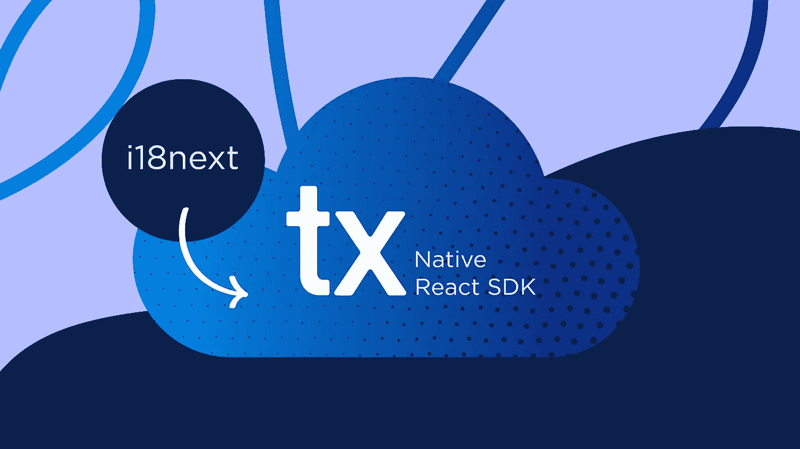

# 从 react-i18 到 Transifex Native:迁移指南

> 原文：<https://medium.com/codex/from-react-i18next-to-transifex-native-migration-guide-3860e96ae8d3?source=collection_archive---------5----------------------->



如果您已经使用 React-i18 将 React 应用程序[国际化(i18n)](https://www.transifex.com/blog/2021/what-is-internationalization-i18n-in-software/) 接下来，您很可能会想“为什么要这么麻烦”？如果它玩起来很流畅，那么为什么要换成新的呢？

首先，当我们谈论 React 应用程序时，我们可能谈论的是一直在发展的应用程序。新功能不断增加，现有功能不断变化。

这意味着您的[本地化](https://www.transifex.com/blog/2021/what-is-localization/)框架在维护模式下需要是可承受的，应用小的改变，在整个代码库中传播。从维护的角度来看，Transifex Native React SDK 提供了以下优势:

*   **文件管理减少到零**，因为不需要额外的文件来保存翻译。不需要额外的管理来发送内容进行翻译，并在准备就绪后解析回您的应用程序。或者在需要翻译的字符串中引入新结构时调整自动化。
*   **将代码从内容、源&翻译**中分离出来，提供更大的灵活性来应用对翻译甚至原始语言文案的更改，而无需您参与额外的部署&发布。

通过 Transifex Native React SDK，您还可以获得:

*   **更简单的初始化**，通过安装所需的库并将它们包含在您的代码中。
*   **通用语法**，具有专为本地化需求构建的 ICU 支持。
*   **与其他 web 和移动应用程序配合良好**，因为有了 Transifex Native，您可以在应用程序和技术之间使用完全相同的内容。

这种方法的好处是什么？

# 如何迁移

遵循完整的指南来帮助您将 react-i18next 本地化迁移到[transi fex Native React SDK](https://docs.transifex.com/javascript-sdk/localize-react-applications)。

# 初始化的变化

这两种框架都要求你初始化一个全局对象，作为应用程序和本地化能力之间的“网关”。在 react-i18next 中，它看起来像这样:

```
import i18n from "i18next";
import { initReactI18next } from "react-i18next";const resources = {
  en: {
    translation: {
  	'Hello world': 'Hello world',
    },
  },
  el: {
    translation: {
  	'Hello world': 'Καλημέρα κόσμε',
    },
  },
};i18n
  .use(initReactI18next)
  .init({
    resources,
    lng: 'en',
    interpolation: { escapeValue: false },
  });
```

这个片段并没有讲述整个故事。翻译的内容(“资源”字段)可以来自各种来源，也可以在初始化后添加。“init”方法还接受更多的参数，并允许您在很大程度上定制体验。

当迁移到 Transifex Native 时，您会失去一些灵活性，因为您内容的真实来源始终是在 [Transifex Native 内容交付服务](https://docs.transifex.com/transifex-native-sdk-overview/hosting-translations)上的内容，作为回报，您最终会得到更简单的内容:

```
import { tx } from '@transifex/native';tx.init({
  token: '...',
});
```

Transifex Native 中还有其他初始化选项，允许您:

1.  使用“过滤标签”字段限制您将从 Transifex 接收的内容
2.  当“missingPolicy”字段缺少翻译时该怎么办
3.  当翻译无法通过“错误策略”字段呈现时(例如，由于译者犯了格式错误),该怎么办

# 准备代码

为了尽量减少不便，您应该用 Transifex 本机的' t '函数替换 react-i18next 的' t '函数的调用。

出发地:

```
import { useTranslation } from 'react-i18next';function Paragraph() {
  const { t } = useTranslation();
  return <p>{t('Some text')}</p>;
}
```

到

```
import { useT } from '@transifex/react';function Paragraph() {
  const t = useT();
  return <p>{t('Some text')}</p>;
}
```

但是，最好使用 T 型组件:

```
import { T} from '@transifex/react';function Paragraph() {
  return <p><T _str="Some text" /></p>;
}
```

简单的变量插值是用单花括号而不是双花括号完成的。

出发地:

```
import { useTranslation } from 'react-i18next';function Paragraph() {
  const { t } = useTranslation();
  return <p>{t('Hello {{username}}', { username: 'Bob' })}</p>;
}
```

收件人:

```
import { T } from '@transifex/react';function Paragraph() {
  return <p><T _str="Hello {username}" username="Bob" /></p>;
}
```

对于格式化的内容，你最好用<ut>替换<trans>。</trans></ut>

出发地:

```
import { useTranslation, Trans } from 'react-i18next';function Paragraph() {
  const { t } = useTranslation();
  return (
    <Trans t={t}>
  	<p>Some <strong>bold</strong> text</p>
    </Trans>
  );
}
```

收件人:

```
import { UT } from '@transifex/react';function Paragraph() {
  return <UT _str="<p>Some <strong>bold</strong> text</p>" />;
}
```

# 迁移翻译的内容

首先，你需要上传你目前的翻译到 transifex.com 的一个基于文件的项目。在创建了基于[文件的项目](https://docs.transifex.com/getting-started-as-a-localization-manager/1-set-up-your-projects#create-a-project)之后，您可以使用 transifex-client 来帮助上传资源(每个资源一个名称空间):

```
# Install the client
wget https://github.com/transifex/cli/releases/download/v0.3.0/tx-linux-amd64.tar.gz
tar xf tx-linux-amd64.tar.gz tx
rm tx-linux-amd64.tar.gz
mv tx ~/bin# Set up the mapping to transifex.com
tx init
tx add \
  --organization=... \
  --project=... \
  --resource=translations \
  --file-filter=locales/translations/<lang>.json \
  --type=KEYVALUEJSON \
  locales/translations/en.json
tx add \
  --organization=... \
  --project=... \
  --resource=helpdesk \
  --file-filter=locales/helpdesk/<lang>.json \
  --type=KEYVALUEJSON \
  locales/helpdesk/en.json# Push the content to transifex
tx push --source --translation --all
```

接下来，您需要[创建一个本地项目](https://docs.transifex.com/transifex-native-sdk-overview/managing-a-transifex-native-project#create-a-native-project)。确保您为以后保留了公共和秘密令牌。

在将内容推送到新项目之前，您需要:

1.  将目标语言添加到新项目中
2.  将两个项目添加到同一个翻译记忆组(TM 组)。一个翻译团队在项目间共享翻译知识，并且可以自动填充项目间相似字符串的翻译。

现在，在您的本地项目中，使用提取 cli 将内容推送到 transifex.com 的本地项目(使用标签作为命名空间，[参见此处](https://docs.google.com/document/d/1CxbC17QG2FWFhrbzc9aBooWx4LZBXVTeCUv9KmCJhkg/edit#heading=h.mbdudj7zfut8)):

```
npm install --save-dev @transifex/cli
npx txjs-cli push --token=... --secret=... src
```

因为我们将两个项目放在同一个 TM 组中，所以将使用现有的翻译来填充新的。

如果您在迁移代码时必须对一些字符串进行微小的修改，那么可以在编辑器中进行填充。即使它们没有被自动填充，部分 TM 匹配也会作为建议显示在 Transifex 编辑器中，并使这项工作变得容易。

最后，确保在应用程序启动时初始化“tx”对象，这样就可以开始了！

一旦一切就绪并开始运行，您就可以删除旧的基于文件的项目并保留新的 Transifex Native React 项目。

现在您的应用程序已经完全迁移了。您可以使用 Transifex Native 继续所有即将到来的开发！


想和你的开发伙伴分享一个快速反应本地化指南吗？你可以在这里下载 PDF！

[这个帖子最初发布在这个页面](https://www.transifex.com/blog/2021/from-react-i18next-to-transifex-native-migration-guide/)。