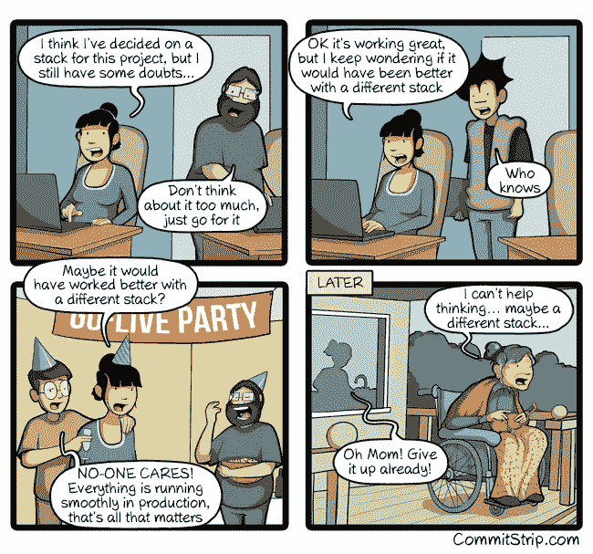

# 前端最佳实践

> 原文：<https://medium.com/codex/front-end-best-practices-666f09a4dfd?source=collection_archive---------4----------------------->

将任何前端项目从开发推向生产总是具有挑战性。许多工具帮助开发人员专注于交付价值。无论您是在团队中工作还是独自工作，都有优化编码工作流程的解决方案。

我是 Franck，今天我将与您分享一系列技巧和良好实践，让您的工作更加安全愉快。

# 本帖回顾的原则

我假设这些实践中的大部分都已经很好地建立起来了，但是这里有一个简短的提醒:

*   不要重复你自己
*   编写测试
*   记录您的代码
*   保持简单
*   Lint 您的代码
*   按领域设计
*   一个好的 CI/CD 工具
*   一套好的浏览器和设备
*   保持你的知识是最新的

现在如何把它放在适当的位置并继续下去？

# 集成驱动电子设备

为了充分利用它，您的 IDE 是一个基础。这就是用 Notepad++写代码的结尾。你需要一个能和其他人很好地集成并尽可能帮助你的工具。

一个好的 IDE 是这样的:

*   不要放下你的开发机器
*   允许您直接从它运行任何东西
*   为您输入的内容提供即时反馈
*   让你尽可能快地找到你需要的任何东西，无论是文件还是函数
*   允许简单的代码重构
*   与您可能使用的任何语言或框架集成
*   让您能够禁用不使用的功能

将来我会写一篇关于 IDEs 的完整文章。敬请期待；)

# 不要重复你自己

作为一个经验法则，如果你重复某事超过 2 次，分解它。原因有很多:

*   这使得你的代码更容易维护
*   它允许更少的错误发生
*   它使你的代码更加清晰
*   从长远来看，它降低了你的 IDE(和你的机器)的性能
*   和前面一样，它为最终用户缩小了应用程序的性能

顺便说一下，如果你在一个团队中工作，这将有助于不混淆队友。

# 编写测试

如果你已经读过我之前关于通过测试驱动开发[快速可靠编码的文章](https://wearelion.medium.com/fast-and-reliable-coding-through-tdd-1b50c8ad0028?source=your_stories_page-------------------------------------)，你就会知道我喜欢测试。

测试是强制性的。有人可能会说“测试就是怀疑”。事实上，的确如此！总是怀疑自己。因为这是在某方面变得更好的第一步。在发展中，这一点从未如此真实。

测试挑战您的解决方案。这对我来说是一个起点，而不是终点。你不是交付测试，而是价值。测试有助于做到这一点。

在这个领域，我坚持使用 [Jest](https://jestjs.io/) ，因为我在开始 ReactJS 时发现了它。它功能多样，可以与任何前端堆栈很好地集成。顺便说一下，即使有 NodeJS 后端。

截至目前，我在大多数项目中使用 [Jest](https://jestjs.io/) 和[测试库](https://testing-library.com/)。这又让测试变得有趣了:)

# 记录您的代码

无论是通过测试还是在项目中削减文档，文档化都可以帮助你和你的伙伴快速开始。它揭示了你的项目的目的和其中一些部分的微妙之处。

# 保持简单

这很容易让人看不到你编码的目的是什么。开始时，保持事情简单听起来很容易。但是很快代码库就会变得过度设计和混乱。

为了避免这种情况，你当然要写测试，但也要经常重构。这是避免复杂的保证。在这方面，您的 IDE 是一个杰作:使用它的能力来检查您的代码。

# Lint 您的代码

[Eslint](https://eslint.org/) 做得很好:一个好的 Eslint 配置文件可以让你免于开发愚蠢的东西。它突出了你的代码的弱点，并给你建议如何去修复它们。

如果你将它与风格指南一起使用，如 [Standard JS](https://standardjs.com/) 、 [Airbnb](https://github.com/airbnb/javascript) 或 [Google Styleguide JS](https://google.github.io/styleguide/jsguide.html) ，它还可以增强一致性。如果你使用它，它是可定制的并且与 TypeScript 兼容。

# 领域驱动架构

这里我不是在谈论领域驱动的设计。但这是有关联的。可以讨论的是前端应用程序应该如何设计。所以这纯粹是需求问题。

我过去常常按领域对事物进行分组，以在我的代码库中创建上下文和一致性。这主要是理解和简化重构的问题。这使你可以很容易地识别东西，而不必在文件树中上下跳跃来找到你想要的东西。此外，它允许快速浏览与特定领域相关的内容。

但是，这是一个有争议的话题，可能与任何项目都不相关。明智地决定。

# 一个好的 CI/CD 工具

持续集成和部署是实现自动化的一个好方法。无论是在您的开发机器上还是在您的代码库中。

理想的 CI/CD 应具备:

*   棉绒滑槽
*   单元测试运行程序
*   功能测试跑步者
*   端到端测试运行程序
*   分阶段部署脚本

运行它们的所有命令(除了部署)都应该可以在开发人员的机器上运行。

如果你没有实践 TDD，至少利用 Git 钩子在提交前运行你的测试，感谢 [husky](https://typicode.github.io/husky/#/) 。这将防止您推送未测试的代码或失败的测试。

我知道这涉及到纪律，但你以后会为此感谢自己的。

# 一套好的浏览器和设备

好吧，我知道浏览器之间的渲染差异比在 Internet Explorer 时代要小。但是请记住，您不能假定您的代码将在什么设备或浏览器上执行。

在你的编译器中总是以 ES5 为目标。如果你不确定某个特定的浏览器是否实现了某种语言功能，请时刻关注 caniuse.com[的消息。无论是 JavaScript 还是 CSS。](https://caniuse.com/)

浏览器列表包括了解你的目标受众。这将帮助您缩小支持的浏览器列表。如果你不能在你的机器上安装它们，你可以使用像[浏览器堆栈](https://www.browserstack.com/)这样的工具。这是一项付费服务，但对开源和非营利项目是免费的。如果你真的负担不起投资，你可以尝试一种更根本的方式:虚拟机。

# 保持你的知识是最新的

这听起来可能是显而易见的，但请记住，前端技术发展非常快。保持最新是强制性的。当您使用添加语法糖和抽象的框架时，很容易忘记琐碎的语言相关的事情。

永远不要忘记，掌握根语言将永远以框架和库所不能的方式帮助你。

# 结论

我希望你喜欢这篇文章。这是多年经验的结果。它的某些部分可能会引起争论。但是如果有人帮了你或者你想讨论一下，请便。和你谈论这件事会很愉快。

我将用一个[提交条](https://www.commitstrip.com/en/2018/10/05/stack-doubt/?):)来结束

