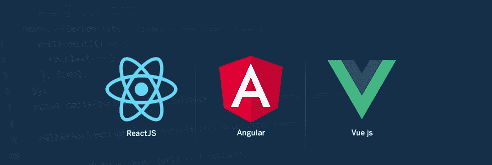
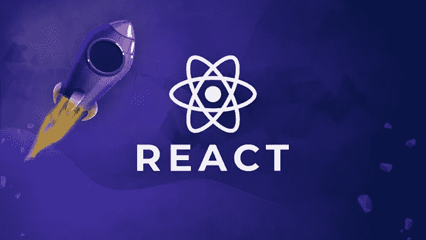

# 前端框架:概述为什么您应该选择反应

> 原文：<https://medium.com/codex/front-end-frameworks-overview-of-why-you-should-choose-react-9e3f730c24d5?source=collection_archive---------22----------------------->

在当今的 IT 世界中，每一个被设计和开发的网站或应用程序都由两部分组成——前端和后端。前端部分是我们在屏幕上看到的设计或用户界面，后端部分是使网站正常工作的部分。

在这个世界上，外观对人们来说是最重要的，他们显然更喜欢设计良好且易于使用的网站或应用程序。用户界面越好，网站就越讨人喜欢。

因此，当我们搜索可用于 UI 设计的框架时，我们总结出当今市场上可用的 3 个最佳选项

1.  反应堆
2.  有角的
3.  Vue js

这些年来，这些框架在 UI 开发中的使用越来越多，现在在如此大的需求之后，公司也提出了对前端框架有良好了解的先决条件。现在，人们也必须对前端框架有很好的了解。

如果我们谈论目前在给定的三个选项中使用的框架，ReactJS 是最流行和广泛使用的框架，因为它的特性使它不同于其他框架。

那么我们就来试着详细了解一下现在最流行的前端框架的特性。

# 为什么 React.js 比其他框架更受青睐？

为什么我们应该使用 ReactJS 而不是可用于前端开发的框架，如 Angular 和 Vue？所以我们来看看 React.js 的好处:

1.  ***易学:*** 任何有编程基础知识的人都能轻松理解 React 而 Angular 和 Ember 难学。对于 React.js，你只需要 CSS 和 HTML 的基础知识。
2.  ***简单性:*** 基于组件的方法、定义良好的生命周期以及使用简单的 JavaScript 使得 React 非常容易学习。React 使用一种叫做 JSX 的特殊语法，允许你将 HTML 和 JavaScript 混合使用，这使得它变得更加简单和容易。
3.  ***原生方式:*** React 也用于创建移动应用程序(React Native)并被认为是 React 的主要特性之一。所以同时我们可以做 IOS，Android，和 Web 应用。
4.  ***数据绑定:*** React 使用单向数据绑定和一个名为 Flux 的应用架构，通过一个控制点控制数据流向组件。调试大型 ReactJS 应用程序的自包含组件更容易。
5.  ***测试:*** ReactJS 应用超级容易测试。React 视图可以被视为状态的函数，因此我们可以操纵传递给 ReactJS 视图的状态，并查看输出和触发的动作、事件、函数等。

# 结论

随着世界的快速发展，我们的 IT 行业也在快速发展。所以我们应该用最新的技术来更新自己。这是对前端框架的简单介绍，以及为什么您应该选择将 js 作为项目的前端框架。

如果你对此有任何疑问，你可以在 [LinkedIn](https://www.linkedin.com/in/harsh-8711a81a0/) 上发表评论或联系我。