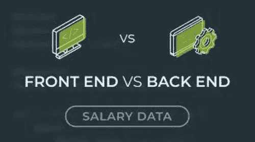

# 前端与后端:哪一个付出更多

> 原文：<https://medium.com/codex/frontend-vs-backend-which-one-pays-more-140a4e3aa845?source=collection_archive---------11----------------------->

如果你在技术领域，尤其是在网页开发领域，你肯定知道这两个术语的区别。如果没有，就要去查一下，了解一下。反正这篇文章里会有简短的解释。但是这个意义不是这篇文章的重点。我们将找出哪一个支付更多，以及在这个计算中任何可能的变量。我们开始吧。

字体端与后端