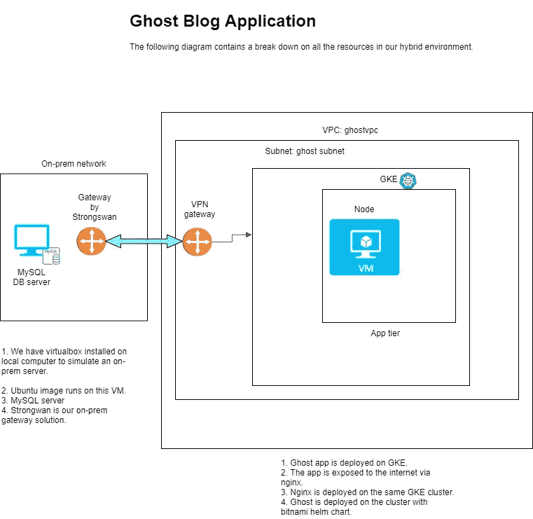
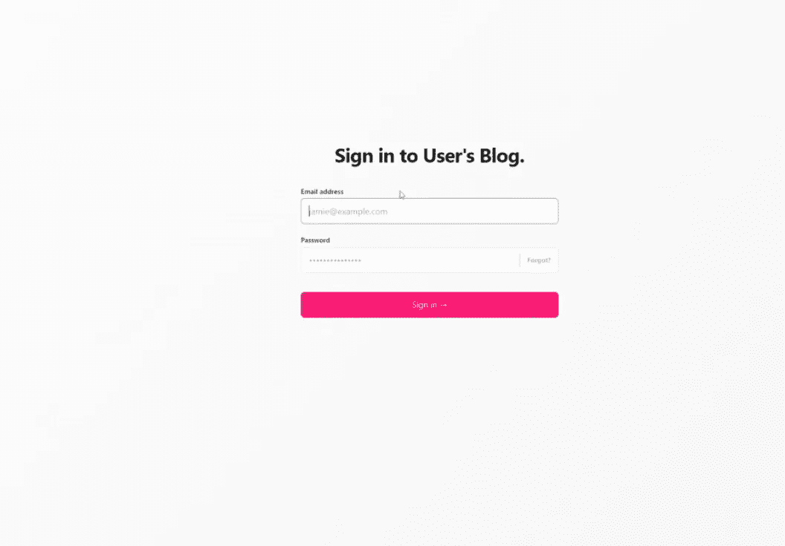

# 关于如何在混合云上自主托管博客的完整指南

> 原文：<https://medium.com/codex/full-guide-on-how-to-self-host-your-blog-on-a-hybrid-cloud-b4dbd14fd855?source=collection_archive---------18----------------------->

## 使用本地计算机上的 GKE 和虚拟机在混合云环境中部署 Ghost CMS 博客应用程序。


在开始本教程之前，了解什么是混合云非常重要。谷歌对混合云的官方定义是:

> 其中应用程序在不同环境的组合中运行。
> 
> -谷歌云

这意味着混合云可以是 OnPrem 数据中心和云环境的组合，也可以是两种不同云环境的混合，比如 AWS 和 Azure。

本质上，应用程序的一部分将在一个环境中，而其余部分将部署在另一个环境中。公司使用这种方法的一些原因包括:

1.  利用各种云提供商的优势，如成本、位置可用性和独特的服务。当你可以获得其他供应商提供的好处时，为什么要把自己局限于一个供应商呢？
2.  更多的数据控制和安全性:一些公司出于安全和法规原因选择存储他们的数据。混合方法将允许这些公司通过卸载公共云上的其他工作负载来获得云的好处。

在下面的教程中，我将演示如何在混合云平台上部署 Ghost 博客应用程序。Ghost blog 应用程序将部署在 Google Cloud 上，而其后端数据库服务器将部署在个人计算机上的虚拟机上，这将模拟 OnPrem 数据中心。

# **先决条件**

*   在你的个人电脑上安装 Virtual Box 并创建一个 Ubuntu 虚拟机
*   配置 Ubuntu VM 的网络设置，允许它发送和接收来自计算机网络外部的流量。

# **建筑**



# **OnPrem 设置**

首先，您需要安装所需的包并配置 MySQL 数据库。打开 Linux 终端并继续。

安装 SQL server 和 strongSwan:

```
sudo apt-get updatesudo apt-get install mysql-serversudo apt install strongswan strongswan-pki
```

登录 MySQL 服务器并完成以下操作:

*   为 Ghost 应用程序创建数据库。
*   为 Ghost 应用程序创建远程用户。用用户名替换 newuser，用用户的密码替换 password。
*   授予远程用户完全权限，读、写等。，到 ghost 数据库。

```
CREATE DATABASE ghost;CREATE USER ‘newuser’@’%’ IDENTIFIED BY ‘password’;ALTER USER ‘newuser’@’%’ IDENTIFIED WITH mysql_native_password BY ‘password;GRANT ALL ON ghost.* TO newuser @’%’ WITH GRANT OPTION;FLUSH PRIVILEGES;
```

为远程访问配置 MySQL 并打开防火墙

现在，配置 MySQL 服务器，使其能够从您的计算机网络外部访问，例如从您的谷歌云 VPC。

编辑 MySQL 服务器配置，如下所示:

sudo VI/etc/MySQL/MySQL . conf . d/mysqld . conf

```
bind-address = 0.0.0.0/0
```

更改后重启 MySQL 服务器

```
sudo systemctl restart mysql
```

然后修改服务器的防火墙

```
sudo ufw allow 3306/tcp
```

记录数据库连接的详细信息。这些值稍后将用于配置 Ghost helm 图表。

示例连接详细信息:

```
hostname: 192.222.1.222 //the private IP of the virtual machineusername: remote-user //the username you created in the database to be used by the apppassword: password //password which was set for the remote database userport: 3306 //mysql port
```

使用远程用户测试登录到 MySQL 服务器

```
mysql -u remote-user -h database_server_ip -p
```

# **云设置**

现在您的 MySQL 服务器和 OnPrem 环境已经准备好了，您可以继续设置云环境了。

在您的公共云帐户中创建 VPC 和子网。然后在刚刚创建的 VPN 子网中创建一个基于策略的 VPN 网关。

以下是如何在 Google Cloud 上配置基于策略的 VPN 网关的指南。

[https://cloud . Google . com/community/tutorials/using-cloud-VPN-with-strong swan](https://cloud.google.com/community/tutorials/using-cloud-vpn-with-strongswan)

在配置好 VPN 网关之后，创建一个单节点 Google Kubernetes 集群来托管 Ghost 应用程序。确保创建这个 Kubernetes 集群和每个将与部署 VPN 网关的同一个 VPC 中的 OnPrem 服务器通信的云资源。

# **VPN 设置**

将使用一个站点到站点 VPN 来连接 OnPrem 环境和云环境。尽管有其他解决方案，比如 Azure ExpressRoute，但为了简单起见，我们将使用 VPN。

在您的 Google 云 VPC 中创建了基于策略的 VPN 网关后，您可以从 OnPrem 服务器(也就是您的个人计算机)配置 strongSwan VPN 来建立连接。

配置 strongSwan

使用正确的值编辑 strongswan 配置文件:

```
sudo vi /etc/ipsec.conf
```

添加 VPN 配置:

```
conn hybrid-connection left= 192.222.1.222 //your vms private ip address leftid=70.121.39.195 //your vm’s public ip address leftsubnet=192.222.1.0/24 //your vm’s subnet leftauth=psk right=34.102.121.199 //public endpoint of google VPN gateway rightid=34.102.121.199 //public endpoint of google VPN gateway rightsubnet=10.0.0.0/25 //your google cloud subnet rightauth=psk type=tunnel auto=start dpdaction=restart
```

[https://cloud . Google . com/community/tutorials/using-cloud-VPN-with-strong swan](https://cloud.google.com/community/tutorials/using-cloud-vpn-with-strongswan)

# **Ghost 应用部署**

在 Google Kubernetes 集群上部署 Ghost blog 应用程序之前，更新 Kubernetes 节点的 NAT 规则。这将允许来自 OnPrem 网络的流量。

注意:其他云平台，比如 AWS 或 Azure，可能不需要这个额外的 NAT 配置。

SSH 到您的 Kubernetes 节点并运行以下命令:

用集群 pod 地址范围替换 IP 地址。

```
sudo iptables -t nat -A POSTROUTING ! -d 10.0.0.0/14 -m comment — comment “kubenet: outbound traffic” -o ens4 -j MASQUERADE
```

用头盔安装 Nginx

这些命令将提供一个 Nginx 负载平衡器并创建 Nginx pods。

```
helm repo add ingress-nginx [https://kubernetes.github.io/ingress-nginx](https://kubernetes.github.io/ingress-nginx)helm install ingress-nginx ingress-nginx/ingress-nginx
```

安装幽灵舵图表

现在，您可以在 GKE 部署 Ghost 了。配置幽灵舵图表并继续。下面是 values.yaml 文件的配置示例。我们可以看到它包括 OnPrem SQL 服务器的连接信息:

```
## [@section](http://twitter.com/section) Ghost Configuration parameters
## Ghost settings based on environment variables
## ref: [https://github.com/bitnami/bitnami-docker-ghost#configuration](https://github.com/bitnami/bitnami-docker-ghost#configuration)## [@param](http://twitter.com/param) ghostUsername Ghost user name
##
ghostUsername: user
## [@param](http://twitter.com/param) ghostPassword Ghost user password
## Defaults to a random 10-character alphanumeric string if not set
##
ghostPassword: ""
## [@param](http://twitter.com/param) existingSecret Name of existing secret containing Ghost credentials
## NOTE: Must contain key `ghost-password`
## NOTE: When it's set, the `ghostPassword` parameter is ignored
##
existingSecret: ""
## [@param](http://twitter.com/param) ghostEmail Ghost user email
##
ghostEmail: [user@example.com](mailto:user@example.com)
## [@param](http://twitter.com/param) ghostBlogTitle Ghost Blog title
##
ghostBlogTitle: User's Blog
## [@param](http://twitter.com/param) ghostHost Ghost host to create application URLs
##
ghostHost: ""
## [@param](http://twitter.com/param) ghostPath URL sub path where to server the Ghost application
##

## External Database Configuration                           
externalDatabase:           
  host: 192.222.1.222                                                                                      
  port: 3306                               
  user: newuser                               
  password: "password"                               
  database: ghost
```

接下来，在 Kubernetes 节点上克隆您的 ghost helm 图表，并运行 helm install 命令。

```
cd /home/ghost-helm-chartgit clone -b master [https://github.com/youraccount/ghost-helm-chart.git](https://github.com/gesselsam96/ghost-helm-chart.git)helm upgrade --install ghost /home/ghost-helm-chart --set ghostPassword=adminpassword,ghostHost=[https://yourdomain.com/](https://ghdevopstechblog.hopto.org/)
```

在 helm 部署之后，您的博客应该可以在域 URL 上访问。

管理 URL 将是:

```
[https://yourdomain.com/](https://ghdevopstechblog.hopto.org/)ghost
```

使用 ghostEmail 和 ghostPassword 值登录管理门户。



# **结论**

恭喜你！您已经成功地在混合云平台上部署了 Ghost。

快乐博客😊

完整的视频教程可以在[这里](https://www.udemy.com/course/deploy-application-on-a-hybrid-cloud-using-google-kubernetes/?couponCode=87CFD711EFAD3591BE69)找到。

延伸阅读:

1.  [帮助我获得 12 万技术工资的两个诀窍](/@gilbertsam96/how-to-master-or-make-a-career-switch-to-the-cloud-entry-level-to-120k-in-under-2-years-434a32fa43c7)
2.  [推动我科技生涯的两次尴尬经历](/@gilbertsam96/embrace-tech-imposter-syndrome-this-is-a-sign-of-growth-70bddc0442e9)