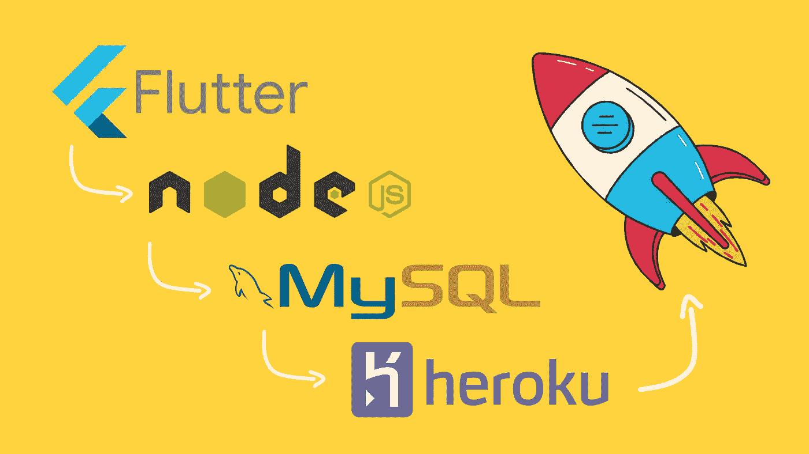

# 全栈应用开发/w Flutter、NodeJs、MySQL 和 Heroku

> 原文：<https://medium.com/codex/full-stack-app-development-w-flutter-nodejs-mysql-and-heroku-caeba4671107?source=collection_archive---------4----------------------->



你好！这是我第一篇关于媒介的文章。本文的目标是总结全栈应用的所有阶段。另一个目标是帮助 Flutter 开发者向后端开发迈进一步。首先，我们将创建一个应用程序与 Flutter 在一起。然后，我们将使用 NodeJS 创建一个服务器应用程序，并连接到一个远程 MySQL 数据库。最后，我们将在 Heroku 上部署我们的服务器应用。开始吧！

## 1.创建 Flutter 应用程序

*1.1。main.dart*

```
void main() {
  runApp(const FullStackExampleApp());
}class FullStackExampleApp extends StatelessWidget {
  const FullStackExampleApp({Key? key}) : super(key: key); @override
  Widget build(BuildContext context) {
    return MaterialApp(
      title: 'Flutter Full Stack Example',
      debugShowCheckedModeBanner: false,
      theme: ThemeData(
        primarySwatch: Colors.amber,
      ),
      home: const HomePage(),
    );
  }
}
```

*1.2.1。home_page.dart(主要代码)*

```
class HomePage extends StatefulWidget {
  const HomePage({
    Key? key,
  }) : super(key: key); @override
  State<HomePage> createState() => _HomePageState();
}class _HomePageState extends State<HomePage> {
  final _network = Network(); late TextEditingController _nameController;
  late TextEditingController _surNameController; String buttonText = 'Save';
  int? id; @override
  void initState() {
    _nameController = TextEditingController();
    _surNameController = TextEditingController();
    super.initState();
  } @override
  void dispose() {
   _nameController.dispose();
   _surNameController.dispose();
   super.dispose();
} @override
  Widget build(BuildContext context) {
    return GestureDetector(
      onTap: () {
        unFocus(context);
      },
      child: Scaffold(
        resizeToAvoidBottomInset: false,
        appBar: appBar,
        body: body,
        floatingActionButton: fabAction(context),
      ),
    );
  }
}
```

*1.2.2。将其他代码添加到 _HomePageState 类*

```
 void unFocus(BuildContext context) {
    FocusScopeNode scope = FocusScope.of(context);
    if (scope.hasFocus) scope.unfocus();
  } FloatingActionButton fabAction(BuildContext context) {
    return FloatingActionButton.extended(
      onPressed: () {
        seeAll(context);
      },
      label: Row(
        children: const [
          Icon(Icons.person),
          Text('See All'),
        ],
      ),
    );
  } AppBar get appBar {
    return AppBar(
      title: const Text('Full Stack Example'),
      centerTitle: true,
    );
  } Center get body {
    return Center(
      child: Padding(
        padding: const EdgeInsets.symmetric(horizontal: 18.0),
        child: Column(
          mainAxisAlignment: MainAxisAlignment.center,
          children: [
            TextFormField(
              controller: _nameController,
              maxLength: 45,
              decoration: const InputDecoration(
                labelText: 'Name',
              ),
            ),
            TextFormField(
              controller: _surNameController,
              maxLength: 45,
              decoration: const InputDecoration(
                labelText: 'Surname',
              ),
            ),
            ElevatedButton(
              onPressed: saveButtonAction,
              child: Text(buttonText),
            ),
            const SizedBox(
              height: 50,
            ),
          ],
        ),
      ),
    );
  } void seeAll(BuildContext context) async {
    await showModalBottomSheet(
      elevation: 10,
      backgroundColor: Colors.amber,
      context: context,
      builder: (c) {
        return FutureBuilder<List<Person>?>(
          future: _network.read,
          builder: (c, s) {
            return Container(
              width: MediaQuery.of(context).size.width,
              height: MediaQuery.of(context).size.width * 0.8,
              color: Colors.amber,
              child: allPersons(s),
            );
          },
        );
      },
    );
  } Widget allPersons(AsyncSnapshot<List<Person>?> s) {
    if (!s.hasData) {
      return const Center(
        child: SizedBox(
          width: 50,
          height: 50,
          child: CircularProgressIndicator(),
        ),
      );
    } else {
      return ListView.builder(
        physics: const BouncingScrollPhysics(),
        itemCount: s.data!.length,
        itemBuilder: (c, i) {
          return PersonCard(
            person: s.data![i],
            delete: () {
              setState(() {});
            },
            update: () {
              setState(
                () {
                  buttonText = 'Update';
                  Person p = s.data![i];
                  id = p.id;
                  _nameController.text = p.name;
                  _surNameController.text = p.surName;
                },
              );
            },
          );
        },
      );
    }
  } Future<void> saveButtonAction() async {
    switch (buttonText) {
      case 'Update':
        await updateAction();
        break;
      default:
        await saveAction();
    }
    _nameController.clear();
    _surNameController.clear();
    setState(() {
      buttonText = 'Save';
    });
  } bool get condition {
    bool c1 = _nameController.text.isNotEmpty;
    bool c2 = _surNameController.text.isNotEmpty;
    bool condition = c1 && c2;
    return condition;
  } Future<void> updateAction() async {
    if (condition) {
      var p = Person(
        name: _nameController.text,
        surName: _surNameController.text,
        id: id,
      );
      await _network.update(p);
      await dialog('${p.name} ${p.surName} updated.');
    } else {
      await dialog('Fields cannot be empty.');
    }
  } Future<void> saveAction() async {
    if (condition) {
      var p = Person(
        name: _nameController.text,
        surName: _surNameController.text,
        id: null,
      );
      bool c = await _network.check(p);
      if (c) {
        await _network.write(p);
        await dialog(
          '${p.name} ${p.surName} saved',
        );
      } else {
        await dialog(
          '${p.name} ${p.surName} already exist',
        );
      }
    } else {
      await dialog('Fields cannot be empty.');
    }
  } Future<void> dialog(
    String message,
  ) async {
    return await showDialog(
      context: context,
      builder: (c) {
        return Dialog(
          child: Padding(
            padding: const EdgeInsets.all(18.0),
            child: Text(message),
          ),
        );
      },
    );
  }
```

*1.3。person_card.dart(个人卡片小工具)*

```
import 'package:flutter/cupertino.dart';
import 'package:flutter/material.dart';import 'model.dart';
import 'network.dart';class PersonCard extends StatelessWidget {
  const PersonCard({
    Key? key,
    required this.person,
    required this.delete,
    required this.update,
  }) : super(key: key); final VoidCallback delete;
  final VoidCallback update;
  final Person person; @override
  Widget build(BuildContext context) {
    return Card(
      margin: const EdgeInsets.all(8),
      color: Colors.white70,
      child: Padding(
        padding: const EdgeInsets.all(8.0),
        child: Row(
          children: [
            Expanded(
              child: Column(
                crossAxisAlignment: CrossAxisAlignment.stretch,
                children: [
                  Text('ID: ${person.id}'),
                  Text('Name: ${person.name}'),
                  Text('Surname: ${person.surName}'),
                ],
              ),
            ),
            Column(
              children: [
                IconButton(
                  constraints: const BoxConstraints(),
                  padding: EdgeInsets.zero,
                  onPressed: () {
                    update();
                    Navigator.pop(context);
                  },
                  icon: const Icon(
                    CupertinoIcons.arrow_clockwise_circle,
                  ),
                ),
                const SizedBox(
                  height: 8,
                ),
                IconButton(
                  constraints: const BoxConstraints(),
                  padding: EdgeInsets.zero,
                  onPressed: () async {
                    await Network()
                               .delete(person)
                               .whenComplete(delete);
                  },
                  icon: const Icon(
                    CupertinoIcons.delete,
                  ),
                ),
              ],
            ),
          ],
        ),
      ),
    );
  }
}
```

*1.4。model.dart(对象模型)*

```
class Person {
  final String name;
  final String surName;
  final int? id;Person({
    required this.name,
    required this.surName,
    required this.id,
  });factory Person.fromJson(Map<String, dynamic> json) {
    return Person(
      id: json["id"],
      name: json["name"],
      surName: json["surName"],
    );
  }Map<String, dynamic> get toJson => {
        "id": id.toString(),
        "name": name,
        "surName": surName,
      };
}
```

*1.5。network.dart(需要从服务器获取数据)*

```
import 'dart:convert';import 'package:http/http.dart' as http;import 'model.dart';class Network {
  final _baseUrl = 'https://this-will-be-your-app-name.herokuapp.com/';Future<List<Person>?> get read async {
    final url = '${_baseUrl}cr/read';
    final uri = Uri.parse(url);
    final response = await http.get(uri);if (response.statusCode == 200) {
      return _personsFromJson(response.body);
    }
    return null;
  }Future<void> write(
    Person person,
  ) async {
    final url = '${_baseUrl}cr/write';
    final uri = Uri.parse(url);
    await http.post(
      uri,
      body: person.toJson,
    );
  }Future<bool> check(Person person) async {
    final url = '${_baseUrl}cr/check';
    final uri = Uri.parse(url);
    final response = await http.post(
      uri,
      body: person.toJson,
    );
    switch (response.statusCode) {
      case 200:
        return true;
      default:
        return false;
    }
  }Future<void> update(
    Person person,
  ) async {
    final url = '${_baseUrl}ud/update';
    final uri = Uri.parse(url);
    await http.post(
      uri,
      body: person.toJson,
    );
  }Future<void> delete(
    Person person,
  ) async {
    final url = '${_baseUrl}ud/delete';
    final uri = Uri.parse(url);
    await http.post(
      uri,
      body: {
        "id": person.id.toString(),
      },
    );
  }List<Person> _personsFromJson(String str) {
    return List<Person>.from(
      json.decode(str).map(
            (x) => Person.fromJson(x),
          ),
    );
  }
}
```

## 2.创建 NodeJS 应用程序

*2.1。app.js(或 server.js)*

```
const express = require('express');
const app = express();
const PORT = process.env.PORT || 3000; 
// If you change process.env.PORT won't work on Heroku.const writeRead = require('./routes/writeRead');
const updateDelete = require('./routes/updateDelete');app.use('/cr', writeRead);
app.use('/ud', updateDelete);app.use('/', function (req, res, next) {
    res.sendStatus(404);
});app.listen(PORT, () =>
    console.log('Server running on port: ' + PORT
    ));
```

*2.2。创建一个名为“routes”的目录，然后在其中创建两个名为“writeRead.js”和“updateDelete.js”的文件*

*2.2.1。writeRead.js*

```
'use strict';const express = require('express');
const crRoute = express.Router();
const connection = require('../db');crRoute.post('/write', function (req, res, next) {
    connection.execute(`INSERT INTO persons 
    (name, surName) 
    VALUES (?, ?);`,
        [req.body.name, req.body.surName])
        .then(() => {
            console.log('ok');
        }).catch((err) => {
            console.log(err);
        });
    res.end();
});crRoute.get('/read', function (req, res, next) {
    connection.execute('SELECT * FROM persons;')
        .then((result) => {
            var rawData = result[0];
            res.send(JSON.stringify(rawData));
        }).catch((err) => {
            console.log(err);
            res.end();
        });
});crRoute.post('/check', function (req, res, next) {
    connection.execute('SELECT * FROM persons WHERE name=? AND surName=?;',
    [req.body.name, req.body.surName])
        .then((result) => {
            var data = result[0];
            if (data.length === 0) {
                res.sendStatus(200);
            } else {
                res.sendStatus(400);
            }
        }).catch((err) => {
            console.log(err);
            res.sendStatus(404);
        });
});crRoute.use('/', function (req, res, next) {
    res.sendStatus(404);
})module.exports = crRoute;
```

*2.2.2。updateDelete.js*

```
'use strict';const express = require('express');
const udRoute = express.Router();
const connection = require('../db');udRoute.post('/update', function (req, res, next) {
    connection.execute("UPDATE persons SET name=?, surName=? WHERE id=?;",
        [req.body.name, req.body.surName, req.body.id])
        .then(() => {
            console.log('ok');
        }).catch((err) => {
            console.log(err);
        });
    res.end();
});udRoute.post('/delete', function (req, res, next) {
    connection.execute("DELETE FROM persons WHERE id=?;",
        [req.body.id])
        .then(() => {
            console.log('ok');
        }).catch((err) => {
            console.log(err);
        });
    res.end();
});udRoute.use('/', function (req, res, next) {
    res.sendStatus(404);
})module.exports = udRoute;
```

*2.3。在项目根目录下创建一个名为“db.js”的文件。*

```
const mysql = require('mysql2');
const dbConfig = require('./db.config');const connection = mysql.createPool({
    host: dbConfig.HOST,
    user: dbConfig.USER,
    database: dbConfig.DATABASE,
    password: dbConfig.PASSWORD,
    port: dbConfig.PORT,
});module.exports = connection.promise();
```

*2.4。在项目根目录下创建一个名为“db.config.js”的文件。*

```
// We will create a database on remotemysql.com shortly.module.exports = {
    HOST: 'remotemysql.com',
    USER: 'YOUR USER',
    DATABASE: 'YOUR DATABASE',
    PASSWORD: 'YOUR PASSWORD',
    PORT: '3306'
  };
```

*2.5。让我们安装软件包*

在项目根目录中打开终端，然后键入:

```
$ npm init -y
$ npm i express nodemon mysql2
```

**2.6。编辑自动生成的 package.json 文件中的“脚本”字段。**

```
"scripts": {
    "start": "nodemon app.js", <-- CHANGE THIS
    "test": "echo \"Error: no test specified\" && exit 1"
  },/* If you gave to main file another name instead of app.js, type its name. (eg "nodemon server.js") */
```

并检查它是否工作

```
$ npm start
```

## 3.创建 MySQL 数据库

我不做详细解释，因为它使用起来非常简单。

*   去 remotemysql.com
*   创建一个帐户
*   转到数据库选项卡并创建一个数据库
*   将主机、用户、数据库、密码和端口信息保存到 nodejs 应用程序的 db.config.js 文件中。
*   到 remotemysql 的 phpMyAdmin 模块，用刚才给你的用户名和密码登录。
*   创建一个名为“persons”的表，字段名称为“id”、“name”和“surName”。指向 id 字段的 A_I 选项和索引。
*   id 类型:int(255) |姓名类型:varchar(45) |姓氏类型:varchar(45)

## 4.1.让我们通过 Heroku 部署我们的服务器应用程序

*4.1.1。下载并安装 Heroku*

转到 [*Heroku 开发中心*](https://devcenter.heroku.com/articles/heroku-cli#download-and-install) ，然后按照说明安装 Heroku CLI。

*4.1.2。键入以下命令，并通过提供给您的链接登录。登录后可以关闭浏览器。*

```
$ heroku login
```

*4.1.3。返回 NodeJS 应用并激活 GIT*

*   创建一个名为“”的文件。gitignore”并在其中写下以下内容:

```
/node_modules
npm-debug.log
.DS_Store
/*.env
```

*   在项目根目录中打开终端，然后键入:

```
$ git init
$ git add .
$ git commit -m "initial commit"
```

*4.1.4。创建 Heroku app*

*   键入以下命令创建 Heroku 应用:
    (您应该用自己的应用名称替换【您的应用名称】。例如:heroku 创建我的服务器应用程序)

```
$ heroku create [your-app-name]
```

*   转到 network.dart，将基本 url 更改为您的应用程序名称。例如:https://my-server-app.herokuapp.com/
*   将 NodeJS 应用推送到 Heroku

```
$ git push heroku master
```

*   激活 Heroku 上的节点

```
$ heroku buildpacks:set heroku/nodejs
```

*   黄金镜头:)

```
$ heroku run npm start
```

*   如果出现错误类型:

```
$ heroku run npm install
$ heroku restart
$ heroku run npm start
```

*   要使服务器空闲，请执行以下操作:

```
//check server
$ heroku ps//stop
$ heroku ps:stop web.1
```

对于其他 Heroku 命令，请转到 [*Heroku CLI 命令*](https://devcenter.heroku.com/articles/heroku-cli-commands) 或键入:

```
$ heroku -h
```