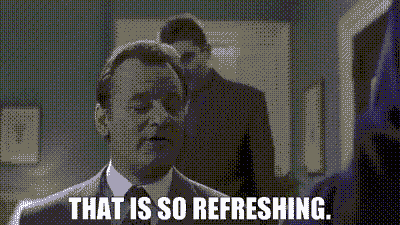
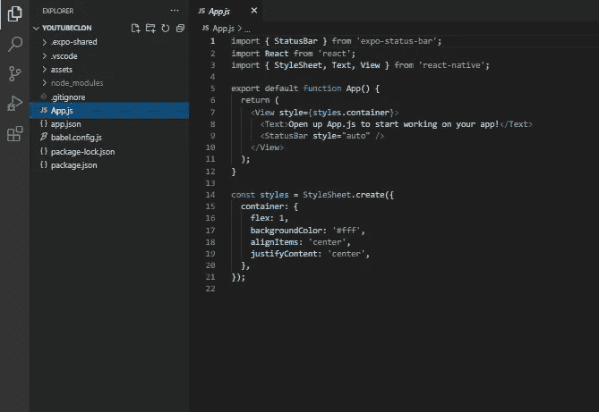
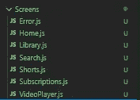
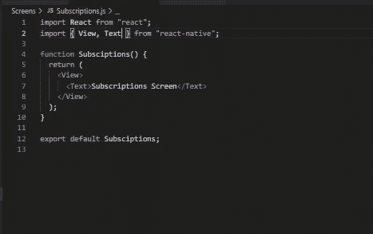
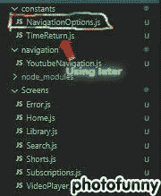

# 使用 React Native 的全栈 Youtube 克隆—第 1 部分

> 原文：<https://medium.com/codex/full-stack-youtube-clone-using-react-native-part-1-12fd7ed771e2?source=collection_archive---------7----------------------->

## *第 1 部分:在本教程中，我们将致力于导航工作，这里我们真正的项目将开始*


# 注意:

以下是该项目的不同部分:

*   [第 0 部分](/nerd-for-tech/full-stack-youtube-clone-using-react-native-part-0-315d606ca107) —文章简介
*   [第 1 部分](/codex/full-stack-youtube-clone-using-react-native-part-1-12fd7ed771e2) —为项目做导航工作并创建标题和标签(下)
*   [第 2 部分](/codex/full-stack-youtube-clone-using-react-native-part-2-22ac1b0330d2) —处理搜索屏幕(标题和内容)
*   [第 3 部分](https://decodebuzzing.medium.com/full-stack-youtube-clone-using-react-native-part-3-c99f44b127f9) —在播放视频的屏幕上工作，同时显示评论
*   第 4 部分—创建主屏幕，添加 redux **(进行中)**
*   第 5 部分—做一些样式上的改变，检查错误，解释如何在没有 expo 的情况下构建应用程序，以及如何扩展这个项目**(进行中)**

大家好，现在让我们开始这个项目，让我们做一些真正的工作💪💪。如果你想了解这个项目及其特点，请查看[第 0 部分文章](https://decodebuzzing.medium.com/full-stack-youtube-clone-using-react-native-part-0-315d606ca107)。同样，我不打算深入基础知识，所以，本教程假设你有一些关于 react-native 的基础知识。好了，让我们开始吧。

# 入门指南

当然，我们将需要节点 js，它可以安装在[这里](https://nodejs.org/en/download/)。我个人更喜欢使用 Visual Studio 代码，但是你也可以使用你选择的任何 IDE。好了，现在让我们安装我们将要使用的所有模块。

# React 导航+模块安装

首先，让我们快速从 Expo 应用程序开始。我将使用“Expo CLI ”,但使用任何你想使用的东西完全是你的选择。一般来说，当你对 Expo 有了一定的经验后，你就会转而使用“React Native CLI”。

所以让我们先开始安装 expo-cli

```
npm install -g expo-cli
```

并运行以下命令来创建一个名为“YoutubeClone”的新 React 本地项目，并运行您的开发服务器

```
expo init YoutubeClone # I chose blank template
cd YoutubeClone
npm start # you can also use: expo start
```

顺便说一句，我基本上是从文档中复制了这个世博安装过程，所以如果有任何疑问，请参考文档。

现在，让我们安装一些模块。

*   ***反应导航***

顾名思义，react-navigation 用于原生应用中的路由和导航。它提供了各种功能，如*、【createDrawerNavigator】(用于创建侧抽屉)、*、*、【createStackNavigator】(屏幕堆叠在一个堆栈中，并遵循稍后将解释的层次概念)，以及“标签导航器”(标签)，这使我们的生活变得更加轻松。如有疑问，可在此查阅导航文档[。所以，现在让我们安装它。](https://reactnavigation.org/docs/4.x/getting-started)*

***安装***

```
npm install react-navigation
```

> React Navigation 由一些核心工具组成，导航器使用这些工具在应用程序中创建导航结构。现在不要太担心这个，很快就会清楚的！为了预先加载安装工作，让我们也安装和配置大多数导航器使用的依赖项，然后我们可以开始编写一些代码。
> 
> 我们现在要安装的库是`[react-native-gesture-handler](https://github.com/software-mansion/react-native-gesture-handler)`、`[react-native-reanimated](https://github.com/software-mansion/react-native-reanimated)`、`[react-native-screens](https://github.com/software-mansion/react-native-screens)`和`[react-native-safe-area-context](https://github.com/th3rdwave/react-native-safe-area-context)`。

上面的部分很清楚，所以让我们安装这些核心工具。

```
expo install react-native-gesture-handler react-native-reanimated react-native-screens react-native-safe-area-context [@react](http://twitter.com/react)-native-community/masked-view
```

所有这些东西都来自于医生，我不会解释太多，因为我假设你知道所有这些东西。这只是为了复习一下。



—

*   **堆栈导航器**

堆栈导航是任何应用程序(web 或移动)中最基本和最常见的导航形式。其工作原理是，它的屏幕是在一个堆栈上管理的。当你打开一个屏幕时，这个屏幕将被推到栈顶。当你打开或离开屏幕时，它弹出或推动屏幕，只有顶部的屏幕是可见的。所以，这很简单，让我们现在安装它

```
npm install --save react-navigation-stack
```

*   **TabNavigator**

顾名思义，它是“标签”导航器，用于在标签的帮助下导航到不同的屏幕。我们可以在顶部或底部放置标签，但在这个项目中，我们将只使用底部。现在让我们安装它。

```
npm install — save react-navigation-tabs
```

*   **应用**

当我们打开 youtube 或任何其他应用程序时，我们会看到一个打开屏幕或闪屏。因此，当应用程序开始加载所有必要的字体、徽标、图像或任何其他资产时，Apploading 帮助我们显示闪屏。现在轮到安装了。

```
expo install expo-app-loading
```

*   ***反应-导航-标题-按钮***

顾名思义，它用于在我们的导航栏中呈现按钮。如果你只是渲染一个元素而不使用这个包，你会发现很多样式和对齐问题，即使我们纠正了这些问题，它也可能不适用于其他尺寸的设备。因此，我们将使用这个包来添加按钮到我们的导航标题。

> 这个包将帮助你渲染导航栏中的按钮，并处理样式，这样你就不必。它试图模仿原生导航条按钮的外观，并试图为你提供简单灵活的交互界面。

上面的陈述是不言自明的，所以，让我们现在安装它

```
npm install --save react-navigation-header-buttons@6
```

嗯，我想这就是我们现在导航所需要的！那么，为什么不现在就开始使用这些模块呢？安装完所有这些之后，你的`*App.js*` *可能看起来有点像这样。*



首先，在进入导航之前，让我们使用`*AppLoading.*`将一些字体导入我们的应用程序

# 添加字体

所以，像这样修改 App.js

代码非常简单明了。如果你不知道 AppLoading 是什么，请参见 [**React 导航及其不同导航器安装**](#f419) 部分。你可以从[这里](https://ufile.io/f/ggats)安装以上字体。顺便说一下，你在`*FontloadAsync*` *中传递的键将被用作字体名称。还是那句话，* [*见此处*](https://docs.expo.dev/versions/latest/sdk/font/) *澄清。*

现在，让我们开始添加导航到我们的项目，但在此之前，我们需要一些屏幕，我们可以导航。不是吗？所以，现在让我们 ***添加一些虚拟屏幕。***

# 添加一些虚拟屏幕

因此，在项目的根(主)目录中，创建一个名为“screens”的文件夹，并在其中创建以下文件。

1.  Error.js
2.  Home.js
3.  图书馆. js
4.  搜索. js
5.  Shorts.js
6.  Subscriptions.js
7.  MediaPlayer.js



这些都是项目的画面。现在，让我们在每个屏幕上添加一个文本，它们的名称如下。



同样，将此添加到所有这些屏幕中。现在，有了这个设置，让我们开始实际的导航工作。因此，让我们创建一个堆栈导航器和底部标签导航器，然后我们将做的样式。

# 添加堆栈和选项卡导航器

首先，让我们在你的根目录下创建一个新文件夹，命名为**‘导航’**，并在里面创建一个名为`*YoutubeNavigation.js*`的文件。当然，文件名完全由你决定。因此，首先，让我们只创建一个堆栈导航器，然后我们将把选项卡导航器合并到堆栈导航器中

## 仅使用堆栈导航器

所以，添加下面的代码`*YoutubeNavigation.js*`文件。代码的解释只在注释中，详细的解释在代码下面。

根据我们的要求，可以有多个堆栈，我们只需要这 4 个屏幕。我们只需要堆栈中那些连接在一起的屏幕，我们在它们之间移动，我们不使用其余的屏幕，即“图书馆”、“订阅”、“短片”等，因为它们将在选项卡导航器中使用。

现在来看看结果，编辑`*App.js*`如下。

现在，如果您运行应用程序，您还可以看到堆栈导航器提供的标题。但是如果你注意到标题上只有“家”这个名字。所以，首先，让我们也添加 TabNavigators，然后将设计标题。

## 添加 TabNavigator 并将其与堆栈导航器相结合

这将是我们的整个`*YoutubeNavigation.js*` 文件与这两个导航器相结合。

解释只在评论中，所以请仔细阅读评论。**现在，我们已经准备好并组合了堆栈导航器和选项卡导航器。**如果您现在运行，您将能够看到底部标签的图标。现在，让我们从屏幕上删除仅名为**的标题，取而代之的是一个类似于 *YouTube* 的标题。**

# 向页眉添加样式

所以就像 TabNavigator 的' *navigationOptions'* 一样，我们也可以为 StackNavigator 添加 navigationOptions。我将在特定屏幕中添加这些“*导航选项*”，但您可以尝试“默认导航选项”和所有选项。我们可以在这种格式的屏幕中添加 navigationOption。假设这是我们的一个屏幕

```
const A_Screen = (props) => {
.......
........
.........
return (
....
)
}
A_Screen.navigationOptions = ()=>{
{Our navigationOptions}
}
```

现在我们为什么要做`*A_Screen.navigationOptions = bla bla.*` `*A_Screen*` **是我们在不同屏幕中使用的一个组件，但是在这里，如果我们正在获得道具并做一个箭头函数，它仅仅意味着它是一个函数，这个函数返回一些我们使用的 JSX。**你还记得你第一次学习 js 的时候，你会记得 js 函数是一个**‘功能对象’**。我发现一个 youtube 视频很好地解释了这个问题。所以，我们可以给一个对象添加属性，对吗？所以，我们给它添加了一个`***navigationOptions***` 属性。在这里，我们可以添加属性

我不想让我的文件太大，因为我添加了很多选项。因此，我创建了一个新文件，将选项作为对象添加到那里，然后将其导入到这里。但是，您可以在这里添加这些属性。因此，如果你想通过这种方法，创建一个“constants”文件夹，并在其中添加一个名为“NavigationOptions.js”的文件。像这样:



把这个加进去。

如上所述，我们使用了一个名为`***react-navigation-header-buttons***`的包来为我们的标题添加按钮。因此，我们导入了一个名为`*HeaderButton****s***` 的包，它是所有可见标题按钮的包装器(header butto***n***)。它接收一个名为“`***HeaderButtonComponent***`”的属性，该属性呈现`*HeaderButton*` 组件，并告知 IconCompnent、IconSize、IconColor 等。所以，为了重用代码，我们在我们的 components 文件夹中(根目录下)做了一个名为`***HeaderButton.js***` 的组件。所以，创建一个‘组件’文件夹，创建一个名为`***HeaderButton.js***` *的文件，下面的代码交给它。*

以上两个代码片段可能对你来说很不清楚。但是所有这些都在[“反应-导航-标题-按钮”文档](https://www.npmjs.com/package/react-navigation-header-buttons)中有很好的解释。所以，请参考文档并仔细阅读那里的解释。

现在我们只需要稍微编辑一下我们的主屏幕就可以看到标题了。所以，让我们稍微编辑一下我们的`*Home.js*`。

最后，我们完成了！！！！。如果你现在运行你的应用程序，你应该会看到一个很好的标题，就像 YouTube 一样，并且在底部有一个标签。因此，我认为我们已经为下一部分做好了准备，这一部分很快就会出现，我们现在将在下一部分中使用搜索屏幕和 API。

在那之前保持安全，保持健康

# 谢谢你