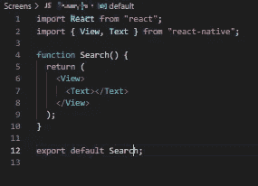
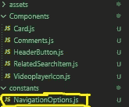
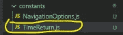

# 使用 React Native 的全栈 Youtube 克隆—第 2 部分

> 原文：<https://medium.com/codex/full-stack-youtube-clone-using-react-native-part-2-22ac1b0330d2?source=collection_archive---------11----------------------->

## *第 2 部分:在这一部分，我们将致力于搜索屏幕(标题+使用 Youtube API)*


## 注意:

以下是该项目的不同部分:

*   [第 0 部分](/nerd-for-tech/full-stack-youtube-clone-using-react-native-part-0-315d606ca107) —文章简介
*   [第 1 部分](/codex/full-stack-youtube-clone-using-react-native-part-1-12fd7ed771e2) —为项目做导航工作，并创建标题和选项卡(底部)
*   [第 2 部分](/codex/full-stack-youtube-clone-using-react-native-part-2-22ac1b0330d2) —处理搜索屏幕(标题和内容)
*   [第 3 部分](https://decodebuzzing.medium.com/full-stack-youtube-clone-using-react-native-part-3-c99f44b127f9) —处理将播放视频并显示评论的屏幕
*   第 4 部分—创建主屏幕，添加 redux **(进行中)**
*   第 5 部分—做一些样式上的改变，检查错误，解释如何在没有 expo 的情况下构建应用程序，以及如何扩展这个项目**(进行中)**

在[上一部分(第 1 部分)](/codex/full-stack-youtube-clone-using-react-native-part-1-12fd7ed771e2)中，我们做了一些导航工作并创建了默认的 youtube 标题(在**主屏幕和其他屏幕上的标题** ) 但是搜索屏幕的标题将完全不同，因为将会有文本输入代替，我们还会显示相关的搜索结果。我们还将使用 Youtube API 来显示搜索结果，并实现无限滚动的概念。

现在你知道我们在这一部分要做什么了，所以，让我们开始安装我们需要的模块。这里我们只需要 2 个模块。如果您不想自己创建标题，第二个模块是可选模块。我将在我的实际代码中使用我自己的组件，但我已经为两者提供了代码。

# 模块安装

*   ***日期-fns***

> **date-fns** 为在**浏览器** & **Node.js** 中操作 **JavaScript 日期**提供了最全面、最简单、最一致的工具集
> 。

我认为上面来自文档的解释告诉了你我们为什么要使用这个模块。我们将在本模块的帮助下将这种日期类型`2017–11–10T18:51:05Z ago`转换成类似于`3 Years 9 months ago`的形式。请参考[日期 fns 文档](https://date-fns.org/)以了解关于此包的更多信息。

*   ***react-native-search-header(可选)***

> 基于材料设计模式的易于使用的 React 原生搜索标题组件。

我使用这个模块的主要动机是获得搜索完成，但我没有获得完全的可访问性，所以我宁愿做我的组件。但是你可以选择是否使用这个模块。但是让我们现在安装它

```
npm i react-native-search-header
```

这整个部分将主要实现我们在[第 1 部分](/codex/full-stack-youtube-clone-using-react-native-part-1-12fd7ed771e2)中所做的。所以，如果你看过它或者知道它的逻辑，这对你来说就是小菜一碟


按男高音

所以，让我们👨‍💻

# 入门指南

首先，我们将创建我们的搜索标题，然后我们将继续使用 Youtube API。

到目前为止，你的`*Search*` 屏幕可能看起来像一个基本页面:



因此，就像在第 1 部分*中解释的那样，我们如何添加设计和样式的标题，让我们在这里做同样的事情*

# 更改标题

在创建标题时，我们还将处理一些状态。因此，首先让我们知道什么是状态挂钩，以及我们将要使用的所有状态(现在只在处理标题*时使用*)最后，我们将从更改标题开始

## React Native 中的状态是什么，以及如何更改和使用它们

在 react 中，本地状态用于存储关于组件的信息，并相应地更新它。当**组件的状态**发生变化时，**组件**和子组件一起被重新渲染以显示变化。如果您熟悉基于类的组件，您可能会这样做:

```
this.state = {
MyState: value
}
```

并通过以下方式改变状态:

```
setState({MyState:value});
```

但是当我们想给我们的功能组件添加状态时，我们使用`***useState***` 。所以，这个内置的钩子可以用来在功能组件中添加和更改状态，而不需要使用基于类的组件。添加状态的一个示例是:

```
const [MyState, SetMyState] = useState(0); // Just destructure array
```

这里我们可以使用`*MyState*`T23 来使用状态，并通过来改变它

```
SetMyState(value)
```

你可能有一些疑问，所以检查一些文章来澄清它们，但现在我们可以知道，我们将要使用的所有状态(与标题相关)。

## 与我们的标题相关的状态

因此，我们将使用 4 个状态，这将方便管理一些数据。

```
**const [Submitted, setSubmitted] = useState(false); // *Wheather user have clicked the search button or not*****const [SearchedText, setSearchedText] = useState(""); // *What user has Searched*****const [Inputstate, setInputstate] = useState(true); // *Wheather Input if foccused or not*****const [RelatedSearchedArray, setRelatedSearchedArray] = useState([]); *// Realated Search List***
```

## SetParams 和 UseParams

你知道我们是如何通过添加导航选项来设计标题的，当我们定义我们的屏幕时是这样的:

```
const A_Screen = (props) => {
.......
........
.........
return (
....
)
}
A_Screen.navigationOptions = ()=>{
{Our navigationOptions}
}
```

但是我们不能在这里访问我们的状态。你猜对了！我们将使用`***SetParams***` 来传递我们的状态或将其更新到当前屏幕。那么，我们如何在导航选项中更新我们的状态呢？我们将简单地使用`***SetParams***` 传递一个函数，它将改变那里的状态。基本格式如下:

```
const ChangeStateFunc = () => {
setState(value)
}navigation.setParams({ //       | **Ofcourse when state chnages**
ChangeStateFun:ChangeStateFun// | **or in**
}) //                           | **in useEffect Fcnction**
```

以及如何在 navigationOptions 中获得状态。我们将使用`***getParam***`
来获取这些值。那么，让我们来完成上面的代码片段。

```
const ChangeStateFunc = () => {
setState(value)
}navigation.setParams({ //       | **Ofcourse when state chnages**
ChangeStateFun:ChangeStateFun// | **or in**
}) //                           | **in useEffect Fcnction**// Assume In the navigationOptions [⬇️⬇️](https://emojipedia.org/down-arrow/)
navData.navigation.getParam("ChangeStateFun") // Got the Function
```

所以，我想我们可以开始写代码了，现在我想你不会有任何疑问了。

## 基本搜索屏幕

因此，这将是我们的**基本**搜索屏幕代码，将用于导航:

在上面的代码片段中，我们只是设置了我们的状态，但是在大多数状态中没有使用状态值。当我们开始从 youtube Api 获取数据时，我们将会用到它们。

在上面的导航选项中，我们返回还没有定义的`NavOptionsdefaultSearchdata`。所以，我们现在也来定义一下。如果你不知道这里在做什么，只需查看[第 1 部分](/codex/full-stack-youtube-clone-using-react-native-part-1-12fd7ed771e2)以获得许可。

因此，在常量文件夹中的“NavigationOptions”文件中，如下所示



让我们添加另一个导出语句(已经有 1 个了，如第 1 部分所述),并按如下方式编辑文件。

所以，现在我们的这个文件也完成了。现在，这里有一个小解释与上面使用的`useEffct`到**上面的代码片段(Search.js)**


作者:tenor.com

## 什么是`useEffect`

我们还在上面的代码片段中使用了`***useEffect***` 。那么什么是 useEffect 呢？。首先，如果**您已经使用了基于类的视图**，`***useEffect***` 是相同的`componentDidMount`，如果您将一个空数组`[]`作为第二个参数传递，并且如果在数组中传递一些值也可以用作`componentDidUdate`，如果您在最后添加一个返回或清理函数(当组件被卸载时运行)也可以用作`componentWillUnmount`。

如果你对这些名字不熟悉，或者是第一次接触 react native，你应该会看到一些视频，但是使用效果，因为使用效果不能用两三行来解释，但是这里有一些基本的用法，以防你知道`useEffect`并且只需要刷新。

UseEffect 是一个 react 钩子，通过它你可以告诉你的组件在第一次渲染之后或者当我们传递给它的状态值发生变化时做一些事情。默认情况下，当应用程序启动时，`useEffect`在第一次渲染后运行。但是如果你不想在第一次渲染的时候做什么，而是在以后做，你可以把它和`useRef`结合起来(我们会知道一点)。这里是 useEffect 的基本用法。

```
useEffect(() => {}, []); // Dependancy array (Second Argument)
```

所以，现在让我们在 youtube API 上工作，并开始带来一些数据。

# 致力于从 Youtube Api 获取和显示数据

嗯，让我们首先处理我们的组件，当我们搜索视频时，它会显示我们的视频。因此，在 components 文件夹中添加一个名为 **'Card.js'** 的文件，并向其中添加以下代码。

我们在☝️☝️☝️☝️.上方导入了另一个名为`TimeReturn`的组件我们为什么需要它？当我们从 youtube API 中获取时间时，我们得到的是`2021–08–28T18:51:05Z`这样的格式，但我们需要的是***“1 天前”“2 年前”，对吗？*** 所以让我们在“constants”文件夹中创建一个名为***【time return . js】***的文件，如下所示:



并向其中添加以下代码:

有关更多信息，请参见'[日期 fns](https://date-fns.org/) '文档。

哎呀！一件重要的事情我忘记了！！显示相关搜索项的组件呢？因此，让我们在组件文件夹中快速添加一个名为***‘relatedsearchitem . js’***的新文件，并向其中添加以下代码。

所以，现在我认为我们可以完成我们的 rest `Search.js`文件，完成我们的项目。下面是完整的`Search.js`文件的代码，注释中解释了所有的概念。上面与 redux 相关的代码我已经去掉了。我们将在第 5 部分中处理 redux，从 redux store(在所有屏幕中)获取 Api 密钥，该密钥将从我们的错误页面发送。

***Search.js***

我已经在注释中解释了所有代码。所以，如果有任何疑问，请再次查看评论或从“谷歌巴巴”那里获得帮助，这样我们就完成了整个`Search.js`文件。如果你现在运行你的应用程序，你应该可以看到你的搜索屏幕，当你输入查看搜索建议并进行搜索以查看 Youtube 视频 commming 以及无限滚动的概念。

所以，这是本教程的内容，在下一部分，我们将创建我们的`videoPlayer`屏幕，播放视频并显示评论。在那之前保持安全，保持健康

# 谢谢你