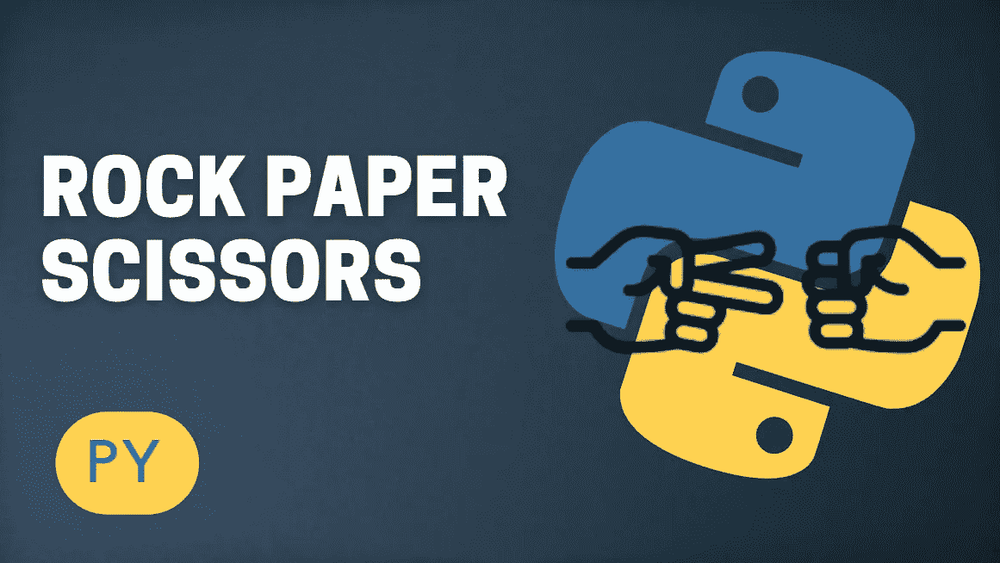

# 有趣的 Python 项目:石头、布、剪刀

> 原文：<https://medium.com/codex/fun-python-project-rock-paper-scissors-319d0436ffd1?source=collection_archive---------1----------------------->

Python 游戏

在本文中，我将向您展示如何使用 python 编程语言创建一个简单而有趣且受欢迎的游戏，名为石头、剪子、布。对于那些从未听说过这个游戏的人，我将解释它是如何工作的，以便你们理解代码背后的逻辑。