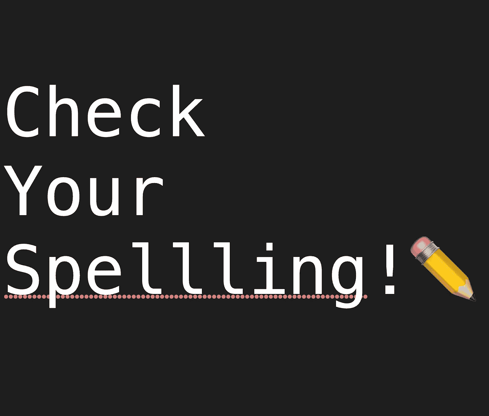

# 自然语言处理的乐趣

> 原文：<https://medium.com/codex/fun-with-natural-language-processing-f88ef0be7b21?source=collection_archive---------13----------------------->

检查你拼写！

我最近发现了苹果的自然语言框架，并决定尝试一下，测试一些想法并分享我的发现。这将是一篇关于框架能做的一些事情的短文，可能会给你自己的应用提供一些灵感

我从`UITextChecker`开始。顾名思义，文本检查器会进行拼写检查。你给它一个字符串来检查，它会吐出第一个拼错的单词。在这里，您可以让文本检查器给出一些关于所需单词的建议。这基本上是苹果版的红色曲线

我立即想到的是搜索领域，并模仿谷歌的“你是指 x 吗？”功能性。我敲了一小段代码，瞧！搜索字段修正建议！

接下来，我认为为语义相似的选项提供建议可能会很好。您可能已经猜到，自然语言框架也是这样做的！

通过添加下面的代码，我们可以得到一串相似的单词。该框架还为每个单词提供了一个距离参数，指示它们与原始单词的接近程度。

# 最后的想法

我已经可以看到如何在应用程序中使用这一点，以最小的复杂性提供一些不错的 UX 功能。自然语言框架还可以做很多其他很酷的事情，所以绝对值得一试！