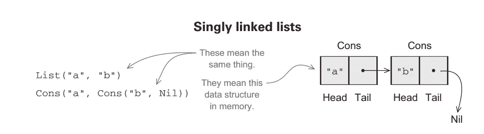
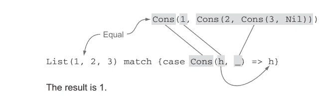

# Scala 中的函数数据结构和模式匹配

> 原文：<https://medium.com/codex/functional-data-structures-and-pattern-matching-in-scala-7a379092e1e4?source=collection_archive---------9----------------------->

函数式编程范式是一种没有任何可变状态的代码编写方式。因此，这提出了一个问题，我们如何定义数据结构以及如何使用它们，这里我们将讨论什么是*功能数据结构*以及我们将如何定义和使用它们，并且还将研究*模式匹配*和*高阶函数*的相关概念。

**定义功能数据结构**

函数式数据结构是对纯函数进行操作的东西，这意味着像 *1 + 2* 将给出 *3* 留下 *1 和 2* 未修改的两个列表 a 和 b 在它们的连接上将给出 *(a++b)* 将给出完全不同的列表，留下 a 和 b 未修改，这不涉及大量的数据复制吗，让我们以链表为例来检查一下。

```
//List type parameterised with type A
**sealed** **trait** **List**[**+A**]
//A list constructor representing an empty list
**case** **object** **Nil** **extends** **List**[**Nothing**]
//A list type representing an non empty list
**case** **class** **Cons**[**+A**](head**:A**,tail**:List**[**A**]) **extends** **List**[**A**]
```

现在让我们看看 Scala 中的链表实现，我们创建了一个 trait，Scala 中的 trait 类似于一个接口的 trait，它可以选择性地包含方法实现。sealed 关键字表示 trait 的实现必须在文件本身中。之后，我们为列表创建了两个构造函数，对象 Nil 表示一个空列表，Cons 表示一个非空列表的构造函数。

注意，我们为列表类型使用了类型为 **A** 的通用参数。这表明我们的列表可以是 Int、Double、String 等类型。



内存列表

> 列表中使用的 **[+A]** 在 Scala 中称为协方差，即假设狗是动物的子类型，那么 List[dog]就是 List[Animal]的子类型。在这里，我们将 Nil 扩展为 List[Nothing],这将适合我们所有的情况，因此 Nothing 是 all 类型的子类型，这将适合我们的需要，因此 Nil 可以是 String、Double、Int 等的空列表

现在，在一个列表上定义的 sum 和 product 之类的操作将如下所示。

```
/*
  * Function to calculate sum of elements in a list*/
  **def** sum(lis**:List**[**Int**])**:Int**=lis **match** {
    **case** **Nil** **=>** **0**
    **case** **Cons**(x,xs)**=>**x+sum(xs)
  } /*
  * Function to calculate product of elements in a list*/
  **def** prod(lis**:** **List**[**Int**])**:Int**=lis **match** {
    **case** **Nil=>1**
    **case** **Cons**(**0**,**_**)**=>0**
    **case** **Cons**(x,xs)**=>**x*prod(xs)
  }
```

为了找到一个链表的元素的和，我们检查了两种情况，我们可以在稍后查看这个匹配操作，这里我们比较列表，如果列表是一个空列表，那么和将是零，否则我们计算列表头和剩余部分的和。

类似地，如果列表为空，则计算乘积。如果到达列表的末尾，则返回乘积 1，如果任何元素为 0，则返回 0，另一种情况是递归计算乘积。

```
**object** **List** {
 **def** main(args**:** **Array**[**String**])**:** **Unit** = {
   **val** x**:List**[**Int**]**=Cons**(**1**,**Cons**(**2**,**Nil**))
   println(sum(x))
   //sum is 3 
   println(prod(x))
   //product is 2
}
```

**Scala 中的模式匹配**

现在让我们仔细看看模式匹配部分看起来有点像 switch case 表达式。我们在这里做的是用关键字 **match** 匹配一个 int 类型的列表。

***lis 匹配***

花括号中提供了不同的匹配情况

```
{**case** ex1**=>** do_something
 **case** ex2**=>** do_something
}
```

现在让我们以列表加法为例，检查模式匹配是如何工作的。我们正在根据某些情况检查我们的列表，如果我们的列表是一个空列表，总和将为零，这将与第一种情况相匹配。下一个条件如下。

```
**case** **Cons**(x,xs)**=>**x+sum(xs)
```

该条件表示非空列表，对于非空列表，递归地计算总和，即总和将是其头部的总和，在这种情况下是递归地添加到 sum 函数的整数，直到达到列表末尾的停止条件。当达到停止条件时，将返回零，所有递归函数将被解析，并且将返回和。

现在让我们看一些模式匹配的例子。

```
**val** k**=Array**(**1**,**2**,**3**)
  **Array**(**1**,**Nil**) **match** {
    **case** **_** **=>** println(**23**)
  }
  //prints 23    
  **Cons**(**1**,**Cons**(**2**,**Nil**)) **match** {
    **case** **Cons**(h,**_**)**=>**println(h)
  }
  //1
  **Cons**(**1**,**Cons**(**2**,**Nil**)) **match** {
    **case** **Cons**(**_**,h)**=>**println(h)
  }
  //Cons(2,Nil)    
}
```

*   第一个 case 将打印 23，因为我们使用了 _ and _ is 来忽略结果，这意味着它不会检查任何东西，它将简单地执行 case。
*   第二种情况将匹配一个非空列表，并将打印列表的头。在这种情况下，它将是 1。
*   第三个条件将打印列表中不包括头部的部分。



列表匹配示例

**函数数据结构中的数据共享**

当数据结构变得不可变时，将会出现一个问题，即如何向其中添加元素或从其中删除元素。如果我们向列表 **xs** 中添加一个新元素，这将导致一个新列表的创建，但实际上我们不需要将所有元素复制到列表中，我们可以重用列表 xs。这个过程被称为**数据共享**。

**高阶函数和传递匿名函数**

在函数式编程中，我们可以把函数当作值来处理，这样这些函数就可以存储在数据结构中，传递给函数等等。

```
**def** findFirst[**T**](as**:** **List**[**T**], f**:** **T** => **Boolean**)**:** **Int** = {
    **@annotation**.tailrec
    **def** loop(n**:** **Int**)**:** **Int** =
      **if** (n >= as.length) -**1**
      **else** **if** (f(as(n))) n
      **else** loop(n + **1**)

    loop(**0**)
  }
```

这是一个用于查找数组中第一个出现的元素的函数，这个函数将另一个函数 **f** 作为参数，用于检查数组元素是否是我们要查找的元素，如果是，这个函数将返回它的位置。否则它将返回-1。

```
**val** arr2 **=** **List**("apple", "orange", "grapes")
findFirst(arr2, (x**:** **String**) **=>** x == "grapes"))
```

这是一个将匿名函数传递给另一个函数的例子，这个函数将接受一个字符串类型的值，并检查字符串是否为“grapes ”(如果为真)。该函数将返回元素的位置。