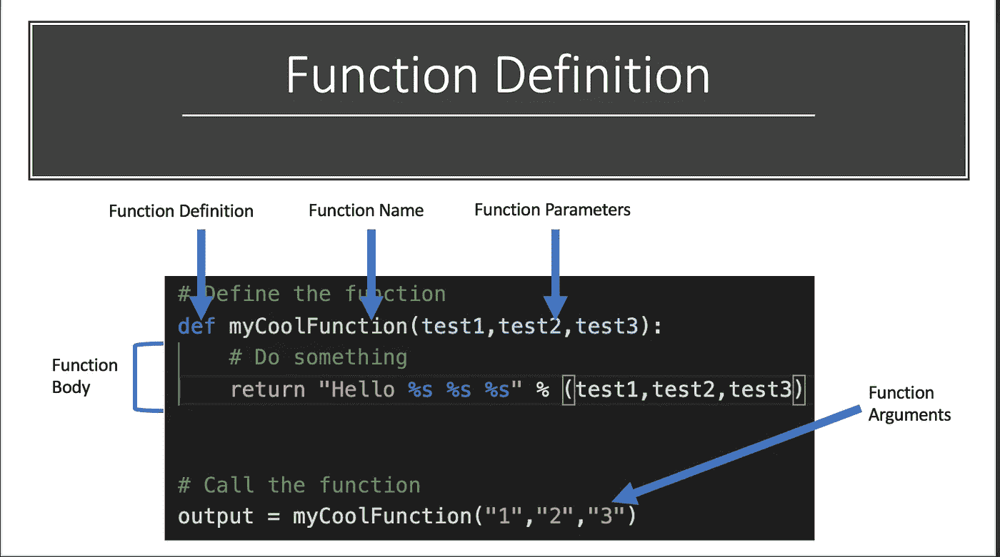

# Python 中的函数

> 原文：<https://medium.com/codex/functions-in-python-71c8c120e853?source=collection_archive---------17----------------------->

函数允许计算机科学家定义一组可以在整个程序中重复使用的指令。

我们通过一个实际生活中一个功能的使用例子来说一下:刷牙。为了刷牙，我们必须遵循一些特定的步骤来成功地刷牙。
1。拿出我们的牙刷
2。弄湿牙刷
3。拿出我们的牙膏
4。把牙膏放在牙刷上
5。放…