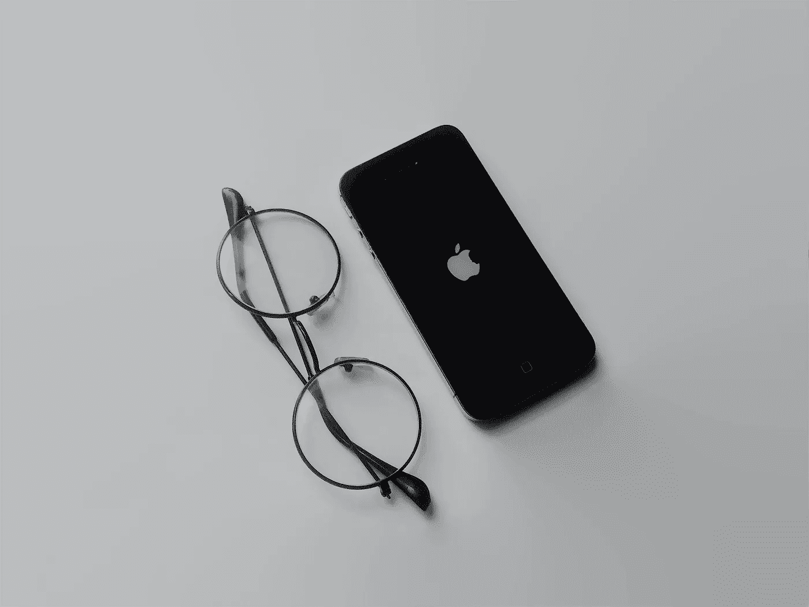

# 苹果公司的基本理念。

> 原文：<https://medium.com/codex/fundamental-concept-of-apple-inc-127fc4bbeacb?source=collection_archive---------10----------------------->

## iPhone 背后的高端品牌

由 [Unsplash](https://unsplash.com/photos/6n9dzMQr8X0) 上的 [Konsepta 工作室](https://unsplash.com/@konseptastudio)拍摄的照片

乔布斯向世界介绍 iPhone 之后，人们要么爱它，要么恨它，没有人处于中间。消费者喜欢 iPhone 的创新和质量，而讨厌 iPhone 的人则认为 iPhone 价格过高。憎恨者指出，安卓手机比苹果手机规格更高，价格更低。相比之下，苹果用户不会被…