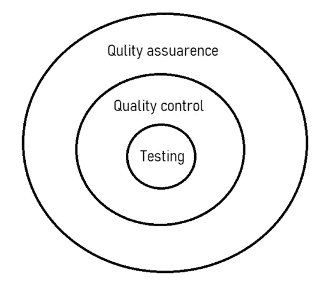

# 软件质量保证基础。

> 原文：<https://medium.com/codex/fundamentals-of-software-quality-assurance-eecdc9631f3f?source=collection_archive---------16----------------------->

首先，如果我们简单看一下软件质量，它是软件组件或系统是否满足其实际用户需求的度量。

因此，软件质量保证是建立所有需求并确保系统对定义的标准有足够的信心所需的一系列步骤。

## 质量保证、质量控制和软件测试

质量保证、质量控制和软件测试之间的关系

质量保证→定义和改进与质量相关的过程，以确保系统的质量。

质量控制→确保产品符合要求。

软件测试→验证软件的功能是否满足其实际需求。

质量保证和质量控制都是为了保证系统的质量

## 验证和确认，软件测试工作流程的关键要素。

应进行验证以确认其规格，从而确保其目标无误。这确保了产品的正确构建。这可以称为静态测试方法，因为它测试应用程序，而不在初始阶段执行

应该进行验证以满足客户的真正需求。因此，这考虑了是否制造了正确的产品。这可以称为动态测试方法，因为它用预期的结果来验证输出。

## 根据麦考尔的因素模型，软件质量因素

麦考尔因素模型提供了一种实用的、最新的软件需求分类方法。因此，利用麦考尔因素模型，将 11 个软件需求分为产品运行、产品修改和产品过渡三类进行讨论。

> 产品操作因素

1.  **正确性:**处理输出的正确性

**2。可重用性:**处理无法提供服务的情况，并确定最大允许故障率。

**3。效率:**处理执行软件功能所需的硬件资源。

**4。完整性:**处理系统安全，防止未经授权的访问。

**5。可用性:**培训新员工以操作系统所需的人力资源。

> 产品修订系数

**6。可维护性:**努力识别和纠正系统故障，并验证纠正是否成功。

**7。灵活性:**处理对不同类型的消费者采用软件系统所需的资源。

**8。可测试性:**用不同类型的操作对系统进行测试

> 产品过渡因素

**9。可移植性:软件从一个环境调整到另一个环境的能力。**

10。可重用性:重用最初为一个项目设计的系统

**11。互操作性:**确保功能或技术需求满足可接受的置信水平。

除了这 11 个质量因素之外，还有其他几个可以衡量软件质量的因素，如可管理性、生存性、安全性、可验证性、可扩展性等。