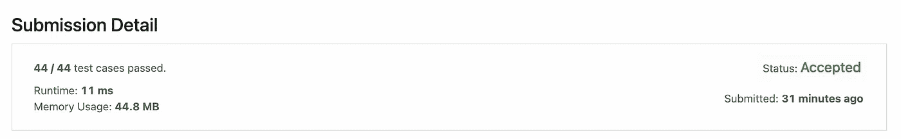

# 有趣的 Leetcode 难题—基本计算器

> 原文：<https://medium.com/codex/funny-leetcode-hard-problem-basic-calculator-79e86c8fa26b?source=collection_archive---------3----------------------->

## 解决 leetcode 难题的全部故事和我的错误

今天是星期天！！！我想在 leetcode 上解决一些计算器问题，因为最近我正在解决包含按位 and，按位 or 和按位 not 的表达式，我将在以后的其他帖子中告诉你这个故事。

首先，只谈基本的计算器问题，所以阅读问题陈述。

# 问题

224.**基础计算器** ( **硬** ) 4069 喜欢 325 不喜欢

[](https://leetcode.com/problems/basic-calculator/) [## 基本计算器- LeetCode

### 给定一个表示有效表达式的字符串 s，实现一个基本的计算器来计算它，并返回…

leetcode.com](https://leetcode.com/problems/basic-calculator/) 

给定一个表示有效表达式的字符串`s`，实现一个基本的计算器来计算它，并返回*计算结果*。

**注意:**你**不**被允许使用任何将字符串作为数学表达式求值的内置函数，比如`eval()`。

**例 1:**

```
**Input:** s = "1 + 1"
**Output:** 2
```

**例 2:**

```
**Input:** s = " 2-1 + 2 "
**Output:** 3
```

**例 3:**

```
**Input:** s = "(1+(4+5+2)-3)+(6+8)"
**Output:** 23
```

**约束:**

*   `1 <= s.length <= 3 * 105`
*   `s`由数字、`'+'`、`'-'`、`'('`、`')'`和`' '`组成。
*   `s`代表一个有效的表达式。
*   `'+'`是不是**不是**用作一元运算(即`"+1"`和`"+(2 + 3)"`无效)。
*   `'-'`可以作为一元运算(即`"-1"`和`"-(2 + 3)"`有效)。
*   输入中不会有两个连续的运算符。
*   每个数字和运行的计算将适合一个有符号的 32 位整数。

# 解决办法

让我们开始吧，如果你没有读过，不要担心，我相信你在高中时已经做过这些简单的数学。

我在这个问题上尝试了几乎 3 次，其中 2 次是错误的，后来它被接受了。(内部错误是由网络问题引起的，所以不要考虑它)


## 解决方案#1 [ 09/18/2022 13:36 [错误答案](https://leetcode.com/submissions/detail/802724993/)

我确信空格需要被丢弃，并且数字可以大于 1，所以我将跟踪一个临时变量中的数字，并且在这种情况下将跟踪操作符'+'或'-'。

这就是我的解决方案简单，干净，甜蜜，直到我提交它。

```
class Solution {
    public int calculate(String s) {
        // ignore space and brackets
        // care about only digits and '+' and '-'
        int temp = 0;
        int result = 0;
        int plusSign = 1;
        for(char x: s.toCharArray()) {
            if(x == '+' || x == '-') {
                result += (plusSign)*temp;
                plusSign = (x=='+') ? 1 : -1;
                temp = 0;
            } else if(x >= '0' && x <= '9') {
                temp = 10*temp + (x-'0');
            }
        }
        result += (plusSign*temp);
        return result;
    }
}
```

## 解决方案#2 [ 09/18/2022 13:43 [错误答案](https://leetcode.com/submissions/detail/802728571/)

当我执行解决方案#1 时，我得到了以下情况的错误答案


于是我深吸一口气，心想作为一名数学系的学生，我怎么能忘记这个案例呢？

然后我修改了我的代码，通过检查括号前的符号，如果括号前的符号是负号，我会把所有的内部符号反过来，如果是负号，我会把它当作正号，如果是正号，我会把它当作负号。

然后我写了这个简单、干净、费力的代码，直到我提交了它。

```
class Solution {
    public int calculate(String s) {
        int temp = 0;
        int result = 0;
        int plusSign = 1;
        boolean invertMode = false;
        for(char x: s.toCharArray()) {
            if(x == '+' || x == '-') {
                result += (plusSign)*temp;
                plusSign = (x=='+') ? 1 : -1;
                if(invertMode) plusSign *= -1;
                temp = 0;
            } else if(x >= '0' && x <= '9') {
                temp = 10*temp + (x-'0');
            } else if(x == '(') {
                if(plusSign == -1) invertMode = true;
                else invertMode = false;
            } else if(x == ')') {
                invertMode = false;
            }
        }
        result += (plusSign*temp);
        return result;
    }
}
```

## 解决方案# 3[2022 年 9 月 18 日 13 时 47 分[已接受](https://leetcode.com/submissions/detail/802730675/)

猜猜我得到了什么？


在两次快速尝试后，我对自己的编码技能产生了一些怀疑，但随后我意识到应该受到指责的是我的数学技能，因为我没有考虑嵌套括号。

```
💡 **Whenever you have to deal with nested brackets then Stack is what you are looking for.**
```

所以我取了一个堆栈，并把指示符号是否反转的布尔值压入，当遇到右括号时弹出。

然后我修改代码，然后执行这个复杂的 sh*t 代码。

```
class Solution {
    public int calculate(String s) {
        int temp = 0;
        int result = 0;
        int plusSign = 1;
        Stack<Boolean> stack = new Stack<>();
        for(char x: s.toCharArray()) {
            if(x == '+' || x == '-') {
                result += (plusSign)*temp;
                plusSign = (x=='+') ? 1 : -1;
                if(!stack.isEmpty() && stack.peek()) plusSign *= -1;
                temp = 0;
            } else if(x >= '0' && x <= '9') {
                temp = 10*temp + (x-'0');
            } else if(x == '(') {
                if(plusSign == -1) {
                    stack.push(true);
                } else {
                    stack.push(false);
                }
            } else if(x == ')') {
                stack.pop();
            }
        }
        result += (plusSign*temp);
        return result;
    }
}
```

猜猜我得到了什么？

呀！你猜对了，聪明的孩子。(我知道你看过标题)



我深吸一口气，打开媒体告诉你们整个故事，我的意思是我不知道为什么它被标记为难题，可能是因为我们在匆忙中错过了愚蠢的错误或边缘情况。

谁在乎(我不是在面试)？我解决了问题！！！

下面是我的代码，经过一些巧妙的代码优化，使代码变得干净。

1.  首先，我删除了对空堆栈的检查，所以我推 1 值。
2.  我推的是整数值而不是布尔值。

```
class Solution {
    public int calculate(String s) {

        int temp = 0;
        int result = 0;
        int plusSign = 1;

        Stack<Integer> stack = new Stack<>();
        stack.push(1);

        for(char x: s.toCharArray()) {
            if(x == '+' || x == '-') {
                result += (plusSign)*temp;
                plusSign = stack.peek() * (x=='+' ? 1 : -1);
                temp = 0;
            } else if(x >= '0' && x <= '9') {
                temp = 10*temp + (x-'0');
            } else if(x == '(') {
                stack.push(plusSign);
            } else if(x == ')') {
                stack.pop();
            }
        }

        result += (plusSign*temp);
        return result;
    }
}
```

所以如果你一直读到最后，请投赞成票，这样我就能知道你们中有多少人和我一起读到最后。

## 谢谢各位。！！

## 祝你周日愉快！！！