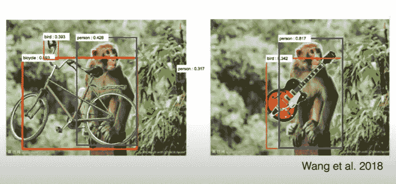
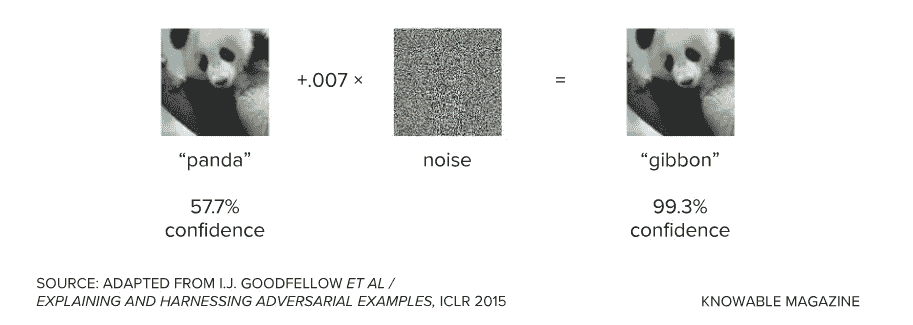

# 未来的人工智能将是我们能得到的最接近“思考”的系统

> 原文：<https://medium.com/codex/future-ai-will-be-closest-we-can-get-to-a-thinking-system-ec0120f2ae?source=collection_archive---------10----------------------->

基于深度学习模型，当前的人工智能系统在许多方面都存在不足。前方的路应该是怎样的？

在我之前的文章中，我对当前人工智能系统的状态相当悲观。关于数据驱动的人工智能系统的几项研究结果令人堪忧。虽然这些系统可以对类似于训练数据的提示显示出令人难以置信的准确性，但对与训练数据高度不同的提示的响应却是疯狂的。

仅举一个例子，在麻省理工学院的[讲座中，David Cox 教授举了王等人(2018)论文中的一个例子，研究人员将吉他或自行车等物体放在一只猴子身上，发现图像识别软件将这只猴子识别为人。正如考克斯教授指出的，原因是训练数据中没有一只弹吉他的猴子。](https://www.youtube.com/watch?v=4PuuziOgSU4&t=988s)

图片来自[亚历山大阿米尼(Youtube)](https://www.youtube.com/watch?v=4PuuziOgSU4&t=989s)

数据驱动的人工智能计算大量数据，最终确定其预测。在许多情况下，它可以以很高的准确度识别物体或文本。然而，在许多其他情况下，预测会出现偏差。解决这个问题的方法不能是将越来越多的数据输入到人工智能中，这样它就更容易预测。我们在这里谈论的是潜在的无限数据集。

似乎我们已经走到了路的尽头。在我以前的文章中，我甚至试图将人工智能的统计基础与人类智能相提并论，并得出结论认为人工智能远非人类水平的智能。也许这不是解决问题的正确方法。

人工智能确实模仿人类系统。但这一事实不应该让我们相信，一个真正的 AI 应该以人类智能为地平线。在讨论人工智能的未来和人工智能超越人类的可能性时，作者加里·马库斯说:“人类是一个很低的超越门槛。”例如，马库斯称之为低门槛，是指我们的记忆是多么脆弱。机器系统的存储能力和计算能力远远超过我们。我觉得传统的哲学方法惯坏了我们，让我们认为我们有比我们知道的更多的东西(例如，当康德说有人类思想和经验所特有的先验类别时)。因此，任务是建立可以帮助人类的系统，而不是超越人类。

在深度学习模型被开发出来之前，符号化的人工智能系统已经在使用了。这些系统不是拥有数十亿的训练图像，而是在数据库中标记对象和编码的逻辑关系。所以，一个符号化的 AI 系统可以很容易地做到‘人类坐在桌子上’这样的句子，这对于 Dall-E 2 这样的程序来说是非常难以处理的。该系统将扫描其知识库，检测两个符号“人”、“桌子”和关系“开”，并提取与之对应的图像。标记图像将无限数据集限制在几个有限元素中。

但是，符号人工智能不可能是一个能够充分执行任务的独立系统。当面对知识库之外的提示时，它会失败。符号人工智能的局限性是使用神经网络模型的原因；让人工智能去学习和适应。神经网络将图像(或符号)区分为几个部分，每个部分嵌入网络的不同层。在预测输出时，网络以统计方式测量输入数据与训练数据的匹配程度，然后给出结果。但是，正如我们所看到的，在神经网络的输入图像中添加额外的噪声，系统无法准确预测所需的结果。例如，当我们给熊猫的图像添加噪声时，系统会将其识别为“长臂猿”:

图片来自[可知杂志](https://knowablemagazine.org/article/technology/2020/what-is-neurosymbolic-ai)

# 前方的路

为了应对当前的问题，加里·马库斯(Gary Marcus)一直在推动一种混合模型——朝着神经符号人工智能的方向发展。有各种各样的理论提出了混合模式将采取的路线。下面是马库斯在他的[文章](https://www.noemamag.com/deep-learning-alone-isnt-getting-us-to-human-like-ai/)中概述的一些观点，这篇文章发表在《诺玛》杂志上:

> 人们已经考虑了许多不同的结合符号和神经网络的方法，集中在诸如从神经网络中提取符号规则、将符号规则直接翻译成神经网络、构建可能允许在神经网络和符号系统之间传递信息的中间系统以及重构神经网络本身的技术上。

混合模型同等重视数据和表示。它依赖于数据的统计模型，以及事物之间的逻辑和抽象关系。通过这些混合模型，通用人工智能系统可以学习如何推理——概括信息，并产生跨领域的知识——的道路是可能的。

这个混合系统接近于我们使用人类语言的方式。当我们看到一个像苹果一样的物体时，我们不仅仅看到从苹果反射到我们眼睛的光，我们还把苹果看作是苹果。*我们的概念能力在感知中起着重要的作用*。然而，正如加里·马库斯在他的文章中提到的，我们不知道这种概念能力是天生的还是在发展过程中获得的。如果是先天的，是什么原因造成的？而如果是后天的，机器也可以学习吗？因此，很难想象如何设计这些系统来实现这些混合模型的最佳输出。

神经符号人工智能研究的当前趋势以多种方式对其进行分类。Henry Kautz 在 2020 年提出了“将神经和符号传统结合在一起的五种方法”——[符号神经符号]，[符号神经[神经]]，[神经∪编译(符号)]，[神经→符号]，以及[神经[符号]]。没有理由被这种分类吓倒。在将神经系统和符号系统结合在一起的过程中，Kautz 展示了在组装这两个系统时可能存在的逻辑关系的数量。

因此，这给我们带来了一个有趣的问题:我们可以设计多个神经符号人工智能系统，每个系统都有一个特定的模态。我们是否在展望这样一个时代:每个人工智能都可能根据其系统中神经网络的符号提取对事物有一个主观的看法(类似于人类根据个人经验解释事物的方式)？