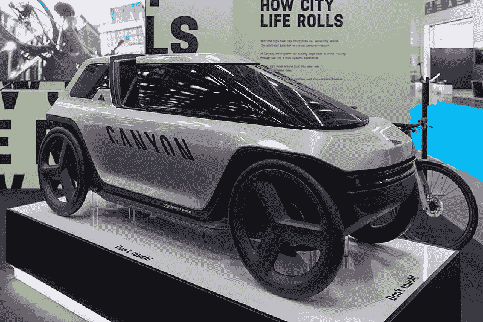

# 移动性的未来:AVs|ADAS 中的车轮运动自主性和数据思维路径

> 原文：<https://medium.com/codex/future-of-mobility-wheels-motion-autonomy-and-data-thought-pathway-in-avs-adas-ceca9ffb99c2?source=collection_archive---------32----------------------->

2021 年慕尼黑 IAA Mobility 的 canyon via[Matti Blume](https://commons.wikimedia.org/wiki/User:MB-one)

全世界的汽车车轮每年消耗多少能量？如果有可能降低这一能源比例，它将减少多少排放，以及增加电动汽车和氢燃料汽车的里程？

车轮是一种独特的外露运动，由传动轴驱动。任何运动都可以驱动能量，但这可能很小而且不均匀，因为它可能被驱动，然后被转换。

如果不使用运动来驱动能量并使用能量来驱动运动，而是直接使用运动来驱动暴露物体中的运动，会怎么样？

这种可能性，通过设计、调整、统一速度或海拔，是本世纪气候目标的关键。

建模一个新的轮子——用一个附件——让它的运动跟随轮子的运动，然后在一定的速度、高度或天气下与轮子共享，这是一个起点。

可以有多个运动供应源的较小版本，包括传动轴。可以有轻微弯曲的轮子，或改变表面，以帮助这种运动。

这将是一个令人兴奋的机械工程的尝试，[为了减少排放](/predict/theoretical-physics-of-motion-in-the-global-energy-crisis-32c72535c778)和能源效率，为新的和现有的车辆。

对于自动驾驶汽车和高级驾驶辅助系统，有一条通往安全和增加熵的计算机工程道路。AVs 和 ADAS 中的所有 ML 数据不应该完全进入相同的处理。

一些输入数据必须经过[分割](/mlearning-ai/thoughts-to-xai-for-anthropomorphic-autonomous-vehicles-79a8832f284b)，这样它们才能沿着与大脑中思维路径相似的路径前进。正是思想的去向决定了要感受什么:恐惧、爱、谨慎、危险等等。为 AVs 和 ADAS 的数据建立一个[恐惧中心，尤其是在一些紧急情况下，会提高安全性和效率。](/codex/affective-computing-ai-with-fear-thought-as-the-means-91b69dd57d08)

有很多关于移动镜像能量转换以及单向输入数据的未来的讨论。运动驱动轮子的运动，思想路径中的数据拥有新的希望。