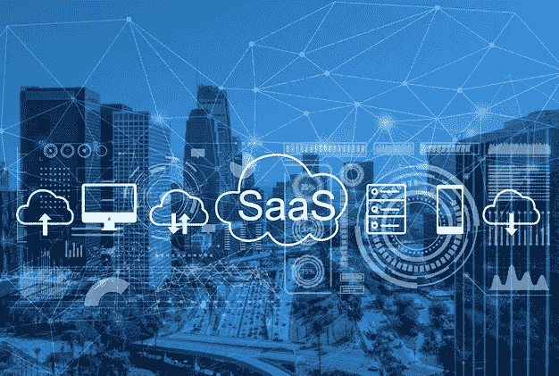

# SaaS 的未来:未来几年的展望

> 原文：<https://medium.com/codex/future-of-saas-what-to-expect-in-coming-years-9685f28342a1?source=collection_archive---------18----------------------->

对于在竞争激烈的市场中寻求可访问性、灵活性和适应性的企业来说，软件即服务(SaaS)越来越可行。

企业可以部署 SaaS 软件解决方案和在线数据分析，而不必依赖于在自己的计算机系统和数据中心安装和运行应用程序。因此，这些奇妙的创新每年都越来越受欢迎。

云计算产业现在由 SaaS 主导。据 Gartner 称，到 2022 年，基于服务的云应用市场将达到 1437 亿美元，这一增长率将影响 SaaS 当年的发展趋势。

由于 SaaS 行业正以惊人的速度增长，让我们来了解一下你应该关注哪些 SaaS 产品。

**你应该关注的 SaaS 动向**

# 人工智能

越来越多的人采用越来越先进的人工智能(AI)技术，这紧随我们的 SaaS 趋势列表之后。这是因为人工智能的发展已经不再处于初级阶段。

技术已经完全改变了商业，开启了以前无法想象的可能性，并彻底改变了我们管理商业的方式。特别是，将人工智能引入 SaaS 市场引起了很多关注。它的颠覆性力量有望改变从 CRM 到会计软件的一切。

人工智能在简化业务流程、自动化冗余工作、提高生产率和效率以及拓展人类才能方面的潜力是巨大的。但不幸的是，尽管 IT 领导者尽一切努力开发人工智能系统，但到目前为止，这种潜力只有一小部分得到了利用。

历史上的主要障碍是潜在危险的想法。不过，幸运的是，SaaS 公司现在终于克服了这一障碍。

最棒的是，尽管存在风险，人工智能仍然是当前 SaaS 市场上最前沿的技术。因此，SaaS 企业正在消除阻碍人工智能进步的障碍，并为其在 SaaS 的实施奠定基础，这一事实不应令人惊讶。事实上，自 2017 年以来，人工智能在 SaaS 领域掀起了巨大的波澜，这一趋势没有放缓的迹象。

# 区块链

不可否认，SaaS 和区块链是两回事。区块链技术本身无疑是创新的。不幸的是，在关于比特币的讨论中，这项技术经常占据主导地位。

结果，SaaS 部门没有人给区块链机会。然而，我们都必须同意一个事实:区块链能够提供 SaaS 工业迫切需要的透明度。

请记住，开放的沟通和可靠的交易是 SaaS 商业成功的基石。区块链技术和分布式数据库可以增加急需的透明度，并增强 SaaS 产品。

最重要的是，区块链可以帮助 SaaS 企业创建无错误的系统，避免传统数据库经常出现的安全问题。更好的是，区块链可以通过提高企业的可靠性来增加消费者的忠诚度。

区块链在 SaaS 的优势显而易见。值得注意的是，这项技术将极大地扰乱 SaaS 的合规、在线支付、审计和税收等行业。毫无疑问，区块链将改进 SaaS 产品。

# 垂直 SaaS

垂直 SaaS 深入研究了通过特定供应链和行业内的定制来锁定客户的可能性，而水平 SaaS 最终以客户为中心。

因此，企业非常注重将自己定位为专家而非通才，垂直 SaaS 领域的进步有助于他们通过特定行业和经济实惠的解决方案磨练定制的可能性。

集成特定于行业的法规遵从性以增强透明度带来了各种数据治理程序。此外，垂直 SaaS 预先确定的 KPI 和指标还提供了分析，企业可以使用这些分析来评估长期项目。

# 机器学习

人工智能的一个子类型称为机器学习(ML)，在 SaaS 用于自动化客户服务报告和应用程序的响应，如人工智能支持的实时聊天机器人的聊天操作。此外，它将实现 SaaS 入职自动化。

由于 ML 是建立在自主操作范例之上的，未来的发展将使软件和平台允许企业除了单独的客户服务或体验之外，自动化相当大部分的内部流程。

自我改进的能力将使 SaaS 式的产品成为可能，提供智能和运营效率，从而推进各种业务。

机器学习是增长率最快的软件行业之一，这使得它成为 SaaS 2022 的热门话题。

随着 ML 成为基于人工智能的软件即服务范式的基本组件，支持跨行业业务的平台数量将会显著增加。

# 社交围墙

既然我们在谈论 SaaS，就很难错过社交墙。最近，社交墙给营销界带来了一个启示。社交墙是在大型数字屏幕上实时显示用户生成的内容。社交墙与用户生成的内容相结合，创造了一个组合，帮助品牌和企业实现其主要目标。

社交墙可以为多个营销接触点带来显著效果，如电子商务商店、活动、网站、营销活动等。

社交墙作为 SaaS 的产品有几个好处，社交证明、观众参与、增加销售&收入、口碑营销和真实性是主要的好处。

社交墙已经延伸到了几乎所有的行业。酒店、旅游、教育、体育、企业和所有行业都受益于社交墙令人兴奋和引人入胜的视觉展示。

# 分散分析

鉴于全球数字革命的巨大潜力，企业期待简化数据操作，以更深入地挖掘客户洞察。

数据分析在基于服务的软件组织中的重要性稳步增长，数据驱动的决策对于未来的企业变得越来越重要。

通过集中分析，可能会发现性能仪表板和其他隐藏的见解。SaaS 模型有一个内置的集中功能，允许从世界各个角落访问数据，这增加了未来业务流程的透明度。

# 白色标签

SaaS 白标是一个基于软件的公司开发一个完全创建、测试和完成的平台，然后将其出售给另一家企业，以便他们可以调整它并以自己的品牌销售。

它将在 2022 年继续流行。它也可以包含在集成的 BI 工具中，让企业在他们自己的软件中有一个解决方案。

白色标签对于那些希望迅速扩大市场份额，同时减少物流或财务支出的公司尤其有用。

如果平台或开发的基础现成可用，企业家可以专注于他们的价值主张、战略和品牌，而不需要从头开始。

BI dashboard 软件可以真正地作为 SaaS 解决方案来使用，该解决方案完全贴上白色标签并进行定制，以满足企业或部门的独特品牌需求。

# MicroSaaS

许多行业的市场预计将在 2021 年饱和；尽管 SaaS 的经济增长令人印象深刻，但预计它会解冻。由于激烈的竞争，预计将出现拥有非常小的团队的微型 SaaS 公司，以向现有平台添加服务并增加 SaaS 产品的价值。

这种小型推广服务的专业化市场可能主要集中于某一特定部门或客户群，也许是自给自足的。

# 包扎

SaaS 是所有主要工业的现在和未来。SaaS 趋势每天都在增长，这是有真实原因的，因为它们正在帮助企业惊人地增长。

这个博客包含了一些重要的 SaaS 趋势的详细解释。现在根据行业的不同，你应该选择适合你的 SaaS 并开始行动。