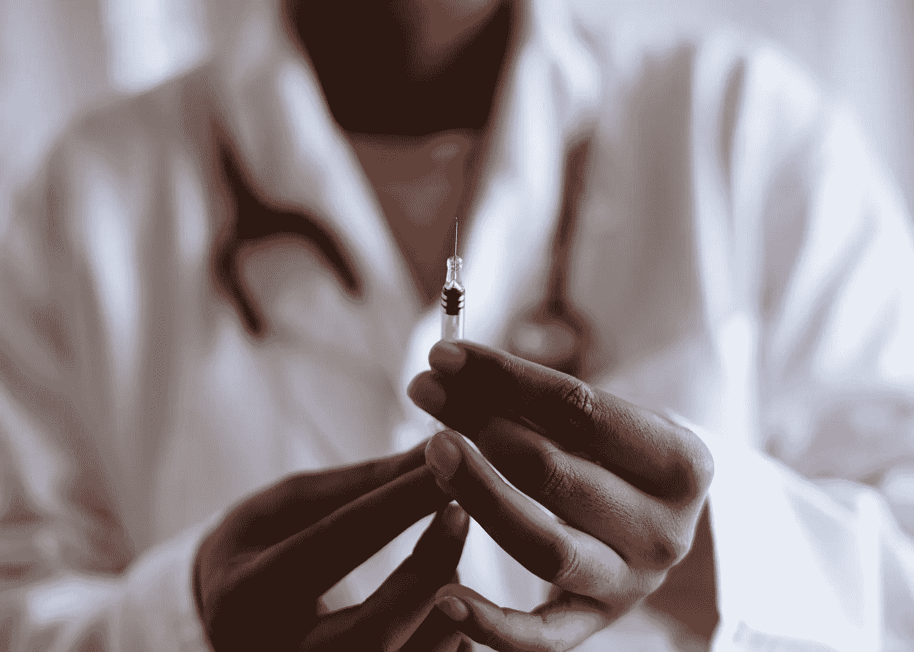
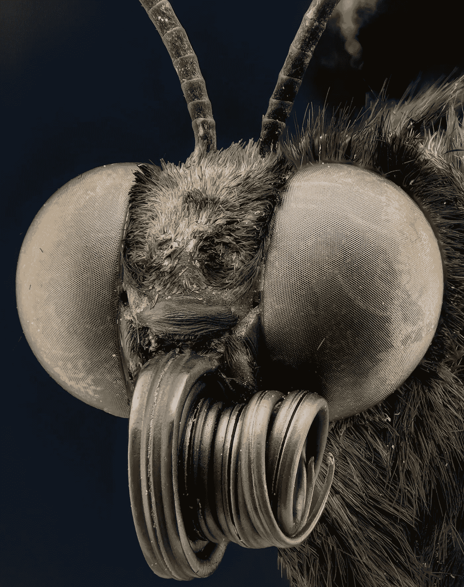

# 未来科技:基因工程

> 原文：<https://medium.com/codex/future-tech-genetic-engineering-a29cf2a335fd?source=collection_archive---------11----------------------->

基因工程是一种可以使一个物种的基因在另一个物种中发挥功能的技术。这项技术已经存在了一段时间，但在过去的几年中发展迅速。医学研究和农业等行业受益最大，但即使是对普通消费者的好处也在不断增加。基因工程将改变我们的生活方式，种植食物，并为科学创造新的机会。

# 什么是基因工程？

基因工程本质上是利用生物技术修改生物体的基因组。基因工程技术可用于将新的 DNA 或 RNA 引入细胞，或通过众所周知的基因治疗和操纵细胞表达特定蛋白质的技术来改变现有的遗传物质。

基因组是生物体(DNA)中的一套完整的染色体，包括所有的基因、调控元件和其他存在于每个细胞一个拷贝中的 DNA 序列。不同生物的基因组大小差异很大:一些病毒只有几千个碱基，而植物的 DNA 通常是病毒的几百倍到几千倍。

# 治疗糖尿病的更好方法

例如，设计产生大量胰岛素的生物体是基因工程的一个未来应用。胰岛素是一种调节血液中葡萄糖含量的激素。当你吃东西时，你的胰腺会释放胰岛素到你的血液中，这样你的细胞就可以利用葡萄糖作为能量。患有糖尿病的人，他们的身体不能产生足够的胰岛素或不能有效地利用它。因此，他们需要每天注射人工合成的人或动物来源的胰岛素来保持健康，避免神经损伤、失明和肾衰竭等并发症。基因工程的一个有希望的新应用可能是创造出能产生大量类人胰岛素而没有过敏反应等有害副作用的植物或微生物。

# 发光的生物体

已经讨论过的这项技术的另一个未来应用是让生物体发光。这项技术包括将产生发光化学物质所需的基因植入活的有机体。

什么生物可以发光？水母和鱿鱼等海洋动物的基因已经被植入老鼠体内，使它们发光。生物发光所需的遗传物质必须通过注射或基因疗法引入，在基因疗法中，用 DNA 处理特定的靶细胞。

会发光的动物有什么好处？一种可能性是，科学家可以利用这一过程制造传感器，用于检测环境污染物和其他有毒物质——想象一下，如果有树木的叶子在特定条件下会发光。这将让我们看到不同种类的污染是如何直接影响植物生命的。

# 医疗保健的未来

如前所述，基因工程是修改生物体的 DNA 以改变其特征的过程。一种方法是从基因组中移除致病基因，并用健康基因取而代之。另一种方法是改变基因中的核苷酸序列。这可能导致生物体具有令人满意的特性，如抵御寒冷天气或增加肌肉质量，或令人不满意的特性，如对癌症的更高敏感性。通过基因工程，致病基因可以被替换或修改，从而不再造成伤害。

# 基因编辑蚊子

CRISPR 蚊子是一种转基因蚊子，携带一种基因，可以防止它产生患有疟疾的后代。当这些蚊子被释放时，它们与正常的蚊子繁殖，并将它们的基因传递给后代，导致它们无法携带疟疾。因为雄蚊子没有这种性状，所以它们仍然可以与野生雌蚊子交配，并将它们的基因传递给后代蚊子。这给科学家带来了希望，最终，所有的蚊子都将能够抵御登革热和疟疾等疾病，而不会对生活在它们周围的人类或动物产生任何负面影响。

# 结论

将来，基因工程很可能不再局限于科学实验室，而是会渗透到商业和消费领域。虽然其中一些创新可能需要数年时间才能上市，但这一时刻正在迅速到来。有一天，我们可能能够下载一个应用程序来编辑我们的基因，或者在柜台上购买一种吸收更好的营养保健品，这给社会带来了一系列社会和伦理问题。我们可以选择忽略它们，也可以正面处理它们。这是我们的选择。