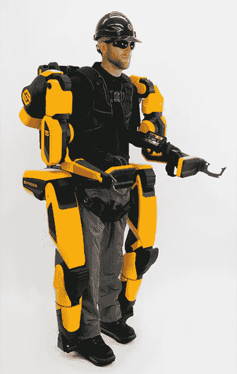
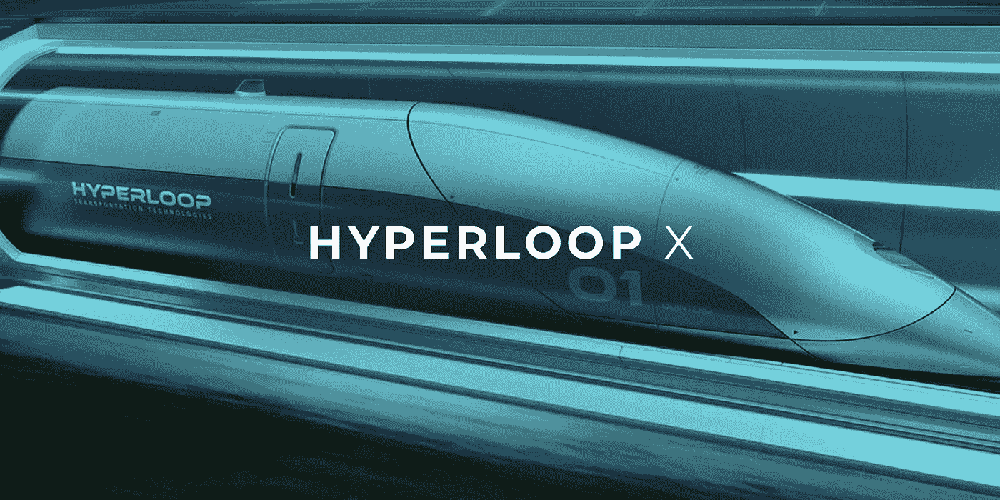
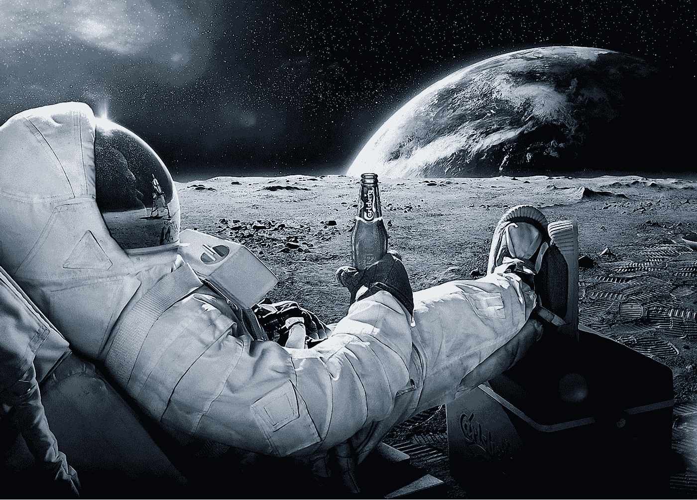
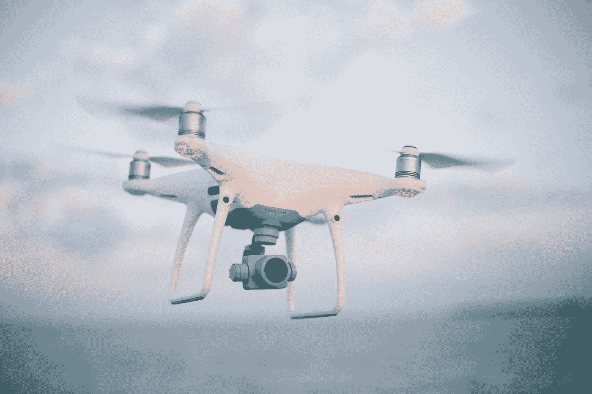

# 2050 年的未来科技世界——可能的发明

> 原文：<https://medium.com/codex/futuristic-tech-world-in-2050-possible-inventions-e69853fae4c2?source=collection_archive---------0----------------------->

美国宇航局在 [Unsplash](https://unsplash.com?utm_source=medium&utm_medium=referral) 拍摄的照片

## 看到未来的科技世界如何用可能的发明来塑造我们是非常有趣的

# ***2050 年世界科技展望***

在过去的十年里，技术的发展取得了巨大的进步，技术发明和应用在我们的日常生活中。在未来几年，全球科技链将会领先一步，创造一个未来科技世界。新形式的技术必将改变我们的社会生活方式。值得注意的是，虚拟现实、物联网(IoT)和人工智能(AI)将成为我们日常生活中各种风险解决方面的主流。不可思议的事情在未来会变得可信。这个博客详细阐述了 2050 年最重要的未来学家提出的可能的发明，他们认为这些发明可以重塑世界的进程。

# 2050 年可能的发明

*   人工智能机器人和人类的再生
*   超人服装
*   完全依赖可再生能源
*   超回路
*   太空度假
*   无人机解决方案

## *人工智能(机器人&转世)*

来源:[对话](https://theconversation.com/au)，*索菲亚，人工智能机器人的最好例子*

专家们表示，相信机器和计算机将拥有人工智能的能力，甚至比人类更有能力，这是可行的。像 DeepMind 这样的公司预计会带来这种变化，他们非常热衷于他们的愿景。这可能吗？根据人工情绪智能的理论，机器或机器人将能够通过理解和确定人的手势以及语调来做出反应并伪造情绪。随着应用科学机械化的发展，人工智能机器人的可能性是巨大的。

“投胎还是重生的人”，听起来怪怪的，我知道！但是根据一位顶级未来学家 Kurzweil 的说法，在未来，随着扫描技术的进步，纳米机器人机制的发展，我们将能够将纳米机器人发送到人们的大脑中，以提取他们所爱的人或死去的人的记忆。通过增强 DNA 采样技术，我们可以从人们的记忆中提取一个人的 DNA，并能够创建一个虚拟的令人信服的版本。

## 超人服装

来源:[新图集](https://newatlas.com/)

在未来，超能力服装的发明为人类提供了更大的力量和工作能力，甚至一个五十岁的老人也能在建筑工地上做举重的工作。最好的例子就是现代最近推出的外骨骼套装。未来学家还设想高级服装，如能够快速奔跑或行走的裤子，或像聚合物凝胶制成的套装这样的蜘蛛侠有助于提高力量。不仅是在工作场所，超能力服装对于那些腿部或手部健康状况不佳的人来说也是一个更好的解决方案，Clinatec 实验室证明了这一点，他们创造了一种可以由瘫痪的人控制行走的外骨骼。

## 可再生能源

照片由 [Unsplash](https://unsplash.com?utm_source=medium&utm_medium=referral) 上的 [Zbynek Burival](https://unsplash.com/@zburival?utm_source=medium&utm_medium=referral) 拍摄

未来学家指出，水下电缆机制和基础设施的改进将使各国能够在海外产生太阳能。因此，各国将有机会从撒哈拉沙漠等地获取太阳能来照亮整个国家。各国可以从海外获取太阳能，这增加了人们对太阳能的依赖，也将是一项不错的投资。此外，核聚变的发展有望在未来为家庭供电。最后，从长远来看，使用化石燃料发电将会迷失方向。

## 超回路

来源: [ZD 网](https://www.zdnet.com/)

Hyperloop 是特斯拉创立并发展的一种超越预期的交通概念。详细地说，这是一个由圆顶状结构封闭的高速推进系统，有助于该系统在真空中运行。与氧气相比，真空中的运输速度相对较高。特斯拉目前正在对其愿景项目进行技术测试，并为其在城市间的访问建立合作。在未来，相信 Hyperloop 将成为一个全球性的运输链，并将改变人们对运输的看法。

## 太空度假

来源: [iExplore](https://www.iexplore.com/)

“太空度假！”最有趣的预测之一。像杰夫·贝索斯的蓝色起源(Blue Origin)和埃隆的 SpaceX 以及其他竞争对手这样的火箭公司正在无缝地努力实现这一愿景。为了增加趣味，SpaceX 已经率先开发了一种可持续的太空旅游模式，实现了埃隆·马斯克(Elon Musk)将人类送上火星的愿景。这种太空旅游将耗资巨大，而且只有富人才能参与。在未来，这将是创造就业机会、新的商业途径和可能的商业前沿的巨大推动力。

## 无人机送货

乔希·索伦森在 [Unsplash](https://unsplash.com?utm_source=medium&utm_medium=referral) 上的照片

无人机技术的发展程度将在未来超越以往任何时候。目前，像地下矿区这样的地方由于环境不舒适，人类无法进入，但是，像 Inkonova 这样的公司已经开始了他们的基础工作，创造出一种具有即兴飞行、攀爬能力的无人机，以及扫描区域的激光技术。空中机器人技术的这些进步将帮助人们到达人类尚未触及的任何空间。此外，像亚马逊这样的公司正在雇用无人机来运送产品和杂货，但未来学家表示，这些送货无人机系统在未来普及的可能性较小，这意味着它只适用于杂货和小型产品。最后，无人机航空技术将带来监视和测绘目的的变化，特别是对军事间谍而言。

# ***未来主义对社会生活的影响***

世界变化的速度比我们想象的要快，明暗色调都在发展。尽管上述可能的发明使人们感觉生活在一个更好的社会中，但这些发明预计将在未来减少目前就业市场的一半。自动化将无处不在，导致体力劳动者的减少。因此，我们需要保持更新，并增强我们的学习过程和方法。学习链很可能向电子学习推进。此外，脸书已经设想了他们的下一个计划，创造一个个人或秘密聊天的环境，从而根除面对面分享我们的想法。技术只是在发展，我们从来没有想过它。我们应该创造与技术阶段相适应的环境，就像我们如何在这个疫情时期适应电子学习一样。人们需要用“未来世界”的概念与他们未来的社会生活合作。感谢您阅读本文！

> ‘我们现在所做的就是我们未来的程度。’