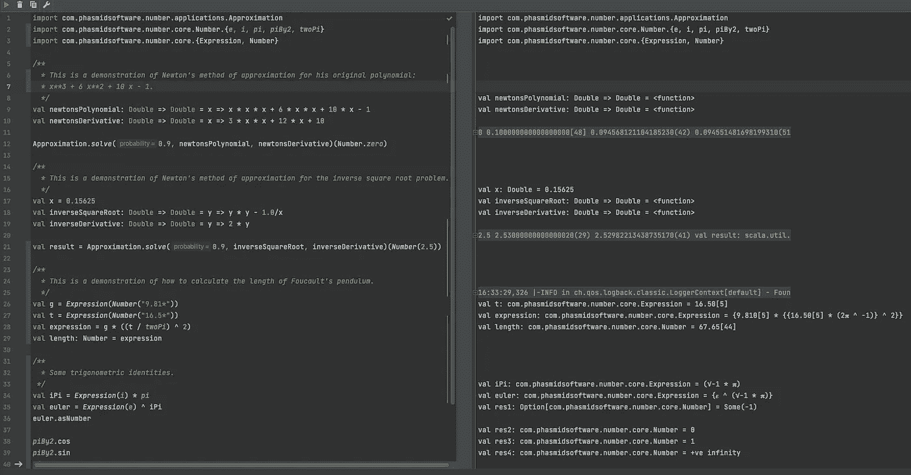
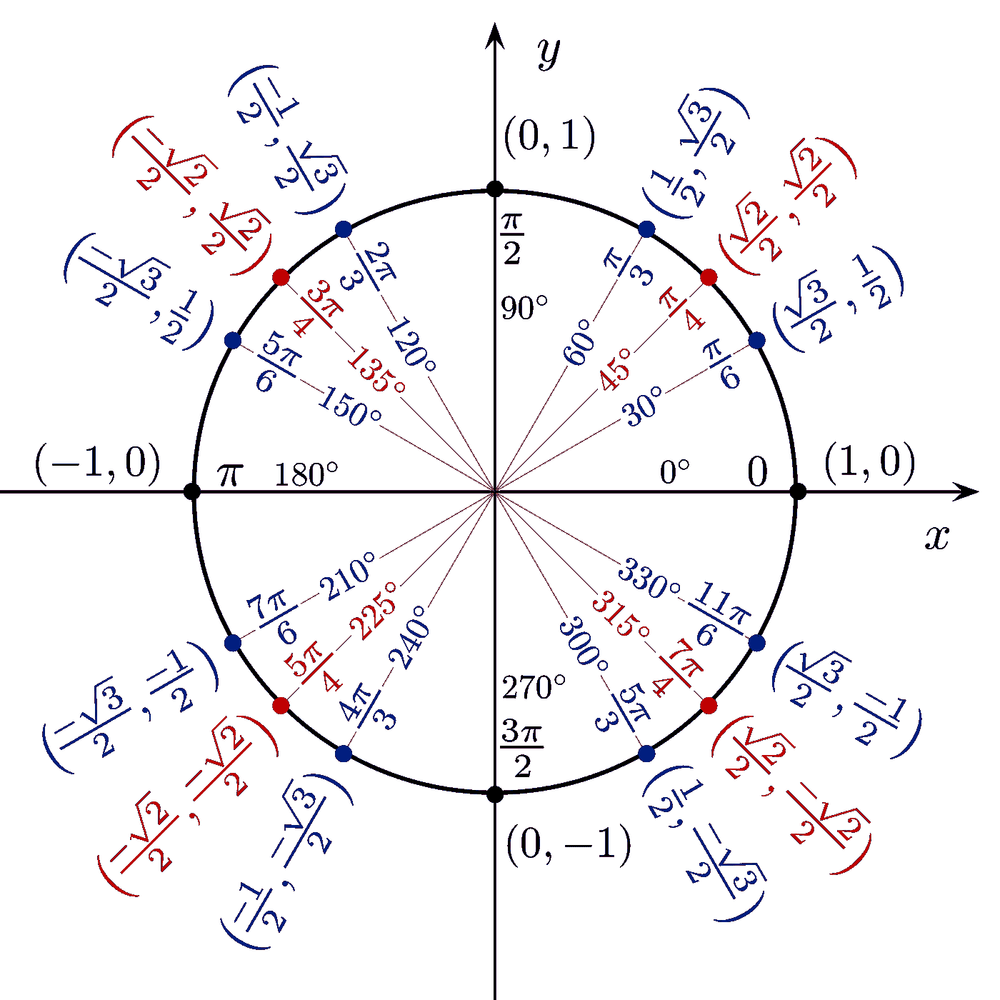
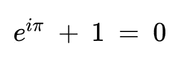

# Scala 中的模糊、懒惰、函数式数值计算

> 原文：<https://medium.com/codex/fuzzy-lazy-functional-numeric-computing-in-scala-4b47588d310f?source=collection_archive---------12----------------------->

这是我第三篇也是(谢天谢地)最后一篇关于 [**数字**](https://github.com/rchillyard/Number) 的文章，一个事物数值的开源库。之前的文章分别是[第一部](/codex/number-part-1-c98313903714)和[第二部](https://scala-prof.medium.com/number-part-2-7925400624d5)。在本文中，我将描述该库的基本数学特性。在这方面，会和 Scala 中的其他数值库有相似之处。然而，有一些新的方法可能是也可能不是一个好主意。欢迎你的评论。

工作表

首先有*字段*。这是一种允许在一个域上进行各种操作的特性:加、减、乘、除。此外，还有 power 操作符、comparison 和一两个其他查询操作符，如 *isZero、isInfinite* 。字段有两个子特征:*号*和*综合体*。有一些方法可以返回一个可选的*数字*，或者一个可选的*复数*(我想我可以只提供一个方法来返回*[数字，复数]* ，但是如果我添加了四元数或者任何其他类型的字段，这可能会很麻烦)。

*复杂*有两个案例类:*复杂笛卡尔*和*复杂极坐标*。这些以您所期望的方式分别采用两个*数字*(即*复极坐标*的虚部通常是一个角度度量)。*实数或虚数的复数*可以转换成适当的*数*。

一个*数*有两个属性:它的值(a *值*)和它的“因子”(a *因子*)。这些属性在一个名为 *GeneralNumber* 的抽象类中实现，该类还实现了*Fuzzy【Double】*，并定义了一个属性 *fuzz* (一个*选项【Fuzzy[Double]】*)(参见第 1 部分了解更多关于模糊性的内容)。*值*是*的类型别名【要么[Option[Double]，Rational]，Int】*。没错，就是嵌套的*或者*！

如果一个数字可以用 *Int* x 表示，那么它被定义为 *Right(x)* 。如果不是 *Int* 而是理性的 *r* ，则定义为 *Left(Right(r))* 。*有理*的分子和分母都是*大整数*。如果数字不能用 *Int* 或 *Rational* 来合理定义，那么我们用 *Double 来表示。*注意，明显不精确的典型来源之一是必须使用 *Double* 进行整数除法。10 / 3 * 3 通常会显示为类似 9.99999999999 通过使用 *Rational* ，我们完全避免了那种事情。你可以把 *Rational* 看作是数字的又一个懒惰的表现(见第 2 部分)。

*Number* 上定义的每一个运算，并元和一元运算符，都定义了三个函数:一个用于 *Int* 、一个用于 *Rational* 、一个用于 *Double* 。

*因子*允许我们定义不同领域中的数字，特别是允许一些无理数和超越数的精确表示。共有 3 个子类型: *PureNumber，对数*和 *Root* 。*纯数字*有两个子类型:*标量*(均为普通数字)和*弧度*(以弧度为单位的角度测量)。*弧度*值范围为 0-2(不含)。常数 *pi* 定义为: *Number(1，弧度)*的精确值为π。否则*弧度*因子与*标量*的区别仅在于该常数因子。

*对数有三个子类型:* *自然对数*(对于自然对数)、*对数 2* 和*对数 10* 。(尽管最后两个可能没有太多实际用途)。当转换成*标量*数字时，这些数字只是将其基数提高到其值的幂。因此，它们不是*标量*的简单缩放版本。它们的值从负无穷大到正无穷大，经过某个点，例如， *Number(1，NatLog)* 的值为 *e* ，Euler 数(2.718…)。【本版之前】*弧度*和*自然对数*分别称为 *Pi* 和 *E、*。

三角函数自然地对*标量*和*弧度*进行运算，与 *exp* / *log* 函数对*标量* / *NatLog* 进行运算的方式相同。因此，如果你取π/4 的正切，你会得到正好 1，当然，如果你取负无穷大的反正切，你会得到正好 3π/2。

单位圆周围的余弦和正弦(来自维基媒体，公共领域)。

第三类因素称为*根*。任意有两个子类型:*根 2* (平方根)和*根 3* (立方根)。这些是在 1.0.11 版中添加的。它们对于正弦、余弦(或正切)函数的结果非常有用。例如，sin(π/3)为√3/2。二的平方根是唯一可以用多种方式精确表示的数:*数(2，根 2)* 和*数(1/2，Log2)* 。同样，有些武断地，我们只考虑这些值的主(正)根。

有一个常数*数*叫做 *i* 它的确切值是(√–1)。未来的增强可能允许基于欧拉恒等式(也许是最优雅的数学恒等式)将 exp 运算符与 cos 和 sin 运算符合并。它包括五个最基本的数学常数，以及四个主要的运算符:等于、加、乘和取幂。

欧拉恒等式

目前没有办法定义一个*数*等于 *i* π，因为一个数不能属于两个不同的域。但是，有一个名为 *iPi* 的*复杂*常量具有适当的值。顺便说一下，如果你真的想在表达式中使用 *i* ，最好在对它做任何事情之前调用 *normalize* 。

对**号**包装的讨论到此结束。目前的状态(V1.0.12)是它有不错的覆盖面，但绝不是完美的。有超过 1，000 个单元测试，但是还需要更多的测试，有几个被忽略了，等待小问题的解决。如果您有兴趣了解它是如何工作的，可以克隆存储库并运行各种工作表。暂时忽略 *misc* 包中的代码。我当然希望有贡献者加入到知识库中。

您可以通过以下 *sbt* 指令在您的项目中使用编号包:

## library dependencies+= " com . phasmidsoftware " % " number _ 2.13 " % " 1 . 0 . 12 "