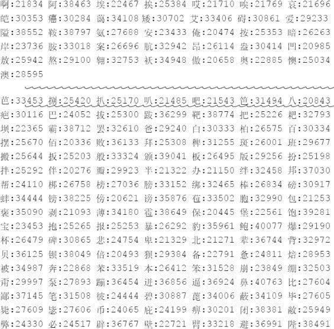
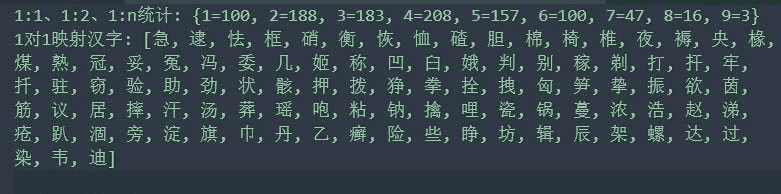
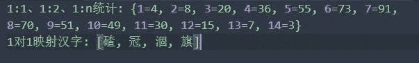
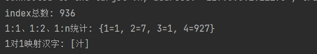
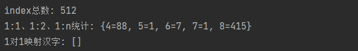

# cipher column | sharding sphere 5 . 3 . 0 Deep Dive 的模糊查询

> 原文：<https://medium.com/codex/fuzzy-query-for-ciphercolumn-shardingsphere-5-3-0-deep-dive-ad09faea67d3?source=collection_archive---------13----------------------->


# 1.背景

[Apache ShardingSphere](https://shardingsphere.apache.org/) 支持数据加密。通过解析用户的 SQL 输入并根据用户的加密规则重写 SQL，原始数据被加密，同时与密文数据一起存储在底层数据库中。

当用户查询数据时，只从数据库中取出密文数据，解密，最后将解密后的原始数据返回给用户。但是，由于加密算法对整个字符串进行加密，所以无法实现模糊查询。

尽管如此，许多企业在数据加密后仍然需要模糊查询。[在 5.3.0](/faun/shardingsphere-5-3-0-is-released-new-features-and-improvements-bf4d1c43b09b?source=your_stories_page-------------------------------------) 版本中，Apache ShardingSphere 为用户提供了默认的模糊查询算法，支持加密字段的模糊查询。该算法还支持热插拔，可以由用户自定义，通过配置可以实现模糊查询。

# **2。加密场景下如何实现模糊查询？**

## 2.1 将数据加载到内存数据库(IMDB)

将所有数据加载到 IMDB 中进行解密；然后就像查询原始数据一样。这种方法可以实现模糊查询。如果数据量很小，这种方法将被证明是简单和划算的，而另一方面，如果数据量很大，这将是一场灾难。

## 2.2 实现与数据库程序一致的加密和解密功能

第二种方法是修改模糊查询条件，利用数据库解密函数先解密数据，再实现模糊查询。这种方法的优点是实施和开发成本低，以及使用成本低。

用户只需要稍微修改之前的模糊查询条件。但是密文和加密函数一起存储在数据库中，无法应对账户数据泄露的问题。

```
Native SQL: select * from user where name like "%xxx%" 
After implementing the decryption function: ѕеlесt * frоm uѕеr whеrе dесоdе(namе) lіkе "%ххх%"
```

## 2.3 数据屏蔽后存储

对密文实施数据屏蔽，然后将其存储在模糊查询列中。这种方法可能不够精确。

```
For example, mobile number 13012345678 becomes 130****5678 after the masking algorithm is performed.
```

## 2.4 在令牌化和组合后执行加密存储

该方法对密文数据进行标记化和组合，然后通过将固定长度的字符分组并将一个字段拆分为多个字符来加密结果集。例如，我们以四个英文字符和两个中文字符作为查询条件:

`ningyu1`以 4 位字符为一组进行加密，所以第一组为`ning`，第二组为`ingy`，第三组为`ngyu`，第四组为`gyu1`，以此类推。所有字符都被加密并存储在模糊查询列中。如果您想要检索包含四个字符的所有数据，比如`ingy`，请加密这些字符并使用一个密钥`like"%partial%"`进行查询。

**缺点:**

1.  存储成本增加:自由分组会增加数据量，加密后数据长度会增加。
2.  模糊查询中的长度限制:由于安全问题，自由分组的长度不能太短，否则很容易被[彩虹表](https://www.techtarget.com/whatis/definition/rainbow-table)破解。就像我上面提到的例子，模糊查询字符的长度必须大于或等于 4 个字母/数字，或者 2 个汉字。

## 2.5 单字符摘要算法(ShardingSphere [版本 5.3.0](/faun/shardingsphere-5-3-0-is-released-new-features-and-improvements-bf4d1c43b09b?source=your_stories_page-------------------------------------) 中提供的默认模糊查询算法)

尽管上述方法都可行，但人们很自然会怀疑是否有更好的替代方法。在我们的社区中，我们发现单字符加密和存储可以平衡性能和查询，但无法满足安全性要求。

那理想的解决方案是什么？受屏蔽算法和加密哈希函数的启发，我们发现可以使用数据丢失和单向函数。

加密散列函数应该具有以下四个特征:

1.  对于任何给定的消息，计算哈希值应该很容易。
2.  从已知的哈希值推断原始消息应该是困难的。
3.  在不改变散列值的情况下修改消息应该是不可行的。
4.  两个不同的消息产生相同哈希值的可能性应该非常小。

**安全性:**由于单向函数，无法推断原始消息。为了提高模糊查询的准确性，我们想对单个字符进行加密，但是会被彩虹表破解。

所以我们采取单向函数(保证加密后每个字符都一样)并增加碰撞频率(保证每个字符串都是 1: N 向后)，大大增强了安全性。

# 3.模糊查询算法

Apache ShardingSphere 通过使用下面的单字符摘要算法`org.apache.shardingsphere.encrypt.algorithm.like.CharDigestLikeEncryptAlgorithm`实现了一个通用的模糊查询算法。

```
public final class CharDigestLikeEncryptAlgorithm implements LikeEncryptAlgorithm<Object, String> {

    private static final String DELTA = "delta";

    private static final String MASK = "mask";

    private static final String START = "start";

    private static final String DICT = "dict";

    private static final int DEFAULT_DELTA = 1;

    private static final int DEFAULT_MASK = 0b1111_0111_1101;

    private static final int DEFAULT_START = 0x4e00;

    private static final int MAX_NUMERIC_LETTER_CHAR = 255;

    @Getter
    private Properties props;

    private int delta;

    private int mask;

    private int start;

    private Map<Character, Integer> charIndexes;

    @Override
    public void init(final Properties props) {
        this.props = props;
        delta = createDelta(props);
        mask = createMask(props);
        start = createStart(props);
        charIndexes = createCharIndexes(props);
    }

    private int createDelta(final Properties props) {
        if (props.containsKey(DELTA)) {
            String delta = props.getProperty(DELTA);
            try {
                return Integer.parseInt(delta);
            } catch (NumberFormatException ex) {
                throw new EncryptAlgorithmInitializationException("CHAR_DIGEST_LIKE", "delta can only be a decimal number");
            }
        }
        return DEFAULT_DELTA;
    }

    private int createMask(final Properties props) {
        if (props.containsKey(MASK)) {
            String mask = props.getProperty(MASK);
            try {
                return Integer.parseInt(mask);
            } catch (NumberFormatException ex) {
                throw new EncryptAlgorithmInitializationException("CHAR_DIGEST_LIKE", "mask can only be a decimal number");
            }
        }
        return DEFAULT_MASK;
    }

    private int createStart(final Properties props) {
        if (props.containsKey(START)) {
            String start = props.getProperty(START);
            try {
                return Integer.parseInt(start);
            } catch (NumberFormatException ex) {
                throw new EncryptAlgorithmInitializationException("CHAR_DIGEST_LIKE", "start can only be a decimal number");
            }
        }
        return DEFAULT_START;
    }

    private Map<Character, Integer> createCharIndexes(final Properties props) {
        String dictContent = props.containsKey(DICT) && !Strings.isNullOrEmpty(props.getProperty(DICT)) ? props.getProperty(DICT) : initDefaultDict();
        Map<Character, Integer> result = new HashMap<>(dictContent.length(), 1);
        for (int index = 0; index < dictContent.length(); index++) {
            result.put(dictContent.charAt(index), index);
        }
        return result;
    }

    @SneakyThrows
    private String initDefaultDict() {
        InputStream inputStream = CharDigestLikeEncryptAlgorithm.class.getClassLoader().getResourceAsStream("algorithm/like/common_chinese_character.dict");
        LineProcessor<String> lineProcessor = new LineProcessor<String>() {

            private final StringBuilder builder = new StringBuilder();

            @Override
            public boolean processLine(final String line) {
                if (line.startsWith("#") || 0 == line.length()) {
                    return true;
                } else {
                    builder.append(line);
                    return false;
                }
            }

            @Override
            public String getResult() {
                return builder.toString();
            }
        };
        return CharStreams.readLines(new InputStreamReader(inputStream, Charsets.UTF_8), lineProcessor);
    }

    @Override
    public String encrypt(final Object plainValue, final EncryptContext encryptContext) {
        return null == plainValue ? null : digest(String.valueOf(plainValue));
    }

    private String digest(final String plainValue) {
        StringBuilder result = new StringBuilder(plainValue.length());
        for (char each : plainValue.toCharArray()) {
            char maskedChar = getMaskedChar(each);
            if ('%' == maskedChar) {
                result.append(each);
            } else {
                result.append(maskedChar);
            }
        }
        return result.toString();
    }

    private char getMaskedChar(final char originalChar) {
        if ('%' == originalChar) {
            return originalChar;
        }
        if (originalChar <= MAX_NUMERIC_LETTER_CHAR) {
            return (char) ((originalChar + delta) & mask);
        }
        if (charIndexes.containsKey(originalChar)) {
            return (char) (((charIndexes.get(originalChar) + delta) & mask) + start);
        }
        return (char) (((originalChar + delta) & mask) + start);
    }

    @Override
    public String getType() {
        return "CHAR_DIGEST_LIKE";
    }
}
```

*   定义二进制`mask`码以失去精度`0b1111_0111_1101`(掩码)。
*   像`map`字典一样保存顺序打乱的常用汉字。
*   获取数字、英语和拉丁语的单个字符串`Unicode`。
*   获取属于字典的汉字的`index`。
*   其他字符获取单个字符串的`Unicode`。
*   将上述不同类型得到的数字加上`1 (delta)`，防止数据库中出现任何原文。
*   然后将偏移量`Unicode`转换成二进制，用`mask`进行`AND`运算，进行 2 位数字丢失。
*   失去精度后直接输出数字、英文、拉丁文。
*   剩余的字符转换成十进制，并在失去精度后与通用字符`start`代码一起输出。

# **4。模糊算法开发进度**

## 4.1 第一版

只需使用常用字符的`Unicode`和`mask`代码进行`AND`操作。

```
Mask: 0b11111111111001111101
The original character: 0b1000101110101111 讯
After encryption: 0b1000101000101101 設
```

```
Assuming we know the key and encryption algorithm, the original string after a backward pass is:1.0b1000101100101101 謭
2.0b1000101100101111 謯
3.0b1000101110101101 训
4.0b1000101110101111 讯
5.0b1000101010101101 読
6.0b1000101010101111 誯
7.0b1000101000101111 訯
8.0b1000101000101101 設
```

我们发现基于丢失的位，每个字符串都可以反向导出`2^n`个汉字。当常用汉字的`Unicode`为十进制时，它们的间隔很大。注意，反推的汉字不是常用字，更有可能是反推的原字。



## 4.2 第二版

由于常用汉字`Unicode`的间隔是不规则的，我们计划将汉字`Unicode`的最后几位转换成十进制作为`index`来取一些常用汉字。这样，在算法已知的情况下，一次向后传递后就不会出现生僻字符，干扰物也不再容易消除。

如果我们把汉字的最后几位`Unicode`留下，就跟模糊查询的准确率和抗解密复杂度的关系有关了。准确率越高，解密难度越低。

我们来看看在我们的算法下常见汉字的碰撞程度:

1.  当`mask` =0b0011_1111_1111 时:



2.当`mask` =0b0001_1111_1111 时:



汉字尾数，留 10 位和 9 位。10 位数的查询更准确，因为它的冲突要弱得多。然而，如果算法和密钥是已知的，则 1:1 字符的原始文本可以反向导出。

9 位数字的查询不太准确，因为 9 位数字的冲突相对更强，但 1:1 字符较少。我们发现，虽然不管留 10 位还是 9 位都改变碰撞，但由于汉字的 Unicode 不规则，分布很不平衡，整体碰撞概率无法控制。

## 4.3 第三版

针对第二版中发现的分布不均的问题，我们把顺序打乱的常用字作为字典表。

1.  加密文本首先在乱序字典表中查找`index`。我们用`index`和下标来代替没有规则的`Unicode`。

在不常用字符的情况下使用`Unicode`。(注意:要计算的代码尽量均匀分布。)

2.下一步是用`mask`执行`AND`操作，并损失 2 位精度以增加冲突的频率。

我们来看看在我们的算法下常见汉字的碰撞程度:

1.  当`mask` =0b1111_1011_1101 时:



2.当`mask` =0b0111_1011_1101 时:



当`mask`剩下 11 位时，可以看到碰撞分布集中在 1:4。当`mask`剩下 10 位时，数字变成 1:8。这时候我们只需要调整精度损失的个数，就可以控制碰撞是 1:2，1:4 还是 1:8。

如果选择`mask`为 1，算法和密钥已知，就会出现 1:1 的汉字，因为此时我们计算的是常用字符的碰撞度。如果我们在汉字的 16 位二进制之前加上缺失的 4 位，情况就变成了`2^5=32`种情况。

由于我们对全文进行了加密，所以即使单个字符被反向推断，对整体安全性的影响也不大，不会造成海量数据泄露。同时，后向传递的前提是知道算法、key、`delta`和字典，所以从数据库中的数据是无法实现的。

# **5。如何使用模糊查询**

模糊查询需要在加密配置中配置`encryptors`(加密算法配置)`likeQueryColumn`(模糊查询列名)`likeQueryEncryptorName`(模糊查询列的加密算法名)。

请参考以下配置。添加自己的分片算法和数据源。

```
dataSources:
  ds_0:
    dataSourceClassName: com.zaxxer.hikari.HikariDataSource
    driverClassName: com.mysql.jdbc.Driver
    jdbcUrl: jdbc:mysql://127.0.0.1:3306/test?allowPublicKeyRetrieval=true
    username: root
    password: root

rules:
- !ENCRYPT
  encryptors:
    like_encryptor:
      type: CHAR_DIGEST_LIKE
    aes_encryptor:
      type: AES
      props:
        aes-key-value: 123456abc
  tables:
    user:
      columns:
        name:
          cipherColumn: name
          encryptorName: aes_encryptor
          assistedQueryColumn: name_ext
          assistedQueryEncryptorName: aes_encryptor
          likeQueryColumn: name_like
          likeQueryEncryptorName: like_encryptor
        phone:
          cipherColumn: phone
          encryptorName: aes_encryptor
          likeQueryColumn: phone_like
          likeQueryEncryptorName: like_encryptor
  queryWithCipherColumn: true

props:
  sql-show: true
```

插入

```
Logic SQL: insert into user ( id, name, phone, sex) values ( 1, '熊高祥', '13012345678', '男')
Actual SQL: ds_0 ::: insert into user ( id, name, name_ext, name_like, phone, phone_like, sex) values (1, 'gyVPLyhIzDIZaWDwTl3n4g==', 'gyVPLyhIzDIZaWDwTl3n4g==', '佹堝偀', 'qEmE7xRzW0d7EotlOAt6ww==', '04101454589', '男')
```

更新

```
Logic SQL: update user set name = '熊高祥 123', sex = '男 1' where sex ='男' and phone like '130%'
Actual SQL: ds_0 ::: update user set name = 'K22HjufsPPy4rrf4PD046A==', name_ext = 'K22HjufsPPy4rrf4PD046A==', name_like = '佹堝偀 014', sex = '男 1' where sex ='男' and phone_like like '041%'
```

挑选

```
Logic SQL: select * from user where (id = 1 or phone = '13012345678') and name like '熊%'
Actual SQL: ds_0 ::: select `user`.`id`, `user`.`name` AS `name`, `user`.`sex`, `user`.`phone` AS `phone`, `user`.`create_time` from user where (id = 1 or phone = 'qEmE7xRzW0d7EotlOAt6ww==') and name_like like '佹%'
```

选择:联邦表子查询

```
Logic SQL: select * from user LEFT JOIN user_ext on user.id=user_ext.id where user.id in (select id from user where sex = '男' and name like '熊%')
Actual SQL: ds_0 ::: select `user`.`id`, `user`.`name` AS `name`, `user`.`sex`, `user`.`phone` AS `phone`, `user`.`create_time`, `user_ext`.`id`, `user_ext`.`address` from user LEFT JOIN user_ext on user.id=user_ext.id where user.id in (select id from user where sex = '男' and name_like like '佹%')
```

删除

```
Logic SQL: delete from user where sex = '男' and name like '熊%'
Actual SQL: ds_0 ::: delete from user where sex = '男' and name_like like '佹%'
```

上面的例子演示了模糊查询列如何用不同的 SQL 语法重写 SQL 以支持模糊查询。

这篇博文向您介绍了模糊查询的工作原理，并用具体的例子演示了如何使用它。我们希望通过这篇文章，您将对模糊查询有一个基本的了解。

# 链接

🔗[下载链接](https://shardingsphere.apache.org/document/current/en/downloads/)

🔗[项目地址](https://shardingsphere.apache.org/)

🔗[分割云上球体](https://github.com/apache/shardingsphere-on-cloud)

# 作者

熊是的工程师，也是 ShardingSphere 的贡献者，负责数据加密和数据屏蔽