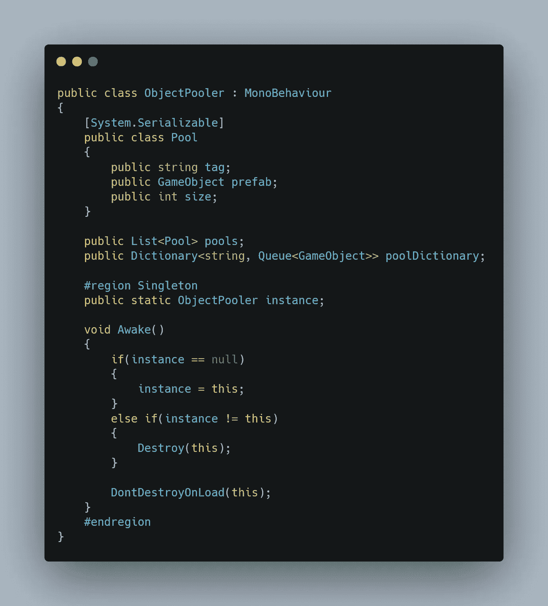
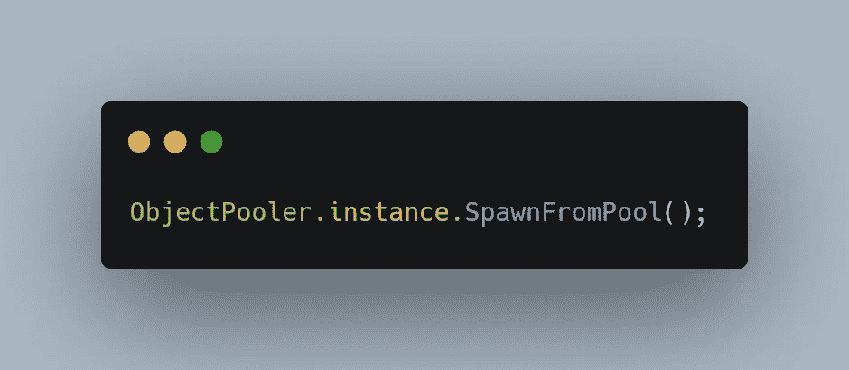

# 游戏设计模式——在 Unity 中使用单件

> 原文：<https://medium.com/codex/game-design-pattern-using-singletons-in-unity-acbd05d8ac9d?source=collection_archive---------6----------------------->

照片由 [@felipepelaquim](https://unsplash.com/@felipepelaquim?utm_source=unsplash&utm_medium=referral&utm_content=creditCopyText) 在 [Unsplash](https://unsplash.com/s/photos/singletons?utm_source=unsplash&utm_medium=referral&utm_content=creditCopyText) 上拍摄

无论你是游戏开发的菜鸟还是老手，你一定听说过 singletons。这是最常用的设计模式，甚至对我自己来说也是如此。今天，让我们探索一下这种设计模式，看看是否值得花时间在我们的代码中使用它。

Singleton 本质上是一种设计模式，它只允许一个类的一个实例，该实例允许任何脚本引用它——本质上是对该实例的全局访问。在这一点上，您可能想知道是否应该使用单例，因为在软件设计中，拥有对实例的全局访问权很少是明智的决定。然而，使用单线图有明显的优势，尤其是在游戏设计中。单例模式解决了游戏设计中的许多明显问题，因此问题不在于设计模式本身，而在于我们如何选择在代码中使用它。

下面是我如何在《小丑之夜》的代码中使用 singleton。为了给出上下文，这个类负责在 awake 上实例化一个对象或粒子列表。这节省了时间和资源，因为对象或粒子不必一次又一次地被破坏和实例化。理想情况下，这个概念是有一个类来跟踪我想在 Awake 函数中生成的所有对象。

下次我们想在另一个脚本中实例化池中的东西时，我们只需这样做:

但是为什么呢？

单身人士有几个好处:

## 1.全球访问

正如我们在上面看到的，singleton ObjectPooler 是类本身的一个实例，在它自己的类中拥有许多属性。所有其他脚本也可以公开访问属性本身！现在，您肯定可以想到这样的场景:您需要一个总经理类的信息，但是您不想每次都引用它。紧密耦合所有其他脚本有时是不必要的，单例脚本很容易解决这个问题，但具有讽刺意味的是，它们以后会产生更紧密的耦合。比方说，你需要一个 AudioManager 类，在游戏中的特定时间播放你选择的首选声音，因为任何脚本都可能调用它，所以你将这个 AudioManager 类设置为单例，这样任何脚本都可以随时随地访问它。

## 2.该类只有一个实例

单例还提供了一个明显的好处，即类本身只有一个实例。现在，如果你想存储一些信息，你可以选择把它存储在一个变量或单例中。使用单例，您只能获得一个实例，并且可以完全控制它。已经创建的实例将被返回，而不是意外地创建一个新实例。对于资源共享目标来说，这似乎是一个很好的可靠用例，对吗？

确实是。直至违反*单一责任原则*。

可以这样想:单例初看起来非常有效，因为它使用起来很方便。但是为了方便，我们牺牲了透明度。将来，当我们有太多单例时，可能很难跟踪哪个脚本使用哪个单例。因此，单例很难使用，因为:

## 1.依赖性隐藏

如果我们使用一个典型的类，我们能够检查构造函数或方法的签名，并且我们很清楚这个类有哪些依赖关系。然而，如果一个类调用一个单例，我们怎么知道它调用的是哪个单例呢？任何后来使用这个类的人都不会知道他们正在调用的单例对象，或者更糟的是，单例对象有某种初始化方法。

## 2.单例很难测试

与任何全局状态或变量一样，我们不能完全隔离依赖于我们创建的单例的类。换句话说，当我们在脚本中测试一个调用单例的类时，我们最终也是在测试单例。理想情况下，我们需要是一个松散耦合的脚本。

现在，已经解释了使用单件的好和坏的方面，我仍然对在《小丑城之夜》的发展过程中每次都选择方便的坏习惯感到内疚。此后，我创建了多个单件，从一个处理游戏保存功能到一个处理按键绑定。我不得不承认，他们可能已经产生了技术债务，但我正在积极寻找方法来清除它们。

我学到的一个好方法是，每当解决问题时，单例对象显得太方便时，就用**注入依赖**。

尽管构造一个完整的类并注入冗长的依赖项不太方便，但从长远来看，这肯定会通过消除长期问题而带来好处。

好吧，至少我意识到了代码的味道，因为我已经在这里写了这篇文章。去修理汗衫吧！下一篇文章再见。

在你离开之前看看这个:

 [## Unity 中的 Singletons(做对了)

### 即使你是 Unity 的新手，你也可能已经知道单身族是一个有争议的话题。你可能已经…

gamedevbeginner.com](https://gamedevbeginner.com/singletons-in-unity-the-right-way/)  [## 状态

### 状态是一种行为设计模式，当对象的内部状态改变时，它允许对象改变其行为。似乎…

重构大师](https://refactoring.guru/design-patterns/state)