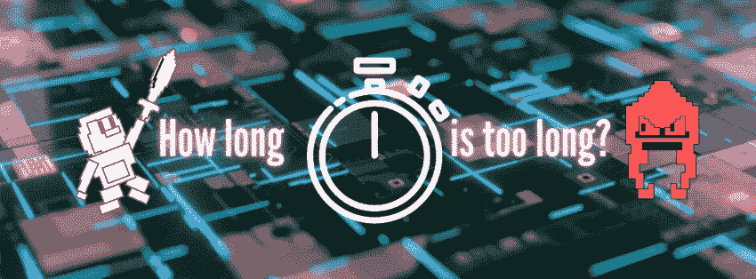
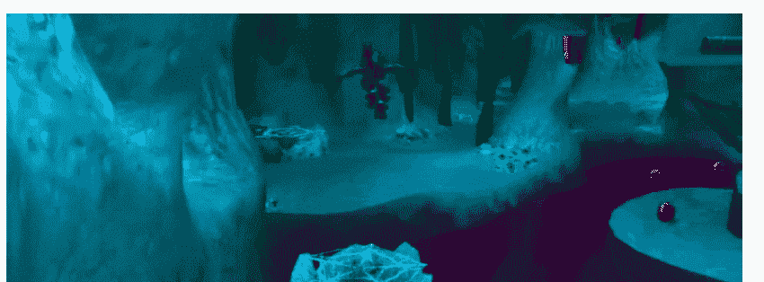
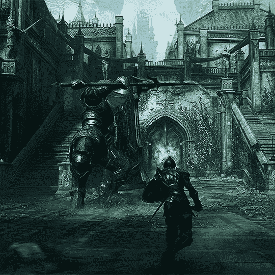
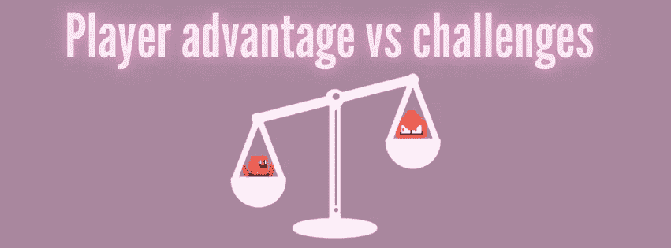
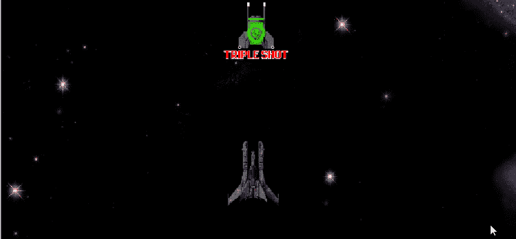

# 游戏平衡和能量提升

> 原文：<https://medium.com/codex/gameplay-balancing-and-power-ups-a7aaabac0d30?source=collection_archive---------16----------------------->

对玩家来说，能量提升本质上是一种短暂的优势，当决定它们的效果的时间长度时，如果不考虑游戏平衡的概念，就不可能解决这个问题。游戏平衡是一种游戏设计哲学，其中角色的优势被对立力量的相对劣势所抵消，以防止一个角色或战术方法主宰游戏。对立的力量可以以敌人或关卡设计的形式出现，并且必须给玩家提供挑战，同时给玩家提供克服它们的方法。

考虑一个平台游戏，其核心游戏挑战是穿越不同高度、障碍物、移动平台和敌人的关卡。对于每个核心挑战，玩家都有一个核心动作或游戏元素来克服它，如跳跃，攻击，甚至获得新的力量或能力来探索以前被封锁的区域。

杰克和达克斯特:先驱遗产

对你正在构建的游戏类型，以及游戏是否有不同的难度设置有一个坚实的理解是很重要的。例如，一些游戏在设计上更难扩展，而另一些游戏则采取更放松或平衡的方式。不管是哪种游戏，在设计游戏玩法的时候总会有一个平衡的动作。即使像《恶魔之魂》这样无情的游戏也为玩家提供了克服挑战所需的所有要素，无论这些挑战有多么艰苦。

恶魔的灵魂(PS5)

# 加电游戏平衡

你加电的持续时间会直接影响游戏的平衡性，给玩家一个超越障碍的新优势。要回答加电效果应该持续多长时间的问题，你需要考虑加电的类型以及它给玩家带来了多少好处。一个让角色无敌的加电应该不会比一个让你的角色超高速的加电持续更久，尽管，这完全取决于你想如何平衡你的游戏。有些异能甚至可能是一次性使用的，除非它们被认为像死亡射线一样强大，可以让你消灭视线内的所有敌人。这个过程可能需要一些尝试和错误——测试游戏的感觉和调整你的代码是司空见惯的，也是很好的实践。

在我的 2D 太空射击游戏中，第一次启动由三发激光组成，而不是常规攻击的单发激光。

为了确定其效果的持续时间，我测试了当电源开启时游戏变得有多容易，以及电源开启产生的频率。重要的是要记住你为玩家提供优势的频率，因为它的频率也可以创造或打破你的游戏平衡。通过使用[协程](/codex/coroutines-with-unity-b5a2b3fc3426?source=your_stories_page-------------------------------------)，可以很容易地编程一个加电产生的频率和它的效果持续多长时间。

在我的下一篇文章中，我们将探索如何创建模块化电源！