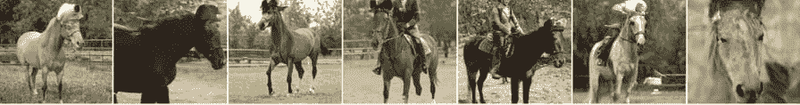
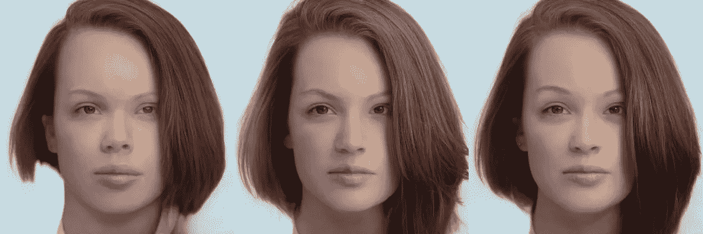

# GAN 技术:商业应用的用例

> 原文：<https://medium.com/codex/gan-technology-use-cases-for-business-applications-261a1c5a9e9e?source=collection_archive---------8----------------------->

[图像信用](https://www.pexels.com/photo/photo-of-code-projected-over-woman-3861969/)

一台机器能够尝试创造与人类生产的人工制品没有区别的独特内容吗？有没有可能借助生成性对抗网络(GANs)——通过学习复杂现实世界数据示例的结构，并生成由相同结构绑定的类似合成示例——来做到这一点？随着最近生成模型的发展，答案似乎是肯定的，至少在一定程度上是这样。现有的 GAN 应用证明了这一点。

在这篇文章中，我们将深入探讨什么是生成模型，该领域的最新发展，以及 gan 在商业中的应用。

# GANs 的主要原理

让我们从非常基础的东西开始。生成-对抗网络由两部分组成:**生成**和**区别。**生成型神经网络创建样本，鉴别型神经网络试图区分正确和错误的样本。

想象一下**甘作为一个造假者和一个警察相互竞争**。伪造者学习制作假钞，警察学习检测假钞。两者都是动态的。警察也接受培训，双方在不断升级中学习对方的方法。

换句话说，甘就像一个作家和一个编辑，或者一个艺术家和一个批评家，他们总是相互影响，在训练中提高他们的技能，以及生成和鉴别模型。

这两种模型的主要目的是能够将新的观察结果分类为属于其中一个类别。模型从更大的总体中接收有限的训练数据样本(数据包括一组具有已知类别成员的观察值)。

**判别模型** **只能区分两个或多个类别**但不能描述类别本身。模型学习条件概率。

另一方面，**生成模型**学习**什么是类别**(值如何在每个类别中分配)。它可以用来判断某个值是属于一个类别还是另一个类别。这个模型学习联合概率分布。

谷歌提供的模型的一个很好的说明(**图 1** )显示了实践中的这一原理——一个**判别模型**只学习类别之间的一般阈值。尽管如此，一个**生成模型**更加具体，并且知道每个类别的边界在哪里。

**图一。**手写数字的判别和生成模型([来源](https://developers.google.com/machine-learning/gan/generative)

我们将关注生成模型，它们创建新数据样本的能力，以及如何在实践中使用。

***注:*** *虽然 gan 包括生成模型和判别模型，但生成模型和判别模型可以分开存在，并用于不同的任务。然而，只有生成模型能够从目标分布创建新的数据样本。由于 gan 是生成模型的普遍类型，我们将对它们给予最大的关注。*

Goodfellow 等人在他们现在著名的 2014 年论文[ [link](https://arxiv.org/abs/1406.2661) ]中首次提出了生成对抗网络的概念。研究人员提出了一个不寻常的训练设置(**图 2** )，其中两个网络，生成器和鉴别器，在一场比赛中相互对抗。给定随机噪声作为输入，生成器必须生成伪图像，而鉴别器必须从我们希望模型学习的目标域(例如，面部图像)中辨别伪图像和真实图像。随着时间的推移，两个网络的任务都在逐步改进，人们可以获得一个训练有素的生成器模型，它可以很好地复制来自目标域的图像。

**图二**。典型生成性对抗网络的示意图([来源](https://www.mdpi.com/2072-4292/12/7/1149/htm)

我们已经发现了 GAN 的基本结构。所以让我们进一步探讨它们的可能性。

# 生成模型能做什么？

通过正确的问题定义，GANs 能够在处理图像时解决不同的问题，即:

**图 3** 。GANs ( [源 1](https://github.com/NVlabs/stylegan2) 、[源 2](https://arxiv.org/abs/1912.00953) 、[源 3](https://news.mit.edu/2020/rewriting-rules-machine-generated-art-0818) )生成的不同图像示例

*   **图像修复**——修复图像的缺失部分。

**图 4** 。修补和恢复图像被移除的部分([来源](https://heartbeat.fritz.ai/guide-to-image-inpainting-using-machine-learning-to-edit-and-correct-defects-in-photos-3c1b0e13bbd0)

*   **图像超分辨率** —将低分辨率图像放大到高分辨率，没有明显的放大伪像。

**图五**。与非机器学习双三次插值法和非 GAN ML 法相比，使用 GAN (SRGAN)放大图像

*   **域调整** —使一个域中的数据与另一个域中的数据相似(例如，使普通照片看起来像油画，同时保留最初描绘的内容)。

**图 6** 。使用 GAN 的域适配示例([来源](https://junyanz.github.io/CycleGAN/))

*   **去噪** —从数据中去除各种噪声。例如，从 x 射线图像中去除统计噪声符合医疗需求，这将在我们的用例中描述。

**图 7** 。使用 GAN 去除断层图像中的噪声([来源](https://www.sciencedirect.com/science/article/abs/pii/S1746809419302137)

除了上述提到的程序，甘还有很多能力。创造数据——从图像到文本甚至是旋律——只是冰山一角。在未来，我们可能会见证伟大的工艺和专门用于医疗领域、增强现实、创建训练数据等的新 GAN 应用的出现。

**GANs 应用能够解决不同的任务**:

*   生成图像数据集的示例
*   图像到图像的翻译
*   文本到图像的翻译
*   语义图像到照片的翻译
*   人脸正面视图生成
*   生成新的人体姿态
*   照片到表情符号
*   照片编辑
*   面部老化
*   照片混合
*   超分辨率
*   照片修复
*   服装翻译
*   视频预测
*   3D 对象生成

现在是实施 GANs 从他们的能力中获益的最佳时机，因为他们可以模拟真实的数据分布，并学习有助于改善人工智能管道、保护数据、发现异常和适应特定真实世界情况的有用表示。

既然我们已经知道了生成模型能做什么，那么是时候更进一步了。让我们来看看 gan 在不同领域的应用示例。

# GAN 使用案例和项目创意

离开理论和学术/非学术研究，现在让我们来看看在哪里以及如何在商业中实际使用 GANs。虽然自 2015-2016 年以来，关于该主题的研究一直非常活跃，但这些模型的实际采用现在才开始，这是有充分理由的。

GANs 已经制作出照片级的图像，例如用于[工业设计](https://mobidev.biz/blog/ai-machine-learning-in-manufacturing) 元素、室内设计、服装、包、公文包、电脑游戏场景等。此外，GANs 还被用来培训电影或动画制作人员。他们能够使用碎片图像重建物体的三维模型，并改进从天文观测中获得的照片。

# GANs 在医疗保健中的应用

图像改善的可能性使我们能够在医学领域实现 GANs，以获得照片般逼真的单幅图像超分辨率。为什么这很重要？

医疗保健行业对 GANs 需求高的原因是图像应该符合特定的要求并且是高质量的。在某些测量协议下可能难以获得高图像质量，例如，当在计算机断层摄影(ct，以减少对具有某些健康先决条件如肺癌的人的有害影响)或 MRI 中使用低剂量扫描时，强烈需要减少辐射对患者的影响。由于低质量的扫描，它具有使获得高质量图片的努力复杂化的效果。

超分辨率改善了捕获的图像，可以很好地去除噪声，但是在医疗领域采用 GANs 相当缓慢，因为出于安全考虑，必须进行许多实验和试验。在处理医疗保健时，必须让许多领域专家参与评估模型，并确保去噪不会以某种方式扭曲图像的实际内容，从而导致错误的诊断。

[斯普林格林克](https://link.springer.com/article/10.1007/s11042-020-08980-w)

尽管有巨大的机会，甘也有问题。最大的问题是它们的不稳定性。众所周知，GANs 很难训练，有时这些网络可能会生成带有伪像的图像，因为模型在训练数据中没有足够的信息来理解某些事情在现实生活中是如何工作的。例如，给定一个肖像图像数据集，网络可能知道如何模拟人脸，但可能无法理解服装的特定元素应该是什么样子。因此，必须仔细选择与预期结果相关的数据。

总的来看，广告和营销行业的 GAN 采用率最高。这是合理的，因为推广某种产品或服务通常需要创建独特但重复的内容，例如拍摄照片模型的图像。

**图 13** —使用创成式照片从真实照片生成的人造人脸(真实照片[来源](https://unsplash.com/photos/rDEOVtE7vOs))

为了抓住这个机会，Rosebud AI 开发了一个[生成照片](https://www.rosebud.ai/generativephotos)应用程序，该应用程序大量使用了 GANs 的最新进展。应用程序с创建不存在的时装模特的自定义图像。这是通过使用真实模型的库存图像并用生成的图像替换面部来实现的。这里真正有趣的事情是，你可以用一个生成的面来替换这个面，并以多种方式定制生成的面。

**图十四** —生成人脸定制([生成照片](https://www.rosebud.ai/generativephotos))。从左到右:原创，添加微笑和年龄，种族编辑，发色编辑。

像这样的解决方案通常采用以下步骤来完成任务:

1.  必须在图像中检测人脸及其边界框，这是一种相当常见的操作，可以使用现有的人脸检测模型来完成。
2.  检测到的面部被裁剪出图像(有不同的方法来解决这个任务。
3.  裁剪的面部被投影到 GAN 模型的潜在空间中，并且相似的面部由该模型合成(反转)。
4.  新生成的人脸必须“移植”回原始图像。它可以通过 [FaceShifter](https://lingzhili.com/FaceShifterPage/) 型号或类似型号实现。

Rosebud AI 的另一款奇怪的软件是 [Tokkingheads](https://rosebud.ai/tokkingheads) app，它可以通过音频或文本输入来制作任何面部照片(合成或真实)的动画(**图 15** )。甘人被允许进行的下一个技术步骤——不仅是生成人造照片，而且要使它们具有动画效果，让它们活起来。

**图十五**。合成面部动画示例— **Tokkingheads** app、 **Rosebud AI** ( [来源](https://www.rosebud.ai/company))

Generated Media Inc .——这家公司应用 **StyleGan** 模型来创建不同种族、年龄和性别的合成面部照片。虽然生成过程没有什么值得注意的(该公司提到他们使用 Karras 等人的 [StyleGAN 和 Nvidia](https://arxiv.org/abs/1812.04948) )，但有趣的是合作公司如何使用人工智能生成的照片。

**图十六**。来自**生成媒体公司** ( [来源](https://generated.photos/))的合成面孔

用例跨越了广泛的领域。事实证明，合成人脸在 3D 图形行业很有用，2D 的面部图像可以转换成 3D 模型，并用作视频游戏或动画的资产。

当谈到移动应用市场时，GANs 正在那里取得进展，并主要作为一种娱乐工具。两个特别知名的这类应用程序(面向西方市场)和(面向东方市场)为用户提供了原创功能——编辑一个人的面部外观，甚至将视频中名人的脸换成他们自己的脸。

FaceApp 使用基于 StyleGAN 或类似神经网络的面部编辑方法。它可以处理照片和视频，建议进行一些修改以确保生成帧的时间一致性。如果视频中的每一帧都由 GAN 单独处理，当处理后的帧重新组合成视频时，这很可能会导致“脸部退缩”伪像。因此，需要额外的努力来确保帧从一个平滑地过渡到另一个。

值得注意的是，这一过程所需的计算仍然过于密集，无法在移动设备上直接运行该软件。因此，处理是在公司的服务器上以集中的方式完成的。

**图 17** 。人脸编辑选项— **FaceApp** ( [来源](https://www.faceapp.com/))

# GANs 即服务

一些公司不是为模型找到特定的利基应用，而是提供对 GANs 和所有基础设施和接口的访问，以处理数据、训练模型并获得最终结果。

[Runway AI](https://runwayml.com/) 就是这样一家公司，将自己定位为机器学习的平台，实现新颖的内容创作技术。该公司称之为生成媒体功能，是一个网络界面的一部分，支持在你自己的数据集上训练 GAN 模型，并以图像甚至视频的形式收集结果——这对内容创作者和其他感兴趣的人来说非常有用，因为它有助于将 GAN 的功能推广到大众(没有图形用户界面的 GAN 可能对大多数非程序员用户来说太不方便了)。

**图二十二**。Runway AI 进行 GAN 实验的接口([来源](https://runwayml.com/generative-media/))

# 计算机视觉中数据集生成的人工智能

任何计算机视觉模型(在某种程度上，任何基于神经网络的模型)都渴望数据，这不是什么秘密——你拥有的数据越多，你可能创建的模型就越好。然而，为训练手动标注数据标签是一个缓慢而昂贵的过程。很多公司负担不起。

在生成模型领域中可以找到一种可能的解决方案(至少是部分的)——事实证明，生成模型可以作为一种工具，用于基于相对少量的手工制作的资产来合成新的标记数据样本。一家以色列初创公司采用了这种方法，据报道，该公司在 2021 年 3 月获得了 1850 万美元的资金。

该公司致力于缩小真实数据和模拟数据之间的差距，以便从模拟数据中获得的知识可以用于真实世界的场景。为了实现这一目标，该公司首先使用 3D 扫描或传统的 3D 建模技术创建了一个针对特定应用领域的 3D 模型数据库(例如用于人脸识别的 3D 人脸模型)。之后，初始 3D 模型(它们的 3D 网格、纹理和语义信息)被转换成潜在空间(反映所有这些特征的压缩表示)。gan 被应用于从这个分布中搜索和采样，有效地从与原始资产相同的域中创建新的资产。

**图。**由 DataGen 制作的人工手模型([来源](https://venturebeat.com/2021/03/16/datagen-emerges-from-stealth-with-18-5m-to-create-synthetic-datasets-for-computer-vision-models/)

这种方法似乎很有前途，随着时间的推移，无疑会被更多的公司采用。合成数据为模拟非常复杂的对象和环境开辟了一条全新的可能性范围，同时提供了比手动注释更精确的注释。

模拟数据使我们能够完全控制数据的变化(例如，对于人体模型，我们可以选择种族、体形、尺寸等。，我们希望拥有以及以何种比例拥有)。我们可能正站在计算机视觉密集型应用(如机器人、自动驾驶汽车和虚拟现实)新时代的黎明。

由 [Maksym Tatariants](http://Maksym Tatariants) ，AI 解决方案架构师在 [MobiDev](https://mobidev.biz/services/machine-learning-consulting) 撰写。

*全文原载于*[*https://mobidev . biz*](https://mobidev.biz/blog/gans-technology-use-cases-for-business-application)*，基于 mobi dev 技术研究。*