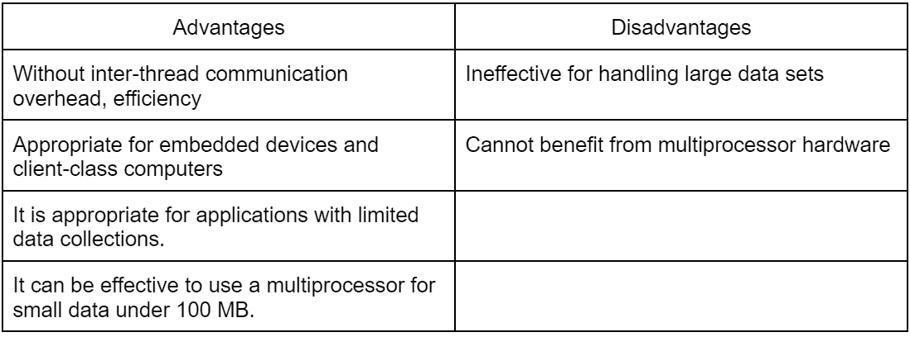
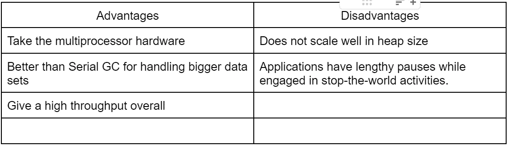
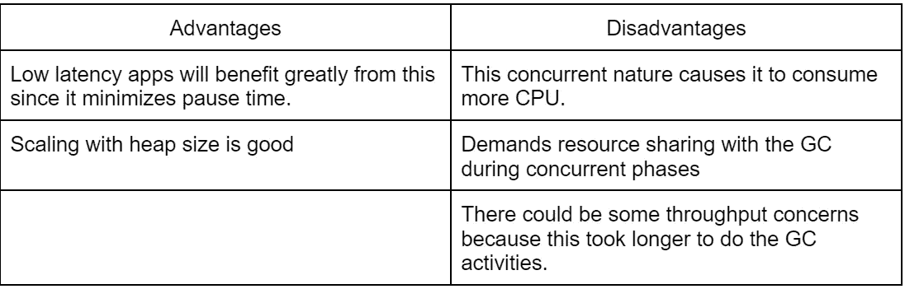

# 垃圾收集算法

> 原文：<https://medium.com/codex/garbage-collection-algorithms-f7fa5df3eea?source=collection_archive---------13----------------------->

垃圾收集意味着自动内存管理是通过垃圾收集(GC)来完成的。垃圾收集器努力回收应用程序分配的但不再被引用的内存，也称为垃圾。

**标记** —显示内存的哪些部分正在使用，哪些部分没有使用。

**清除**:删除在标记阶段被标记的项目。

主要有 5 种类型的 GC 实现。

*   串行垃圾收集器

垃圾收集过程在这里是使用单线程完成的。这种串行垃圾收集在一些普通的硬件和操作系统设置中是默认启用的。

> 可以使用-XX:+UseSerialGC 命令来显式激活它。

*   并行垃圾收集器

这通过使用许多线程来加速垃圾收集。在 Java 8 或更早的版本中，这个 GC 是服务器类计算机的默认 GC。

> 命令-XX:+UseParallelGC 使这成为可能。

*   CMS 垃圾收集器

这与应用程序一起处理某些昂贵的任务。通过消除并行和串行收集器的完整 GC 带来的长时间延迟，该 GC 针对低延迟进行了优化。这个 GC 在 Java 14 中已经不存在了。

> -XX:+useconcmasweepgc 可能会删除 CMS 收集器。

*   G1 垃圾收集器
*   垃圾收集器