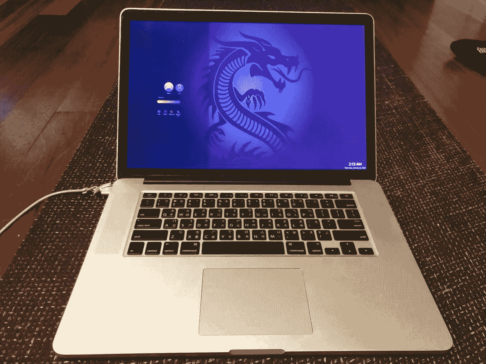

# 2013 款 15 英寸 MBP 上的哥鲁达 Linux

> 原文：<https://medium.com/codex/garuda-linux-on-a-2013-15-mbp-df47f162b961?source=collection_archive---------1----------------------->

## 将旧 Macbook Pro 更新为漂亮的 Linux 工作站

最近，Linux 社区一直在热烈讨论一个新的基于拱门的发行版，叫做 T2 哥鲁达 Linux T3。它不仅通过像[曼加罗](https://manjaro.org/)一样使安装图形化和用户友好，消除了普通拱门安装的复杂性，而且它还提供了各种各样漂亮的预配置桌面…